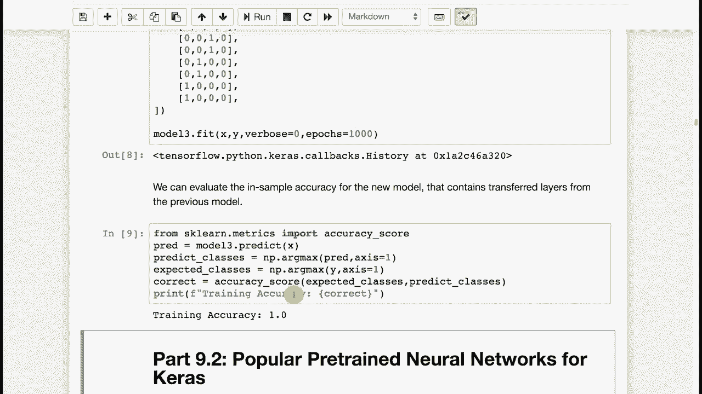

# 【双语字幕+资料下载】T81-558 ｜ 深度神经网络应用-全案例实操系列(2021最新·完整版) - P47：L9.1- Keras迁移学习简介 - ShowMeAI - BV15f4y1w7b8

Hi， this is Jeff Heaton。 Welcom to applications of deep neural networks with Washington University。

 You know what， It's a lot of work to train a neural network， and it can take a lot of compute time。

 It's mostly your computer doing the work， but still it can take a long， long time。

 especially if you don't have a multi thousand dollar GPU。

 This is where transferfer learning comes in handy。 Transfer learning， lets you take。😊。

Neurural networks that were developed by larger companies or startups or other people who have a lot of money to blow on GPUs。

 and you can use this training in your own projects for the latest on my AI course and projects。

 click subscribe in the bell next to it to be notified of every new video。

Transfer learning is a very important concept in deep learning。

 This is because it can take a tremendous amount of time。

 Compute resources and money to train advanced neural networks。

 particularly in the area of computer vision and natural language processing。

 You don't see transfer learning as much with tabular data。

 because there's just not a lot of actual neural networks out there that are already trained for that sort of thing。

 It depends on your data set for tabular and the tabular dataset sets tend to be very different。

 Comp imaging and computer vision there tends to be a lot of commonalities。

 Some of the elements that you will see like edges and wheels and eyes， noses。

 mouths are common across many， many computer vision tasks。

 So you can take some of the learning that large companies such as Google and Microsoft and others have put into training。

 these advanced neural networks and transfer。😊，Data into your neural network to begin as a basis。

 So if you're going to teach a neural network to recognize a couple of very specific image types。

 you probably don't want to train the neural network entirely from scratch。

 if you can transfer in a neural network weight system that has already been trained on imagenet or some of the other common computer vision data sets。

 The way that this works is you will typically find a pretrained neural network that will have a variety of layers。

 it doesn't even really matter exactly what these layers are。

 you can definitely display them and we'll see that when we run the programs here for this example。

 and you will typically shear off the top part。 So imagenet is very common one and some of the others you'll typically see them trained for 10 different image categories。

 So we might want to train it for something much smaller than that。 We will。

Move that top layer and transfer just these layers。 These layers。

 All of the weights are going to move across into our neural network。

 and we will train just the new layers that we add for our new neural network。

 So here we add a dense layer that is going to learn from these lower layers and only these top two layers are going to actually be trained。

 These bottom layers essentially become feature engineering， especially for computer vision tasks。

 These are learning all of the building blocks that went into imagenet and the other dataset sets that the neural network was trained on。

 First， we're going to look at a very simple transfer learning example。

 and this will be tabular data。 This lets you look at a very simple will use the iris data set。

 just so that we can see the mechanics of how this all comes together。 Typically。

 you probably won't be creating transfer learning neural networks that others will transfer into theirs unless you're going to really。

😊，Commit to getting a lot of data and building an advanced training set up with GPUs and other things like that and spending some serious money For this one。

 though， we will create that initial neural network that we are going to transfer into something else。

 and we're going to we're going to basically try to learn to classify some additional flowers beyond those three irriss that the data was originally set up for。

 We'll hope that some of the learning for the original iris data set will transfer to this new one。

 So here the first thing we're going to do is actually get our training data loaded in and build our neural network。

 So this neural network that we're building here this simulates what the tech companies or researchers are doing using advanced computer rays to really seriously train these。

 So now we have a iris data set。 We would probably save it at this point so that we could transfer it。

 We'll check the accuracy real quick。 which runs about 98%。 So that's pretty accurate and。

Print out the summary。 We use summary a lot to analyze the neural networks that we're transferring in Here we can see that we essentially have some dense layers。

 the 50，25 and3， just like we set up up here for the neural network。

 So 5025 and 3 summary can be very good for looking at these things and seeing what's going on。

 total parameters So that's how many weights we have in the neural network trainable parameters is the same in this case because everything is trainable Now when we transfer this simple neural network into something else。

 we're going to mark some of these untrainable and we'll see that。

 So now I am going to show you that basically we can rebuild this neural network。

 we're creating model2 sequential。 and I'm taking all the layers in the original model and adding them when we run this。

 we see an exact duplicate up here 1603 just like we had up here。 And just as a sanity check。

 we're going to evaluate model 2。SeeHere and see what the accuracy is。

 the accuracy should exactly match the original one that we transferred。

 So we have basically done transfer learning here。 We've transferred everything。

 which is typically not what you'll want to do。 We would have a duplicate of this neural network that can classify the same three flowers that the original neural network could not too useful。

 where it becomes useful is if we have these fake flowers that we want to add to it。

 Now I'm just calling them fake flowers， because are hypothetical。 This shows again。

 the mechanics you would go through if you wanted to truly create your own neural network that others could transfer。

 What we're going to do is create now model 3。 and I'm just going to move those first two layers in and drop off the output layer。

 So these will be feature engineering for the new model。

 You'll see we have fewer parameters because we've dropped off the top layer that was going to do the top are the final layer。

 depending on your perspective， but the output layer， what we dropped off。 Now we're going。😊。

To add on a new softm layer with four output neurons to classify those fourth leg fake flowers。

 We run that And we see that basically now we have the 5025， but we have a four attached to it。 Now。

 we could have also added some additional dense layers to maybe give some additional processing。

 But for this simple of a network， not really， not really necessary。 Now， we also。

 when we added these mark the new ones trainable false。 Now。

 for the original layers that we transferred in， we march trainable is false up here。

 That's very important for transfer learning， because we don't want to train the weights that we already had。

 that's what we're transferring in。 That's the benefit。

 So here you'll see that the total parameters is 1629。 But only 1525 of them， the first two layers。

 the input and the 5025， those are the only trainable layers。 So those numbers are different here。

 I create just some contrived values。😊，That we will use for these four flowers。

 I'm only giving two training samples on each。 But again。

 this is just showing the mechanics that you would go through。

 Here's the one hot encoding for each of those four flowers that correspond to the X inputs here。

 We're going to fit the neural network with just training that final output layer。

 and we're going to try to see how well it can classify those four new flower types。 We run it。

 we see the accuracy the last time I run it was about 88。 We'll see what this is1。0。

 So actually perfect accuracy in this case。 So it's the stochastic nature of neural networks。

 you'll get different results。 So here we've gone through the entire process of this。

 So this is how you would truly create a neural network that you would want to transfer。

 The rest of this course。 we will be transferring in other people's neural networks to us rather than being the producer of those。

 So we'll simply be the consumer， which is usually how it goes。

 Thank you for watching this video in the next video。 we're going to take a look at how。😊。

To actually。Find some of these。Open neural networks that you can put into your own learning for transfer learning。

 This content changes often。 so subscribe to the channel to stay up to date on this course and other topics in artificial intelligence。

