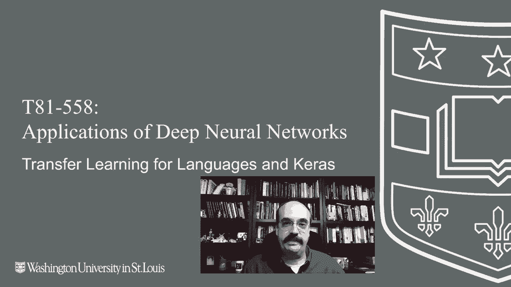

# 【双语字幕+资料下载】T81-558 ｜ 深度神经网络应用-全案例实操系列(2021最新·完整版) - P50：L9.4- 自然语言处理和Keras的迁移学习 - ShowMeAI - BV15f4y1w7b8

Hi， this is Jeff Heaton。 We to applications of deep neural networks with Washington University。

 In this video， we're going to look at natural language pretrained neural networks that you can transfer into your current project for the latest on my AI course and projects。

 click subscribe and the bell next to it to be notified of every new video。

 Transfer learning is also commonly used with natural language processing。

 Now we've got an entire module of natural language processing coming up。

 this just gives us a brief introduction to this。 Usually what you're doing with transfer learning is you're adding an embedding layer to your neural network。

 This basically takes raw text， such as sentences and encodes it into some sort of a vector that will go into your neural network。

 and that vector can be predicted upon because it's a numeric input its fixed length。

 whereas the normal sentences can have very numbers of words。

 and you have to also really think about how you want to actually encode your。😊。

There's a variety of different embedding layers or encoders。

 basically models that you'll transfer in。 and we'll see more about that in a couple of modules once we get to the natural language processing module for this course。

 I have listed some of the sources here that I use to put together this pretty simple example showing how we can analyze the Internet movie database and try to predict if a review is positive or negative。

 Now to make use of this example， you'll need to have Tensorflow hub and Tensorflow datas installed。

 you can run those two PP installs。 if you're running Google coab every time you restart your coab you're going to have to rerun these。

 I already have these installed on my environment I'm currently running locally。

 the first thing I'm going to do is load in the Internet movie database review。

 So this has reviews for all sorts of movies， Some are positive， some are negative。

 the idea is we're going to try to train the neural network to know if these reviews are positive or negative just by reading the。

exNow we're going to make use of a pretrained embedding module called Google news swivel20 dimension。

 So this is a relatively low resolution。 So this is a relatively low dimension encoder。

 It's only 20 dimensions is definitely a lot higher like word'reve and other ones that will see when we get to the natural language processing module。

 I'm going go ahead and load in the pretrained neural network for that。's built into Curs。

 So they make that pretty easy for us。 Let's look at the first three movie reviews。

 So these are the first three movie reviews。 You can see they are just pretty much freeform text。

 This is unstructured data and structured data is particularly hard to use with a neural network。

 Not to worry， we can take that unstructured data Basically right here is what we use previously to print it out。

 We're going to pass it into the hub layer。 The hub layer is the layer that we just transferred in from Tensorflow hub that is。

The Google trained embedding layer。 So now let's see what those three reviews look like here。

 Now you can see they actual vectors， vectors of 20 numbers each。

 that's a lot easier to train and deal with a neural network on。

 you can basically just put raw text into the beginning of the neural network and it's going to process on these vectors that are created from those sentences。

 Now， what do the individual numbers mean， that's very hard to say， but the vectors in the distance。

 So if you were to take the distance between two of these vectors for two different sentences more similar sentences will typically be closer together。

 We'll see more how we can do linear or algebra on these vectors that the embedding layers are creating when we talk about word to V。

 Now let's go ahead and add the hub layer to our neural network that we're building and some other layers。

Using sigmoid and only one output neuron because this is a binary classifier。

 either it's a positive review or it's not。 We'll compile the neural network。

 It's binary cross entropy and we'll use atom for training。

 We're going to split into a training and test set so that we can train on one and validate on the other and we're going to go ahead and fit it using a relatively large batch size of 512。

 So this is going to go through a number of epochs we'll fast forward this。

 Okay the neural network is trained。 We can go ahead and evaluate it。

 This is running it on the test set。 can see it's getting an accuracy of around 85%。

 Let's use a rock chart。 Let's look at how the training progressed。

 you'll notice up here that when I fit it I kept the history that can be useful to look at because you can chart how the training progressed I'll run this this is very interesting because you can see that this really。

 really shows overfitting an action。You can see that the training loss is going down， down， down。

And continues to go down。 But the validation loss plateaus。 and eventually starts to go up。

 That is almost a textbook description of overfitting and why you use early stopping。

 So the loss was going down。 This is pretty much just the mirror of image of that。

 The accuracy is going up。 And again， you can see where overfitting starts to occur。

 and the validation set begins to plateau， even though the train set will just keep getting better and better。

 Thank you for watching this video on transfer learning。 This content changes often。

 So subscribe to the channel to stay up to date on this course and other topics and artificial intelligence。

