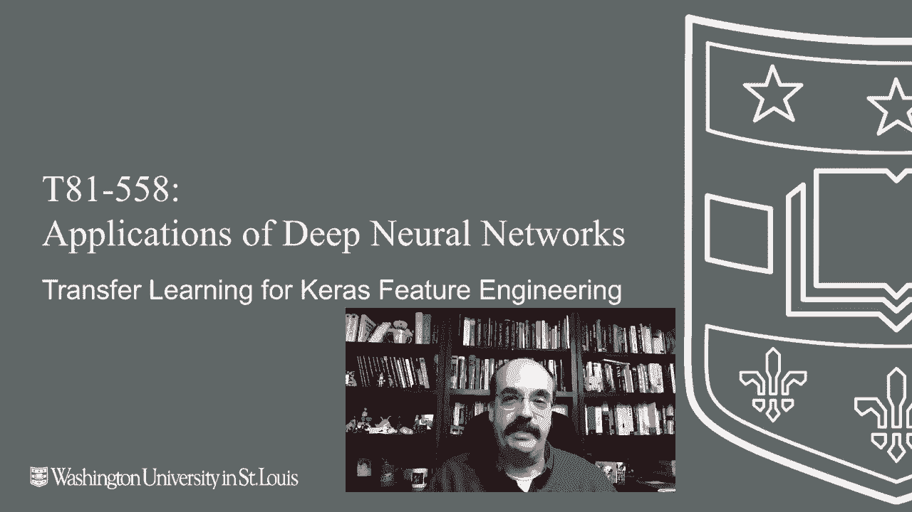
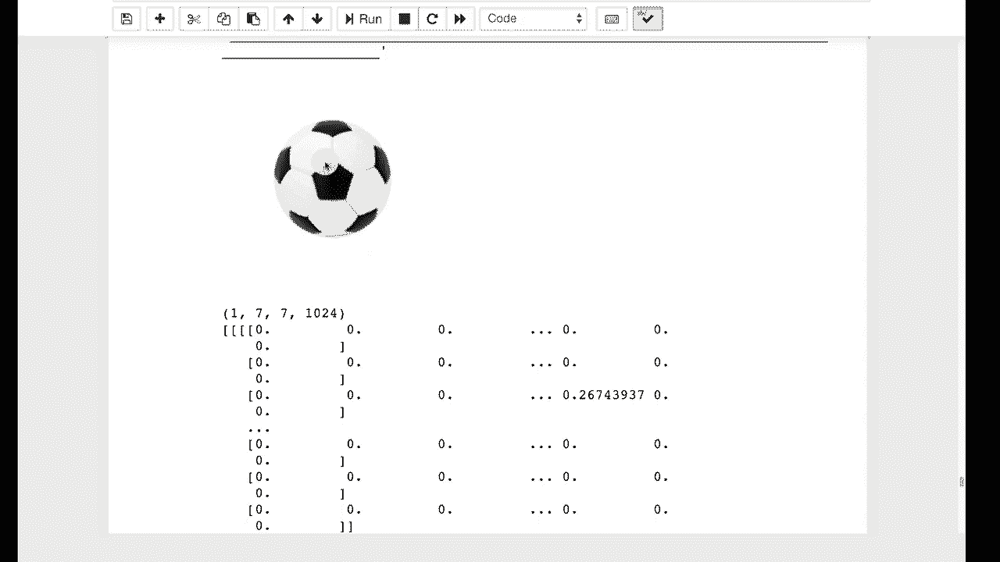

# 【双语字幕+资料下载】T81-558 ｜ 深度神经网络应用-全案例实操系列(2021最新·完整版) - P51：L9.5- Keras特征工程的迁移学习 - ShowMeAI - BV15f4y1w7b8

Hi， this is Jeffeine， welcome to applications of Deep neuralural Networks with Washington University in this video we're going to continue with transfer learning and we're going to see how you can use neural networks that you've trained yourself。

For feature engineering and dimension reduction for the latest on my AI course and projects。

 click subscribe and the bell next to it to be notified of every new video。

 Transfer learning can also be used for feature engineering。 Sa， for example。

 you were going to classify images， but not just the image。 Maybe you wanted an image of somebody。

 And you were going to put other statistics in there as well， like their age， their gender。

and other things so that maybe the neural network might give you some health assessment for them。

 again， using a life insurance industry example， which is what I do for my my day job。

Here we're going to simply look at how you might rip off。

The top layer of one of these neural networks that you typically transfer and use what's underneath for feature engineering。

I'm going to go ahead and run this introductory part where basically this is code like we had before I am grabbing。

Essentially， an image here， it's a soccer ball。And I display the soccer ball and I leave the neural network so that there's not an output layer。

This is like we were going to do a transfer learning。Except。

Let me actually go ahead and display the model summary。So if I run that。

 I can see now the typical input for a 224 by 224 image that comes in。

Go through all of these and instead of classifying it into the 1000。Images that。

Were the classification classes for this type of a neural network。

 we're taking the final layer that it was trained on， which just so happens to be a vector of 1024。

So you can see basically here is that vector of 1024。 It's relatively sparse。

 which is kind of interesting so it's。These are essentially the feature types that the dense layers at the end of this would have learned to recognize and classify it。

 You can simply pull these off and use those as engineered features。As part of your feature vector。

 So your you would have your 1024 values that came from whatever image you had classified。

 and it's not classifying that all the way to soccer ball。

 It's classifying it to all of those individual features that you see here that the dense layers would have been able to use to tell that it's a soccer ball。

 So you're getting that raw feature engineered input that the CNN has produced for you。

 And that can be then used as a way to encode。An image， or just like we saw in the last part。

 you can do something very similar to encode a。String value for natural language processing with an embedding layer。

Thank you for watching this video。 In the next module。 we're going to begin to look at time series。

 This content changes often。 so subscribe to the channel to stay up to date on this course and other topics in artificial intelligence。

😊。