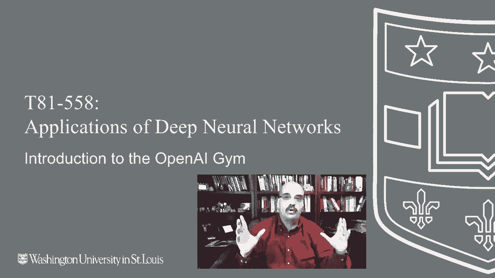
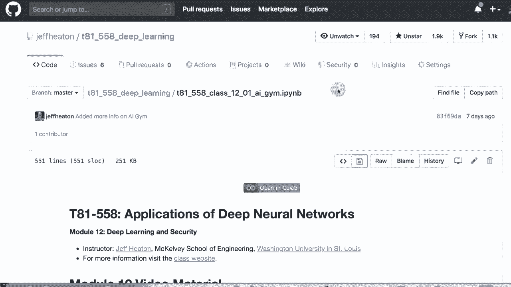
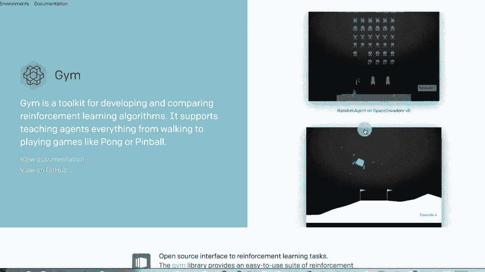
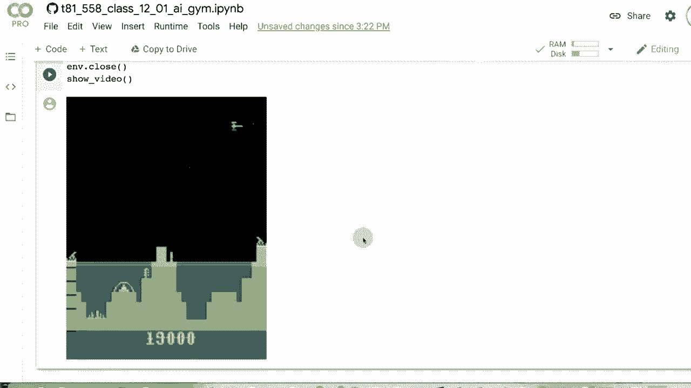

# 【双语字幕+资料下载】T81-558 ｜ 深度神经网络应用-全案例实操系列(2021最新·完整版) - P62：L12.1- OpenAI Gym介绍 - ShowMeAI - BV15f4y1w7b8

Hi， this is Jeffy。 Wecome to applications of deep neural networks with Washington University。

 In this module， we're going to look at AI gym。 So AI gym is a。😊。

Benchmark platform that lets you in Python evaluate your reinforcement learning programs against wellknown games。

 Atari games and other things like that。 So we're going to see how you can actually interface into this and use this to even watch the games play on the screen or to train them in an offline way to see all my videos about kgel neural networks and other AI topics。

 click the subscribe button and the bell next to it and select all to be notified of every new video So let's take a look at open AI gym So reinforcement learning is what we're dealing with for this module and the next five parts So reinforcement learning it's not like supervised learning or unsupervised learning it is really sometimes referred to a selfupervised It's going to happen is you're going to give the computer some sort of a game。

And it doesn't have to be game。 It could be， it's really anything that has well defined rules and can be completely simulated in the computer。

 So basically a game， but。To use this for other types of learning。

 you really need to express your problem in such a way so that the rules are well definedfined so that there's kind of an increment as you go through episode So each play of the game so to speak is an episode you go through a series of steps at each step the computer can take a given action and then at the end。

 its performance is evaluated， did it succeed or did it not， and at each step。

 it is given a reward based on how well it did And the machine plays it over and over and over again and it's able to learn and get very good at playing this This was used and go and chess to develop extraordinarily powerful computers that can play better than the humans who ever taught it how to do this and it does this basically by playing chess essentially with itself because the rules are well well defined。

It gets better and better and better。 And what's amazing about it is it needs no prior knowledge of chess。

 So all those chess books that talk about famous openings and whatnot。

 it's almost like an alien came from another parallel Earth that develop chess on their own。

 but the two planets did not share any techniques on chess。

 So these extremely advanced chess players from the parallel world came to Earth to play and they're playing chess from a whole different rule book。

 So I think that was part of the complexity too for the goplay as well to beat these highly optimized machines。

 So let's see open AI lab。 So open AI lab Jim is basically a bunch of games。

 even the Atari games all set up so that you can have your program compete against them。

 So this is open AI gym。 you can see that they have Atari games。 these are running through an Atari。

LaterThat works really well on Mac and on Linux on Windows。 you can make it work。

 There is some complexities to getting the Atari emulator working on Windows。

 the classic games like you see here that is the pole cart that's the pendulum。

 Those work just fine and we'll start off using pole cart and using mountain car。

 which are some fairly classic games for example， let me show you what those look like。

 if you click on the environments， you can see these are the classic control games。

 The ones that we're going to work on in particular are cartpo and mountain car。

 There's two versions of mountain car and this becomes important when we see how to actually interact with these。

 there is this is mountain car that basically has a Boolean throttle。

 Either you've got your foot on the brake all the way down or you've got your foot on the gas all the way down。

 the idea of mountain cart mountain car is to try to get up here to this flag。

Car's engine is simply not powerful enough to do it。 It is going to even if you floor it。

 So we pretty much have to。 you've got three controls on this one forward backward and break。

 So pushing it up， it's going get to about here and then just roll back down。

 It just does not have enough momentum So what it needs to do is go as fast as it can roll back back back up here。

 push it hard to go up here and then push it hard to go up here and eventually just by rocking back and forth。

 you get enough momentum that you make it up the hill So it takes a little AI to learn to do that。

 I also show you an algorithm that I write that is just if statements that is able to solve it to basically just whichever direction you're going if you're going up。

 always force the throttle full speed the way up the hill you're going the continuous one。

 you can push the pedal partially down or partially up。 I don't think that really helps。

 I think you pretty much need to floor it to make it up up the hill。

 This one's just trying to balance So you've got this pull。I mean。

 think of it like if you took a meter rod or a yardstick and you tried to balance it on top of your hand and now walk across the room and have that not fall off。

That's basically what it's trying to do。So let's go back here to the notes for this section for this part in Google Collab in GitHub actually now we're opening it in Collab。

 so it's opened here。 Let's look at how to actually make use of AI gym I've got some basic information here but the first thing we're going to do is we're going to import AI gym and each of those games that I showed you is basically called an environment and this function that I just defined here essentially queries and environment you need to open up the environment and then you need to open up the specification for that environment。

 What I'm doing here is you can run this for each of the environments that we're going to be dealing with and I'll show you it for a couple of Atari games as well If you run it for mountain car It tells you the action space The action space of this type is discrete So that means you can be doing three discrete things to run that mountain car。

You can be going backwards， you can be applying the brakes。 I think you're applying the brakes。

 It might be running idle I forget exactly and you can be going forward。

 I'll tell you on dealing with just about any of these environments I usually look at the source code and Github for that environment to really truly understand how they work Now the observation space So you've got the action space。

 these are things that you can do and then the observation space is basically how the world has changed Now there's two box values box basically means continuous so there's two continuous variables that come back and those two are basically telling you the location of that car left and right so how far up the hill essentially is it and in which side so it's essentially the X on that screen that was on and then the other value is how fast is it going and that's a plus or minus depending on which which direction it is moving it and that's the whole。

Unniverse those are the only two values that it needs Max episode steps。

 So each episode is a play of this game and that's how long the episode is gonna last if the car is not figured it out by 200 steps。

 we give up Think of a step like a frame think of you're playing a video game you know a video game your render engine is shooting for maybe 30 frames a second which is what a movie is each of those steps is a frame so it's going to go for a max of of 200 of those nondeterministic I don't really like the naming of this one in particular Most of these episodes or environments are random somewhat So your cart it's not like the physics calculation on that cart is completely predictable now you can seed it and you can put a seed into here and that's what the nondeterministic means if you seed it then that means it will be deterministic but if you don't seed it's it's somewhat random So that is。

Essentially what this means most of the environments that I've worked with are nondeterministic so if you seed them。

 then they're going to be the same。 So this is important to understand if you've trained a neural network to play mountain cart and you have it play it with a different seed it might lose because it's facing random situations it's learned some basic ideas about how to how to play the game。

 but if I don't know if you look at the world's best race car driver。

 there's no guarantee that they're going they're going to win every time because there's a lot of random and random are just things outside of their control outside of each game and they may not win It's the same thing now for each of those steps。

 you're going to get a reward So you essentially give it the action。

 it gives you back the observation so what does the world now look like for the next step and then you give it another action and tells you what the world looks like the reward threshold is essentiallys what that's your basic reward so if you get the negative。

110 you didn't do so good。 Now mountain car is very stingy on rewards。

 you only get a reward when you win which makes it a little difficult to train for because it's I mean。

 imagine if you had to build this building and you don't get any feedback at each step。

 you build the entire building and they tell you if it was good at the end。

 that's very frustrating but the neural network can actually optimize something that does win mountain car and we'll see an example of that in in the next class Now I can also query the environment for cart pole。

 So that's the one where you're trying to balance the pole and a cart the accent space for this one is discrete。

 So you can't stop you are moving in one direction or another and your observation space is for values I had to go look at the code to figure out what those are。

 but essentially it's the cart position， you're moving the cart only in two dimensions the cart velocity how fast is it going because as you apply greater force from those two discrete。

Dires you accelerate what is the angle of the pole and what is the pole velocity at tip so that's kind of the physics usually you think of the velocity of a pendulum or a pendulum I means it's it's essentially an inverted pendulum。

And what is the velocity at the tip of that。 And you can push the car to the left or the right。

 So the only two of these values that we're dealing with are discrete。

 meaning there's only two So it's one variable， two possible settings or continuous， which is box。

 So there's four continuous values。 And if you're dealing with the mountain car continuous variety。

 they're both boxes。 So the action space is just the accelerator。

 you can give it positive or negative acceleration and a continuous range or zero， meaning nothing。

 The maximum episode steps for some reason is 999。 and it it's a double negative nondeterministic。

 So it is not deterministic so。And then the reward range can go from negative to to positive and the reward threshold is 90。

 Don't worry about this warning。 I think that's a bug actually in open AI gym Open AI gym is not maintained a lot there's a lot of issues posted on it。

 but it's a great toolkit still to use for this Now breakout This is an Atari game and I want to show you what they do for some of these Atari games which is just kind of fascinating So the observation spaces it's essentially an image 210 by 160 by three So''s essentially a red green blue image and what you're doing here is using the image so what is the user looking at it's looking at the screen just like a user that is cool that it is just looking at that image and learning how to play the game episode steps can go on for quite a while you know 1000 of them Nodeterministic is almost always false on these and the reward range can be anything Re threshold they don't even give you one typically I don't use the range in the threshold。

Kd FYs Now， this， I think， is really fascinating。 They also give you breakout Ram。

 You're looking at the Ram of the Atari 2600。 The Atari 2600 has 128 bys of Ram bys not K not meg and certainly not gig。

 So this is not that much memory。 I mean， heck the image size is bigger than the Ram that it took for that game。

 I mean， one row is 210 times three bys。 So that's a lot of that's not a lot of memory。

 but by looking at the memory for this game， you can kind of tell what's going on。

 And who what are those 128 bys for in the old school。

 they call that a memory map and who knows only the Atari developers know。

 they're probably not even using all 128 of them。 And just by looking at the memory manipulate as as you play the game。

 you're able to to play the game。 Now both of these， the action space。 So the input is4。

 That's your joystick。Four positions up down left right because you're moving that little square around trying to bat the ball and you don't need to give a bat the ball command。

 just the fact that it hits your player causes it to bounce out and what's fascinating and we'll see how to do this we develop a agent that is able to learn to play these Atari games this I also want to show you because we're doing coab if you were running this on your actual local computer what would happen when you try to render and play these games as a window would pop up and you would actually see the Atari game So if you want to actually play the Atari game on your computer in coabab since coab's a virtual environment I'll show you how you can do this So we're gonna to run this part here it does a Pip install we're installing Python virtual display which is great for something like coab I use it also to generate some of the videos that I attach in to show you kind of things playing it gives you a Python virtual。

Environment and it essentially is going to render it to a file that we can then turn into a video。

 let's go ahead and run these So essentially you're going to have it play the guitar game and record a video of it playing and you can potentially download the video or just watch watch it in coab so you don't get to watch it play in real time you kind of see it after the fact but that's just as good and it's all you can really do in collab Now this part here and I do provide a link because I got these functions from a very handy write up that somebody did on how to use this in coab so'm going to run these just define it that shows the video and sets it up for you we're gonna play atlantis Atlantis version zero so I'm going go ahead and run this what's basically going on here is wild true it's not using any AI at all it's essentially doing a it's sampling from the action space so it's basically taking random acts and look there's the game This is not play。

In real time， this is a video that had been recorded briefly while that cell was running。

 but now you can watch it play over and over again it's about a minute and 16 you can see the players getting beat badly you've got a gun here。

 you've got a gun and you've got a gun and it is shooting some of the some of the spaceships but the spaceships start to eventually take it out as as we play further and further the idea here is got to love 1980s graphics this is a underwater city this is water and oops just tuck out the main cannon so it's as you lose your lives but this is just an overview of AIG will be using it more in the next to really every every module in this every part of this module。

Thank you for watching this video and if you're interested in more things about reinforcement learning and training it for games。

 please subscribe to my YouTube channel， thank you very much。

