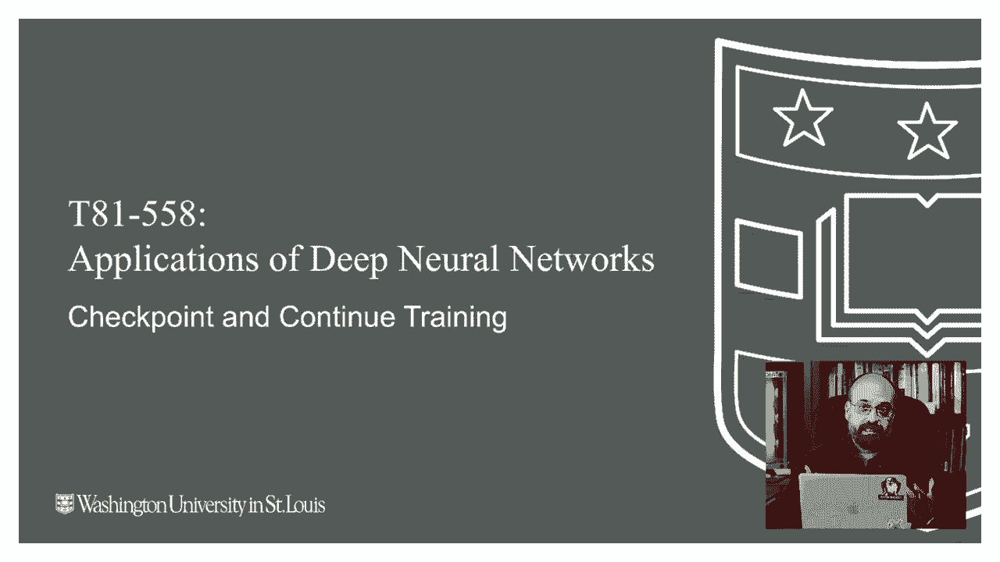
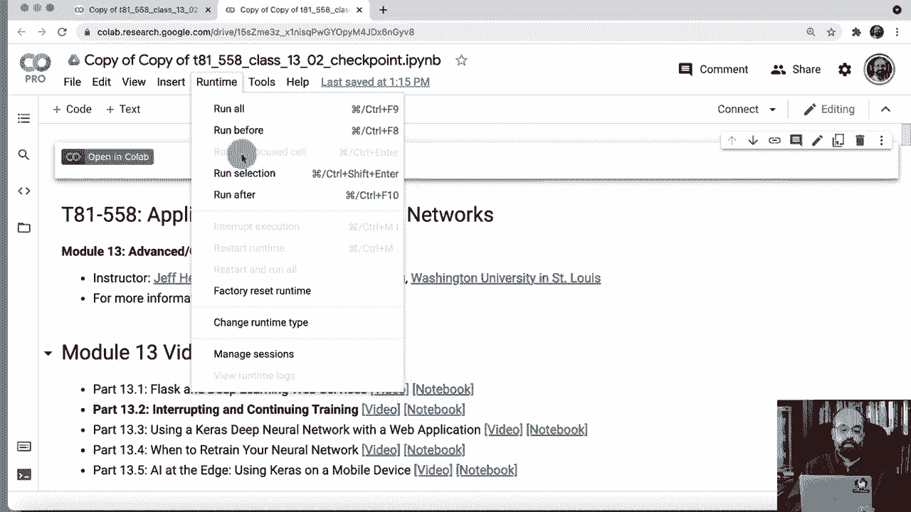
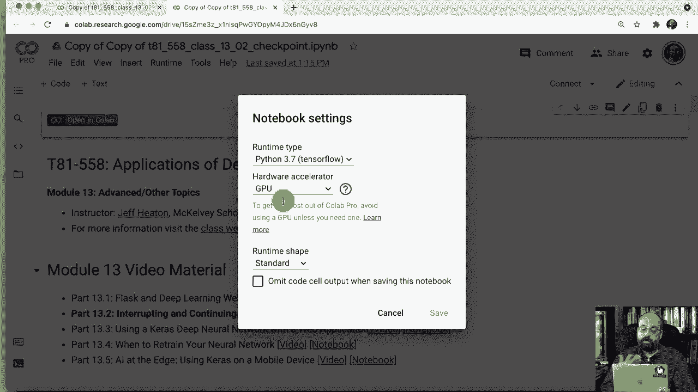

# 【双语字幕+资料下载】T81-558 ｜ 深度神经网络应用-全案例实操系列(2021最新·完整版) - P68：L13.2- 在Python TensorFlow Keras中恢复训练和检查点 - ShowMeAI - BV15f4y1w7b8

Hi， this is Jeff Heaton welcome to applications of Deep neural Networks with Washington University In this presentation I'm going to show you how to checkpoint and continue a model in Kis。

🎼The。So the first thing I'm going to do for the class notes for this and this is just on my Github repository。

 I have a link in the description so you can go right to it。

 I'm going to click open and collab Now when you're training big complicated models you'll frequently want to stop and restart training because they may go on for several days you'll invariably get interrupted not necessarily intentionally but you need a way to continue and that's what I'm going to show you in this presentation go ahead and zoom this a little bit so we're now running and collab I'm going to go ahead and copy it to my G drive even though I'm not really going to use actual files on the G driveri I'm going make sure that the runtime type has a GPU which it does you don't need collab Pro for this even though you'll see that I'm running coEpro I'll run this introductory code here that just gets you started this also defines a little function that shows you how much time something elapsed in a human readable form This code that I。

I have here is code that I make use of when I'm running a bigger complicated project actually base this code on NviDdia styleganN2 ADA they had some really nice code there to create output directories that were labeled ever incrementing and also captured the standard out to a log file So if you worked with style GN2 you will have seen some of this code here before basically the way it works is there's this logger function and actually a logger class。

And that is used to wrap your code so that anything going to standard out goes to the log file as well as to standard out。

 So it's a convenient kind of low grade logging。 If you want something more production level。

 you'll probably want to use log for Python or other libraries that are available for that。

 but I'm going to run this so that it's defined。 Okay， let's go to the next part。

 this is where I am going to store the checkpoint files。

 So I'm putting a call back on Kis that is going to wait every so many。

Steps at the end of each epoch actually it is going to save a complete copy of your neural network as well as the training state so that you can resume training because if you don't capture the training state as well as the neural network then your training resume is going to be inefficient think of it like you're in the middle of a college semester and you I don't know life gets in the way you have to drop out but you're going to come back when you come back do you want to start at the beginning of your deep degree program or do you want to start where you left off that's like your training object your training object is like the university you want to you don't want to have to repeat those semesters because it's not going to do you any good you still have all the knowledge up in your brain like the neural network so that's why you want to save the state of both the training which is like your transcript in college。

And the neural network， which is your smarts that it's learned Now， just like a transcript。

 you're only going to capture those courses back to the semester。

 so the semester is like the Epoch at the end of the epoch， it is going to save the state of。

The training and also the neural network you're going to lose whatever happens in the middle of the Epoch until the other one。

 so that's that's a little different， but that's basically how that works。

 I am going to run this code and it is going to store it in this data directory。

 which is just a location。On my coabab instance that'll go away as soon as I reboot it but this is just for an example。

 you would probably move this elsewhere。 this is just going to be the batch size。

 the number of classes we're doing a classification we're doing the classic minsed digits so we're teaching it to classify these handwritten digits there's 10 digits so that's why there's 10 classes the results are going to be saved this is 001 test train that's the name of the experiment that I was running and this is just an ever- increasingcreas number that keeps these separate so that way you can quickly go back to previous runs and since we're saving the state of the training in a JSON file you'll be able to look at that and see how these individual runs were this is very useful in a research type project so we're going to define this class called my model checkpoint This is going to work as your checkpoint this will be called at the end of each epoch and it's going to store your neural network and the training parameters so on the EpoC end。

We want this to be called when each epoC is ended， we are going to first of all call the previous class that we're basing this on。

 which is the model checkpoint， which is provided by Kiris so you want to make sure that the built-in stuff is still called that's what actually saves your model state We're going to just do the extra work that we want to do beyond what Curris has built in and that extra work is we're going to save the optimizer state so I'm going to get the file path that so that I have the name of the HD5 I think it is that it stores the model to it's a binary format that the model is stored to but I want the training state to have the same name as the model just a different extension it'll be a PKL file because we're going to pickle it that I open up the pickle file and I essentially write to the pickle file a dictionary。

That has all of this information in here So the optimizer that is basically I'm going to call whatever optimizer the model is using that's something like atom or gradient other forms of gradient boosted based algorithms that is just how it is being optimized stochastic gradient descent is also another possibility We have to save what epoch we're on because we're going to also do a learning rate decay on this so the learning rate is gradually going down as you train you don't want that to change just because you're going to restart training and this is stored as a pickle file let's go ahead and run this so that it's defined This is the decay scheduler This is a fairly standard decay scheduler so as this is your initial learning rate one times 10 to the negative third we're decaying by 75% and the step size is 10 and it's just going to gradually decay that rate。

down。Exponentialally， we'll go ahead and run that so that it's defined。

 This is the code to build a model。 and this is very similar to what you've seen previously in this course。

 It's just a convolution neural network。 The model format is not really that important to this example。

 We're mostly interested in how we're going to continue training。

 We're going to now call it also this train model。 This is a little more complicated。

 because we're going to potentially resume training。 We'll pass in the model。

 The initial epoch when you first start is going to always be zero， because you should start at zero。

 and then Max Epos is going to be how far you want it to train。 So when you first train it。

 we're going to train it for just three epochs。 but you could also hard interrupt it as well。

 The computer could lose power。 The dog could trip over your power cable。

 Whatever that could cause you to fail。 You can also buy spot instances on AWS， which are much。

Cheaper than normal cloud instances。 But the trick is Amazon can interrupt you when a higher paying customer comes along。

 So this is all cases where this checkpointing is really very important in a production type situation。

 So we create the checkpoint。It's going to have this name so the model Epoch will be embedded in there and also our loss just so we can keep track of how effective each of these are we're going to create a learning rate schedule that we have up there。

These are our two callbacks， the checkpoint and the scheduler。

 and we're going to call fit just like we would do。

On any other training operation at the end we're going to evaluate it and print out the results。

 we're also going to track how much time this took and print that out so let's run this stuff so that it's available This is where we're going to actually run it so I'm going to go ahead and kick this off because this takes a little bit of time not much。

We are going to train it for three epochs， which is not very much。

 I just want to get an initial train in here。 I could force interrupt it in some way。

 but this works just fine and it's continuing and you can see we're on Epoch one of three This is all pretty standard stuff for what we've had before except you will see now that it's saying saving model to here and it's also saying that it's saving the optimizer。

If I could spell optimizer， that'd be nice to the pickle file and the two files。

 you're going to want those file names and you also want to make sure you're running GPU acceleration or this little training bit here will take considerably longer It's done already so you've got these two file names here you'll want those you'll copy those and these are the two files that you have there I don't know why it's been smart and hyperlinking them it doesn't go to anywhere those will give you a 404 if you try to click those but if we list the directory you will see basically that's the directory it created if we actually look into that directory you're going to see all the files there's the log Txt file which is exactly the same as your console up here but that way you have a record of it and all of these various checkpoints those last three those last two from the third epoch are the ones that you will want to continue from and by the way that getconfig that。

Were calling on the optimizer that we are saving so that we are able to continue with the optimizer as well you can see basically what it is printing out here so now let's continue the training These names are potentially different than what I had up there so I copied them let me go up here and copy the last two names I'm just going copy and paste on so I decrease the odds of me making some sort of a dumb mistake there we go。

And I'll delete this and we'll just go ahead and define those two and now we're going to run this code。

 you'll notice I have the load model data， this is loading those two paths。

 you pass those two paths to there it loads the model with a very simple load model command and then it opens up the pickle file and extracts from it。

 the number of epos and the training options。You'll want to add to this if you're doing something more complicated where you need to store additional things beyond just that learning rate。

 the learning rate that I have is entirely driven by the epoch。

 So it so long as the epoch is saved It's it's good to go。 Notice how we compile it， though。

 this is a little different。 the optimizer， I am creating a new optimizer from。Aom。

 so I am potentially changing the optimizer that was there when we call build model。

 which builds a blank untrained model。 So I'm changing the optimizer out and reading its config from those options that we saved。

 that will have some ramifications that we'll see here in a second。

 mainly I'm going to have to recompil it。 So if I run this code just so that it's going because I think that yeah。

 that's the last step。 you'll notice here， I call this in I train the model。

 I pass in the initial epoch is the one that I loaded and the max epos at 6。

 So we're saving some more。 And again， the compile step that I head here， that's recompiling。

The model with the new optimizer might not be necessary depending on the optimizer that you have。

 but compiling the model does not erase your weights that is just。

Really defining the optimizer and building that whole graph that's going to be executed。

 and you can see that it's done。 So notice the key things Epoch started at four and it ended at six。

Notice the accuracy when it started it was 98 so that was the starting accuracy right out of the gate whereas the earlier one had 94% accuracy so it didn't have to start over you can see that it really kind of continued right from right from here so this is how you continue training or maybe you decide that you want to send your neural network back for a master's degree additional training this is how you do it all right thank you for watching this video if you're interested in artificial intelligence and more on this course other things please subscribe to the channel。

And thank you for watching。