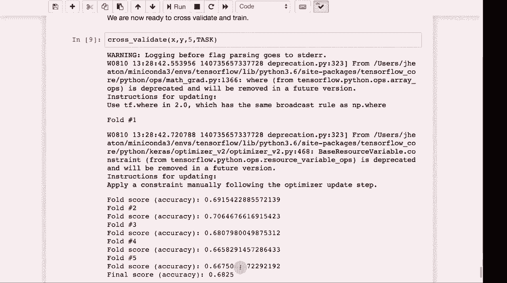

# 【双语字幕+资料下载】T81-558 ｜ 深度神经网络应用-全案例实操系列(2021最新·完整版) - P72：L14.1- 用于Keras和TensorFlow的自动机器学习(AutoML) - ShowMeAI - BV15f4y1w7b8

Hi this is Jeff Eaton， welcome to App of Deep neuralural Networks with Washington University。

So time for the easy button and you'll probably ask me why did I put this at the end of the course or near the end of the course。

 but we're going to look at Automl， which is automated machine learning for the latest on my AI course and projects。

 click subscribe in the bell next to it to be notified of every new video Now we're going to look at automl。

 So as a data scientist， I very frequently get asked by people of various professions。

 aren't you just trying to automate me out of a job are you trying to replace my job with artificial intelligence and in reality the answer is often no we're trying to give them better augmented tools to help them do their jobs better。

 But if I were to say yes， I'm trying to automate you out of a job Well。

 if it makes you feel any better Data scientist are trying to automate ourselves out of a job just as fast as anybody else。

 And this is what Automl is I give you all of these hyperparameter and other things that you need。

To do to tune your model so that they get the best possible performance。

 I give you all these data types and you have to use dummy variables and other encodings to get that data into a form that the neural network can deal with Automl does this all just boom。

 you give you give it some data and it figures out how it wants to encode everything。

 It figures out what type of neural network at once。 and it goes from there。

 It's largely use machine learning to build machine learning。

 It's not the most complicated thing in the world。 It's brute force often。

 but there's a lot of commercial products that are extremely expensive。

 You can get highend sports cars for what these things cost per year per user。

 So I'll talk about a few of those on the commercial side。

 And we will also see how to implement a very simple automl that I have just in this module。

 It's something that I created。 It's part of what I have in my kgular utilities。

 some more simplified version that you'll see here。

 but it can take raw data and try to figure out what it's going do。 So as far as。😊，Autm。

 there's rapid Minr， there's data coup。 there's data robot。 There's H2 a driverless。

 I have honestly worked with and evaluated really all of these。

 I will give you my opinion of these in 2019。 This changes rapidly。 Automl is huge。

 There's tons of companies startups that want to get into this everything from a couple guys in a garage forming a startup to fairly large second and third round startups that that are doing these kind of things。

 Rapid miner is one of the older ones。 It's been there a long， long time longer。

 I believe than all three of these others Ra minorr。

 I'm going to actually show you the free version of it in a moment。 it is it's not my favorite。

 but it's it's there。 and you can get a free version of it。

 So you might want to you might want to look at that if you're interested in some auto machine learning Data co is a platform that has auto machine learning as part of it So you can go very。

They call it low code no code So you're not doing a lot of coding citizen data scientists so these are people who are not terribly technical but still want to do data scienceency sort of things。

 Data coup is very good for them。 data coup really really tries to be just about everything and I think that's perhaps one of their downfalls is they attempt to be auto machine learning but not the best auto machine learning。

 They attempt to be data preprocessing， but not the best data preprocessing So there's lots of companies that specialize in all the parts of data coup does Data robot in my opinion was really one of the pioneers of Automl and they were founded by kle masters back when you didn't have a kaggle grandmaster many of them are now grandmasters and they founded their company on their kgel winnings How cool is that So I'm very fond of these last two really data robot and H2O driverless I feel those are the two best technologies。

Solutions out there for Autom。 They're both very expensive， relatively speaking for an individual。

 They're quite expensive for a fortunetune 500， maybe not so bad。

 but these are all commercial close source products。

 there's also the cloud solution from Google there's Autom let me show you just kind what one of these looks like。

 So we'll do rapid minor。 The reason that I'm picking rapid minorrs not because I'm particularly fond of it。

 It's okay but they have a free version and I'm going to launch it rapid miner is pretty expensive itself。

 if you pay for the interesting speaking of which you're rapid minor studio education license will expire in 65 days。

 I renew my license。 So yeah， look how much this costs Ramin studio。

 which I think is they're pretty simple on 5 to 10 per user per year Ramin server on premise 36 a year36 These are not inexpensive programs And there's a chatbo that'll talk to about spending big bucks。

 if you want to talk to the chatbo。 So。Let me say remind me later And what we're going to do with this one is we're gonna click this one auto model。

 So we're going to choose to auto model and I need to get my data actually upload it。

 So I'll do this in the local repository import new data。 the datas on my computer loads。

 we'll use my sample data set。 same one will use another example。 These are all of the data。

 We're gonna to let the data be in the format that we're expecting。

 We're gonna try to predict the product。 So'll do a classification。

 And here you choose the oh it just wants to know different formats。 So that's fine。

 We import the data。 We want to predict we want to predict the product。 shows you the distribution。

 We'll click next。 It suggests not using I is pretty smart。 Yeah I is not that useful。

're going let use all these different machine learning model types。

 We'll run it And essentially it is brute forcing the heck out of this right now。

 It is trying to find the best models and the best encodings for that data。Let you know what it sees。

 You can see the accuracy percentage here。's it's decent。 It's getting around 70% accuracy。

 I always run this program on a subset of the current semester's kle competition just so that I can see if the current data set is even remotely predictive。

 meaning can the inputs Do they have any chance of predicting the target。 All right， and it's done。

 you can see the different models。 it looks like the best accuracy was achieved by deep learning。

 yaea deep learning。 So also shows you the run time。 Some of these took more time to train。

 So often you want to balance these two in terms of compute complexity versus others。 Now。

 once you have it， you can go into the deep learning model， you can look at the model。

 This shows you the stats on how it created it the hyperparameter。 This is pretty cool。

 you can go into the simulator and it tells you the correlations here。

 So income is pretty negatively correlated with predicting product B。 So you can you can look。😊。

These and really get a some explanation on the data。 So this is a commercial automl package。

 Now we'll look at how to create a simple one of these in Python。 So this is my simple automl system。

 I give you a pretty simple class here。 I rather like this class。 I wrote it。

 It basically allows you to abstract the difference between a Cv file coming from the web or locally。

 So I will run that just so that's defined because we'll need that because this all works。

 this automl that I'm giving you at least the analysis。

 it all works by streaming So even if the data is very very big。

 it will be able to handle lots of records and do the required calculation。

 These are some of the configuration items that you can give it Most of these you can simply leave as is So I will run this just to get the automl system into here This code generates a neural network based on the sizes that you give it。

 So itll create either classification or regression and this one helps cross validate。😊。

NeworkThis is all the same code that we saw earlier in this course where we're setting out classification。

 So notice if you're classifying it does do Am to turn the dummy variables for your output into an actual index because that's what you need to evaluate it and we also make sure that we evaluate an accuracy if we're classifying RMSs if we're not and we just build the auto samples and report the final accuracy as well。

 We'll go ahead and run this so that it's loaded。 I give you several different data sets here that you can run the automl on summer classification summer regression。

 You honestly don't have to think about it that much other than specifying it here。

 So I'm going to run it on that same simple data set that I had and it's going to run it as class and it's going to attempt to do auto machine learning just like rapid Minr was doing。

 So this first part that I do it analyzes the data set and it creates a file called control csv and I will show you control CSv。

😊，It's important So this is control CSV。 It gives you essentially so ID it is suggesting that we Z score the ID。

 it wasn't quite smart enough to figure out that there was too many unique values。

 I'm going to change ID to ignore we don't want to do anything with the I The job it decided to make it a categorical and that's fine it shows you the distribution of the various categories here area is also going to be a categorical income common aspect it is choosing to z score those and that is fine Subs is also dummy categorical Z score z score those are fine Those are fine age interestingly it is choosing to dummy it's just because there weren't that many ages it thought it was a category let's z score that I think that's a better decision population density is definitely a z score and then the final output product it is going to consider those as category so I'm going to go ahead and save it so that we now have a modified version of the control file and this next part it basically just reloads。

Control file and it transforms the input data according to the control file。

 So we'll go and run that。 It is pretty quick。 It just processes over and it transforms and gives output to transform got CV Let's have a quick look at that。

 So look at this file。 This is kind of a mess。 I mean。

 see job got swapped out to all these dummy variables。 you've got all kinds of dummy variables。

 you've got some Z scores。 but isn't this cool。 This is your feature vector that you would have normally fought with and try to create yourself on your own the automl that I wrote is basically just figuring that all out for you。

 And now we're going to actually try to fit it to a we're going preprocess it so that we get it into X and Y and it does that。

 I check to make sure there's no missing variables。

 there are not and we're going to cross validate it。

 It's going to go through all five folds and train it and validate it and we'll get an idea of what the neural network that this would be able to produce。

 actually has't。And some accuracy notice the first fold it's not that far behind rapid minor and my version is free F2 is right around 70。

 So we're just a few accuracy points below rapid minor and the final accuracy is little below 70 so's it's close it's a few points below rapid minor but it's also free and unlike the free version of rapid minor you can use as many roses you want on reason you still have to be able to train the neural network in memory this content changes often so subscribe to the channel to stay up to date on this course and other topics and artificial intelligence。

