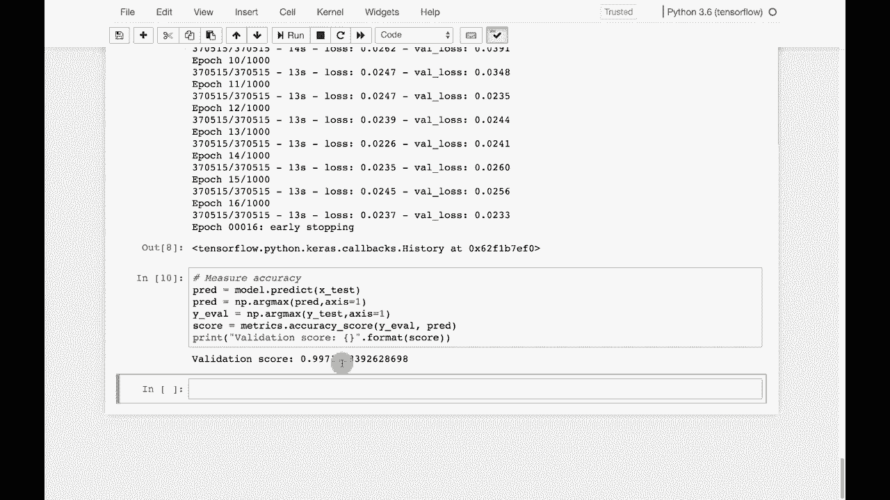

# 【双语字幕+资料下载】T81-558 ｜ 深度神经网络应用-全案例实操系列(2021最新·完整版) - P75：L14.4- 使用Keras训练入侵检测系统(KDD99) - ShowMeAI - BV15f4y1w7b8

Hi， this is Jeffy and welcome to applications of deep neural networkss with Washington University。

 In this video， we're going to look at intrusion detection systems and how you could use the KDd 99 data set to actually train one of those for the latest on my AI course and projects。

 click subscribe and the bell next to it to be notified of every new video。

 We're going to look at how to build an intrusion detection system。 So to do this。

 we need a data set。 We're going to use the same data set that we use for anomaly detection。

 This is the KD 99 data。 I'll briefly reintroduce the data just so that these videos can be done in any order。

 but this is a data from 1999。 so it's 20 years old。 So be aware of that。

 It's a good example data set for security。 I wouldn't train any sort of current security detection systems on it because the nature of the attacks have probably changed a bit in 20 years understatement of the year。

 perhaps but what we're going to do is go。

Go ahead and read in the KDD 99 data set and we are going to that's done up here。

 I can't just build this data into the class because I don't own it so you do have to download it if you're doing Google Coab。

 you'll probably load it into your G drive。And these are all the data columns that we're going to use。

 Let me just go ahead and run this。 And it shows you the first few rows。

 You can tell this is very TCPI internet sort of sort of data。

 We can run this code that I give you here that helps you to analyze it。

 This just gives me a first look at this data to give me an idea of how I am going to actually encode it。

 Okay， here is the analysis of this。 I find this somewhat useful to just dump on data sets that I'm looking at。

 And you can see basically like protocol type。 It shows you essentially the breakdown 57% or ICmpP TCP is 38% and so on。

And it lets you get an idea of how many。Similar values you have。

 This guides me as far as creating categoricals versus continuous。 so like source bytes down here 0%。

 so is 0% repetition really on that， you're not seeing any real duplicates。

 so it can't find categorical values on the other ones。 once I have this。

 I go ahead and use these same two functions that I showed you for anomaly detection。

 we're going to encode the using Z scores and using dummies。

 So all the values that I determine to be categorical。

 I'm going to encode dummy all the continuous values， I'm going to encode Z score。Now。

 if you are dealing with something where you need high accuracy， this is usually just the first very。

 very first step。 you'll get more creative on your encoding and feature engineering。

 So that basically creates the feature vector。 And now I'm ready to actually train the neural network on it。

 I'm training it to predict the outcome。 and the outcome is either normal or a number of different types of attack that can be sent at this。

 Now we're using categorical cross entropy。 So I'm trying to even predict the attack type。

 it is training the network。 I will fast forwardward this。

 This group I will show us the outcomes that we can potentially have。

 So these are all the different types of attack like Smurf was very popular at that point。😊。

Normal is 97，000 of them， so there's pretty many normal cases。

 some of these are very rare like pearin and spy。But these are essentially what we're trying to classify as now that the neural network is trained。

 we can measure its accuracy， it is very accurate， 0。997。Now。

 this is another thing to keep in mind with the KDD99 data set it is。It's been out there for a while。

 it's not really that hard to get a good score on it the the data separate very very well into those various classes once this data set had been studied and really well understood it's interesting you do still see papers even in 2019 where people are talking about。

A 99% accuracy on this particular data set like it's anything of any research significance this is largely an example data set for intrusion detection and other security features at least in 2019 so definitely be aware of that but it does make for a good example of these types of technology This content changes often so subscribe to the channel to stay up to date on this course and other topics in artificial intelligence。

