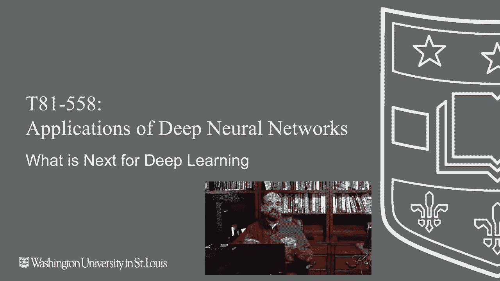
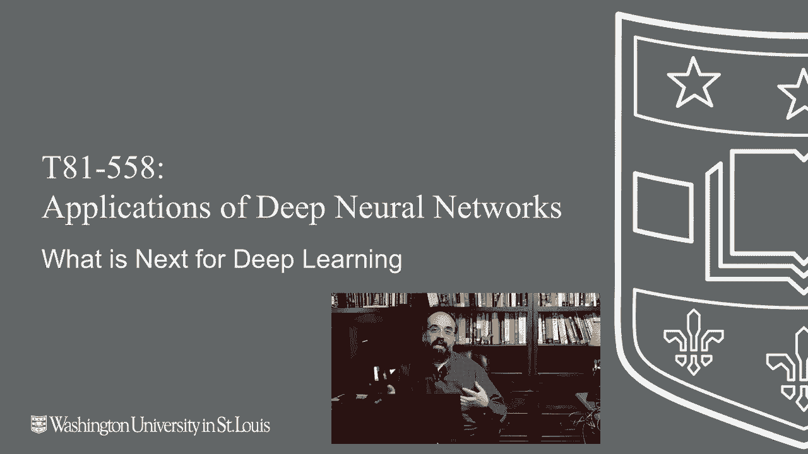
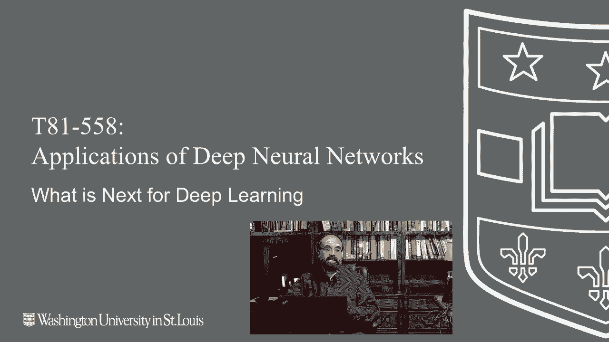

# 【双语字幕+资料下载】T81-558 ｜ 深度神经网络应用-全案例实操系列(2021最新·完整版) - P76：L14.5- 新深度学习技术介绍 - ShowMeAI - BV15f4y1w7b8

Hi， this is Jeff Heaton welcome to applications of Deep neuralural Networks with Washington University Well congratulations you've made it this is the last part of the last module of this course in this video I'm going to talk about what comes next what do you do now that you've learned all these great things about deep learning。

🎼う。First of all， I just very much encourage you to subscribe to my YouTube channel。

 I know every YouTuber always says this， but in this case you've gone through this course。

 you can see videos that I will put out that really have their foundations in this course material。

I'll show more advanced applications of these same technologies and I also add new videos as I replace parts of。

This this course。So every time I replace a video you'll get an update letting you know that one of these has changed and you can see at least in my mind what I am thinking are the new technologies of deep learning that that I've decided to add to part of the course。

 you can follow me on GiHub or just on the YouTube channel itself either either or hey， both will。

Let you know when I make changes or add additional things I always have my quote unquote new technology radar and this part I rerecord at least once a year。

 so the K runs for two semesters so every other semester I try to update this on what what is next and what technologies is on my radar because this stuff is always changing two years。

 even one year is in eternity and deep learning so the technologies that are currently on my radar screen。

 you see here transformers， more advanced transfer learning augmentation and reinforcement learning。

 particularly beyond TF agents。So transformers， I do not have enough transformer coverage in this course。

 this is definitely a technology that you want to be familiar with。

 especially if you're interested in natural language processing。

 although it's starting to really make some inroads。Into computer vision。

The real hallmark of transformers is sequence to sequence。

 so the model is accepting in a sequence and outputting another sequence So sequences are these variable length vectors that might be characters。

 might be words， might be a series of images， it could be video in video out as compute part gets stronger and stronger。

 I really think we'll see the video to video。😊，Transformers， deep fakes。

arere not using exactly transformer technology， but think that of that sort of thing。

 So you can essentially just give this transformer a list of sentences in English。

 a list of sentences in French。And it will learn to make the translation。

More advanced transfer learning， so the course currently touches on transfer learning and it's a very。

 very important topic。Usually at least in this course。

 I'm talking about taking a neural network in and then fine tuning it a bit and and building on that what I want to add in some subject matter。

 particularly on how to find already learned pre traineded neural network so that you don't have to go through this。

Expense of training it because some of these state of the art neural networks are trained。

On GPU arrays with 1024 GPUs I saw one the other day， I was like $250，000 just to train this thing。

I mean， come on。 you want to stand on the shoulders of those giants， but two things in particular。

 I would say to have a look at or hugging face， these are pretrained models that you can use and pull right into Python and and go for natural language processing The other one is in GC Nvidia GPU cloud also contains a lot of transfer learning that you can use for all kinds of things I'm kind of visualizing sort of a jarvis。

 you know Iron Man， the robot will add something like him because there's a couple of neural networks that you can string together to do sort of a personal assistant like like that。

 augmentation This has really propelled computer vision a lot you can use the generators like in Kiras where you can basically take images。

 flip them， rotate them， change the colors， do all sorts of things to give you additional training data that was。

Really not in the actual train set Something was just released。

 which I actually already incorporated for next semester is the NviDdia style G2 AD。

 which uses augmentation to give the discriminator a lot more images to deal with when the G is learning to create fake images and then reinforcement learning but beyond TF agents TF agents is what I use in this course to teach reinforcement learning It's okay I chose it mainly because it plugs right into TensorF Another one that I really。

 really like is stable baselines when you look at all the things that TF agents tends to break like their Atari examples and then they have experimental examples and。

Those may or may not work St baselines just really out of the box gives you nice hello world。

 here's how you play an Atari game， here's how you do something else。

 a lot easier of interface without exposing a lot of the inner workings that in an introduction course like this I may not want to get into so that's that's something else that's kind of in the back of my mind as far as new technologies that are on my radar programming languages。

Now this is one where there's not a lot of battles going on in terms of Python。

 this course is based on Python and Python really， really has a lock on machine learning and deep learning。

Data science as well， I mean kind of out in the far reaches。

 there are battles going on where other languages are encroaching upon Python's territory and believe me。

 I've been doing this a long time， Python will fall。

 there will be another language that becomes the cool language and then Python since it's risen to sort of the level that it is now。

 it'll become quote unquote  the new Cobal like is a crown currently enjoyed by Java。

So there are other languages。 and probably if I had to say the one that。

Intrigues me the most of replacing Python for what Python actually does in machine learning would be maybe go。

 go Lang。But all of these other languages that are nipping at Python such as Julia and even Swift。

 believe it or not， I think of that mostly as a mobile language。

 but there's definitely definitely interest there I would say that still primarilyyon Python is going to be the core machine learning language for for a while and what's a while in the field of machine learning six months。

 two years， I don't know。So some of the other languages that you might want to consider。

Would be for iOS application development， Defite Swift。

 Swift is what iOS apps are written on Android app development， Cotland， Kotlin。

 I guess it's pronounced and Java。 I'm a lot more familiar with Java than I am Cotlin。Basically。

 Kotlin's a layer on top of Java that makes it a lot more modern and less typing。Web development。

 No Js and jascript。 Now， you can do web development in Python with Django。

 and I've used that before， but you cannot escape that Javascript。 Javascript is on the front end。

 and you're going need to use that， there's other languages like Ru to let you escape it a little bit。

 but and ja has a whole host of dialects。 Mac application development。

 Swift or jascript with electron or react native。 So if you want to create a true Mac application。

 you see fewer and fewer applications。 It's now mostly mobile or web， but。

Sometimes you do want an actual application， Windows app development C Sha or JavaScript with electronron or reactact native。

 have you seen a pattern here， Linux application development。

 CC++ with TCL or JavaScript with electron or react native。If you've used VS code。

 you've used electron。And VS code is available on Mac Windows Linux。

That's a great way to create an app if you want it on all three of those environments。

 because you can you can basically just use JavaScript， So I would say of all these languages。

 the one that I have the most interest in beyond Python is JavaScript。

 That is the language that I find myself working with the most outside of JavaScript and then there's sort outside of Python。

😊，And then there's no JS which is essentially just sort of compiled server side JavaScript so that that's my views kind of on programming languages as we begin 2021 What about pieetorrch this course is taught in Tensorflow Kiras and believe me this is one of the machine learning world religious debates I might as well ask you if there's a God or if you voted Democrat or Republican liberal or conservative。

 this is probably more US。And get less fiery of an answer back on this one。

 I frequently get emails from people just why don't you。

 why don't you switch to Pytorrch Some are even quite mean。 So people really。

 really get worked up on this one。 The main reason that I that I created this class in Kira's Tensorflow。

 There's two of them。 one is Pytorrch didn't exist in 2016 when I created this this course。

 It was I hadn't even heard of it。 I'd heard of torch， but that was。Not at all the same。

Thing the other is。I like bytorrch， but it does require more typing that it's kind of like the Java of machine learning frameworks now that'll get me some hate and comments。

 but seriously you have to put a lot more infrastructure around it and。Do the training loops。

 do all of this kind of thing。 However， where with Java。

 the extra layers just make your fingers sore with Pytorrch。

 it lets you really fine tune what you're actually doing。

 And that is why Pytorrch has seen considerable inroads into research。

 And I think these two will continue to to duke it out。

 And for me to switch the course to Pytorrch would。😊。

Would mean that I felt that one has definitely gone by the wayside or another。

 but when I first got into machine learning in 2008。

 I was pretty dead set on Java and I've completely moved on from Java into into things like Python and the other and then just where to go from here I would very much suggest you take a look at Google CoEab Pro。

I have advanced GPUs and I make use of O on the cloud as well。

But I still use Google Coab a lot because Google Coab Pro lets me have access to a V100 NviDdia GPU。

 If it's something that is just going to run for a couple of hours。

 I often like the mobility of just being able to launch it rather than having to bother my。Tighten。

R T X GPU， which might be running on a long training mission， or I just may want the mobility of。

 of Google Collab Pro。 So I am a big fan of Google Collab Pro。

 I have no connection with Google whatsoever。 And then you might also want to look at Tensorflow certification。

 I give you a link there。 That gives you something to show。

Show employers that you've learn and mastered this technology and then Coursera speaking of other things that you can do to sort of put on your resume and these days your resumes。

 your LinkedIn profile basically so，Build that up。The other thing that I would say。

 as somebody who occasionally hires people coming into into large companies who are just starting out。

 get those internships。Get that practical knowledge， work on projects。

 find kggles that you're interested in， push your stuff to GiHub。And get some domain knowledge。

 There's tons and tons of people out there who have taken。

Data science courses and other things on Coursera and many of them know lots and lots of things。

 I've talked to many of them， but where a lot of those individuals will sometimes come up short is no real sort of world experience。

What really says something to me is somebody who has taken on a project sort of of their own。Kagle。

 if you can't think of anything else and research some of that domain and and learn how to really apply these theories to real world data。

 All right， I hope you really enjoyed this course。 I know I enjoyed preparing these videos and interacting with you guys in。

😊，Zoom for the Washo students and comments for the rest of the internet community。

Give me comments here， What would you like to see， am I insane should this course be flipped to Pytorch which of those new technologies on the radar do you like the most Let me know in the comments and definitely subscribe to the channel。

Follow me on GitHub， Twitter， and keep track of all the fun， at least for me。

 things that I am working on。Thank you for following along with this course and whatever the next step in your deep learning and machine learning journeys。

