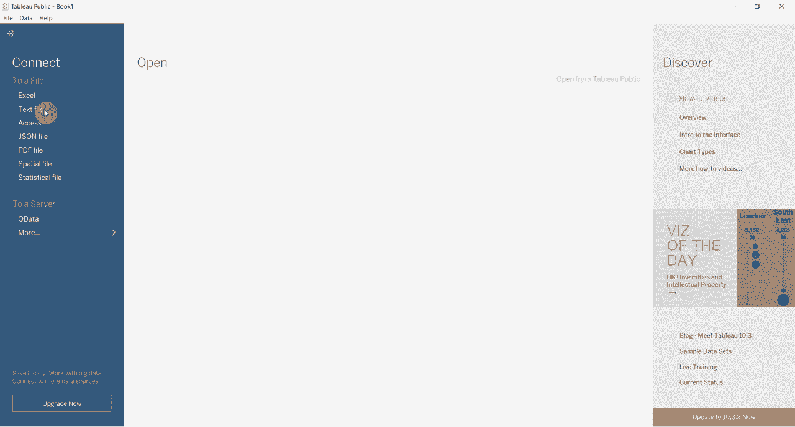
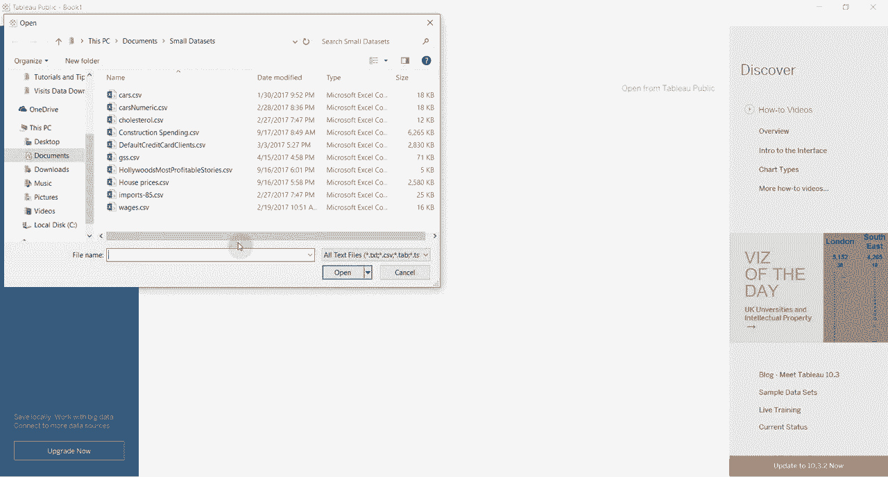
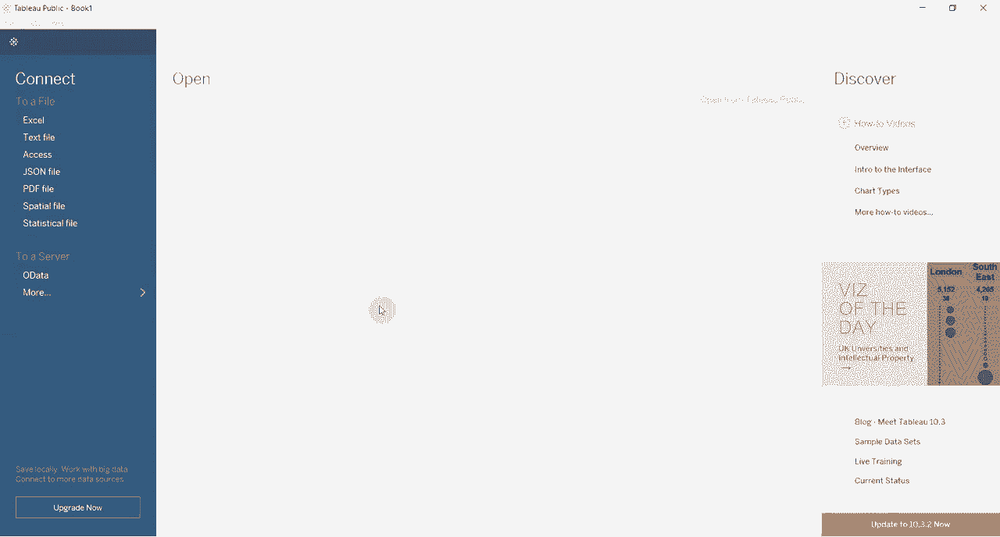

# 【双语字幕+资料下载】Tebleau操作详解，照着实例学做图！数据科学家的必备可视化工具，简单快速做出精美图表！＜实战教程系列＞ - P10：10）表格计算获得同比增长 - ShowMeAI - BV1iq4y1P77U

Hi folks and welcome to another video for Tableau in two minutes today we're going to be demonstrating how to use a table calculation to create year over year change numbers it's really very simple and you can do it with data that's laid out in various ways but ideally the way you would want to do this is with your data laid out as a time series now we have some of that data in this construction spending data set this is US construction spending by segment as you can see we have it by segment and this covers years since 2002 to the present so we have plenty of years to calculate the change from this data is not part of the tableableau package but you can download it for the Tableau website there is a link in the comments if you would like to try this out on your own。

😊。

So the first thing we're gonna to do is we're gonna create the the layout for our dashboard here。

 The first thing is up。Per name， period name。 That's the one that's gonna give us our years。

 And we're gonna break this out by quarter。So you can see we have a 2002 to 2016 with Q quarters each broken out and then we're going to take we're actually going take the category description and we're going to put it on filters here and then we want to filter this only to represent total construction spending there it is down at the bottom and the reason we want to do that is because we don't want to inadvertently sum up too many categories obviously we want to make sure that our data even though we're just playing with this that our data is actually real and then we're going to take this valve。

😊，And we're going to drag it into this table right here。 Now。

 you can see this gives us the raw revenue numbers， which is great。

 And because we have a time series， Tableau has a really neat option where you can click on。😊。

Year over year growth， and it will automatically calculate the year over year growth。

 How easy is that in past versions a tableau that wasn't the key。

 So you did have to create the table calculation manually。

 I're actually going to do that because it's pretty easy to do。

 So just to create a second value field here， we'll show you how these match in a second。😊。

We're going to click here， quick to quick table calculation。

 and then we're going to go percent difference。When we click on percent difference。

 it's going to default to showing us the difference from the previous value。 So Q2 spending was 20。

99% greater than Q1。 Q3 was 6。72% greater than Q2 so on down the list Now we don't want that。

 We want it to be year over year spending so we're going to come in here we're going to use the compute using。

And then we have a couple of options here， but we don't have the year or the quarter。 So to do this。

 we're going to go into edit table calculation。😊，In here you see that we can select various different compute options。

 we can change the type of table calculation what we want to do though is we want to select specific dimensions right here and this is going to give us the option to include or exclude various things so if you look at this right now we're computing relative to the previous everything is highlighted so it's computing from the previous item in this list it's uncheck quarter you can see that we've now got no data in any of the years from Q。

😊，From 2002， which is a good sign。 And only the Q1s are highlighted。

 So this is computing the difference along this set of values， which is exactly the way we want it。😊。

So we're essentially again， computing the difference and skipping four things in the middle here。

 but really computing the difference using the year of the period name， which is。

The values we have up here。So we can close this out and then just look so the values match between the two tables so the year over year growth is the same no matter which way you do it。

 the reason this way is a bit more flexible is because Tableau will automaticallymatic add the year over year growth calculation。

 if you have a date field if you don't have a date field if you just had say a column that represented years and a column that represented months or a column that represented quarters。

 that option wouldn't be available so you need to use this other method to get to it。😊，Well。

 thanks for joining us for another episode of Tableau in two minutesute again if you want to try this out at home the data is in the comments。

 please subscribe to the channel and if you have any questions please leave them in the comments thanks so much。

😊。

