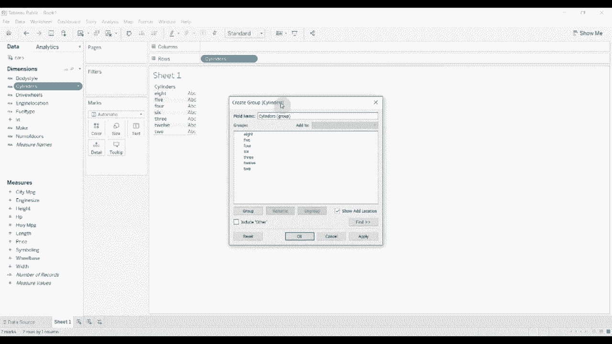

# 【双语字幕+资料下载】Tebleau操作详解，照着实例学做图！数据科学家的必备可视化工具，简单快速做出精美图表！＜实战教程系列＞ - P13：13）创建和组 - ShowMeAI - BV1iq4y1P77U

Hi， folks， and welcome to another episode of Tableau in two minutes。 Today。

 we're going to show you how you can use groups to group dimensions together or group levels within dimensions together to create a sort of higher level category。

 So I've gone ahead and connect to a cause data set。

 This just has a bunch of information about different types of cars。

 And what we're going to do is we're going to take this cylinders。😊，Dimenssion。

I'm going to group some of these together to make them a a bit more useful so。

To create a group， all you do is you click on this little down arrow， go to create and then group。

Once you have that， we can begin to to put these into categories。

 So maybe we want to group all sort of large engines together。 So we'll get the 12 and 8 together。

 We'll call that a large engine with a large number of cylinders。 We'll grab。5 and 6。

 and group those together。 and then we'll grab 3 and 2 and call them very small。

You'll see I've left four out as its own category。 So we'll go ahead and apply that。

 You can see that it pops up as a just the default name is just the name of the dimension followed by group。

 And then it has this little paperc next to it that tells us it's a calculated group for one of the other dimensions。

 So just go ahead and click apply。 and then we'll drag that across。

 And now you can see that we've created groups based on。

These。Based on the groups that we put them in。 Now。

 there's a couple of other things that we can do too groups。

 it's worth noting aren't dynamic necessarily。 So if we had another set of cylinders。

 we didn't have 10 cylinder engine in here。 for example， we only had 12 and 8。

 So if we had a 10 cylinder engine， that would pop up as a new row in the data set and we would have to go and manually assign that to a group。

So best to make sure that you have all of the potential values represented before you go in and create your group。

 but certainly useful， even if you don't。 Now， the other thing that we can do with this is include another category。

 we don't have or we didn't have other category to start with。

 we just have four sitting out by itself。 But if we included other and then ungroup those。

 you can see。 but when we ungroup things。 instead of falling into a bucket that has just individual items in it。

 They get grouped together in this other category。 So we could have large engines。

5 and 6 cder engines and then other。There you go。 And that's how that works。

 So now you can see that instead of four being all by itself and two and3 being all by themselves。

 they are in a single group。 if we choose to exclude other。

 you can see we just get then three individual categories for4，3 and 2。

 whether you want to do that depends on the context how you're using this particular grouping field。

 It is helpful sometimes especially if you don't want individual items。

 then popping up whenever they are rolled in from the database or something like that。

 you just want to include them in other category。 It makes a lot of sense。

 just have that category there。 Alright， so that's just about it for using groups。

 they behave just like any other dimension。 So you can drag them around。

 use them essentially in place of a dimension。 So thanks for watching this episode of tableableau in two minutes。

 if you have any questions， please leave them in the comments。 there's a link to the workbook。

 and the data set in the video description。 And if you like what you heard and you like more tableau tips and tricks。

 please give us a thumbs up and subscribe to our channel。😊。

