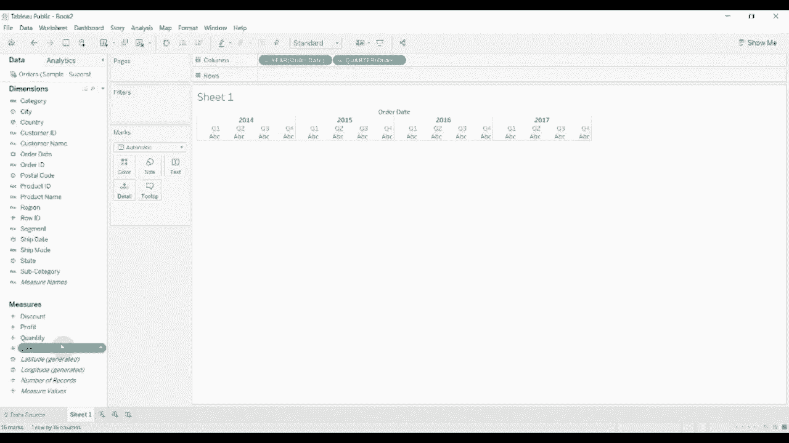
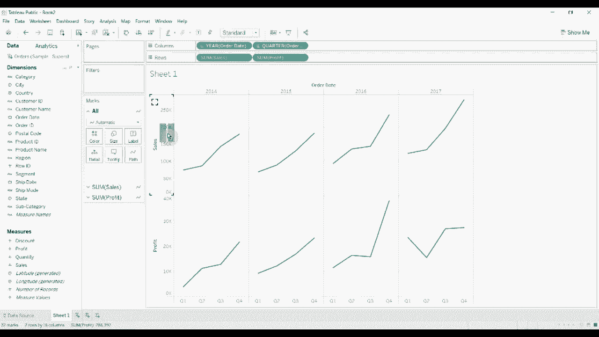
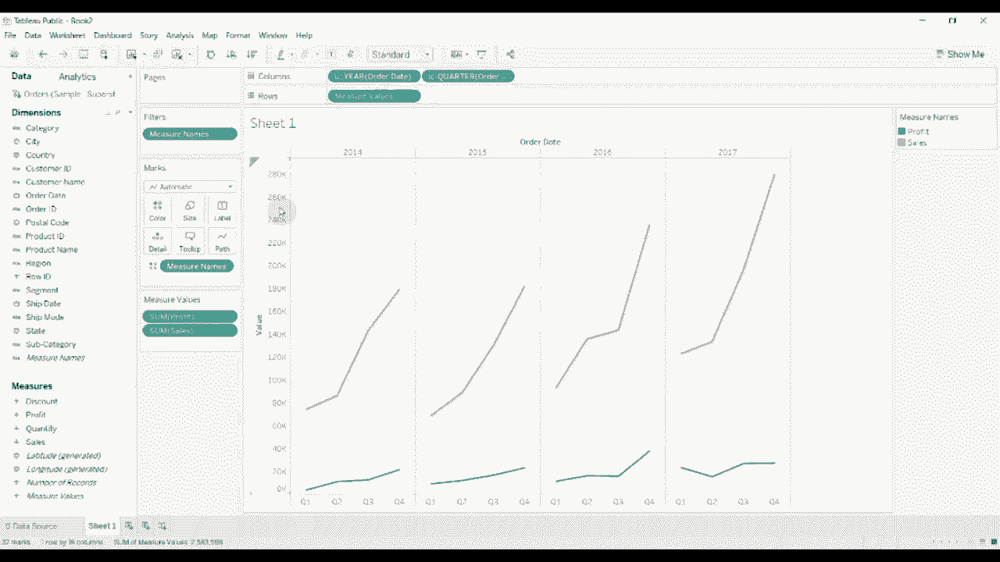
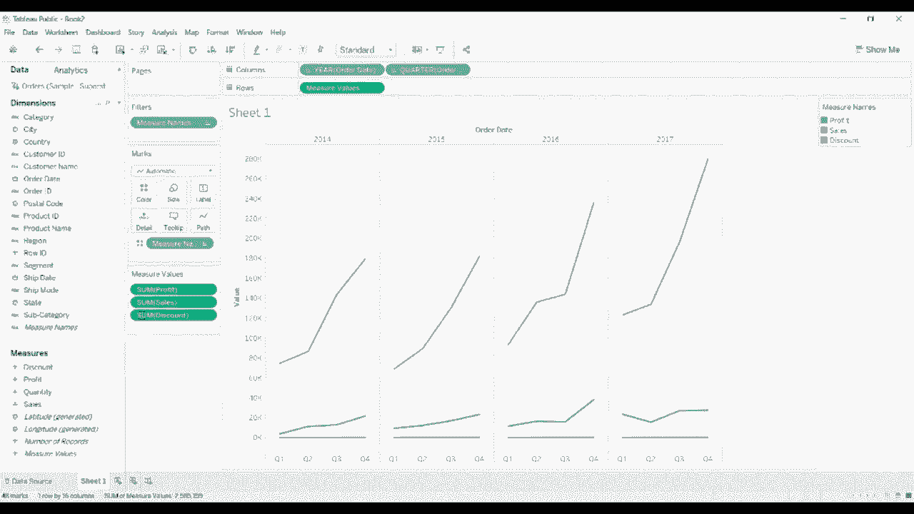
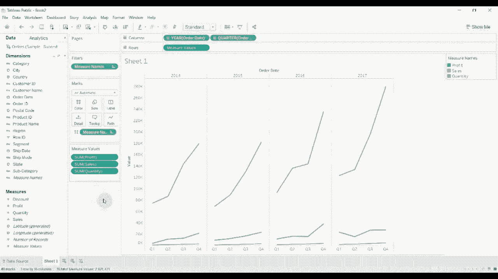

# 【双语字幕+资料下载】Tebleau操作详解，照着实例学做图！数据科学家的必备可视化工具，简单快速做出精美图表！＜实战教程系列＞ - P14：14）创建组合轴图 - ShowMeAI - BV1iq4y1P77U

Hi， folks， welcomecome to another episode of Tableau in two minutes。 Today。

 We're going to be showing you how to create a combined access chart。

 This is one of the sort of basic foundational things that you'll need to do with Tableau。

 It's also part of the tableableau certification for the desktop qualified associate level。

 and it's dead easy。 So I've got to happen connected to the superstore sample data set。

 And what we're going do is we're just going create a nice baseline。

 I'm going to drag order date out here， give order date。

 space it out so that we have some data at the quarter level。 Then we're going take sales。

 and we're going drag sales up onto the Rose shelf。😊。

When we do that， you'll see that we get a line graph for sales for each of the quarters。

And then we're gonna take profit。 We're also going drag it up onto the row shelf。 Now。

 you'll notice that we have sales and profit one on top of the other here。 We don't want that。

 We want them to be combined on the same axis。 So just hover over this little triangle fell in the corner drag it up above onto the sales axis。

 So drag profit onto the sales axis。 You'll see you get two green bars next to one another。

 Drop it there。 And then you get this dual axis， this combined chart where we have the measure values on pill on the row shelf。

 and then the measure values shelf down here， showing us what we have within our what we have displayed。

 So this orange line now is the。

Is the sales and the blue line is the profit and again they're on the same scale This is not a dual axis chart。

 if we had a dual access chart they would have independent scales。

 The combined chart has both of them using the same scale and just on a single y axis rather than having two y axises as we have with a dual axis chart。

If we wanted to add more， we could drag， say discount out onto this shelf。

 obviously discounts very small。 So that's not really showing up。

 You could also drag quantity out onto this shelf。 Again， quantity is very small。

 not really showing up。 But you can see how you could add and remove measures from this measure values shelf。

 And that wraps it up for this episode of tabau in two minutes， that's a really quick。

 simple version of how to create a combined access chart。 if you have any questions。

 please leave them in the comments。 if you would like there is a link to the workbook and to the data set in the video description。

 if you like what you hear then please give us a thumbs up and subscribe to our channel and we will see you next time。

