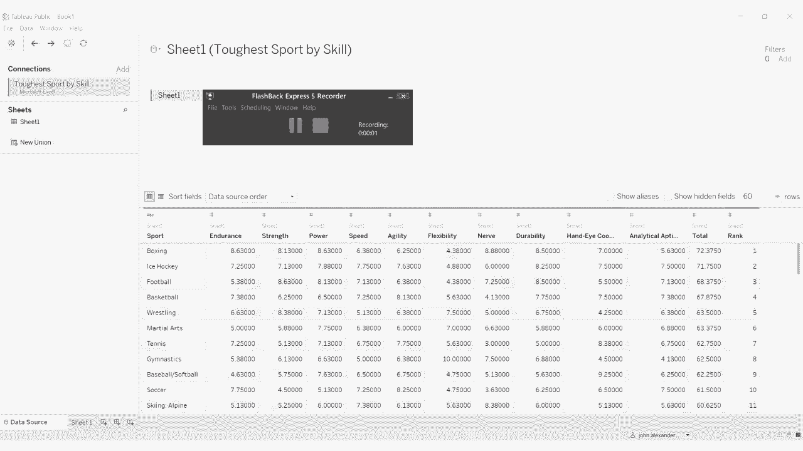
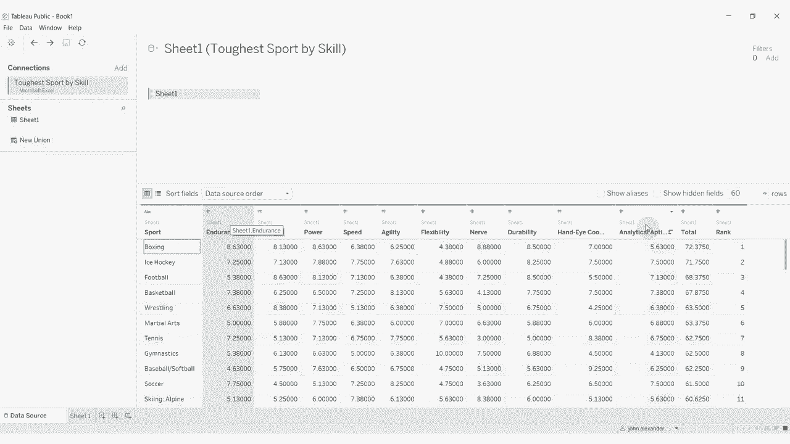
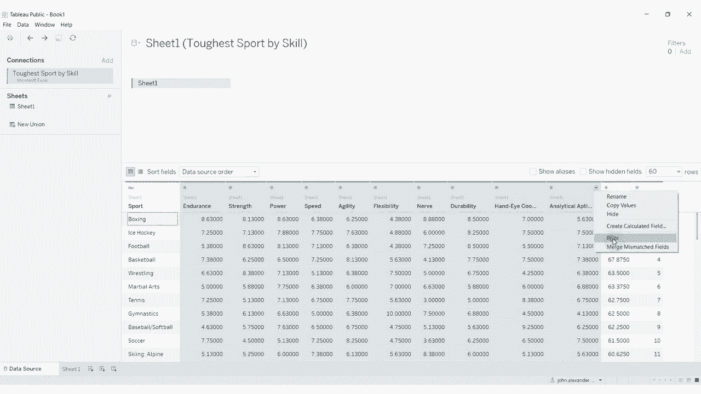
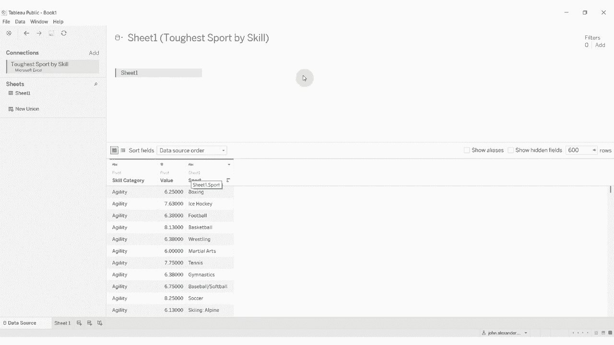
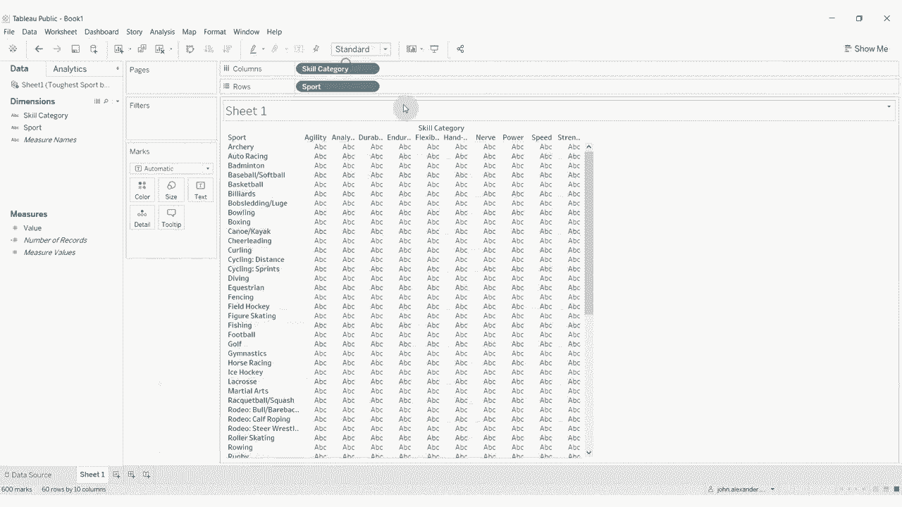
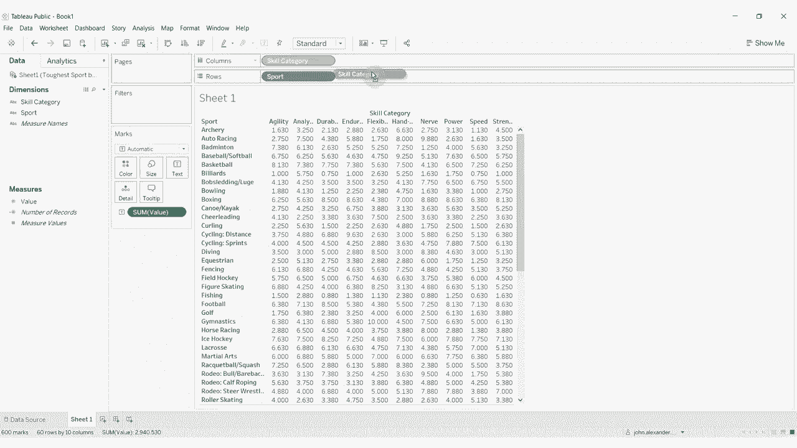
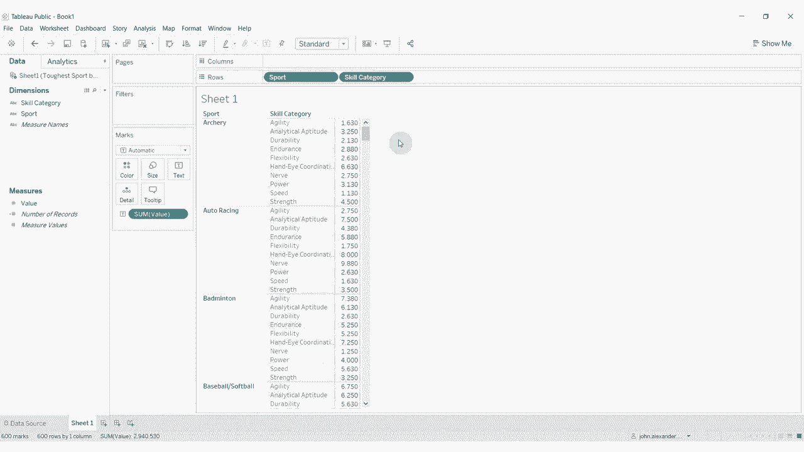

# 【双语字幕+资料下载】Tebleau操作详解，照着实例学做图！数据科学家的必备可视化工具，简单快速做出精美图表！＜实战教程系列＞ - P18：18）透视数据源中的数据 - ShowMeAI - BV1iq4y1P77U

Hi， folks， welcomee to another episode of Tableau in two minutes。 Today。

 we're going to be covering how you can use the pivot function with your data sources to turn column wise data into row wise data。

 So what do I mean by that？ Well， I've gone ahead and connected to a data source that gives us the ranking of various sports by the skills needed。

😊，So you can see we have the sport here over on the left hand side。

 and we have a number of different skill categories as it were。

 and then a ranking out of 10 for each of those skill categories， along with a total and a rank。

 I think this was some makeover Monday data from from many， many moons ago。

 But what if we wanted this to be row wise。 instead of column wise right right now。

 we have columnwise data。 So everything we have to sum up to get to this total is across the rows。

What tableableau allows us to turn these into a column。😡，By pivoting the data。

 So what we want to do is you want to click on all of these whoops， click on all of these columns。

 So I just clicked on the first1 I held down shift。

And then click on the last one and then click on this downward arrow above any of the columns and click pivotvo。

What that does is it takes that column wise data， flips it row wise。

 So now we have a field representing that skill category， and we have a field representing the value。

 So let's go ahead and rename these。 So they make a bit more sense。Skill category。Right here。

 we're going to rename this。Uh what would we call this just the value for the moment or the rating？

Then we have our sport and then we have total and rank。 Now these fields in sport。Total and rank。

They will all be duplicated for each of these values， right。

 so any so boxing is going to have this total in there a number of times。

 so we don't really want the total and rank fields。So we can go ahead and hide these。And now we have。

Just the sport， the skill category and the value。 And in tableableau terms。

 that makes the data a lot easier to work with Tableau as it much prefers。

Row wise data the column wise data。😡。

Let's go ahead and just hop into a sheet here。 We'll put the sports down the right hand side。

 or we'll put the skill categories up across the top。 And you can see that if we drag the values out。

 this is pretty much the data structure that we have before。

 All we've done is we've taken this skill category。

And done that with it so that now we have the sport and the skill category column wise instead of row wise。

That's it for this episode of Tableau in two minutes。

 There's a link to the data set and to the workbook in the video description。

 If you have any questions， please leave them in the comments and if you like what you hear and you'd like more tableableau tips and tricks。

 then please subscribe to our channel and we'll see you next time。😊。

