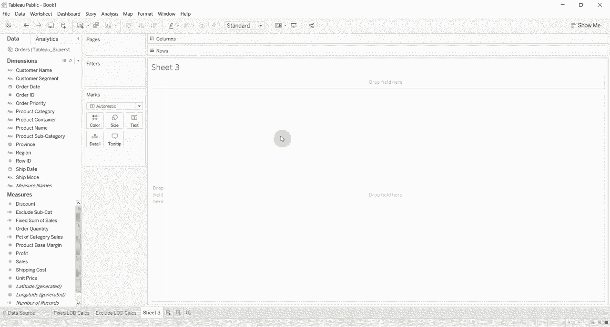
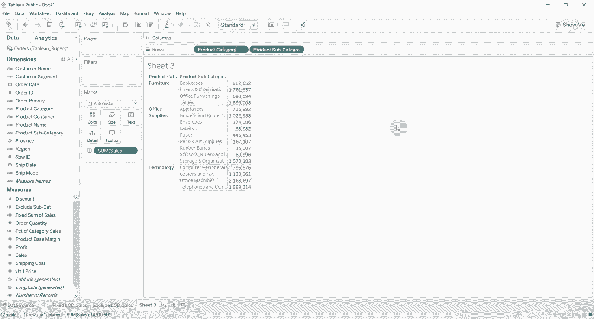
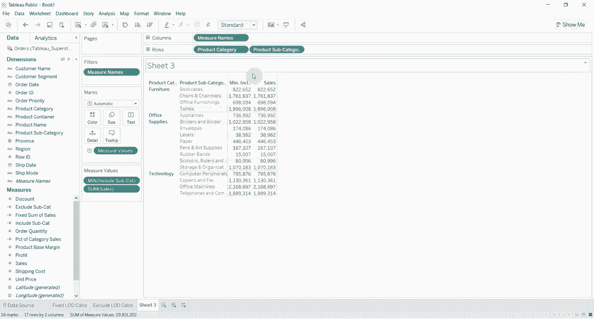

# 【双语字幕+资料下载】Tebleau操作详解，照着实例学做图！数据科学家的必备可视化工具，简单快速做出精美图表！＜实战教程系列＞ - P6：6）包含详细级别计算 - ShowMeAI - BV1iq4y1P77U

Hi folks welcome to another episode of Tableau in two minutes today we're covering a level of detail calculations we have two prior videos in the series that cover fixed level of detail calculations and exclude level of detail calculations today we're going to be going through the third and final one which is the include level of detail calculations If you remember and this is just a recap if you watch the other two videos fixed level of detail calculations we' aggregate a measure at always the same dimension a fixed dimension if you will。

😊，Exclude level of detail calculations will allow you to exclude a dimension while you aggregate a measure。

😊，And include level of detail calculations allow you to include a dimension when you calculate a measure。

 when you aggregate a measure， so what we're gonna go ahead and do is create the same table that we created in our other two dashboards here so we'll drag product container out onto the I'm sorry we'll drag product category out onto the row shelf product subcategory out onto the row shelf and then we'll take our sales and drag it out onto our ABcs here and create ourselves a nice little table Now let's go ahead and create a。

😊。

Level of detail calculation， so we're going to say include subcat and that is going to be a level of detail calculation where we include we're going to always include product subcategory and then we're going to say sum of sales。

And finish that off。嗯。Pick some spelling error there。

There we go。 Alright， and then we're going to drag include subcat out into our table here。

 So you'll see that at the moment， these are the same because they're actually aggregating the same way and we have product subcategory in our view where this gets interesting is when we remove product subcategory from our view and we take away。

😊。

We changed the level of aggregation。 So what we're going to go ahead and do is we're going to change the level of aggregation to maximum。

And then we're going to take away product subcategory。

 Now you'll see here that now our include subcategory is different than our sales and what this include is doing is it's calculating the sum of sales for each of the subcategories。

 and then it's taking the max for whichever one of those subcategories it think it' is the biggest and that's what it's displaying on here。

 So if we put product subcategory back， I just control Z to undo。😊。

You can see that the maximum sum of sales within the furniture product categories is for tables and that's 1896008 so if we take away product subcategory and look at furniture you'll see that it's 1896008 so it's showing us the sum of sales for the product subcategory that is the biggest we could if we wanted to change this to min or to any other level of aggregation so if we change this to minimum that's going to show us the one with the smallest category so if we put product subcategory back you'll see that our smallest was office furnishing 698094 and we'll take it away again。

 698094 and then finally we could if we wanted to we could say we wanted to average and that's going to give us the average sum of sales for each product subcategory within that。

😊。

Products category。And that's how you might use a level of detail calculation using include。

 it's a good way to get two different levels of measure so we can get the sales for the biggest subcategory within a product category as well as the total sum of sales for that product category on a visualization if you have any questions please leave them in the comments there is a link to the data we used for this workbook as well as a link to the work book itself on Tableau public in the video description and we hope that if you like the tableableau tips and tricks that you got today that you will subscribe to our channel Tableau in two minutes and we will see you next time。

😊。

