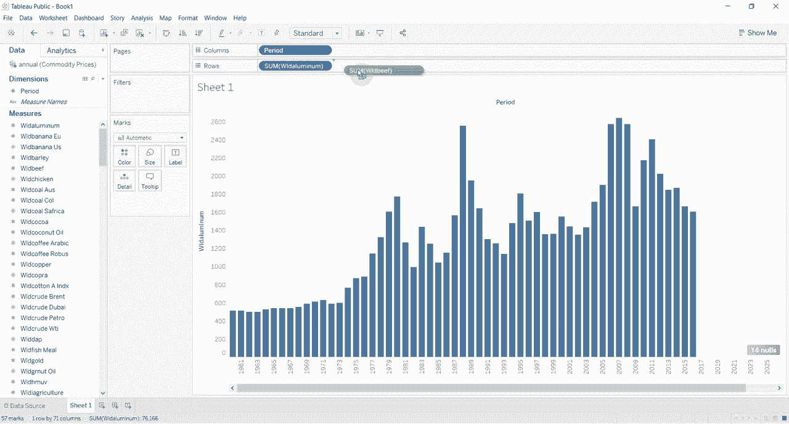
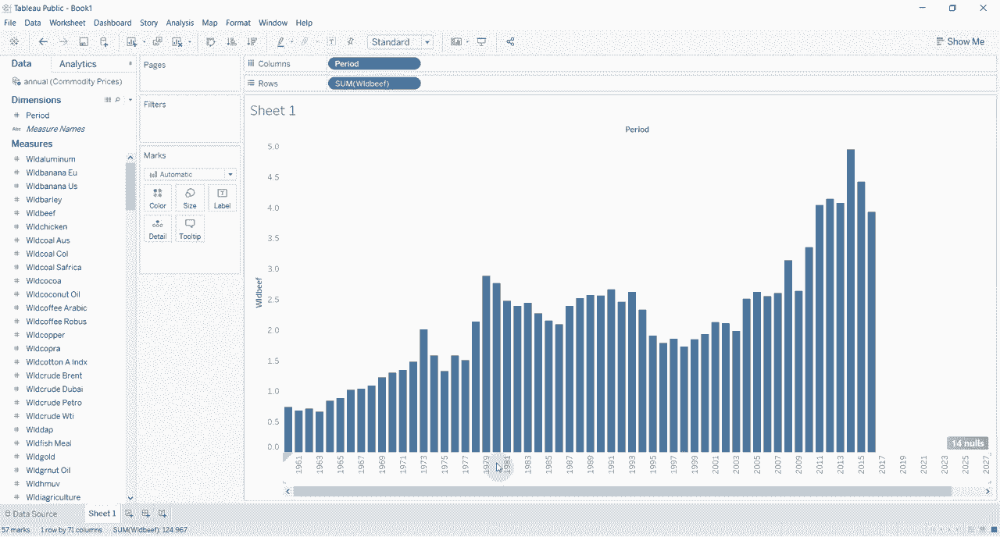

# 【双语字幕+资料下载】Tebleau操作详解，照着实例学做图！数据科学家的必备可视化工具，简单快速做出精美图表！＜实战教程系列＞ - P7：7）参数和下拉菜单切换度量 - ShowMeAI - BV1iq4y1P77U

Hi， folks， welcomelcom to another episode of Tableau in two minutes。 Today。

 what we are going to be using is demonstrating how to use a parameter to change the measure on your graph。

 Maybe you have two different measures that you would want to look at。 maybe say average price。

 total revenue， something like that。 You can switch between those using a parameter。

 and we're going demonstrate how to do that。 First of all， we need to connect to some data。

 I'm going to use a commodity prices data set that I've actually used in a previous video。

 You can download this。 There's a link in the comments section。

 It's one of the global economic indicators data sets。 We're going to use the annual data。

 Does it really matter what we use。 We're going do a lot of cleanup here。

 So we're going change this period。 Then we're going go to our worksheet。😊。

You can see we actually have a number of different pricing options across the top。

 All sorts of things from aluminum， bananas， bananas， barley， beef， chickenck， coal。

 all sorts of things。 And what we're gonna do is we're gonna to use a parameter that's gonna allow us to choose between a number of those options。

 So the first thing we have to do is a little bit of data cleanup。 So again。

 we have to just convert these quickly to whoops。

I've accidentally created a copy。 I didn't want to do that。

 We're just gonna convert these quickly to。Con variables to numbers。

 and then we're going drag them down onto the measure self。

 So the first thing we need to do is change the data type to decimal numbers。

 you'll see that changes everything to a number， then we're going drag these down onto the shelf here。

 then we're going to take period， which is actually the year that we created it at the top。

 we're going convert that to a measure we're going drag it out onto the column shelf Now you'll see here we have our little visualization with all of our years。

 let's say we wanted to look at the price of aluminum。

 normally you drag that onto the thing and we get this very nice bo graph which shows us the price of aluminum。

 but if you then wanted to see the price of beef。 The only way to do that is either to add it next to it。

 to drag it and drop it over the top so that you replace it now we're looking at the price of beef。

But we can change that with a parameter。 So what we're going to do is we're going to create。

 first of all。😊，A parameter。So we' going to create a parameter that allows us to select a couple of different things。

 So we're gonna say this is our selection。Parameter。

We're going to change the data type to be a string。

And then we're gonna give it a list of allowable values。 The first value that we'll have is beef。

the second value will have is，Aluminium or ainium， depending on where you're from。

And we're just gonna click。 Ok， We'll leave it with just those two values for the moment。

Then we're going to create a calculated field that is price。

 We'm just going to call it price for the moment。 And then we're going to say if。Our parameter。

 which we call the selection parameter。Is exactly equal。wo。Beef。Then， this。

Price is gonna be equal to the price of beef。We're just gonna track that over there， El。

The selection parameter is exactly equal to alllu。W， that's not the one we want ain E。lumuminum。

 there we go。We're gonna forget that we want to put quotes around these two。

It's exactly equal to aluminum。Then， we're gonna。Show the price。Have aluminum。elselse？

If there's an arrow， we're gonna return 0， then we're gonna end it。 Remember。

 you always have to put the end after your if calculations and hit O。Then we're going to take price。

Which is up at the top here。 And we're going drag that onto the period。 Alright， so。

Not 100% sure which one this is。 I think it's beef。

 If we click on the parameter down here and click show parameter control。

 You'll see that at the moment， it's selected to beef。 But if we change that to aluminum。

 our graph changes。 and now we have the price of aluminum。

Just as easy as that Now obviously you can have multiple options in there。

 if you would have multiple options in there， we could have one option for everything on this list。

 and then we wouldn't have to change the measure on the row shelf。

 This means that when you build a dashboard you can give your users the option of changing what they're looking at in a visualization without having to go through the rigmarole of changing the field or having a bunch of different visualizations on the screen at once you can just give them the option to change what they're looking at on one particular visualization。

 Thank you very much for joining us for this episode of tableau in two minutes if you have any questions please leave them in the comments。

 There is a link to the data in the。😊，Video description and if you like what you see。

 if you like learning about Tableau， then please subscribe for more Tableau tips and tricks and we will see you next time。

😊。

