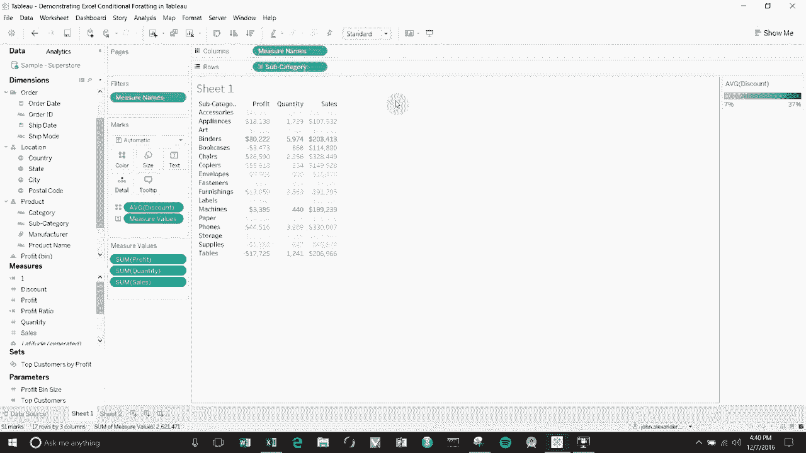
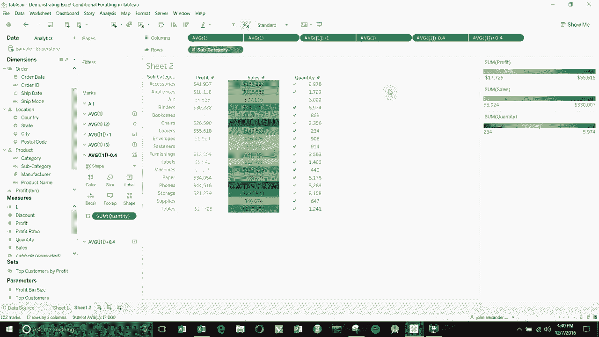
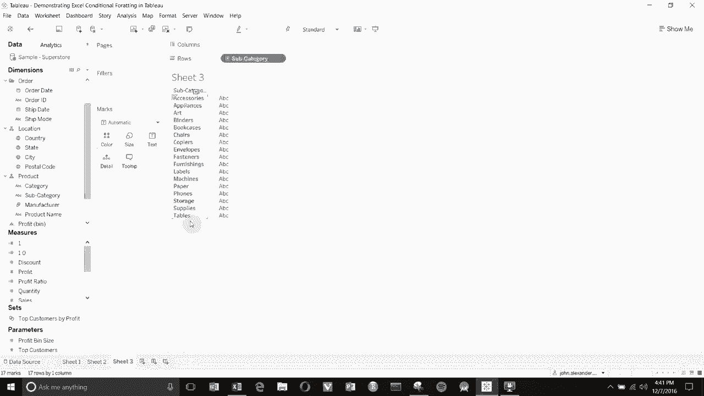
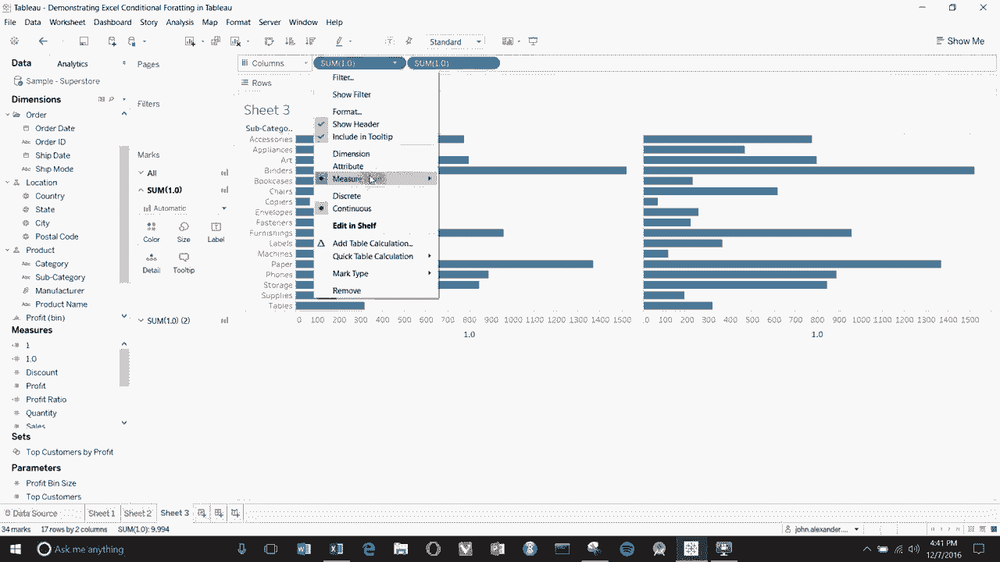
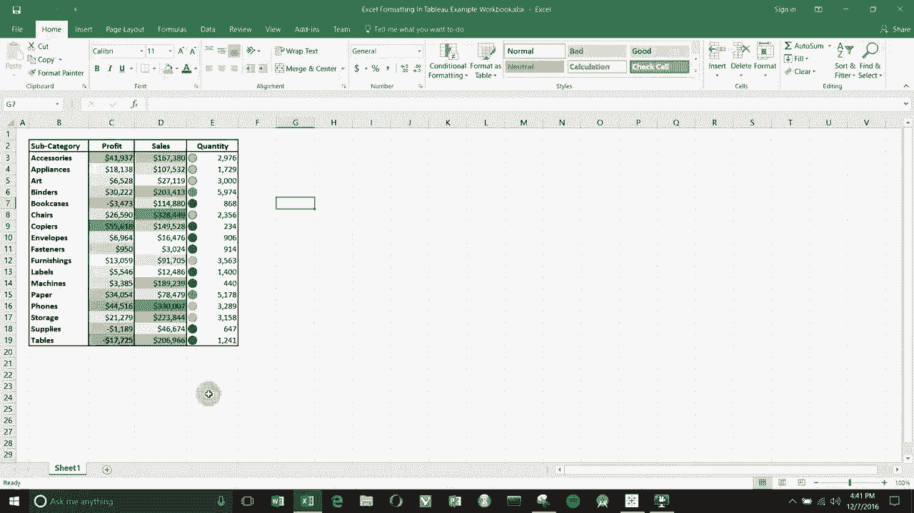
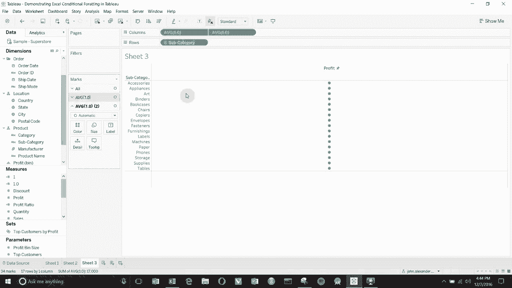
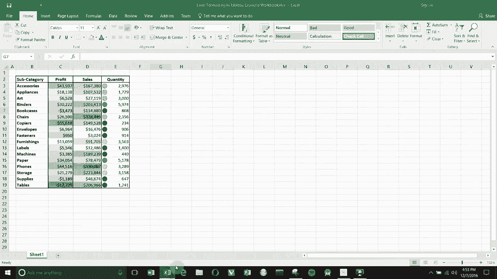

# 【双语字幕+资料下载】Tebleau操作详解，照着实例学做图！数据科学家的必备可视化工具，简单快速做出精美图表！＜实战教程系列＞ - P8：8）创建 Excel 样式条件格式 - ShowMeAI - BV1iq4y1P77U

Hello and welcome to another episode of Tableau In two minutes。 Today。

 we' are going to be covering how to create Excel style conditional formatting within tableableau。

 So one of the challenges of tableau is that it's quite difficult to color different columns by different items。

 See if we wanted to change the color， the word color on this particular graph。

 and we wanted to do it by discount， we drag it up to the color shelf。

 But every column here is colored the same。 If we wanted to color profit by profit and quantity by quantity and sales by sales。

 we'd have a much harder time doing that。 But in Excel， it's very easy。

 So here you can see we have sales， higher sales numbers in or sorry， higher profit numbers in green。

 lower profit numbers in red sales from white at0 up to this darker green when we get up to the 330000。

 And then quantity， we have these little icons representing the total number of products sold now。😊。

That looks easy。 It is easy in Excel， but it's a bit more challenging in Tableau as I said。

 So what we're going to create is this type of a graph。

Or sorry， this type of a table using that style of conditional formatting。 So to start with。

 we're going to go ahead and just open up a new workbook here。

And then we're going to create a calculated field that represents basically nothing。

 but we're going have going to call it 1。0 and we're just going to give it the value 1。0。

 And this is something we're going to use to manipulate the layout as we build our table here。

 So first thing to do， we want to look at this by subcategories。

 So we'll drag out subcategory to create our first column here。 Then we'll take 1。

0 and we're going to drag it to the column shelf。

Twice。And then we're going to change the aggregation。

To be average。To be average。 And then on this one， we're going to click on this downwardarrow on the right hand one。

 And we're going to go dual access chart。 Now you can see that gives us a single。

Axis which actually gives us two axes， one at the top， one at the bottom。

With only a single dot all the way down at 1。0。W doesn't look like a table yet。

 So let's make it look a little bit more like a table。 If you remember from Excel。

 the very first columnist profit。

So we're going to go ahead and set that up now， we're going to edit the axis。

We're going to click synchronize dual aes。We're going to set the value to be0 to 2。

And then we're going to change the title to profit。

 which is what it was in our very first column there。 Now we're going to go to tick marks。

 We're going to remove all of the tick marks from the top axis。 and then we're going to click， O。

 so remember， no tick marks。 Then in the general screen。

 we want to synchronize dual axes and set the fixed range to be 0 to 2。

 and you'll see why we do that in just a second。Click O， All right。

 So now we have profit label at the top of the axis。 We have a single axis going down。

 and then we have all of our dots in a line down the middle。

Let's do the similar thing with the bottom axis。 we're going to go edit the axis。

 It's already set it to fixed because we synchronize the dual axis。

 We're just going to delete the title so we don't have a title down there。

 Then we're going to go tick marks none and minor the tick marks none。 click that。

 and there we have just a single line of items going down the middle。Now。

 we do have to do a bit more， obviously， because we still have these little lines representing things on the background of the graph here。

 So we're going to go to format。 Then we're going to go format， and we're going to click on lines。

 which is this little stacked set of lines here。 Click on columns。

 And then we're just going to set all of this。To none。So got none， none， none， none。Nan。None。

 all right， perfect。 Now we have an open background with just a single set of dots going down the middle。

What you'll also notice is that。Close the formatting when we。Set this up on the Mars card。

 We now have three different versions of the Mars card， So we have。

These two items up here creating our dual axis chart。 And we also have all average 1。

01 and average 1。02。 Now， we can manipulate these individually to try and create the same sort of effects that we were creating in。

Excel。

So if you remember on the first column of our example here， we just had profit colored by profit。

So what we can do is we can take profit。On the very first markx card here。

 what we're going to do is we're going to take profit。Drag it out to the label。

And then we're going to take profit。And drag it out to the color。

We're going to change this chart type to text。And then you can see we've created something very similar looking。

 So it's all coloured by our profit。 We have the profit in the thing， but we have these big。

 annoying dots in the middle to get rid of those big annoying dots。

 we're going to go to the other marks card。 So the average 1。02。 Click on that。

 we're going to change the chart type。2 circle shape square doesn't really matter。

 Then we're going to make the size as small as possible。

 See now we've got tiny little dots in the middle， and then we're going to go to the colour。

 and we're going to scroll all the way down to make this opaque。And that gives us our column。

 with profit。Excellent， now， using the same sort of technique， we can build out our other columns。

 So we're going to take this field again to build our second column。Which is sales。 And in this case。

 we're colouring the background。 So we want to go to。Drank our 1。0 out again。 See some of 1。0。

 some of 1。0 whoops， I missed。Alright， and then we're going to change again， change it to average。

 change this one to average as well。Dan。😔，Create a dual axis chart。Then we're going to edit the axis。

 this one we called sales， if you remember。Oops。And to says， synchronize the x is fixed 0 to 2。

Get rid of the tick marks。Okay， that creates this one。We're going to create a second one。

Just delete the title， go to the tick marks， remove the tick marks。Apply none。 alright。

 Now we're in good shape。 So you can see that by creating this other dual axis chart。

 we've now got a second。😊，Sorry， a third and a fourth， Marks cards， so number 3， number4。Now。

In this case， what we're going to do is we're going to again， we're going to put the number on sales。

 so let's do that on the top marks card。 we're going to turn this into a text chart as we did before。

Oops， we're hopping around a bit here。 So we're going to turn this into a text chart。

Then we're going to take sales， and we're going to drag sales out onto the text。

 And now you can see we have sales all the way down our column here。

 but we're going to do something a little bit different。I'm sorry。We're going to go back。

 we're actually going to leave this as automatic。We're going to remove sales。When we go here。

 we're going to set the fourth one。To text。And then we're going to drag sales out onto text right there。

 Okay， now the reason we did that。Is because this card， the top one is underneath and this one。

 the bottom one is on top， and we want sales。The name to be on top of our dot。

 And you'll see why in just a second， so。What we're gonna do is take。

This field and this field is now going to create our background。So if you're a member before。

All we did was we made the dot really small， and then we kind of got rid of it。

 This time we're going to manipulate the dot。 So we're going to take sail。

 We're going to drag it out onto the color。 Now you can see our dot is colored by the sum of our sail。

 So the darker colorss mean higher sales， lighter colorss mean lower sales。😊。

We're going to change the chart type to a bar。And then you'll see right now。

We have bars going out about halfway across。The reason for that is because if you remember。

 we set set the scale on our axis from 0 to 2。And the mark， the measure is the average of one。

 So what we have， essentially， is。A bar going all the way out to one。

So what we want to do we want to take。A bath shot。Here， we're just going to add one to this。So。

We just double click on the pill up here in the columns She。

Add one to the average of one so that this is going to be2 as scale is 0 to 2。

 so this is going to cover all of this column。We're gonna to hit enter。

You can see it went all the way across。Make sure this matches。

 We'll use this in a slightly different way， creating a user formula because it can also be used to manipulate the layout when you want to manipulate the layout。

 but we're not quite ready to do that just yet。 So what we want to do is just create that bar add one to it so it goes all the way across and then blue seems like a bit of a silly color We use that last time。

 So why don't we change the color and we'll just change this to some nice screens there apply。 Okay。

And you can see that this is getting closer， but we probably want to make the bars a little bit wider so that they cover all the way across to do that。

 we just click on size， drag the size up， you can drag it all the way to the top and now each cell is coloured。

The background of each cell is coloured by the sum of sails within that cell。So we are getting there。

 getting closer。😊，I might want to make this too just a little bit transparent so that we can see some of our numbers in the background there。

Now we're on to the third column and the third column is where we're going to do some clever things with a layout to make sure that we don't have our shape and our numbers over nor sitting on top of one another as we had in some of the other ones。

 So again， to start the third column， we'll just take 1。0， drag it out twice onto the。

Column shelf here。Set the。Aggregation to be average。Then we're going to create a dual axis chart。

Like this。Do all the same things with our axes， so set synchronized， go zero to two。

This was quantity。That we were creating on the。Graph here。

 and then we're going to turn off the tick marks。Again。

 all of the same things that we did on the axis with the other one。

 and then we're going to do the same with the bottom axis so we're going to get rid of the title。

Go the tick marks here。 Turn off the tick marks。All right。

 Now you remember that when we created the profit column in the sales column。

 the first thing we did was we drug out the text in order to get the text into the cell。

 That's exactly what we're going to do again。So you can see again， by adding a column。

 we've got two more averages on the top here and we've created two more averages on the bottom of the marks card here。

😊，So again， the second one is always on top。 These last two are our last two up here。

 So we're going to go to the second one。 We're going to change the chart type to text。

 We're going to get the quantity here。We're going to get the quantity here and drag it out to the text She。

 Sometimes Tableau does this where it bounces up and down between marks cards。

 So make sure you're on the right one when you're manipulating this。

And now you can see in our quantity field， we have。The numbers for each of the quantities。

Which is a good start。 Now we want to create the shapes。 So we're going to go to our other card。

 So we've just gone up one。We're going to change the chart type。To shape。

And then we're going to change the shape again， second one up。

 we're going to change the shape to a filled circle。And remember， second one up。

 sometimes it jumps around， and then we're going to drag it out quantity onto the colour shelf。

And it's gonna colour them by the quantity here。 Now。

 we had a slightly different colour scheme in Excel。 You can also go in here and edit the colours。

 And maybe for this one， we wantan to use some purple。 Why not。You can see。

 but now the shapes and the labels are sitting on top of one another in this graph。

 So we need to move them somehow。Now， if you remember what we did with sales to create this bar and make it go all the way our top is we edited the pill up here to add one so that it then went all the way across。

 Well we can do the same thing。 One on both of these pills means that they're going to be centered within the column。

 But let's say we wanted to move them， say one， two thirds to the left and one two third to the right。

 just as we have in Excel here。😊。

What we're going to do is we're going to edit this one。 This one's going to be our first column。

 Remember， our first column was the quantity shape and the colour。

 and we're going go minus where to about。t3，3，3，3，3。There we go。

 That moves it about a third of the way to the left。Then we're going to go over here。

Double click on this one。 and we're gonna go add point3，3，3，3，3。

And that's going to move it about a third of the way to the right hand side。

 So now you can see that we have our shape and our column sitting off the side of one another。

 We seem to have forgotten the title up here。She'll take care of that now there there we go。

 so now we have profit sales and quantity。😊，You can manipulate the size of these columns the same way you would with the other charts so we can take the the edge here。

 just drag it across until we get some more reasonable sized columns， some more Excel sized columns。

 Again， you can manipulate the shape。 you can set custom shapes in here based on。

