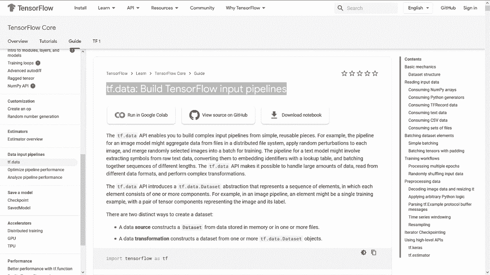
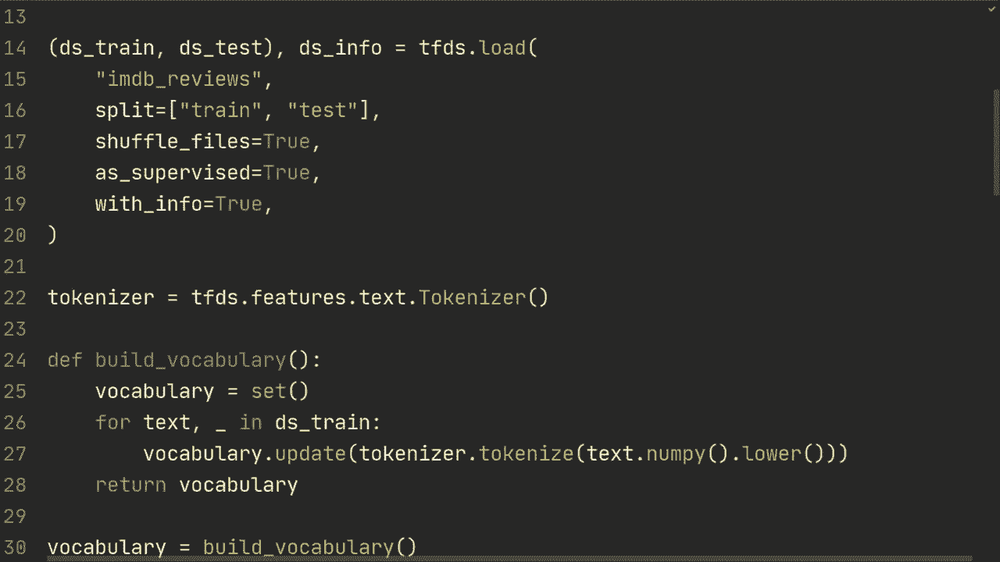

# 【双语字幕+资料下载】“当前最好的 TensorFlow 教程！”，看完就能自己动手做项目啦！＜实战教程系列＞ - P12：L12- TensorFlow 数据集 - ShowMeAI - BV1em4y1U7ib

In this video， we're going to look at Tensorflow data sets and how we can load different data sets。

 do preprocessing and load the data efficiently。

Alright so here are the dataset sets that are available through through Ka datasets。

 which is what we've been primarily working with so far。

 and as you can see it's relatively few right we've been working with Cycipher 10 and MNist and if we now just look at the comparison of Tensorflow data as we can see here we have a bunch more dataset so we have dataset sets for audio。

 images， image I don't know really difference between image image classification， object detection。

 question answering， structure， summarization text。Translate video。 I mean。

 there are so many dataset sets on this one。 So it makes sense for us to learn it。

 and it also becomes so we can also load the data extremely efficiently。

 Now I feel it's important to mention that what we're going to work with isn't the same as Tf do data。

 So Tensorflow datas makes it easy to load datas and it uses Tf data。 But if you have。

 let's say custom data you want to load you're going to want to use Tf data。

 So Tensorflow datas is a highlevel wrapper intended to make it very easy to load commonly used datas。

 And in future videos， we're gonna to look at how to use Tf do data to build an input pipeline for data sets that perhaps you've gathered on your own or scrape from the Internet or something like that。

 with that set， there's going to be similarities since Tf datas is a wrapper for Tf data。

 So what we learn in this video is still going to be useful for when we load our own custom datas。

Alright， enough talking。 So what we're gonna do now is actually take a look at the code。

 So what you have right here is just the standard imports we've been using。 There are。

 I guess this one is new and this one from import Tensorflow datas as TFDS。 that's new。

 So if you don't have those， you can Google how to download them for So for this one is just Pip install Tensorflow datas。

 therere also gonna be in the description for the links for annaconda。

 and then also the command for Pip。All right， so when you've downloaded that。

 what we're going to do is。We're gonna first just load the Ms data set。

 So we've been working a lot with Ms and we're all getting tired of Ms I think。

 but this is really just for a simple use case of how it actually works to load it。

 So what we're going do is we're going to do DS train DS test So we're going to get from this Tensorful data sets。

 we're gonna to get a data set for training， a data set for test。

 And then we're also going get some DSS info about the dataset。 So how we do this is TfDS do load。

And then here we're going to do Mnist。So then we do split and this right here。

 this string is just what you find on that the Tensor data catalog。

 and then you just write the dataset name as the string。

And then we're going to do split and we're going to do train。And test。

 So this is to this sort of we're doing DS Strain as the first output in this twople right here。

 So that's why we're doing split train first and then test。 Some data sets also have a validation。

 So then you would also do add a validation string here。 Emmins doesn't have that。

 But so you would have to check for the specific data set。

 sort of what you have what the splits are for that data set。

Then we're going to do shuffle files equals true So what Tensorflow data sets usually do is store things in something called TF records and usually they it in multiple files so let's say they have 1000 example per file and the reason is that that way it can be streamed through so if you're working with a server or something like that it can be streamed over internet and then it can be loaded simultaneously while it's training so that's quite useful if you're training on something like Google TpUs or something like that and so what we want to do is we want to shuffle those files so that and we want to shuffle those so that it doesn't see the exact same sequence of files even though the batches inside of that sort of 1000 examples are going to be shuffled and randomized we still want to shuffle the files so that the ordering is not the same。

Alright， and then we're going to do as supervise equals true。

 And this means that it will return a tuple of sort of the so of a tuple of image comma label。

 Otherwise it's going to return a dictionary。And then we're going to do with info equals true。

 So that's why we get this Ds info。 If we remove this one。

 we set it to false we're just gonna get Ds train and Ds test。

 So first thing usually we just do print DSs info so that we actually see what the data set looks like in this case I think we already know it but so the image shape are 28 to 281 and then the D type is Tf U in 8 and then we have label it has no shape it's just an integer and it's Tf in 64 and then we have a number of classes 10。

Total examples are 70，0，10 k and 60k for our training， and then you can sort of see citation。

 et cetera if you're using this for a paper or something like that。All right。

If you also have newer versions of Tensorflow， I think it's 2。3 and up。

 then you can also do something like figure equals Tftds that show examples DSs train DSs info so we're going set in sort of the test set and then information about the test set or training set rather and then rows and we can set columns and you'll see what this is going to doright yeah so what you also need to do is you can't do this as supervised it's expecting to get a dictionary for this。

 So let's just rerun it as supervised equals false and then as you'll see it will look something like this。

 where you can see some examples of your dataset set So here we have four rows and four columns as we specified and then we can see what the beneath we can see the name and then the labels so moving on what we need to do now is we're gonna create a function So we're going to define normal image we're gonna to take in an image。

and a label。 And what we're gonna do here we're just going to normalize images。 So。

 so essentially we're gonna make sure the image is TF flow 32。

 and then we're gonna just divide by 255 to get it in that0 to1 range。

 So we're gonna return TF dot ca image。 and then TF dot flow 32。 and then divide by 255。

 and then we're gonna return the label。And so。What we can do is now is we can do Ds train equals DSstrain。

 map。And then， normalize image。Alright， so we're essentially what this is going to do it's going to map every single example and run it through this function first。

And then we can also specify nu parallel calls since to send in to this normalized image there' is no inherent sequence that needs to be done in so this can be done in parallel so then we specify how many parallel calls it's going to do and so you could specify this yourself so let's say5 or 10 whatever it's essentially going to be a hyperparameter of your model one cool thing is that Tensorflow lets you do auto tuneune so it's going to sort of find what Tensorflow thinks is best and then how to get autoune you would do Tf do data that experimental dot auto tune。

And then we're going to do Dstrain equals Dstrain dot cache and this cache is essentially after the first time it's loaded data。

 it's going to keep track of some of them in memory so that it's going to be faster for the next time。

And then DSstrain equals DSstrain dot shuffle and we can essentially set the buffer sort of the shuffle buffer size and let's say 1000。

 so this means that it's not going to see the entire range of the dataset。

 but it's going to also this number kind of depends on this size of the files that in this case Tf datasets has stored them in but what you could do here also is you could do DSs info dot splits and you could obtain the train and then you could just do do nu examples and in this way we're going be sure that it's going shuffle them randomly。

And then we're going to do Dstrain equals Dstrain dot batch， and then we can set some batch size。

And let's set the batch size above here。 So batch size， let's do 64。Oh。Al right。Get that back。

 and then。Also， we're gonna do D Strain dot prefetch。

 and then we're gonna also gonna set auto tune on that。

 And then also here on the prefetch essentially， it's gonna while it's running on the GPU。

 it's gonna prefetch 64 examples so that they are ready to be run instantly after the the GPU calls are done。

 And then all we gotta do here is we gotta do it for the test set as well。 So we gotta do。

Pretty much the same thing。Pretty much the same thing。

 So we're gonna do D S test is D S test dot map。Normalize image， and then nonpar calls is auto tune。

And then we're gonna do。Bch， so we're not going to shuffle it for the test set。

 And then we're going to do Lastly， we're going to do pre fetchtch。Prefet fetch， and then auto2。

Alright， so this is for the actual data processing and this is going to be similar to when weve when we're loading the data ourselves using TF data。

 so this is just this is so this is already a Tensorflow data which has been loaded very conveniently by this thing。

 but after that point， so this is exactly what we're going to do when we have custom data sets and so on。

And then let's see。 What we need to do now is just create a simple model。

 So let's do careas that sequential。 and let's do Kaas input 28。28，1。

And then let's just do one comm layer。32 output channels，3 kernel sides， and then。Rello。

And let's do flattenten。And then one then layer。And that's it。

So all we got to do now is model compile。 and you've， you've seen all of this before。

 So model compile optimizer equals cares that。Optimizers dot Adam， We can set the learning rate。

And then loss equals krisat losses dot spars。cateategorical。Ccroross entropy。

And then metrics is just going to be accuracy。And then。

We're going to do model do fit on the Ds train， so normally you would have to send in x and y。

 so if you have x and y you would do x and then y。 Now since we have everything in this Ds train。

 we can just send that in and that's going contain twople of the x and Y labels and then we can do epochs set it to5 or something like that ver're both equals 2 and then model that evaluate on the test set。

And if there are no errors， let's see。 And this hopefully works。Yeah， one thing we had to do。

 we did as supervise equals false when we wanted to do this show examples。

 but we gotta do supervise equals true for this to work。 So let's rerun it。

And let's see what's wrong。 So what we gotta do here is we gotta do from logicit equals true。

 Otherwise， this is not gonna train， so。Think that's what we were missing。Alright。

 so we get 98% on the test set。 And so that's an example of Mist with images。

 I was thinking that we could also look at something a little bit。More。

 I guess something different in text classification。 So this is gonna be， I guess。

 a little bit more advanced because it's also gonna to be how to process the text and so on。

 we're gonna do it very simple and try to focus on a data。

 but we're gonna so we're gonna look at IMDB data reviews。

 So essentially that that reviews of movies and and so what we want to do is a sentiment analysis on these reviews of these movies and tell and sort of interpret if the comment is a positive comment or a negative one。

 So let's just give an example。 I mean， some comment might be this movie was terrible and then we would give that a zero since this is negative。

 And then if something someone said this movie was really good。

 then we would set this to maybe one right So that's sort of the the data we're working with we're gonna do is similar to what we did before。

 D S trained D S test。We're going to do and then DS info， we're going to TFDS dot load。

 and we're going to specify IMDB reviews。We're going to do split is。Train， and then test。

And then we're going to do shuffle files equals true as supervised equals true。And then with info。

 equals true。All right， so the same as what we just did。Now， what we need to do also is since what。

 if we just so what we can do， first of all， actually， we can do print D S info and then we can do。

 I du't know， something like。For text， comma label in the S train。 We can do print text。

 And then let's just quit。After one single example。 So just just so begin get。

We get an interpretation of how it looks like。 And then we' gotta do。Split。Alright。

 so we get some information here。 We get test train。 So we have 25 k examples for training。

25 k for test。 And then this unsupervised， I think are just comments that we don't have a label for。

And then， yeah， and then we get great fun。 I went with eight friends to sneak preview viewing of this film。

Yeah， so you can sort of。It's quite a long comment， but anyways。And。

So that's how it looks like what we need to do first of all is actually tokenize it so that we don't get an entire sentence because that's we can't send an entire sentence to our model。

 we need to first tokenize it so that let's say we have a string hello， know I love this。

 I love this movie。Movie。 And then we， we're gotta do so tokenization。 And essentially。

 the output is then gonna be a list of。Sort of the specific independent words。 So I love。

And then this etc， you get the point and then the next point is we need to actually numericalize it so that we we can't send in a string here。

 we need to convert each of these words to an index using some vocabulary。Alright。

 so what we need to do is we need to do tokenizer and we can use Tensorflow datas for that。

 We can do features text do tokenizer。 And one thing here is that so Tensorflowlow has a bunch of different ways to process text。

 and it's a bit confusing， to be honest。 you have Tensorflow datas that you can preprocess it CAs has a tokenization。

 you can preprocess it And then there's also a library called Tensorflow text that there isn't really that much information on。

 So yeah， I'm not really sure which one of these three are best so far this Tensorflow data seems to work fine。

But anyways， after we get thisken tokenizer， we're going to do define build vocabulary。

And we're gonna do a vocabulary。 iss gonna be a set。And then we're going to do four text。

 and then we don't need the labels in DS S train。 We're going to do vocabulary do update。

 tokenizer do tokenize。Of that text。 and then we got to convert it to numpy。

 and then let's do it lower so that it doesn't really matter if the characters are uppercase or lowercase。

And one thing， if you're very observant is that we're adding every word now in our vocabulary and that is not ideal。

 right， normally it would set some frequency。 let's say if it occurs five times in our data Then we add it to our vocabulary because that's then it's an important word or something like that。

 So this is not really for efficiency， this is not for accuracy。

 I just want to show you a very simple example of how you would do this。

 And I think you can try to make this better and。Yeah。

 do something like check how many times that specific word occurs and then add it if it。

 if it occurs a certain amount of times， something like that。

And then we're going to return that vocabulary。And so we're going to do vocabulary equals build vocabulary。

And then one thing we're going to do now is we're going to do an encoder。 So as I said。

 we need to numericalize these specific all of the tokenized words。

 and that's going to be done with TFTS do features dot text do token text encoder。

And then we're going to send in our vocabulary， first of all。

 and then we're going to send specify out of vocabulary token。

 so if we get a word that's not in a vocabulary， in this case。

 we're not going to get any right because we're adding every single word， but anyways。

 and then we're going to do lower case equals true。And tokenizer， we're gonna specify our tokenizer。

Alright， so now we can do define my encoding。And we're going to get some text tensor and we're going to get some label and what we're going to do is we're going return encoder do encode that text tensor do nuy。

 So we're going to convert it to Ny first and then we're going to return the label So essentially what this encoder is going to do is it's going to tokenize it and then turn it into an index based on this vocabulary right here And so it's going to do all of the things we need essentially。

And then we got to do another function。 So we're gonna to encode map。

And we're gonna send in some text and label。And the thing is here that the data loading is also part of the Tensorflow graph。

 so this is a python function， and we need to do a function to we need to specify the input and the outputs of this function so that it's part of the graph so we're going to do encoded text and then label is Tf py function so we essentially we're going to specify that we're going to send it through some python function and we're going to specify the function so my encoding we also need to specify the input so this is because of its part of the because it's part of the graph we're going to do text and then label and then we're going to T out is is Tf in 64 Tf in 64 so because when to numericalize is's going to become an integer representing the word in our vocabulary。

And both are going to be integers。And then we also got to do encode and text dot set shape。

 so we got to specify the shape and we're going to specify none。

 and why we're specifying none is because we essentially have a sequence and that sequence can be arbitrary length。

Although the label are just going to be a single integer of 0 and1。Alright， and then at the end。

 return encoded text comma label。 So this can feel a little bit， I't know，unk clunky。

 like unnecessary， but。And there might be better ways to do it as well。 This is just。

How I managed to get it to work and and it seems to， to be that this is a standard way of doing it。

Alright， so then we're going to do auto tuneune Tf that the experimental dot auto tuneune。

We're going to do Ds train is DSstrain dot map。 We're going to send it through encode map。

That's what we call it right in code mapap。And then， nu parallel。Calls is autotune。

And then we' got to do this。Let's do cache。 So dot cache。

And then we're going to do D S train equals Ds train dot shuffle。 And let's just write 10000。

 And then what we're going to do now is D S train。That padded batch。

And we got to do a padded batch because all of the sequences in our batch are going to be different in length。

 so we need to pad it so that pad it to the longest example。And。

What we do here then is we do padded batch 32， and then we gotta specify padded shapes。嗯。

So we got to do none。And then just a tuple。So on new versions on Tensorflow。

 this part is not necessary， but essentially what we're doing here is we're specifying which of the of the shapes that are going to be padded。

 So when we specify none here， those are for the images or rather the text sequences。

 and that's the one we we want to pad。 So that's why we write none on that one。

And then Tensorflowlow is going to know that we want to pad that one and then we're got to do DSs train。

Thatt prefetch。 And then again。Auto tune。And similarly for our test set。

 we're just going to do DSs test。Dot map and code map。Encode map。 That's it。

 And then we're gonna do padded batch on that one as well。 So D S has thatt padded batch。32。

 And then again， padded shapes。A're going to be none and just a tuple。Allright。

 so that was it for the preprocessing of the text and the data。

What we got to do now is create our model。 So we're just going to create a very simple model。

And then we can， we're gonna do， first of all， we're gonna do layer start masking。

Mask value equals 0。 so essentially。So essentially here we're telling TensorF that the values that are padded they're going to be padded with index of 0。

Those values are going to be ignored in its computation。

 So let's say we have one sequence that's 1000 in length and we have one that's 20。

 then that 20 in length is going to be padded by 980 of zeros and performing the computation for all of those are going to be quite unnecessary。

 So when we're doing this layer that masking， we're just letting Tensorflow know that just ignore those values of0 don't perform any computation。

 Yeah， so。Then we're gonna do layers dot embedding。

 We're gonna do input dimension is going to be the length of the vocabulary。 and then plus 2 plus 2。

 because we added one when we did this padded batch with index of 0 to our vocabulary。

 And then we also have one out of， out of。We also have one index for out of vocabulary words。

 So we're just going to add two on that。And then let's specify some output I mentioned。

 we're just going to specify 32， which is very small for an embedding size。 Normally。

 you would have 300 or something like that。But as， again， this is just for illustration。

 And then what you would also do is you would do some LCSTM or some sequence model on this。

 In this case， all we're gonna do is we're gonna do global， global average。Pulling 1 D。

 So let's just say we had 1000 words in our sequence。 And then what we did is we map this each。

 each index， each word， we mapped that to an output dimension of 32。 So essentially， we had。

 you know， batch size。And then times 1000 in that case。

 And then what we did after this embedding we're going to get batch size times 100 times 32。

 So each word has been mapped to an output dimension of 32。

 Then after this after this average pooling， we're just going to get batch size times 32。

 essentially taking the average of all of the sequences for all of the examples。Yeah。

So then we're going to do layer start dense。64 activation equals re。And then at the end。

 we're just going to add one dense layer。So let's just say it's gonna output a single float float value。

 And then if it's if it's less than0， if it's less than 0， then it's negative。So less than zero。

Negative， greater than0。Positive or maybe greater or equal。

So what we're going to do here is we're going to use binary cross entropy and that's going to use the sigmoid activation function。

So yeah， I guess this， this part of is a bit more advanced。 So if you're not really following that。

 that's okay。 But yeah， so what we're gonna do now is we're do model compile。嗯。

I guess also one thing you could do is you could do as we have done previously where it would output two nodes。

 and then you could use sparse。Srse categorical cross entropy， as we've normally done。

 It's just that when we have two classes， we can instead use another loss function。

 and that loss function is care that loss that binary。

Cross entropy and then from logicit equals true。And then we can specify the optimizer。

 cars that optimizes。 atom。3 e-4。 And then we can specify the clipping value so that they we don't get exploding gradient problems。

And then metrics， we're gonna do。Accuracy。Alright， And then in the end。

 we're just gonna do model that fit D S train。 Let's do it for 1nypos。

And then we're going to evaluate it on the test set。 So again。

 this is not in any way for accuracy or something it's just for demonstration of how we would take this data set from Tensorflowlow data。

 Billy vocabulary， preprocess the text， load it efficiently and then create a simple model just to show that it works。

So let's run it and see what we get。Alright， so first of all。

 can we just talk about how that ran without any errors on the first try。 I mean。

 I wrote like all of this code and it ran on the first try。

 That got to be the first time that is actually that has actually happened。 So on the test set。

 we get 89% at the end。 And let's see if we can scroll up。This is why I set the verbose equals 2。

 by the way， and then we get 96% on the training about so。WellWe can， I mean。

 there's some room for regularization and there's also some room。

 we can try and know train this for a little bit longer。 Of course。

 we can make the model bigger and so on。 But for this case， this that， that's fine。 So alright。

 so hopefully this video was useful。 I know this last part might have been。Li little bit advanced。

 but I also wanted to show you how you would do it for text and I also want to mention that there are a bunch of different ways to do this。

 This is one way。 And if you have an alternate way that you think is better to something like this to process the text then please leave a comment。

 But anyways， thank you so much for watching the video。 And I hope to see you in the next one。

