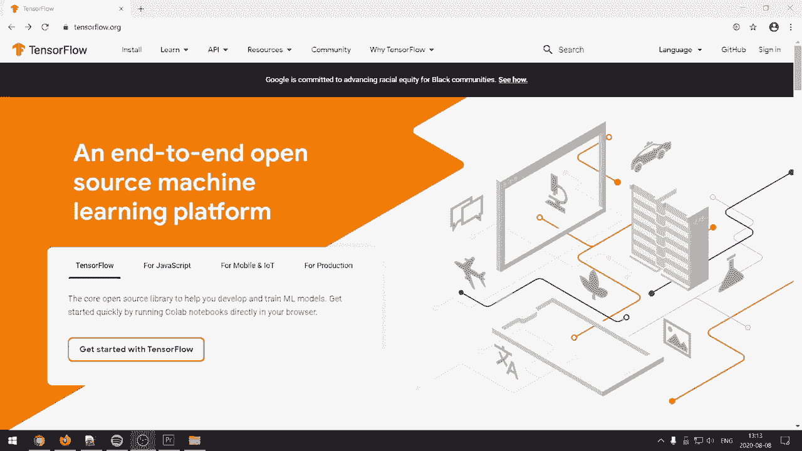
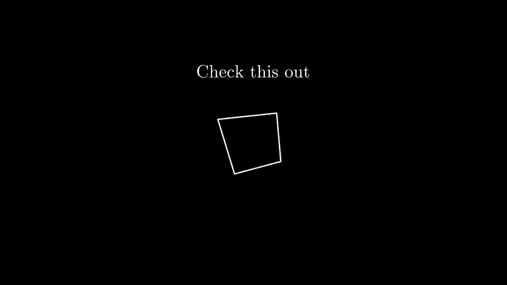
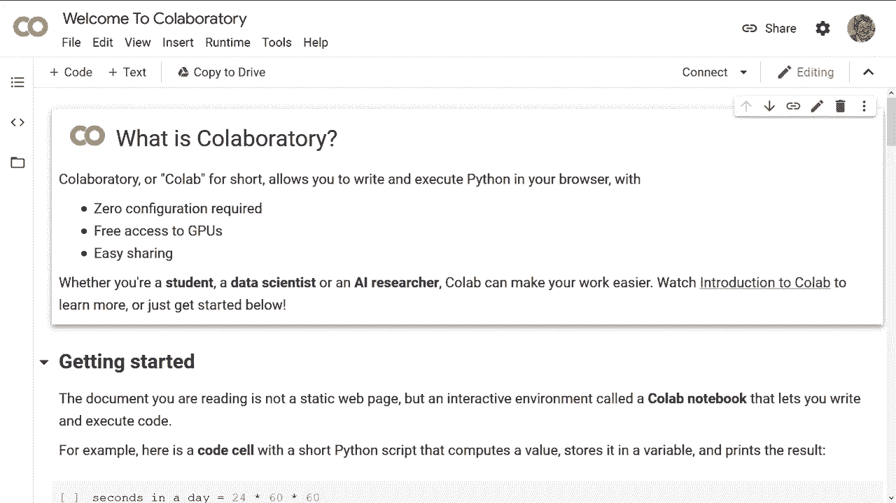
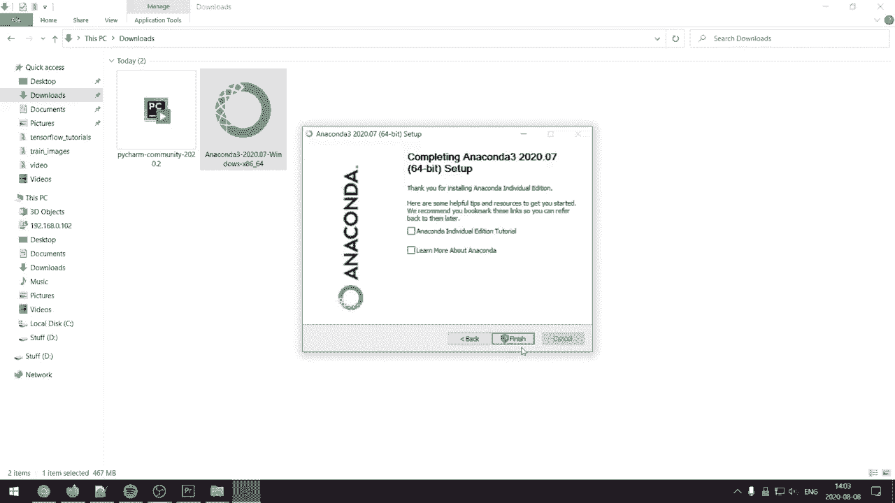
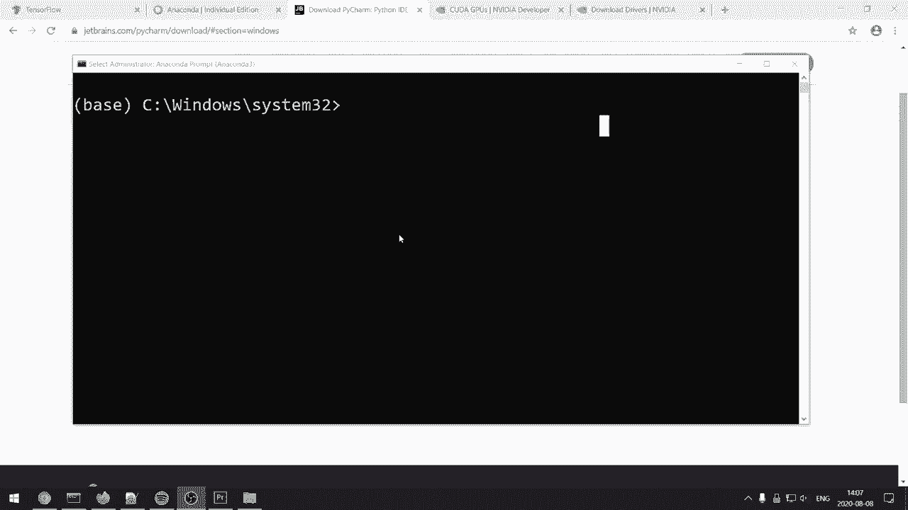
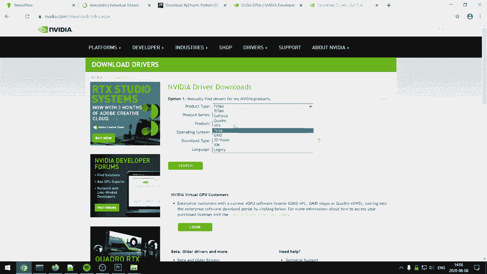
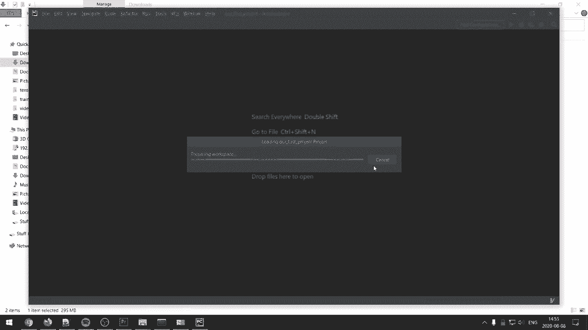
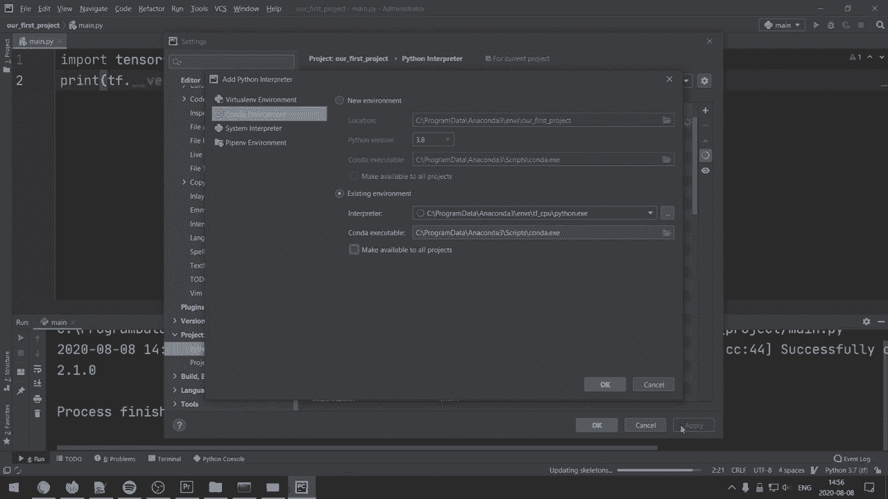

# 【双语字幕+资料下载】“当前最好的 TensorFlow 教程！”，看完就能自己动手做项目啦！＜实战教程系列＞ - P1：L1- 安装和设置深度学习环境(Anaconda 和 PyCharm) - ShowMeAI - BV1em4y1U7ib

🎼Ladies and gentlemen， welcome to the best TensorFlow tutorials in the entire Frickin world。

So I've been planning and structuring these videos for a while now and the goal is for us to build a solid。

 solid foundation in TensorFlow so that after watching and going through these videos you're ready to start doing your own cool projects So what I expect is for you to know the basics of Python and preferably some math in linear algebra and then knowing the theory behind deep learning is great and you're going to have a much easier time understanding what we're actually doing。

 but if you don't I'm going to write theoretical prerequisites and refer you to great resources where you can learn about the topics for each specific video in this way I'm able to completely focus on Tensorflowlow and the coding part and make these videos much more concise。

Alright， so with that said guys， let's get started and before we do anything we need to install it and no joke this might be the most difficult part。

 the easiest way to get started is just using Google Coab and there's going to be a link in the description so using coab you don't have to install anything so if it doesn't work for whatever reason you can always use this for the time being and it would look something like this where you would have you would have cells where you can just import Tensorflow STF and we can do something like print Tensorflow version。

And you'll have the latest version of Tensorflowlow Now preferably you want to have it on your own PC and I think I've found some pretty easy ways to install Tensorflowlow for the GPU and CPU depending on what you have and I'm going to show you the easiest way I know to set it up So the first link we're going to go to and all of the links are going to be in the description of the video we're going to scroll down and press download for Ananaconda then we're going to take the specific Ananacon installation for our PC in my case that 64 bit windows and then the second page we're going to go to is this installation for Pyar which is the editor that I recommend and we're going to take the community version the free version and we're going to download that one。

Now that you have both of them downloaded， we're going to start with installing an aconda。

 so let's run it as administrator and we're basically just going to have the default options on everything。

 so we're going to press next， I agree next， next and then install。Then when it's complete。

 we're gonna press next， next， and then。Yeah， finish。

Alright， so then we're going to open Ananaconda and the first thing we're going to do is we're going to create an environment。

 so basically Ananaconda allows you to have multiple environments where you can have different packages for each。

 so for example， let's say you wanted to have one version of Python and then another version you could have different environments for both of those now that we want to create our environment it's going to depend on if you have a co enable GP or if you're going to run on the CPU so what you can do is you can go to this page here could enable Gfor product and you can see if you have the the required compute capability on your graphics card。

Then if you do have a co enable GPU， you're going to want to download the drivers for your graphics cards graphics card first。

 So if you're a gamer you probably already have this so you won't have to bother but it can make so for example let's say you have G4 experience and you have the latest drivers you probably you already have the NviIo drivers so you don't have to do this but otherwise it's on this page so let's start with the option that you have a GPU so we're do we're going to write conduct create hyphen hyphen name we're going to call it Tf for Tensorflow and then we're going to do space and we're going to write Tensorflow hyphen GPU all right we're going press enter。

。Now what's great about the content installationlation is that if you look at the libraries it's going to download is it's going to download the Nvidia to co a toolkit and it's also going to download the code andN library all right so you don't have to bother about finding the specific versions to match and so on and it's also so it's going to download everything you need the only thing you have to do is just why and then enter and it's going to download everything you need。

So when that is done， we now have an environment where we can run Tensorflowlow in the GPU and all we had to do was run a single command to install it so the only con of doing it this way is that Tensorflowlow doesn't ship natively with Conda meaning that we're going be a few versions back and in this case the latest version is 2。

3 we're now going have Tensorflow 2。1 but doing it this way saves us a lot of headache。

 if anyone from the Tensorflowlow team is watching this video。

 please consider shipping Tensorflowlow with Connda Pythtorch does it and it's super easy easy to install and makes it a lot easier for us users of TensorFlow for the second option of installing Tensorflowlow on the CPU we're going to do Conda create iPhoneheni name Tf let's call it CPU。

And then we got to activate that environment。 So we're going to do Con activate Tensorflow CPU。

 The first thing we're going to do is do Con install Pip。Now that we have Pip。

 we can do Pip install TensorF。

The next step is now to install Pchar all we're going to do is is press next， next。

 I'm going have I want to have a shortcut and then I want to associate Python files to open with Pcharm and then next。

Install。And then run Pyr。Do not import settings is fine， okay。And then this is fine。😔。

And then I'm going to install Vim， but if you don't know what VIm is， if you don't use it。

 then don't install this。And then start using P charm。

So what we're going to do is we're going to do let's see。We can create new project。

 and then we can do。P let's call it。Our first project。

 and then we're going to go to existing interpreter here and we're going to go to let's see this dot dot dot right here。

 we're going to go to Conda environment and here you should now see your two environments。

 So or if you just created one you should see that environment。

 So I'm going to take the Tf for that has the GPU enabled and then I'm going to press make available to all projects and I'm going to press okay。

And then now we have that interpreter， I'm just going to do create。

Yeah。And now you should be able to do， let's see。You should be able to do import Tensorflow as T F。

 and we can do print T F。Version。And then we get TensorFlow version 2。1。0。

 or if you're using the CPU， you should probably have the latest version。

Now let's say for some reason that didn't work， I've seen some people have issue finding the condo environment。

 you should be able to also go to settings and then you should be able to go to project Python interpreter and then here you should be able to press add right here and then Con environment and then existing environment and then here you should be able to see the interpreter。

 in this case the Tensorflowlow CPU and then you can do make available to all project。

So that's if you don't find the Python interpreter That's it for this video for setting up TensorFlow if you have any problem with this leave a comment and I will try my best to help you out with that said in the next video we actually get started coding and I hope to see you there。

