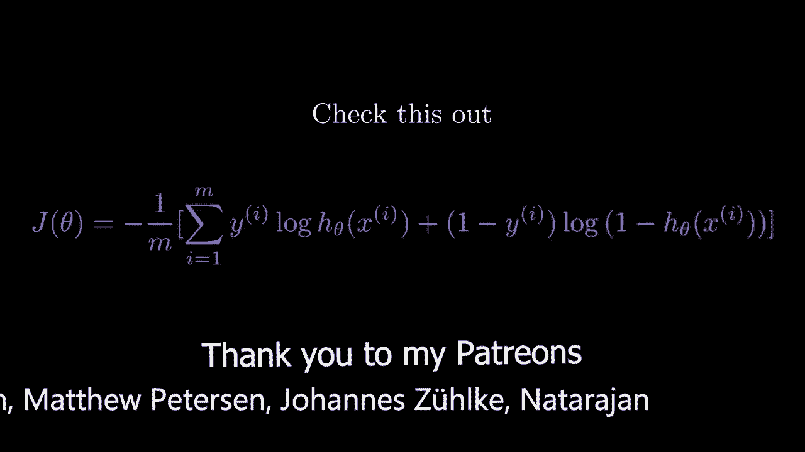
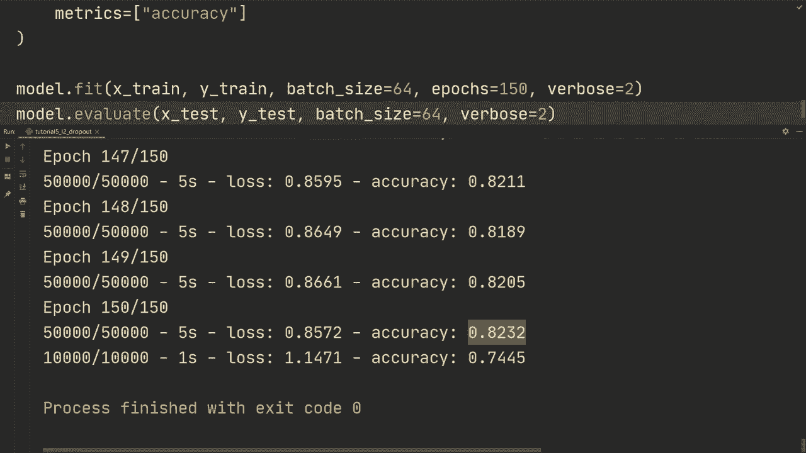

# 【双语字幕+资料下载】“当前最好的 TensorFlow 教程！”，看完就能自己动手做项目啦！＜实战教程系列＞ - P5：L5- 使用 L2 和 Dropout 添加正则化 - ShowMeAI - BV1em4y1U7ib

What's going on guys welcome back to another Tensorflowlow tutorial in the last video we built a simple convolution on neural network and when we trained it we saw that there's quite a large gap between the training accuracy and the test accuracy and when that's the case we define it as the model is overfitting to the training data Now we call the methods to reduce overfitting regularization and there are multiple methods of regularization and to just mention a few you could reduce your model capacity to avoid overfitting you could also add L2 regularization dropout early stoppage or adding data augmentation so if you're unfamiliar with these terms make sure to watch the more theoretical prerequisite videos that I've mentioned previously we're going to explore all of these methods of regularization at the end of these series of tutorials but in this video I just want to show you how to add L2 regularization and drop out to our model。

So in this video we're going to keep it quite simple the other methods are in my opinion。

 best to keep in a separate video to keep the videos more concise。

The first thing we're going to do is we're going to from Tensorflow carriers。

 we're going to import layers， but then we're also going to add regularizers。

And then when we scroll down to our model， we're going to add first let's add L regularization and what you got to do here is that you got to actually add it for each of the layers separately and then so for simplicity let's also do padding equals same and then we got to do kernel regularizer。

Regizers dot L2。 and then we're going to set the the weight of deregularization for that specific layer。

 So let's set it to 0。01。And then we got to do that for all of the layers。So in this one。

 let's also do padding equals same just for simplicity。

 We're going to do kernel regularizer equals regularizer L2 0。01。And then we just have one more coer。

 So we're going do。Similarly here。Adding equals same。

Colonnal regular regularizer equal regularizer do L20。01。

And then let's also add it to the the fully connected layer right here。We're going to add dropout。

 but we're also going to add。Regularization for it。 So we're going to use both。Set the same weight。

 And then in between those layers， we're going to set a drop out layer。

 So let's do layers dot drop out。 And then let's set。A value of 0。5 so it's going to drop 0。

5 of the connections between this layer and this layer。So then let's run x through that。

So now we've added L2 and dropout one thing I want to mention also is that we've added batch normalization which is the purpose of batch norm is more to normalize the data to have faster training and so on。

 but it also has a regularizing effect so a batch norm you could also view as a form of regularization so really now we're using I guess three methods we're using L2 dropout and batch norm so one thing that when we're using regularization like dropout it's going to take longer to train because we're dropping a lot of the connections between each of the batches so what we're going to do here is instead of training for 100pos we're actually going to run for 150。

AndThen let's see what kind of test accuracy we get and if it's an improvement from from the last training we did the last video all right so training after 150 epochs we get a training accuracy of 82% and then a test set of about 74。

5% so it seems that we even need to train for longer than 150 epochs but one thing we can at least see here is that in the last video we had about 93% training accuracy and 72% test set in this case the gap between them is much much lower right the range is has decreased quite a bit I think that if we train this for longer as well。

 the gap the gap will get bigger but the difference is going to be we are already seeing that the generalization to the test set is better even though the training accuracy is quite a bit lower。

name last video， but anyways， this video was quite of a more simple and quick one just showing you how to add L2 and drop out regularization and we'll explore more ways of adding regularization in future videos。

