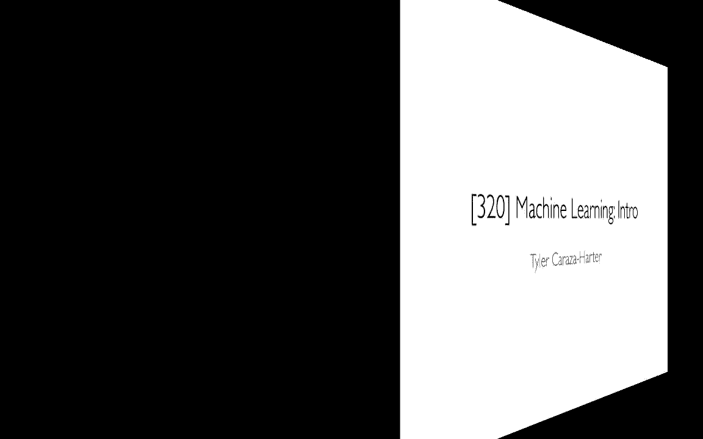
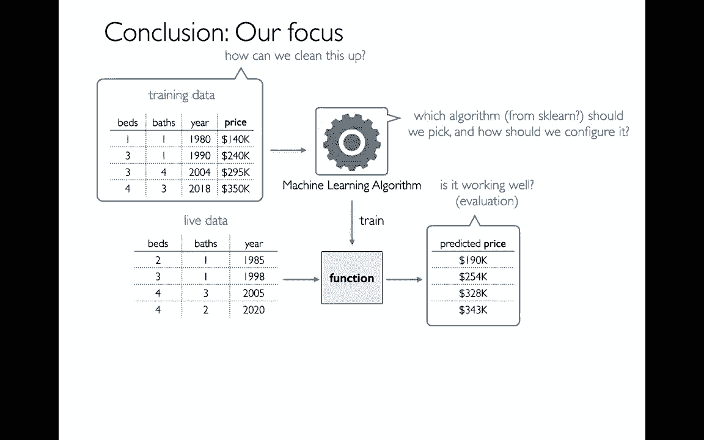

# 【双语字幕+资料下载】使用 Scikit-learn 进行机器学习，4小时实战视角刷新知识框架，初学者进阶必备！＜实战教程系列＞ - P1：1）机器学习介绍 - ShowMeAI - BV16u41127nr

Well in this part of the course we're going to be moving into a new section which is machine learning。

 there's a lot of material we're going to cover， but at the same time it's really the tip of the iceberg for all the material you can do in this field。

Let me try to start by relating to something that we're familiar with。

And then connected to something new we're going to be doing which is building models so all of you have been running functions for a long time right so hey maybe I'll write this code and then our function take inputs maybe in the form of parameters and then they have some outputs maybe maybe either they're printing something or or I might return a value。

And so for example， I can imagine that a function could be doing something like making some sort of prediction。

 maybe my input is that I have some details about a house sets for sale。

And then I might be predicting what it might sell for， and so when I have a function like this。

 that's an example of a model。And and I could imagine having it feed in a bunch of values at the same time and making a bunch of predictions。

So the idea of machine learning is that instead of having a computer write these or instead of having a human write these functions where I have a computer automatically generate these functions。

 and the way they're going to do that is they're going to learn by example。

 so we'll feed in a bunch of training data where we have a bunch of her of houses that have sold for different amounts and have different bedrooms and baths。

 we't trying to infer things like well how much is the bedroom worth， how much is the bath worth。

 how useful is it have a newer house？And then based on that function。

 we're be we're going to be able to generate that function and then use that to make predictions on other。

Data and you can imagine why that might be useful for a lot of things。

 maybe you're doing property assessments or maybe a realtor and you're trying to figure out how to price a house properly。

So the example I've given here is an example of a regression model and a regression model is trying to more broadly a type of supervised machine learning which is one of the main three categories of machine learning。

 so I'm going to start broad now and talk about these three areas and then we're going to be talking about regression in more detail and I'll actually explain on what it is。

So the three main areas of machine learning are reinforcement learning。

 which is basically a situation where you have to make a series of decisions。

And you're trying to optimize some sort of reward so you can imagine some sort of robot moving around in the world and picking up coins or something like that we're not going to be doing that kind of work in this class instead we're going to focus on two areas which are supervised machine learning and unsupervised machine learning and in both of these cases we just have all our data upfront and we're trying to gain information about that some people will say there's a fourth category of machine learning called super super semisupvised but we won't be talking about that here。

Within supervised machine learning there are two different things that we're going to learn this semester。

 one is regression and with regression we're trying to predict a quantity and then with a classification we're going to try to predict a category so in any of these cases where we're trying to predict something that's known as a supervised problem and the way it works is while the data we have has some labels on it usually there's some special column that's telling us you know a quantity like the price for house or some sort of category and then from that we can try to predict that label and cases where the label is unknown and on supervised learning there's no special label column that we're trying to predict we're just trying to look for general patterns in the data and so we might do a couple things we might try to cluster our data we're replacing rows into different groups。

Or we might try to decompose our rows， we might notice that you know I might have these rows which eachF5 numbers in them。

 but maybe every row is like a combination of kind of two component rows。

 and so there's some simplicity in there even though there might be a lot of columns on our data。

So I'm going to go through these four types of thing that we're going learn this semester and just try to make it more concrete so here I have a table right this is just a regular data frame and so this is my index here here are my column names right now I have a Y column which is my label so that's going to be generally what I'm trying to predict。

And then I have these different problems here that I guess I'm just drawing the x0 through x4。

 but usually those would have some sort of real name right like before I saw that we had like the number of beds in a house。

So this label that we're trying to predict is what we're going to try to do is look for a relationship between that and these other columns。

 which we're going to call features。😊，So in general what will happen is that we have some examples。

 some rows where we have examples of both， and then there might be some other data where we only have the features but we don't have the y label and so we want to try to predict what should're draw here and you can imagine why they might be maybe these are all different houses and some of them have already sold so we know what they sold for and then these have not drawn on the market yet。

 so we're trying to predict would they sell if they do go on the market so the problem here with regression I just want to state again is that we want to predict a quantity the y column in this case based on the features and by a quantity I mean this is like a number。

So how we're going to do that well we might actually break it down into the three parts first we might select a subset of the data that we for which we know the answer and then we might leave some other data aside for which we also know the answer and what we'll do is we'll run an algorithm that is able to infer what the relationship is between these features and these labels。

Once I've done that I might run my model on these other ones for which I also know the answer now of course I already know the real answer and unless my model is perfect it's probably going to give me somewhat different answers and so why would I do this。

 why would I want to make a prediction if I already know the answer and the reason is that I can do this to evaluate my model or I might say test my model so for example if my model says that this rush of in 70 and it's actually 72 well that's an error same thing here。

 60 versus 59 that's an error and I can try to quantify all of these errors and then Jim my model some sort of score that's the testing phase？

So after that， after I've learned my model up here。

 and then I've kind of evaluated it on some known cases。Then I might actually put it in production。

 production means I'm using it for real things。And I'm trying to predict actual unknowns in the world。

 like， for example， if I add a new house to the market， what might itself more。

And I could all put these different values there。other thing we might do even beyond making predictions is that I might look at that model and just try to learn things about the world。

 so I keep going back to the example where we're selling houses。

 I think it's interesting to just know well for each additional house or for each additional bedroom or bathroom I have in my house。

How much does that increase the value of my house and I can use that to make different decisions right like maybe I want to do a housing remodel am I going to get more benefit by adding another bathroom or another bedroom right so we can just kind of learn things about the world and also make decisions in that way。

Okay， so all of this was regression which was the first kind of supervised learning we're going to learn this semester and when we're doing these regressions right the key thing that makes the regression is that we're trying to predict some quantity and our Y label now it's totally possible that our features might be a mix of both quantities and categories right so something like green red blue is a category。

 something like shape as a category， a lot of things are strings or categories。That's fine right。

 the distinguishing characteristic of a regression is that the label column is quantitative。

If I somehow am working on a problem where my Y is categorical， then this is no longer regression。

 it's a classification problem， but otherwise all these other things I've been talking about where I kind of do training and testing and then I put in production。

 all of that is the same we're just dealing with categories instead of instead of quantities。Okay。

 so moving on we saw the two kinds of supervised learning which is both regression and classification what about unsupervised learning The main thing here。

 the main point is that there is no label column right I just have a bunch of features。

And then I can try to still learn some patterns about this。

 even though I'm not trying to predict anything。And so one of the things I might want to learn is well are there any sort of natural groupings of these rows and so there are algorithms out there that will let's say put all these rows into three groups and might and assign them numbers like zero。

 one and two right and then just to kind of draw what that looks like while all of these rows be lying together。

Now I really want to stress here that there's no data out there that tells me what the proper grouping is or even how many groups there are so when I'm doing this。

 it's not exactly like there's one right answer， but that doesn't mean that all groupings or classifications are equal I can measure within a group how similar those rows are to each other if I have some metric for that and so then my goal is to have a grouping that kind of maximizes a similarity within each group and there might be different groupings that are equally good right but as long as I'm kind of having a high similarity within groups well then I still learn something meaningful and you can imagine lots of different reasons I might do this like maybe each of these。

Things represent a different user for my web application and then if I can say， hey。

 while there's these 10 different kinds of web users for my application。

 I could maybe run a different marketing campaign for each of these different groups。Okay。

 so clustering again is unsupervised and it's unsupervised because while there was no label column I'm trying to predict。

The last kind of machine learning problem when I talk about this semester and which is probably the most complicated is called a decomposition and and decomposition is also unsupervised is again。

 right， there's no column I'm trying to predict here。

And the idea with a decomposition is that I'm going to look through all these rows and see if there's any pattern。

 are there kind of a couple archtype rows that really can be mixed together to create other things。

 so maybe what I see is that with some small error most of these rows are just combinations of these three rows over here and I would call these my component rows。

 So you notice the columns are the same right between my original data and my component rows。

And then to get this row here， like negative 11， negative 7， 3， 2020。

 what I would do is I would multiply this row by negative V 11。

And then add it to 21 times this row and then add it to negative8 times this row right so I'm kind of taking a weighted average of these three rows。

To produce this row and if you actually crunch these numbers you'd see that I would just something kind of similar to this。

 but there would be some error right it's not a perfect match which is fine I mean the fewer components I have well then I kind of have a simpler model but while there might be more error。

So so I have that here and I have these numbers here and what we'll generally do when I'm trying to mix these components to create a row is I'll put these numbers in another table down here。

 so this will be a table of all my weights or maybe my principal component scores and so I'll put you know negative 11 here。

 21 here and then negative8 here and then for this next row down here right I'll do the same thing I'll say a negative 43 here。

 12 here and then the negative6 here and so since I'm doing this I'm putting kind of these mixtures for every row down here down here。

 what that means is that if there's n rows over here。

Then there are also going to be N rows over here if there are M columns over here。

 well then there would be M columns over here， so basically what I can do is I can take this big table and I can reduce it to having some components here I can have some weights here it's useful for lots of things one is just if I'm trying to save space on my storage system right I can have these things be smaller but then it's also nice if I'm trying to do other phases of machine learning like a classification or regression it's kind of nice if I only have like three feature columns instead of the original five that's trying to help me in a number of cases。

Okay， so that's a whirlwind tour of these four poems where I solve regression。

 classificationification， those are both supervised because again it's labeled， clusterstering。

 decomposition， there is no column we're trying to predict that's unlabeled， it's unsupervised。

Learning and and so for each of these four things there's actually a ton of different algorithms out there and and in this semester we only really have time to learn like one algorithm for each of them and so if I go to this website down here this is the website for PsyH Learn which is the module we're going to be learning。

😊，And there's probably close to hundreds of different algorithms or different classes they have there。

 I put a small subset under here and so I can see well here's all these different things they have for clustering and we're going to just learn one of those which is k means clustering。

 decomposition， all these different things I can do， we're going to learn just one of them。

 which is PCA。It turns out that for a lot of algorithms。

 the classification and regression common pairs， so for example。

Here I have like a decision tree classifier here I have a decision tree regressor。

Here I have a K neighbors classifier here I have a K neighbors regressor and that's why I didn't kind of split these out and I just put both of these under these two categories and so we're going to learn two things here we're going to learn logistic regression and we're going to learn linear regression and this is a little bit confusing because。

Well this part's obvious， right the linear regression is going to be a regression here。

 this is the one that people get confusedfused on because even though it says regression in the name。

 it is not a regression， it's actually classification right so these are the four things we're going to be learning this semester and logistic regression is when people always get infused on because well it's not actually a regression。

And I think once we learn all these things， the very nice thing is that the interface to using the other ones is relatively simple。

 So for example， once you know how to use a linear regression。

You could very easily just replace the word linear regression with Ridge and you're still going to be able to do all your machine learning stuff correctly now before you do that you should probably learn about how Ridge works and then think about which model is best for you。

 but at least in terms of the code it's very simple to switch between different models。

I without any any of these four categories。So I want to talk a little bit。

 that was pretty high level， I want to talk a little bit about the foundations where I need to be learning this machine learning both in terms of the code and then also the math。

Where I learn a few different modules， the main one is atsyKt Learn。

 I would showing you some documentation from PsyKt Learn。We're also gonna learn nuy， which has。

 lets us deal with matrices。 It turns out that nuy。Numpy is really the foundation for pandas right。

 all panda data is actually stored in Numpy and now will be a good time for us to actually see that。

And then when I learned this thing called Pytorch and Pytorrch can do a couple things for us。

 one is it can do calculus for us， which is pretty cool。

Another thing it can let us do is it can actually let us run our code on GPUs。

 which are graphics processing units， everything we've been running so far this semester has been running on CPUs。

 right your central processing unit。And and it turns out that GPUs that originally built for graphics also happen to be really good at machine learning and so a lot of things if you're dealing with a lot of data or kind of complex models。

 a GPU will be better at it。Where I have to learn a little bit of math。

 I'm not assuming you have any math background besides what you might learn in high school。

 but let me give you an example of how math is going to come into play here for a regression problem right so we have this example again with all the houses and these characteristics and then we have a function that predicts the price。

How would we do that with matrices， well I might take all these numbers in the data frame and put them in this matrix here？

And then for my function， I may have kind of just an algebraic expression which is using matrices。

 So my x here is this matrix C is a vector， B is just a number And when I run this well I'm going to get this other vector out here which actually has all all the prices so to understand what's going on here and we have to learn a little bit of linear algebra。

 this is not a regular multiplication， it's actually something called the dot product and it looks like this right I can take this X matrix here。

Dot product with this vector and then add a number and then that's how'm going to get my results over here on the righthand side do one prediction and what's cool is that if I can do one row times times this vector here and I get one house value and it's going to go through without having a loop even the beauty of linear your algebra and multiplying matrices together with the dot product is that do in one step and I'm going get actually all of these numbers the code for it is pretty simple if I say data frame of values then x is actually going to be a nuy array and if I want to I can just say well I want the dot product of these two things and I want to add B and it just work so we're going be talking about that in quite a bit more detail at some point before the end of the semester。

One thing I want to note is that if you're reading other documentation。

 a lot of resources will use A instead of Xs， which I find confusing。

 I think that's not intuitive if you're kind of working on all of thesesyKt learn modules because those will generally use x for data and then even stranger we'll often have a C when we're in PsyKt learn but then they call that little acts instead so just be you know as we're learning linear algebra stuff。

 I just want to say upfront and I'll say it again be aware that the variable names are a little bit wacky。

So what is kind of the scope of linear algebra and what kind of things are we trying to solve Well one thing that we're not going to solve is something like this y equals x squared that is not linear anything quadratic or cubic or anything like that not linear really all we can do is multiply multiply variables by numbers and then add things off right so this is an example of a linear equation right I just have I have some different variables。

And then I'm multiplying them by different numbers one of the things where I notice is that the way we're going to be doing linear algebra in this course is we actually have very big matrices and at a lot of variables and a lot of equations right so you can see here I actually have 50 variables so I think the key takeaway is that more variables more data but simpler equations。

what about calculus so here I have that situation again with the house where I have some training data。

 so I have both my features and my label， it draws into an algorithm and that algorithm will basically spit out this formula for me that I can use to predict housing prices。

Right。Now， it turns out that when I was doing this training， right。

 I had the original prices and the new prices might be a little bit different right This is 140。

 this is 190，240，254 right， They're all a little bit different。

 And so what I can do is for this given equation I end up with。I can have some sort of function。

 total loss function that compares the correct answer with my model's answers， right。

 so I compare these two and I get one number out right that's kind like what my error is or how bad it is。

And of course， how bad it is really depends on kind of the numbers that are part of this equation down here。

 so the whole idea of this training thing with this algorithm is that I want to find out， well。

 what see can I do that is going to make my error or my loss as small as possible so we're trying to minimize something and I don't expect you if they can calculus。

 but I know a lot of you have and in calculus we're often trying to minimize or maximize things？

And that's why it's trying to come into play a little bit here。

 The good news is that we don't have to understand calculus there's going to be modules that can do it for such as this pitorrch thing I're going be learning pi torch。

Its also going to help us be able to run our code on GPU。

 we're going to be able to do things like take two matrices。

 shove them over to a GPU and then multiply them together and it'll just kind of。

It almost feels like it's just magically going faster than it would if we're running on a CPU and it doesn't take a lot of code to move it around so Pytorrch is going be very powerful both in terms of calculus and using GPUs。

To conclude this video， I just want to talk about this difference between developers and users and then who we are。

嗯。When I'm looking at this picture here， I'm feeding all this training data into a machine learning algorithm。

 and then that's giving us a function we can use make predictions。

There are classes and I guess people in general， who either develop a new algorithms or write code and optimize code for existing algorithms。

And we'll just do a tiny bit of that， but that's not our focus we aren't trying to do machine learning research or trouble to put novel ideas。

We aren't developers instead of're going to be users of machine learning algorithms that trauma and I cant learn and so some of the questions that we're gonna be interested in going forward for the rest of this class is well which algorithm should we use an SK learn how should we pick it and I guess how should we configure it right a lot of these have different parameters in terms of the data how can we clean it off so it's trying to work well with the machine learning algorithm we chose and then finally when we actually use this thing。

 we're going to get all these predictions that we can compare it back to the original and how do we want to score that there's not necessarily one right way to evaluate how good or bad it is and so we want to get some experience with that as well so that's a bit of a preview about what's toing up in the course and hopefully this is kind of a fun change of pace compared to what we've been doing。

