# 【双语字幕+资料下载】使用 Scikit-learn 进行机器学习，4小时实战视角刷新知识框架，初学者进阶必备！＜实战教程系列＞ - P7：7）决策边界 - ShowMeAI - BV16u41127nr

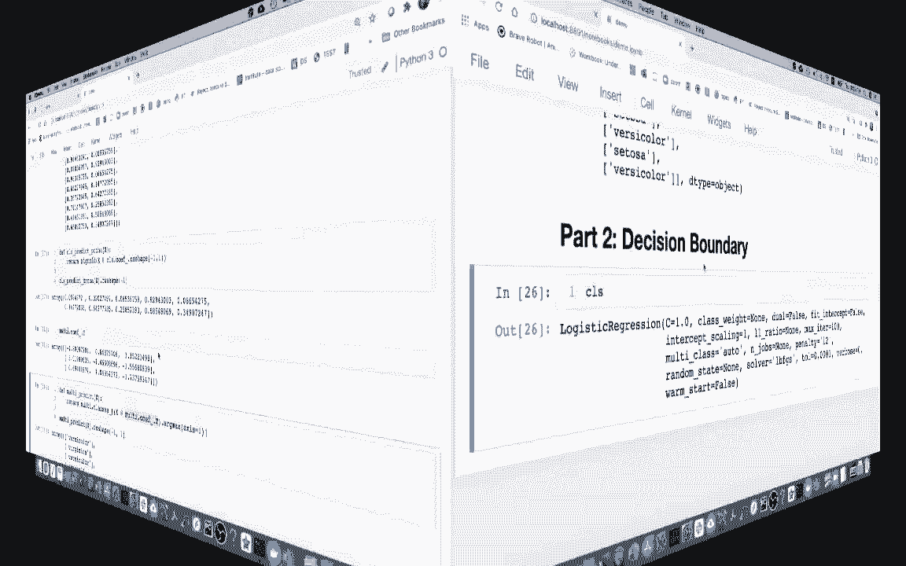

Yeah。Hello in this video I want to talk about how we can visualize of the decisions or predictions that are made by a classifier when we were doing regressions。

 we'd often visualize this by drawing a fit line and the equivalent here is that we'll often at least when we have two features is we'll draw those two features on an X and Y axis and then we'll separate the area into two different regions one where we predict true and another area where we predict false and so the function that we'll be using in Mapllib is called contour F and it and can do that kind of plot so we want to evaluate CLS and the idea is that we want to put in a bunch of different values for。

For both Sepple a， which I' be put on the y axis and SPL width， which I'll put on the X axis。

And so the way to get every combination of these maybe most easily is with anumpy mesh grid。

And the reason I'm using a meshcr is that it creates some arrays with different combinations and exactly the form that I'm going to need later。

 So creates arrays and form needed for。Contour ath later， and。

So let me go leave this comment here on that。And what is it going to return。

 Well it's trying to return two arrays。 It's going return  one。Which is。

One of my variables in another one will be the other variable。

 so maybe I'll say I'll put my sel width first and then my sepel length just like that。

And then what I have to do here is I have to have a range right so I'll have like range1 and range two。

 and really what the mesh code is going to do is it's going to give me every combination of these two ranges。

So here I'll say NP range。Maybe they'll go from 0 to 0 to 10 and maybe do a 0。1 step。

And then the same thing over here as well。Okay， so I have those two and let me just take a look at what these things look like。

I see that both of these are a two by two matrix that are showing me every combination。

 So let me look at another one as well。So these are exactly the same shape and the values in it are just giving you the coordinates right so the first one is giving me the x coordinate basically the Sepple width and the other one is going to give me the y ord or the sepple length。

And so if I wanted to， I could then call Plt。cont F。

And this is taking three things， it has to have my matrix of my x coordinates。

 and it has to have my matrix of my Y coordinates。And then a has has on me that says that lives the color。

RightAnd that can be some sort of alternate expression。

 so I could say if I wanted to sple W and this will show me some stripes from left to right。

Or I could do S L， and that'll show me vertical， or I could have some sort of mathematical expression right like this。

And at each point， it's showing me what would happen if I multiply the value in one of these by the value and the other。

 so I can get these nice contour maps。 Now what I'd really like to do is to just have two levels。

 two numbers。 I guess let me just show you what this is now。

哦。Lots of different numbers， I'd like to just have two numbers here。

 basically one and a zero that correspond to predictions right so it because my x axis is going to be the sple width and my y axis will be the sple length。

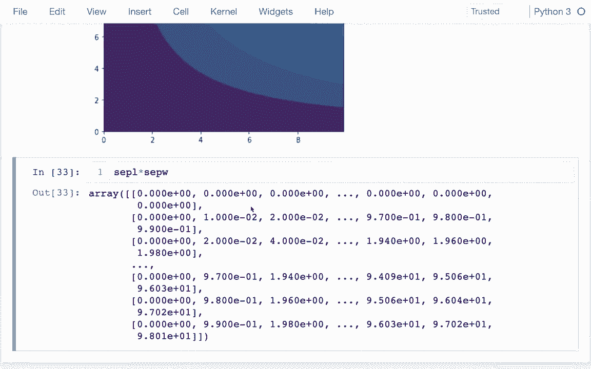

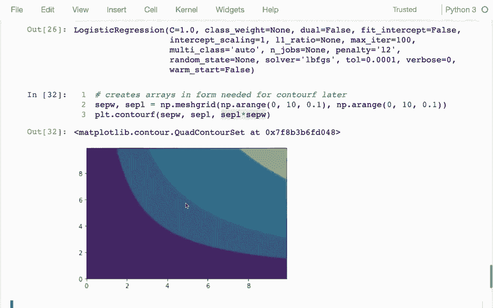

So I have to get all this data into a format where I can do some predictions right so let me leave this here for now and may come back to this。

 this is my goal where I'm working towards。

哦。

What I would like to do is put these things in a data frame。

 so I'm going to say this will be my contour data frame， Im going to say PD data frame。

And my data frame has to have。All of these things up here。

Right because I want to do predictions on it， and these are my X columns。

And somebody' going have something make for that。哦。Let we have something for that。

And then I'll do my content first， that's easy， that's just one。These values。

 I can pull from these and so I can put this here。And。Then I could put up here。

 I could put Sap W if I wanted to。 now this is not going to quite work because these are those。

basicallysically square matrices。And down here， I'm to put all this in a data frame so I can do my predictions。

 it has to just be a simple column， so I have to flatten these。

So it' it's just kind of one dimensional， and I can do that and then I could look at my CDF if I like。

And I can see what is going on here is I really have every combination of length and width。

 and then I have my constant column。So this isn't a great format for me to then do some predictions because I can just say it has everything that I need for my predictor。

 I can say CLS。 predict。Just like that。And then I get all of these values right here。

 and if I wanted to I could add those to that data frame as well， I could say CDF。

 I could say predicted， maybe I'll just say a prediction。

And I remember that was the pedal wet is what I'm trying to predict。I can say， or I'm sorry。

 that was the category， is it Sentosa or not， right， so that's what I'm trying to do。Okay。

 so I have that。And。And now I'd like to be going down and doing my。

哦。During my contour plot down here， right so I can have this。And。

Let me think a little bit carefully here right so if I have my set W。

 let me look at the shape of these。

That's a 100 by 100。Because that's what my range was I was drawing over 100 numbers。

 this is 100 100 matrix this 100 100 matrix this is also going to have to be 100 by 100 matrix right now it's just a long column so just like I have to had to convert these matrices to columns with a reshape here now I have to go in the opposite direction I have to take values and then reshape this。

To be matching the format of these， right， so I can actually just use these。And say， well。

My prediction should be whatever shape my x values are， and I'll line up nicely。

 and so I can do that and now I can see all the two sides of this are going correspond to a prediction of it being either all a sattosa or not a sattosa。

Let me plot those with a scatter plot on top of here。

I have my data frame here of all my original flowers I may plot all of them。

 ideally I would just plot only the training data on top of this so I can actually have a better sense of what errors are made。

But I only have like 10 rows of my testing data and so I'm just going to plot the whole thing So I'm going to say dot plot do scatter and actually what I'd like to do is I'd like to separate this out so I'm going to have something like sattosa。

Dot plot。tcatter， and then I going have something like other dot plot dot scatter。

And then those things I can get just with some filterilth right now。

 I'm going to say Sotosa equals data frame。We're data frame of variety。R equals Ctosa。

And then my other ones will be basically where it's not that。So I'll say where it is not sattosa。

 Okay， so what am I going to do down here， Well I may say my x value is going to be。哦。Well。

 I was putting sple width there， so I better put that。Sepple width on my X axis。

And then my Y axis should be sepple length。Okay， so I'm going to do that and I'm going to do the same thing down here for a moment and I see okay well I have my decision boundaries and then I have my two separate plots down here。

 I'd like these to all be on the same plot。 and normally the way that we've done things like that is we would say AI X equals this and we pass that down below let me just show you quickly what the type of Ax would be if I were to do that。

 It's this thing here。 this quad contour set and we can plot on top of that So if I wanted to reuse the same aupplot area What I can actually do is I can say matplotlib do it current axis and that will give me an a subplot that I can pass in elsewhere。

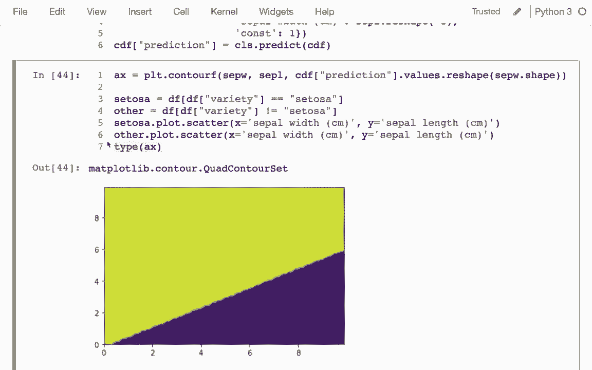

Right， I could say up here， I could say。啊。Maybe I'll go on to the next line and say AX equals that and。

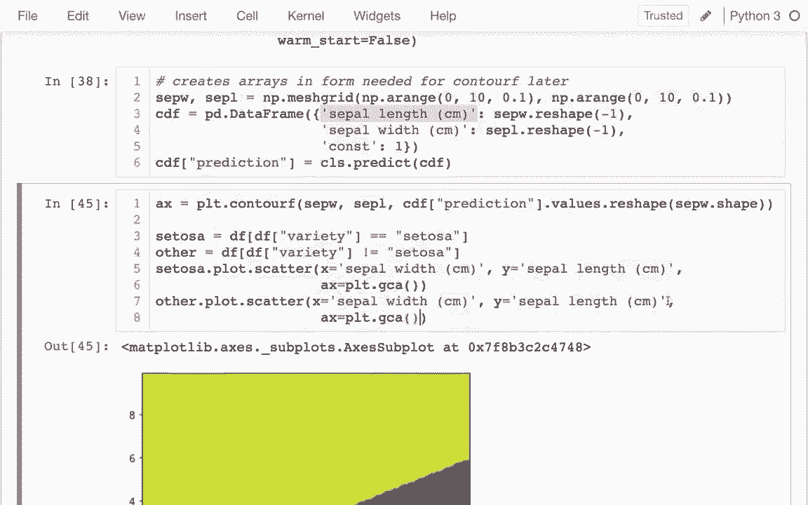

Same thing here， so then they'll all go into the same area。

 so let me do that and so I have all of these points。

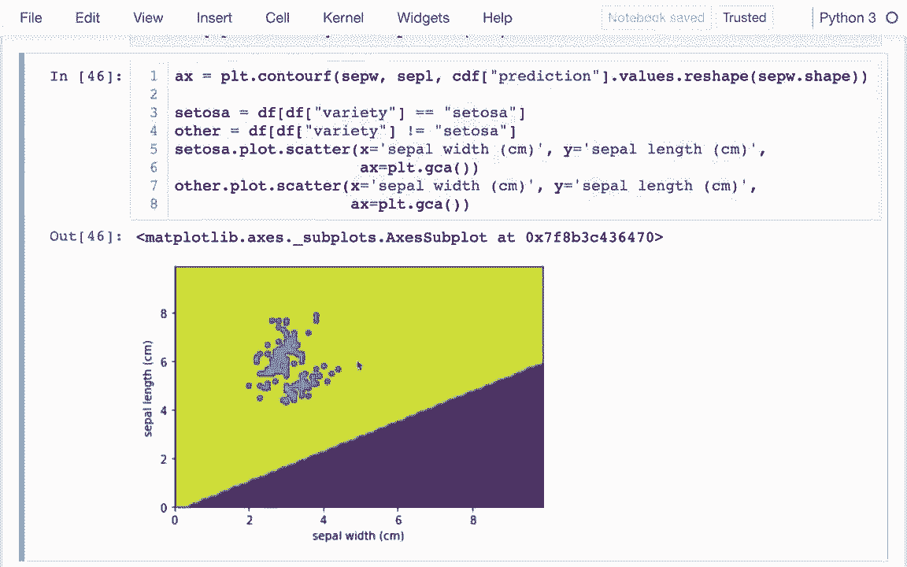

And。

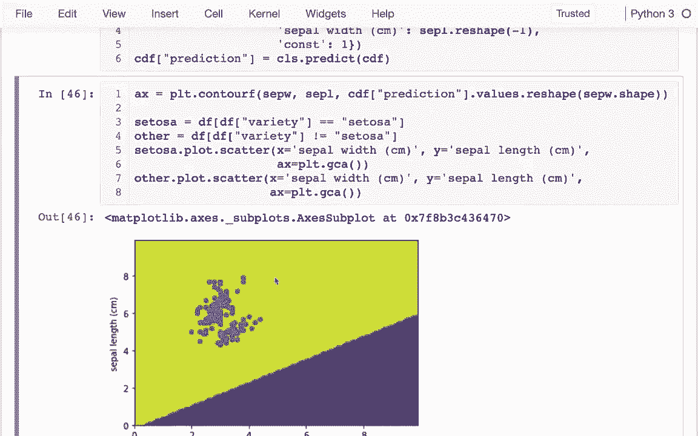

And so then what I like to do now is， well， it's kind of strange that it's not overlapping。

That boundary。

Did I get my axes mixed up？I did。 So here a sepel with sepel light。Okay， great。

 so let me just switch this back。

So this should have been Sple A， and this should have been sple width。

And now I can actually see that makes a lot more sense how you can try to separate the ones that are from the ones that are not and so to actually make this work now I should have the color be different in some way so I'm going have the stosis be。

R。

And then maybe I'll have the other ones be。I don't know， maybe it can be great。

So just like that and so now I can start to see what mistakes will be made。

 I can see that there's one sattosa that is not going to be recognized as a sattosa because is's on the wrong side of this boundary。

 I should probably also have some labels here so we may say like label equals sattosa and then down here maybe I'll say label equals。

Equs other。

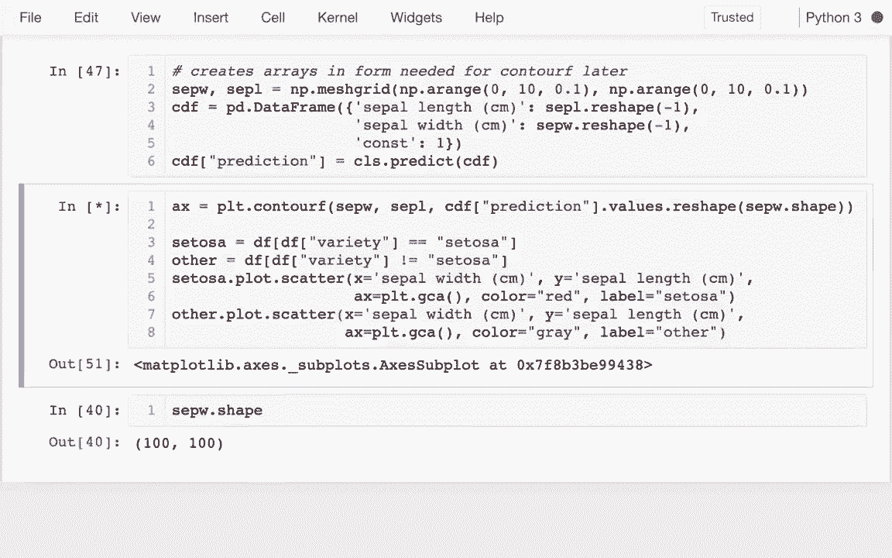

Just like that and so I can see what's happening here now and and so there's a couple steps to all this right maybe I can delete these extra things up here so I can have a minimal example。

 I had to create a mesh grid。

And that basically， for every point， at one grid had the x values and other one have the y values。

I had to reshape those to church and convertt them to data frame columns。

 and at that point I really had every combination of these in some row。Once I did that。

 I could add predictions for basically our recommendationcomation。

And then if I converted on my predictions back to the mesh gridd formula like these two have。

 then I could do my contour。

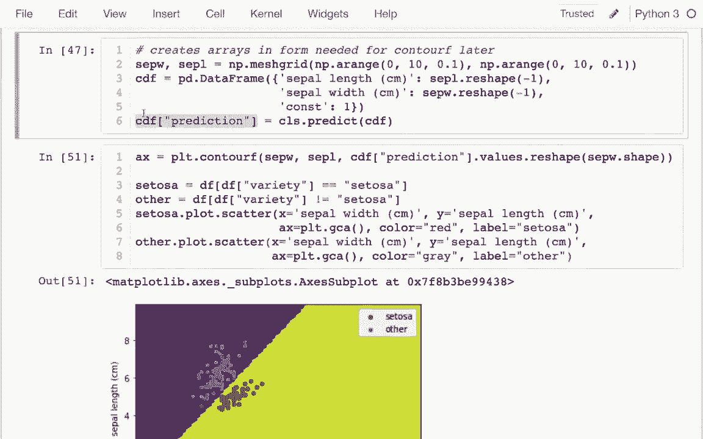

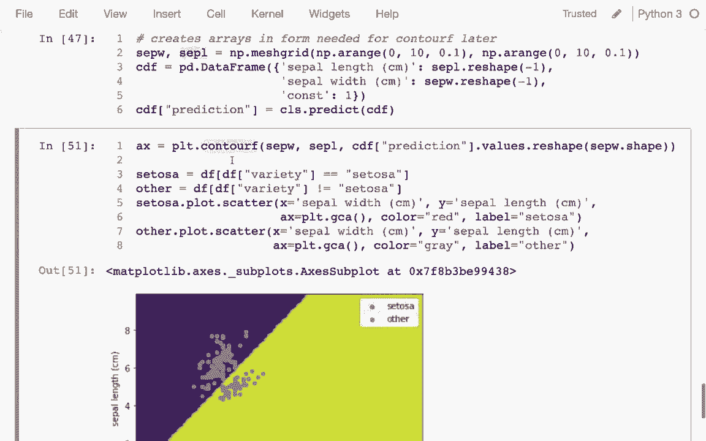

And that's how I could create this map。 And then on top of that。

 I could plot my scatter point and see what's happening。

One last thing I want to do here and that is I want to try to do some polynomial fes。

 so just like we can use polynomial features。

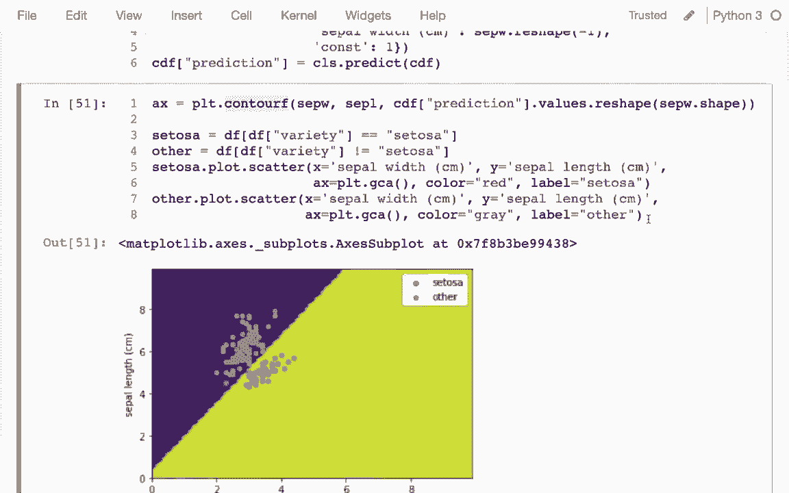

Or a regular regression， I can use those for classification as well。 And so let me import some。

 I might say， from S K learned。

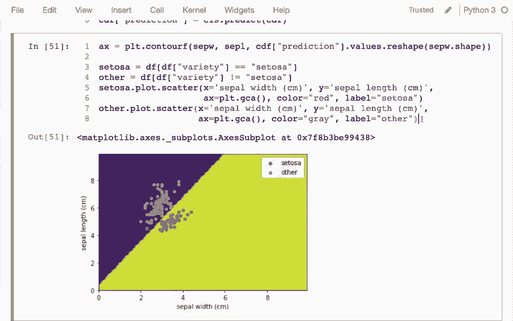

Dot pipeline import pipeline， and I may say from SKL do preprocessing。

I'm going to say import polynomial features。

Okay， and so before what did I have， I had， I just had a logistic regression like this with。嗯。Well。

 what what was it There was on。

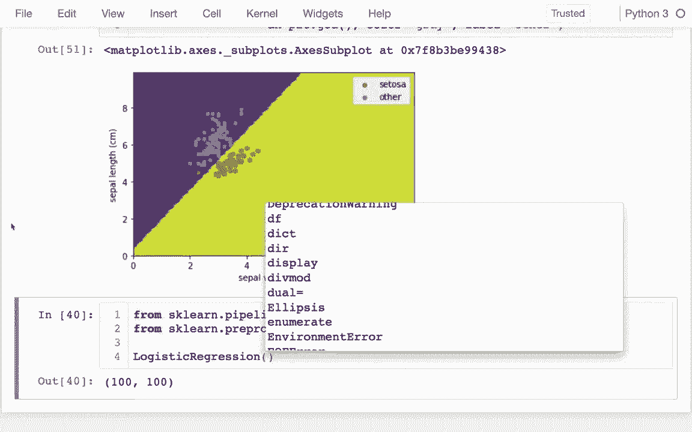

I'm just trying to search up in my page earlier， I think it was a fit intercept thing。

That I had off for all of them， excuse me。So I had that this is my model before。

 and that's going be part of a pipeline right so now I'm going to say pipe。Equals pipeline。

And the pipeline is going to be this list of stages。Just like this。And so that'll be the first stage。

 well I'm sorry that'll be the last stage， and then before that I want to have my polynomial features。

Just like that。 And then the other trick is is that。Each state of my pipeline has to be a tuple。

And the reason it has to be a tuple is because I have to give it a name， right。

 So I guess I'll just call this polyly。And I'll call this one LR。So I have that in its straight。

And so just like before I could have my， I before I had something like this F。 And then I had。

Train of X columns and then train of what was my Y column， I guess it was。

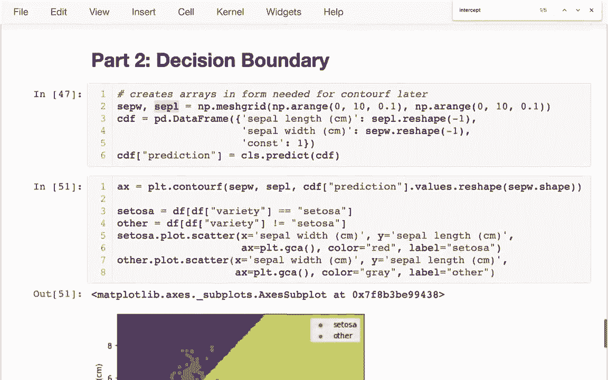

It was going to be my pedal width， I think， so let me let me just copy you that。

It was like this， but it was petedal we。That's what I was doing before。

 and I can just replace my logistic regression with this pipe。

 let me try that and I get some sort of error here。

Unknown label type continuous。 Oh， I'm sorry。 I'm trying to predict the whether or not it's a Sctosa。

 right， it's complaining because it's continuous。 So it's saying， hey。

 you're trying to do a classification。

On a quantity， which we don't do classifications on， we do regressions on quantities。

So what I may say here is Ctosa， is it a sattosa， that's what I care about。

And then I train it and that's all great。Now if I want to。

 I can come back here and I can repeat these steps so I could if I wanted to maybe I' just try to move all of this up here。

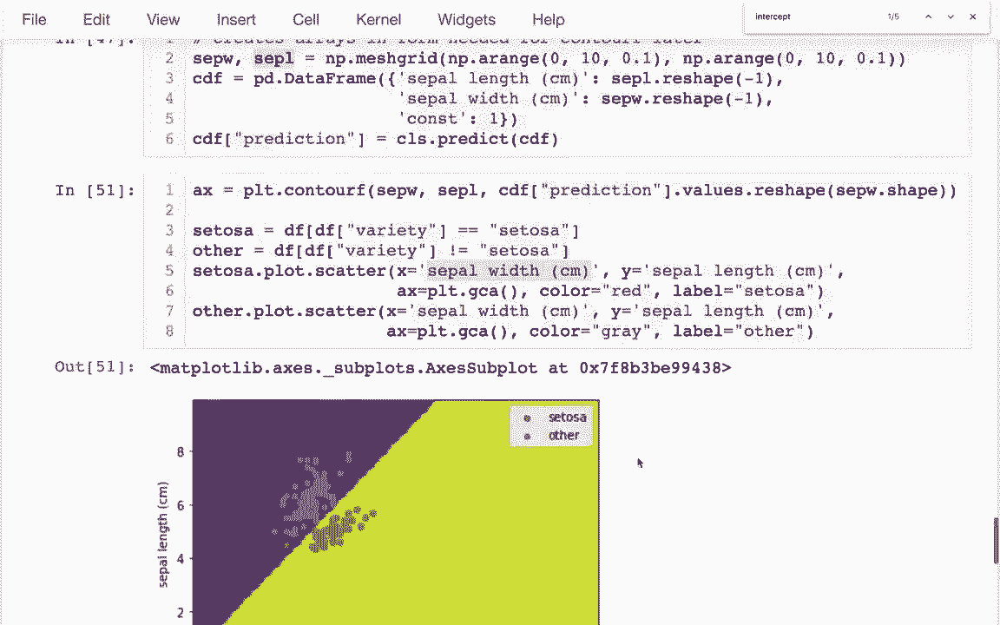

。And then when I'm plotting this， when I want to look at those with decision boundaries instead of using my simple classifier before I could use my pipeline classifier。

 and then what's going to happen while that boundary line between them is just slightly more curved。

 it doesn't quite help that red point is still on the wrong side。

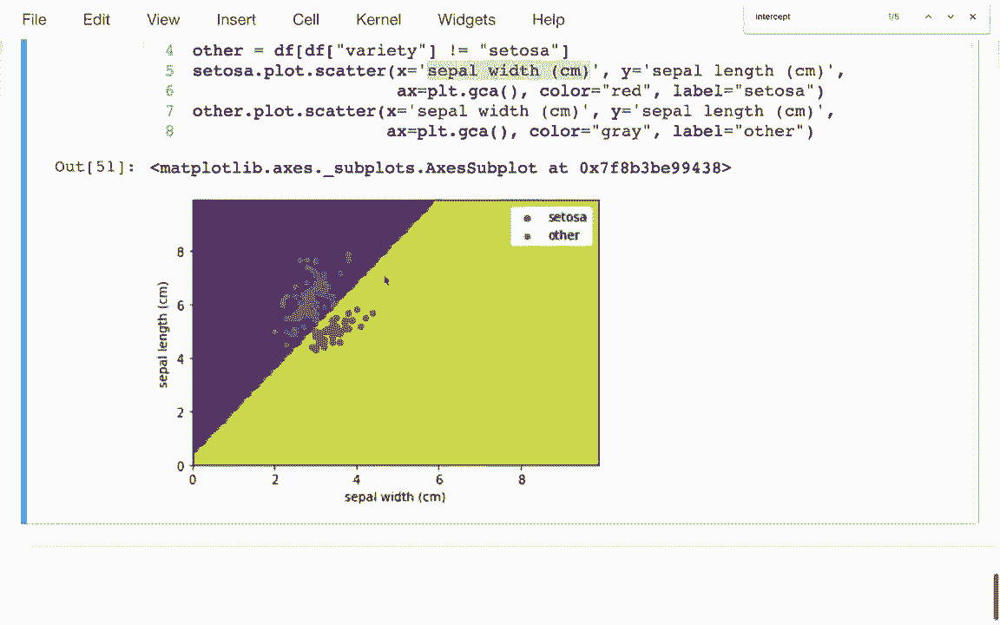

But you can see I can get different shapes depending on the complexity of my model and what I have in the pipeline beforehand。

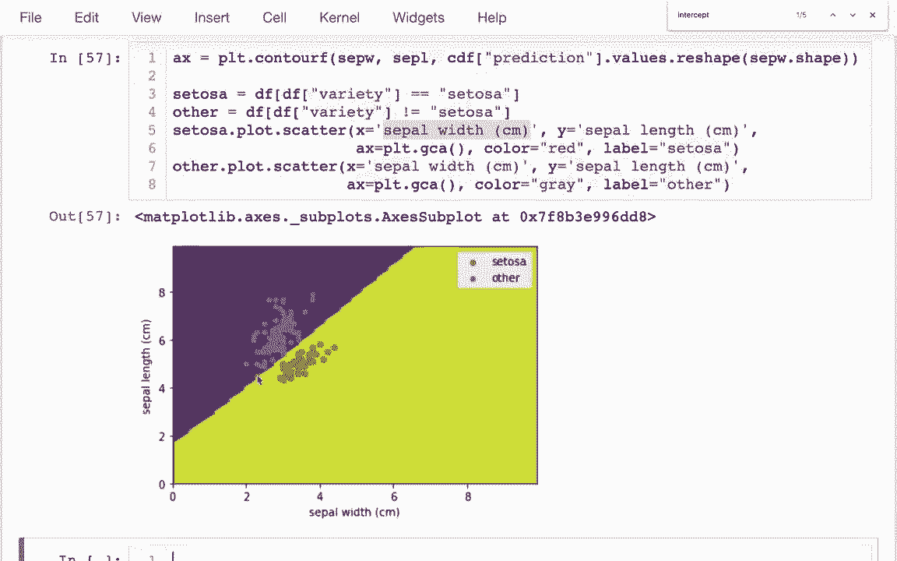

