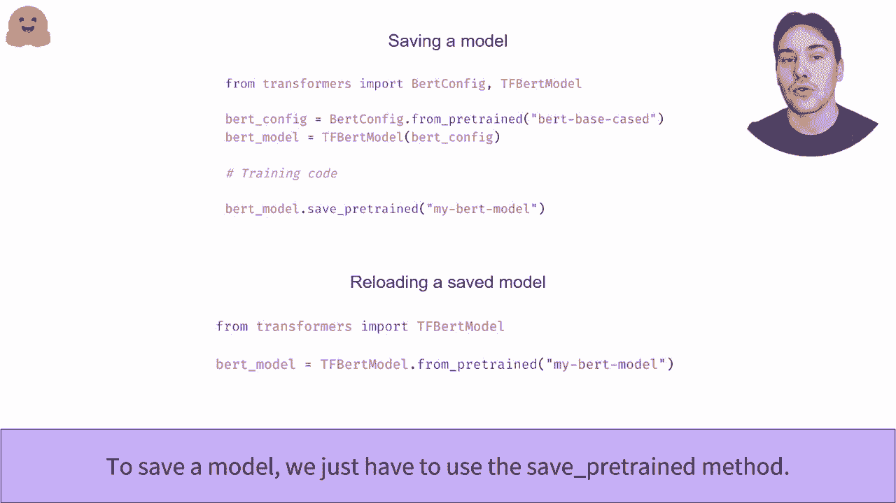

# 【双语字幕+资料下载】官方教程来啦！5位 Hugging Face 工程师带你了解 Transformers 原理细节及NLP任务应用！＜官方教程系列＞ - P11：L2.4- 实例化transformer 模型(TensorFlow) - ShowMeAI - BV1Jm4y1X7UL

How to instantiate the transformers below。In this video。

 we will look at how we can create and use a model from the Transforms library。

As we have seen before， the TF photo model Gla allows you to instant sheet a portrayed model from any checkpoint on the aching F hub。

It will pick the right model class from the library to instant shade the proper architecture and load the weights of the portrayed model inside。

As we can see when given a bird checkpoint， we end up with a TF B model and similarly for GPT2 or about。

Bend the scenes， this API can take the name of a checkpoint on the E。

 in which case it will download and cache the configuration file as well as the model weight file。

You can also specify the path to a local folder that contains a valid configuration file and with always slide。

To instant shade the preed model， the TF Automod API will first open the configuration file to look at the configuration class that should be used。

The configuration class depends on the type of the model， be， GPT2 or butt， for instance。

Once it test the proper configuration class， it can instant shape that configuration。

 which is a blueprint to know how to create the model。

It also uses this configuration class to find the proper model class。

 which is combined with the loaded configuration to load the model。

This model is not yet or between model as it has just been initialized with random weights。

 the last step is to load the weight from the model file inside this model。

To easily load the configuration of a model from any checkpoint or a folder containing the configuration file。

 we can use the autoconft class。Like the T for tomod class。

 it all picks the right configuration class from the library。

We can also use the specific class corresponding to a checkpoint。

But we all need to change a code each time we want to try a different model architecture。

As we said before， the configuration of a model is a blueprint but contains all the information necessary to create the model architecture。

For instance， the bird model associated with the bird based case checkpoint has 12 layers。

 a hidden size of 768， and a vocabulary size of 28，996。Once we have a configuration。

 we can create a model that has the same architecture as a checkpoint， that is randomly initialized。

We can then train it from scratch， make any tons of room model。

We can also change any part of the configuration by using keyword arguments。

The second snippet of good instants a randomly initialized pair model with 10 layers instead of 12。

Sing mode once it's train of fine tune is very easy， you just have to use a safe pretend method。Here。

 the model will be saved in a folder door named My beltt model inside the current working directory。

Such a model can then be reloaded using the form between method。

To learn how to approach this model to the head， check out the push to video。

Yeah。