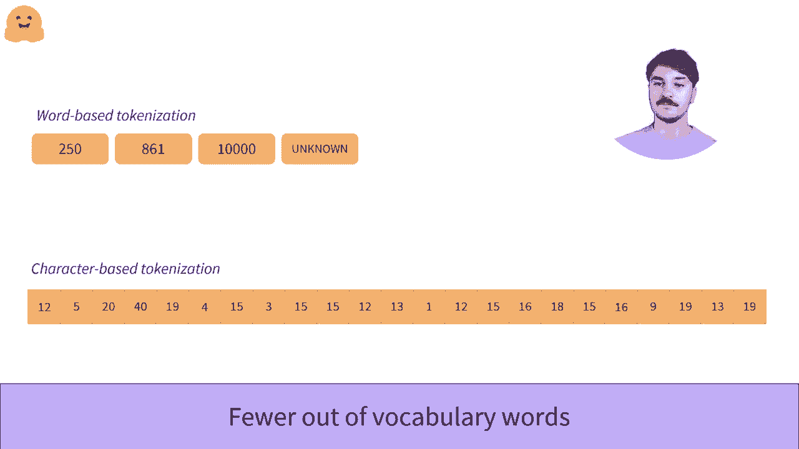

# 【双语字幕+资料下载】官方教程来啦！5位 Hugging Face 工程师带你了解 Transformers 原理细节及NLP任务应用！＜官方教程系列＞ - P14：L2.7- 基于字符的分词器 - ShowMeAI - BV1Jm4y1X7UL

Before diving in character based tokenization， understanding why this kind of tokenization is interesting requires understanding the flaws of word based tokenization。

If you haven't seen the first video on the word based organization。

 we recommend you check it out before looking at this video。😊，Okay。

 let's take a look at character based tokenization。😊。

We now split our text into individual characters rather than words。😊。

There are generally a lot of different words and languages， while the number of characters stays low。

To begin， let's take a look at the English language。It has an estimated 170，000 different words。

 so we would need a very large vocabulary to encompass all words。😊。

Where they character based vocabulary， we can get by with only 256 characters。

 which includes letters， numbers and special characters。

Even languages with a lot of different characters like the Chinese languages can have dictionaries with up to 20。

000 different characters， but more than 375，000 different words。

So character based vocabularies let us use fewer different tokens than the word based tokenization dictionaries we would otherwise use。

😊，These vocabularies are also more complete than their word based vocabulary counterparts。

As our vocabulary contains all characters used in a language。

 even the words unseen during the tokenizer training can still be tokenized。

 so out vocabulary tokens will be less frequent。😊，This includes the ability to correctly tokenize misspelled words rather than discarding them as unknown straight away。

😊，However， this algorithm isn't perfect either。😊，Intuitively。

 characters do not hold as much information individually as a word will hold。😊，For example。

 let's hold more information than its first data L。Of course， this is not trueful for all languages。

 as some languages likeideogram based languages， have a lot of information held in a single character。

😊，But for others like Roman based languages， the model will have to make sense of multiple tokens at a time to get the information otherwise held in a single word。

This leads to another issue with character based tokenizers。

 Their sequences are translated into very large amounts of tokens to be processed by the model。

And this can have an impact on the size of the context the model will carry around。

 and it will reduce the size of the text we can use as input for a model， which is often limited。😊。

This organization， while it has some issues， has seen some very good results in the past。

 and so it should be considered when approaching a new problem as it solves issues encountered in the word based algorithm。

嗯。

