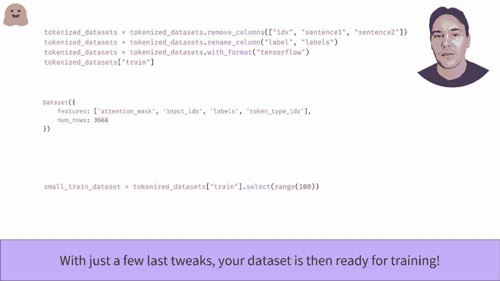

# 【双语字幕+资料下载】官方教程来啦！5位 Hugging Face 工程师带你了解 Transformers 原理细节及NLP任务应用！＜官方教程系列＞ - P24：L4.1- Hugging Face数据集概述(Tensorflow) - ShowMeAI - BV1Jm4y1X7UL

The E phase dataset sets library， a quick overview。So you can F dataet library。

 is a library that provides an API to quickly download many public's data sets and pre them。

In this video， we'll explore to do that。So don part is easy with a load data set function。

You can directly download and cache the dataset set from its silent if I own the dataset set hub。

Here we fetch she I our PC data set from the crew benchmarkch。

It's a dataset set containing pair sentences， where the task is to determine the paras。

The object returned by the Lu dataset function is the dataset diict。

 which is a sort of dictionary containing each split of a dataset。

We can access each split by indexing with its name。

This split is then an instance of the datasetet class with cons。Here， sentence1， sentence2。

 level and IDX， and ruless。You can access a given element by its index。

The amazing thing about the Uing phase Data library is that everything is safe to disk using upper Sharo。

Which means that even if your dataset is huge， you won't get out of run。

When these statements are request areed in memory。Accessing a slice of your dataset is as easy as one element。

The result is when the dictionary with list of values for each case。Here a list of labels。

 the list of first sentences， and the list of second sentences。

The features attributee to a data set gives us more information about its columns。In particular。

 we can see here it gives us a correspondence between the integers and names of the labels。

0 stands for net equivalent and one for equivalent。To purposes all the elements of a data set。

 we need to tokenize them。Have a look at the video， preed sentence pairs for a refresher。

But you just have to send the two sentences to the documentkenizer with some additional keyword argument。

Here we indicate the maximum length of 128 and pad inputs shorter than these length fromcate inputs that are longer。

We put all of these in the tokenized function that we can directly apply to all the sps in our data set with the map method。

As long as the function returns the dictionary object。

 the map method will add new columns as needed or update existing ones。

To speed up preposing and take advantage of the fact that autocanizer is backed by rust。

 thanks to the tick phase tokenizer's library， we can process several elements at the same times in autoized function using the batch called true argument。

Since the tokenizer can list of first or second sentences。

 the tokenase function does not need to change from this。

You can also use multi processingces with the map method， check out its documentation link below。

Once this is done， we are almost ready for training。

We just remove the columns we don't need anymore with the remove columns method。

We name label2 labels since the model from the Tom library expect that。

And set the output format with desired backend， torch， pencilsor F on impact。If needed。

 we can also generate a short sample of a data set using the select method。

。