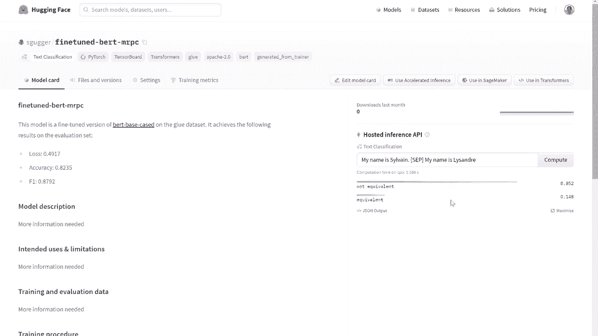

# 【双语字幕+资料下载】官方教程来啦！5位 Hugging Face 工程师带你了解 Transformers 原理细节及NLP任务应用！＜官方教程系列＞ - P31：L5.2- 推送(模型)到hub API - ShowMeAI - BV1Jm4y1X7UL

Let's have a look at the push to everyPI。Just before recording this video。

 I mentioned the bad model and to the C M PCC dataset set。

We won't go over the find your code here because you can find it in any transformer tutorial or by looking at the videos link below。

What interests us here is what happens when the training is finished and we've got metrics we're happy about。

This video requires you to one sign up for an account under the Eingfeaz。go website and two。

 have your authentic taken to that website stored， which can easily be done by typing Erfacese CI login into a terminal or like this in a Coab notebook by using an exclamation mark。

This command won't work if you are using a regular Jupiter notebook。

 so if you are using that and don't have access to a terminal。

 you'll need to copy your access token from the Ugenfeest。go website into the training arguments。

 I'll show you where exactly in a little bit。With that done。

 the pusher API willarrow to a to the face our model， its configuration。

 and the associated tokenizer。To use it inside the trainer。

 you have to make sure to set push2 equal2 inside the training argument。

We can specify a Mo ID for repository。Which will defaultote to the name of the output here if we don't say anything。

We can push to an organization as long as we're a member of that organization。

 and this is where your aging Fe account should be past if you need to。Weeverof is done。

 we can call Twinner that pushtub once the training is finished。In future developments。

 we'll add the ability to automatically push to the app at the end of each epoC or every given number of steps。

 so stay tuned。The command returns a URL for a specific commit which well be able to inspect if we copy it in our browser just before checking that。

 not that if you are not using the trainer API， you can directly push your model and your tokenazer to the by using the push to have method。

By passing the commator in my browser， I can access my repository called Fine should beltt MPC as expected。

And see， that of filess have been added。A model count， the configuration of the model。

 the model weight， the tons of bond runs， and all the files required by the tokenizer。

The trainer drafted a model card follows， which contained the final results on the evaluation set。

 the training output parameters， the intermediate training results。

 as well as the frameworks I was using。If I click editit model card to see the raw content。

 I can see the trainer also generated a table of metadata that the Ugingfaceco website is going to use to properly apply field first to my model。

I can also directly access the tons board runss inside the model hub by clicking training metrics here。

Now that the model is in developed， we can use it from anywhere with the from betweentrain method。

We just have to use the identifier from the E and we can see that the model configuration and weights are automatically downloaded。

We can use this model as we would any transformers model， for instance。

 by readinging it in a pipeline。Since the MRPC dataset set is a dataset set of parallel sentences。

 where the task is to determine if two sentences are paras of one another or not。

 we use it on two sentences separated by S。It's a little bit disappointing to see that it's predicting label zero。

That's because I didn't specify any label when I created the model configuration。

Fixing this is super easy with a push to a APIP。First。

 we can fix the configuration locally by setting label to AD and add to label with a proper value。

 then we can push the fixed con to our report with the push to a method。Once again。

 please return the URL of a commit， which we could inspect and see the exact inside the config。

And note that the command is going super fat because I'm using the same local folder as before。

 which on which my report is already clone。Once this is done and we create a new pipeline。

 we can see the new configuration is automatically downloaded thanks to the building pursuing system and we get the new label。

We can also play with the model directly on its model card。

Bypaing the text was using and clicking Comp。I just have to wait a little bit of time before the model is loaded on the inference API and displays the result。

When the mod is loadedted， we can double check， we get the same results as before。

 directly on the Wiidget。

Try to push to a VPA on your models today。

Yeah。