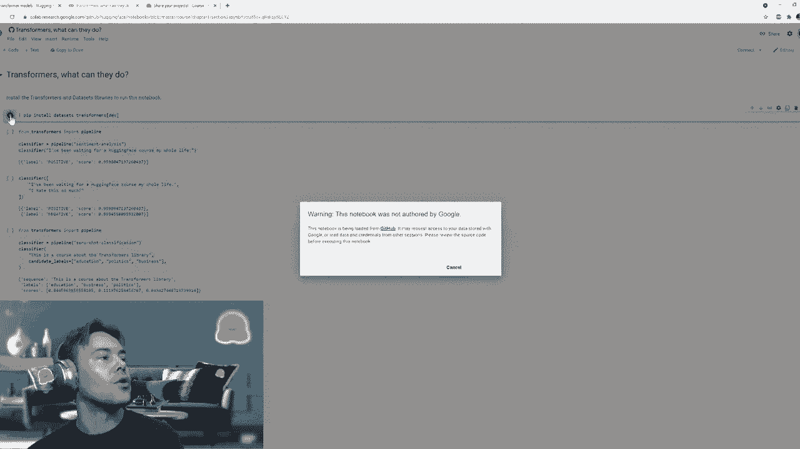
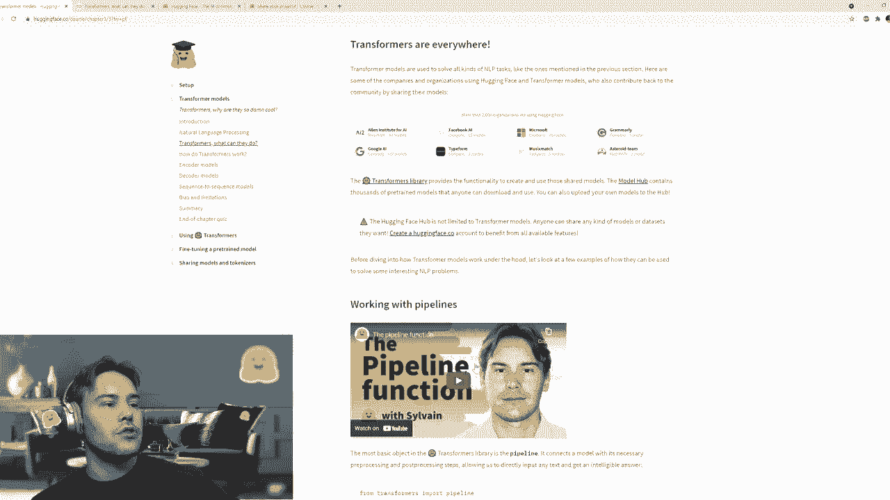
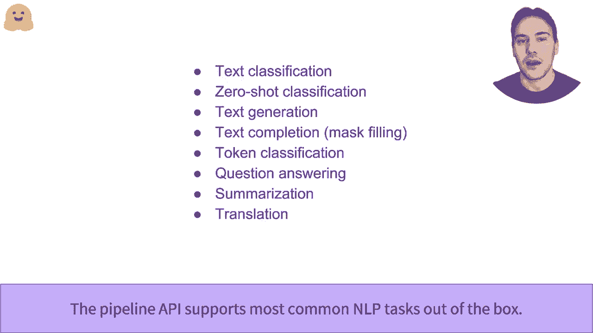
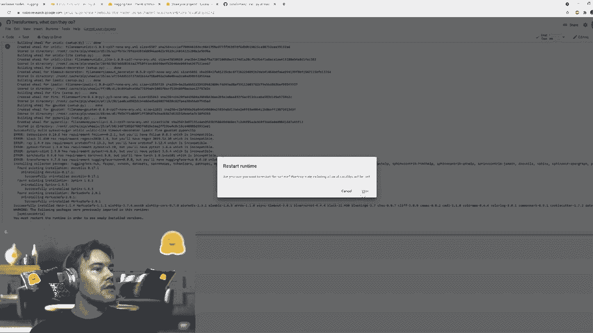
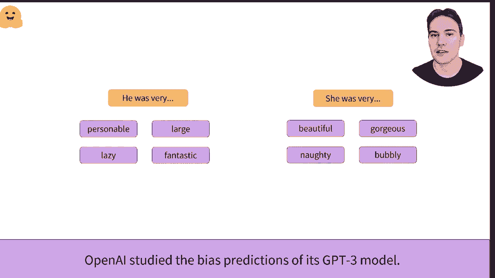
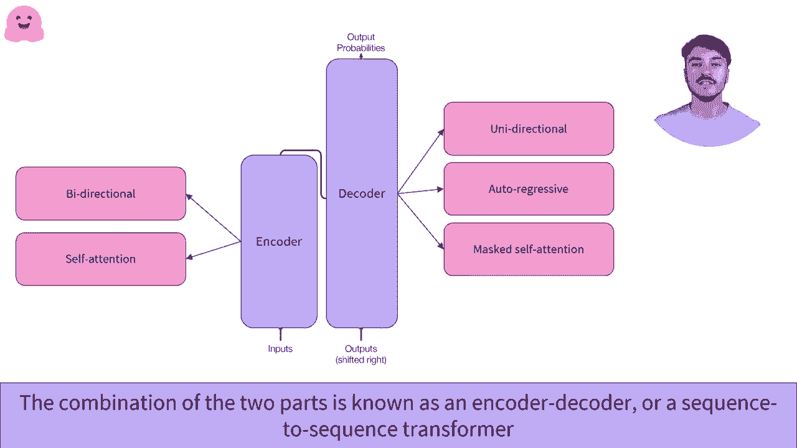
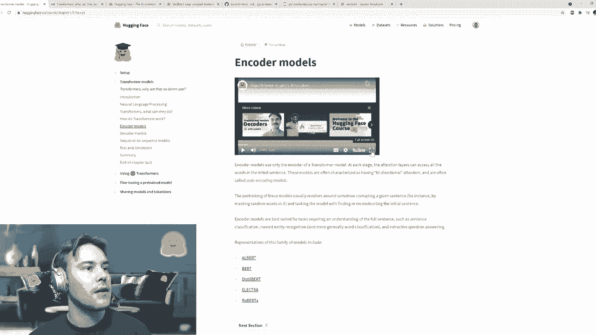
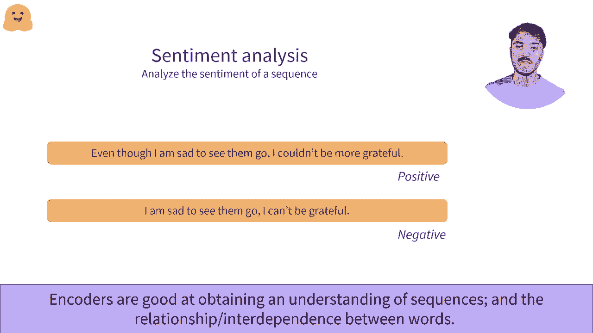
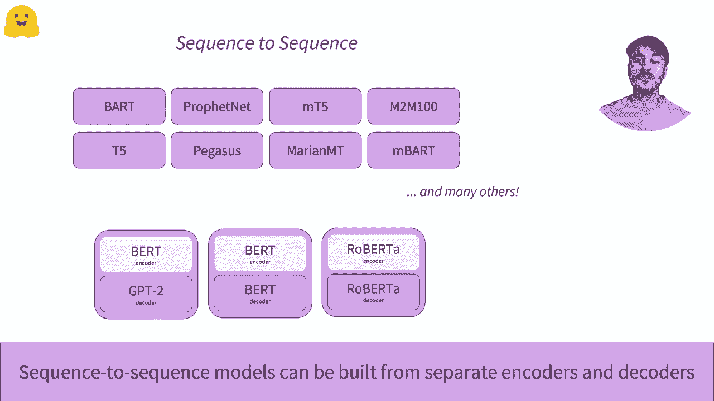

# 【双语字幕+资料下载】官方教程来啦！5位 Hugging Face 工程师带你了解 Transformers 原理细节及NLP任务应用！＜官方教程系列＞ - P33：L6.1- Sylvain的在线直播讲解 - ShowMeAI - BV1Jm4y1X7UL

But yeah I think it's time to begin so welcome to thefi course and we're going to let you the chapter 1 together and this is really the place to ask any questions you might have so please do so in the chat I'm going to make some booth every five to 10 minutes and go through the chats read the question and answer them to the best of my knowledge。

So the urging for his course。And this session will go over chapter1 as I said。

 and this chapter is meant as a very general introduction to what transformer models can do so you don't need to worry about setting up be just yet a few good samples will to see how you can run them in coab directly。

Or the Greenface website。I'm not going to watch review the introduction video because you can do that on your own time and there's not really anything informative in it。

 and so the goal of the first section of the course， which is probably right now。

 which is this section in pink is to。Introduce you to transform models the web Strer went today and then teach you how to download the pretrain model from the Eb。

 find unit on your own data for text classification tasks。

And thenluute the result back to the model heb。And then see section 2 will dive a little bit deeper and consider all NLP tag can adjust text classification and when the last part of the course is going to dive even a little bit deeper。

 so part two should be released in the fall and part three should be released at the beginning of next year。

And so once you've finished this part of the course。

 you should be able to download the between model Once you it on your own problem。 and then。

Create either a smaller uploadlet the result back to the hub。 And so you should。Look at the forum。

Which I'm gonna。Show you dressed here at discuss the phase。

go which is where you will be able to ask any question you have after this live stream in the course category there is one to big per chapter for all your questions and then there is also one to pick I'm going to follow very closely which is。

So chair your projects topic on which you should definitely share anything you built after following the first section of the course。

嗯。Alrighty。So let's dive in case I don't see any general questions for now with。

The beginning of chapter1。So。Transformer models are all about doing NLP task andLP stands for natural language processing。

 and it's a field that's related to everything language。

So the the goal of NLP task is either to classify some text。

 so for instance getting the sentiment of a review， detecting if an email is spam。

 detecting if a comment someone posted online is rather nice or rather not nice if a sentence is grammatically correct。

 etctera， etcter。Our task could be classifying edge word in the text， so for instance。

 being able to pass the gramatic component to be able to see if that word is a person or a location or an organization。

Another type of NLP task is generated text content。

 so completing a prompt which is what Jo smartF does when you're trying to compose a message。

 usually it suggests using X and even Gmail does that now on email。嗯。Fillling the B syn text。

 which is another kind of text generation。Another kind of task is to extract an answer from a text。

 so given a very long text and then a question being able a model。

 being able to extract the answer to that model。The answer sort of that question。

 sorry from the context or generating these new sentences from an input text。

 So this is for instance， generating translation of a text summarizing a text I saw not over recently on making a new text in and of style。

 for instance， a casual style or more。嗯。Foral style。

So those are all the kind of enLP testque tackle in the course， especially in section2。

And so it's rather challenging because a computer doesn't process information the same way as we do。

 And so a new transformer model let you deep learning to。

Are able to from like a few from a few samples that you have label for are able to generalize properly without you having to to create。

Rs for instance， so before deep learning was all the rage。

 one thing would be to pass the text and have some special rules if I see this world maybe it means its's positive if I see this world maybe it means it's negative etctera right。

 so that's not what's done now this is mostly using transformable models with a again face library。

And those models， you should， if you have not yet you should follow an introduction to a deep learning course。

 those model are usually trained and they don't follow a set of given role that has been written by your human。

 they have weights， which follow an algorithm called gradient descent and following the training data that are fed they make valueless function or ametric a little bit better at each step and so we get at the end a model that is kind of a black box。

But we can use and generalize fairly well on data， but looks like the data on the training set。

So let's look at what this model can do in practice。

 so there are two ways we'll be able to do that the first way is by clicking on this open in color button。

So Collab is a platform maintained by Google which provides free access to resources like GPUs or TUs in a Jupy down the book environment。

So， you can execute。Good directly。

Inside it。And so the first cell needs to be executed to install all the library I'm going to let this run where we go through a little bit of the course and then we'll be able to run the other good samples I'm going to come back to that window a little bit later So transformers models are everywhere they are used by a lot of companies now those are examples of company that are using the Gface model app to have to share as models we have pretrained and probably to use them internally as well。

And the Transformless library is the main interface library that provide access to those model。

And the bottle up。Which we're going to have a quick look。And a little bit later。

 the model app is where all post Sptrain model as taught is part of the evening phase ecosystem and we will be able to run the same code as wellll try in the Coab notebook on the that model app a little bit later。

The thing you will need to do to access the forum and to be able to play around with all the models is create give a second following the link here on the 6 of the chapter 1。

And so we'll have a look first at the higher higher level API object。

 which is called the pipeline plan function。

I'm going just give a littleelps few minutes。Just going to give a few minutes for the video to both。

For the video to load itself a little bit and take the time to answer any questions that you have let miss horse through the chat。

I so， there were a few。So the first question I see is there still a place for LSTM models approaches like OMF。

 if so where do they outperform transformer models or at least should be considered that's a very very good questions。

 very good question right and there is definitely still a place for LSTM model。

The main reason transformer models are heavily used right now is that the computation is more efficient especially on hardwarePUs and TUs。

 because LSTMs rely on a recurrent mechanism and that recurt mechanism is a little bit harder to optimize but for instance when in fit as a very good state of the art results on the EMDB data set。

 which is classifying movie reviews and it's been only very recently that it was performedform that transformers and that task in which I think is linked to the fact that the EMDB reviews very long and transformer models are good with input that go up to the sequence like we can manage。

 usually it's 512 but for 12 to sorry， but yeah if you have things that are longer than that it looks like LSTM models can see。

It'll be a very good fit。Another question， I'm going to answer it just after this video because it's about the pipeline。

So yeah， let's watch the video， I'm going to disappear from the screen so you can watch with me being in the way and I'll come back after the video。

。It's pipe end function。The pipeline function is the most I level API of the Transformers library。

It groupgroup together all the steps to go from moretex to usable predictions。

The model used is at the core a pipeline， but the pipeline also include all the necessary prepoing since the model does not expect texts but number。

As well as some post processing to make the output of the model human readable。

Let's look at the first phase on Paul with the sentiment analysis pipeline。

This pipeline performs text classification on a given input and determines if it's positive or negative。

Here it attributed the positive label on the given text， with a confidence of 95%。

You can pass multiple texts to the same pipeline， which will be processed and passed through the model together as a batch。

The output is a list of individual results in the same order as the input text。

Here we find the same label on score for the first text。

 and the second text is church negative with a confidence of 99。9%。

The zero shot classification pipeline is a more general text classification pipeline。

It allows you to provide the labels you want。Here we want to classify our input text along the labels education。

 politics， and business。The pipeline successfully recognizes it's more about education than the yoga labels。

With a confidence of 84%。Moving on to our tasks， the text generation pipeline will to complete a given prompt。

The output is generated with a bit of randomness， so it changes each time you call the generator object on a given prompt。

Up until now， we've used the Biman APIpi with a default model associated to each task。

But you can use it with any model that has been freetrained or fine tune on this task。Oh。

Going on the model H， again F dogo slash models。You can filter the available models by task。

The defaultform adults used in our previous example was GPT2。

 but were many more models available and not just in English。

Let's go back to the next generation pipeline and load it with another model， distill JPT2。

This is a lighter version of GT2 created by the Eingface team。

When applying the pipeline to a given prompt， we can specify several arguments。

Such as the maximum length of the generated text， all the number of sentences we want to return since there is some randomness in the generation。

Generating text by guess the X12 in is intense， why the pertraining objective of GPT2。

The field mass pipeline is a pering objective of Bro， which is to guess the value of mass qua。

In this case， we ask the two most likely values for the missing words according to the model。

 and get mathematical or computational as possible answers。

And a task transform most model than form is to classify each word in a sentence instead of the sentence as a wall。

One example of this is named entity recognition。Which is the task of identifying entities such as persons。

 organizations or locations in a sentence。Here， the model correctly finds the person， sva。

 the organization， Gface， as well as the location Brooklyn inside the input text。

The group entities equal2 argument use is to make the pipeline group together the different walls linked to the same entity。

 such as eggging and face here。novel task available with the byg API is extractive question and sorry。

Providing a context and a question， the model will identify the span of text in the context containing the answer to the question。

Getting short summaries of very longats is also something the Transers library can help with with the summarization bike。

Finally， the last task supported by the B API is translation。

Here we use a French English model found on the Mo hub to get the English version of our quick text。

Here is a brief summary of all the tasks we've looked into in this video try them out through the influence switchts in the modern hub。

Yeah。Sorry about the song at the beginning so I'm trying to get better wrong A I can't have my head on at the same time I'm playing the video so that part seem to have been dealt with and for the fact that it's leggy and be angle a lot trying to find a solution but I don't know what it could be it so it could be a little bit better the next video I tried minimizing OS and footage could be better。

So the question I skipped before the video was when you do pipeline sentiment analysis。

 how can you determine which model it is using the dog string doesn't help much。

 Pat true its not in the documentation and we should probably make an effort to have it better document it the best way to do that is to inspect a source code for now。

Which I'm going to show you in one second。So， you need to go。

Into pipelines in it and that's a great question we actually make it more accessible and easier to see。

 but you need to go in the source code in the pipelines module and in the in file and where you will see for each pipeline the default model that is used so here we are using the text classification and sentimentalizes have the same default as the model that was used is this still well based in case find you in SS2 English。

Don't know why the person didn't pick a short name， but。That's the name of it。

Let me see if there are any other questions。Yes， I'll send the links of the next video on the chat。

 or you can follow on the on the course chapter at the same time and look at them directly in and of our brother。

Okay， it looks like there are number of our questions， so let's continue。So this chapter。

 So the rest of this section is just a good samples but shown in the video。

 So I'm not going to go through that Instead， I'm going to look at my call up， which hopefully。

Should as。

I need to restart own time， all lovely。

So hopefully it's not going to take a long time to reinstall everything。好好好。

Why are you being with me。Okay。So for could be a little bit smoother for you。

So once we have installed the Transformers library， we can run the first cell， for instance。

 which add the same good as in the video and yeah。V is a book with the last version of To show which was just released now。

 and so we can't run anything on Collab。So that's also lovely。Not sure if we can get this。

you know your version somehow。あ。Okay， so hopefully the Pytoch works folks will fix the bug very soon and you will all be able to run all the collapse pretty easily in the meantime。

 I'm going to try to show you the same thing in a tripyter notebook and'm going where I'm not going do something that can run it。

Ge。So let me just go。 I'm not gonna be here。So if you prefer winning notebooks locally。

 everything is in the report called Notes inside the Eing F Or and with this notebook you have a course sub folder and when you have chapter by chapter or directly for the videos。

So let's look。At the same notebook I was trying to run in Collab。Zoom in a little bit。

Let is done less， okay。So after running the install。

 which I don't need to do because it's my have everything installed。

 you can run the code that we were seeing on the video you can play around and put another sentence。

 try with several sentences at the same time。Twice as there wrote classificationification pipeline and all the pipeline were saw in the video。

😊，As the next。The other way you could try all of that is model ever。嗯。spec ed。不得有你怎么样。诶。

Where you can go so the model appears do co s models and where you can click on any model。

 So for instance， if we go and the distill be based on case fine turn SS to English。

 which we saw as a default model for the sentiment analysis pipeline。

 we can go there and whereas a small wet where we can。Try it on any sentence。

And gets the same results。So。You've got oh meta table。

 so you've got at least three different ways of trying all the good samples。

 So on the with the inference API and the website， sometimes when you were when you're trying a model you have a small progress by here while it's loading and then you can try it on b or sentences in a。

So。Let's go。Back to the course。On the next section。

About how transformer models work so transformer models are pretty recent。

 So the architecture in itself was released in a paper in 2017 and then the first pretrain model was G。

And was released by Open AI in June 2018， a second betweentrain model Westbro released by Google in October 2018 and then it kind of accelerated like here are just a few samples of model。

 but there are many， many more。That were released and even though so we would need at least like to to have this image be twice or three times as big to be able to put every model that was released between 2019 and right now。

It's really hard to follow the base at which everything is released。

 but the transformformers library as I think 60 different architectures now and is trying to add as soon as the papers are released。

And so what we're going to look at here is not what's inside a transformable model in details。

 in details， but a little bit of an overview and there are three types of transformer models which we're going to explore in this section。

 so we are GT model GT like model that are called ons or autoregressive models。

Wwhichch are transformable models that are basically to generate text。

 look so what we were talking about before， like when your phone is trying to suggest you ideas of words that you could put in the sentence afterward。

The other type of transformer model is the be like model a GT like sorry it's not the noncodeders model it's a decoders model。

 sorry autoregressive or decoders model for GT bet like its encodecoder model or autoencoing models。

 so those models are best suited to classify things so generate a9 representation of the sentence which allows you to either classify the whole sentence。

 classify every words in the sentence are they also very good for the extractive question and throwinging task we talked about earlier。

And the last type of model are the sequence to sequence transformer models are encode decos model。

 which has the ones that are better suited for the sequence to sequence text such as translation。

 sumorization， basically writing a new text from an input text。

So all those transformer models are language models and the main difference between the first two types。

 the encodeders and the decoders is that the decoders are portrayed by kissing the next world。

 so that's why we are very good at generating text because that's how they are betrayed。

Whereas the en those models are usually betweened with feeling some random masks in the sentence。

 so we have two examples here。And those transformformers models are super big so we started with like open AGTD with tests rather than tell millions of parameters and now we have models with like billions or tens of billions of parameters。

Which is why it's very important to reuse this model， which is the whole point of transfer learning。

 so transfer learning is when you take your betweentrain model。

 which is huge and between on lots and lots of amount of data which took a lot of compute so a lot of later bra animated a lot of CO2 and you reuse that model to find unit on a new tasks。

 the task that you want to work with and。Yeah， so by reducing the model instead of training a new one from scratch。

 you're saving compute， you're saving money and you need less data than what the model always be trained on。

Let you see our new questions。Very one question is GT3 the only model that allows you to do zero short learning？

So that is how this model was advertised， it's not the only one because T5 for instance。

 has the same kind of prompt where you tell it， for instance。

 summarize this text or translate this text from this language to this language and so it can also do some sort of zero learning。

And the link to the notebook but it was answered already So let's go and watch the transfer learning video I hope this one is going to be a little bit better than the previous one and or in the chat like will share the link if you want to watch it directly if it's too leg。

What is transfer learning？The idea of transfer learning is to leverage signal knowledge acquired by a model train with lotss of data on another task。

The Model A will be trained specifically for task A。

Now let's say you want to train Ad all B for a different task。

One option would be to train the model from scratch。This could take lots of computation。

 time and data。Instead， we could initialize Model B with the same weights as Model A。

 transferring the knowledge of Model A on T P。When trend from scratch。

 all the middle's weights are initialized randomly。In this example。

 we are training a belt model on the task of recognizing if two sentences are similar on it。

On the left， it's trained from scratch。And on the right， it's venting a proed model。As we can see。

 using transfer learning on the preed model yields better results。

And it doesn't matter if we train longer， so training from scratch is kept around 70% accuracy。

 or the betweentrain would all beat the 86% easily。

This is because portraytrained models are usually trained on large amounts of data but provides a model with a statistical understanding of the language used during portraytraining。

In computer visions， transfer learning has been applied successfully for almost 10 years。

Models are frequently proed on ImageNet by a asset containing 1。2 million of photo images。

Each image is classified by one of 1000 levels。Training like this。

 unlabeled data is called supervised learning。In natural language processing。

 transfer learning is a bit more recent。A key difference with ImageNet is that the training is usually self supervised。

Which means it doesn't require humanation for the labels。

A very common portraying objective is to guess the next word in a sentence。

Which only requires lots and lots of text。GPT2， for instance。

 was retrieveed this way using the content of 45 million links posted by users on web。

Another example of selfupvised per training objective is to predict the value of randomly massed quals。

Which is similar to fit in blood B tests you may have done in school。

Brt was between this way using the English Wikiped and had100 and published books。In practice。

 transfer learning is applied on a given model by throwing away its head。

 that is its last layers focused on the per training objective。

And' with a new randomly initialized a suitable for the desk attempt。For instance。

 when invented in the build model earlier， we remove the a that classified Mque and replaced it with a classifier with two outputposts since our task at two levels。

To be as efficient as possible， the protrained model used should be as similar as possible to the task it's fine tune on。

For instance， if the problem is to classify German sentences。

It's best to use a German portraying model。But with the good comes to bad。

 the proed model does not only transfer its knowledge， but also any bias it may contain。

ImageNe mostly contains images coming from the United States and Western Europe。

 so models fine tuned with it usually will perform better on images from these countries。

But Beni also studied the bias in the prediction of its Gpyy3。

 which was between using the guess and X world objectives。

Changing the gender of the prone from E Westbury to she Westbury changed the predictions from mostly neutral objectives。

To almost only physical ones。In the model code of the GT2 Mor。

 Open AI also acknowledges its bias and discourages its use in systems that interact with humans。

嗯。

Okay， so let me see if there are any questions on the video。😔，I don't think so。Okay。

 so this was what transfer learning is very high level introductionions and this is what's usually done with transformerss model。

And for instance， the model we used before distill B fine tune necess to English。

 I'm forgetting alphat name， as the name indicates it was fine tuned on the62 dataset set which is a dataset set containing sentences and you have to classify them between positive and negative。

And。Unlesss are are any new questions， I don't think so we're already to dive into the transformer architecture a little bit more so Omar will post the link of that video in the chat。

 I hope it's not too leggy again， so this video is going to introduce as the difference between Odo decos and sequence to sequence transformer model we briefly talked about before。

Let's study the transformer architecture。This video is the introductory video to the Ens。

 decoders and Ender decoder series of videos。In the series。

 we'll try to understand what makes a transformer network and we'll try to explain it in simple high level terms。

No advanced understanding of neural networks is necessary。

 but an understanding of basic vectors and tensors may help。To get started。

 we'll take up this diagram from the original transformer paper entitledAttention is All you need by Vawaing it up。

As we'll see here， we can leverage only some parts of it according to what we're trying to do。

We want to dive into these specific layers， building up that architecture。

 but we' try to understand the different ways this architecture can be used。

Let's first start by splitting that architecture into two parts on the left you have the encoder and on the right。

 the decoder。These two can be used together， but they can also be used independently。

Let's understand how these work。The encoder accepts inputs that represent text。

 it converts these text， these words into numerical representations。

These numerical representations can also be called embeddings or features。

We'll see that it uses the self attention mechanism as its main component。

And we recommend you check out the video on encoders specifically to understand what is this numerical presentation as well as how it works。

😊，We'll study the self attention mechanism in more detail， as well as its bidirectional properties。😊。

The decoder is similar to the encoder， it can also accept text inputs。

It uses a similar mechanism as the encoder， which is the masked self attention as well。

It differs from the encoder due to its unititedirectional feature and is traditionally used in an autoregressive manner。

Here too， we recommend you check out the video on decoders。

 especially to understand how all of this works。Combining the two parts results in what is known as an anchor decoder or a sequence to sequence transform。

The encoder accepts inputs and computes a high level representation of those inputs。

These outputs are then passed to the decoder。 The decoder uses the encoder's outputs and alongside other inputs to generate a prediction。

And then predict an output， which is will reuse in future iterations， hence the term autoregressive。

Finally， to get an understanding of encoder decoders as a whole。

 we recommend you check out the video on encoder decoder。

。

Okay so that was the general introduction and so basically this is the diagram you have to remember about the general transformformers architecture and so what is an encode decoder or an encode decoder model we dive into that a little bit more just before going there we briefly talked about attention which was in the。

diagramia for the original paper， so the core of the architecture the transformer model is this layer called multied attention。

 which is a layer that basically as indicates base attention。

 so it's going to look at your wall sentence。sequence of input and for each word it's going to compute some score li to pay attention to this or this word of is a world so why is that it's because the transformer architecture was originally designed for translation and when you're translating if you're translating a given word you need that word but you need to understand the context around it so for instance you might need the gender of if the word are none you may need its gender which would be the word before you may need some words after。

So that attention layer is where on top of computing some contextual representation of a given world。

 it's there to tell them all all for this specific word also in to this one in particular this world not so useful but this one you should really pay attention to it will have videos coming in section 2 and section 3 of the calls that go into more details of what attention layer is but that's the I level1 introduction。

And the key difference between encode codeos and decoders is thattting on codes as the attention mechanism is allowed to look at every word in the sentence。

 So the word before and the word after， that's because like the bird model when you need to。Detect。

 sorry to guess what is the value of a mask word， it's useful to look at what was before and also what we after。

The decoders models like GT have to predict the next world。

 so if they were allowed to look at the word after it would be cheating。

 so in those models the attention layer is allowed to look at what was before in the sentence so for instance when trying to guess silver as the attention layer can only look at my name and is they can't look at what is after in the sentence。

Yeahそ。We are going to switch to the next。Section of this chapter on Ocuoss models， but before that。

 let me see if there are any questions。On the decoder diagram。

 what does the output shifted right refer to， please。Let me check that diagram。This。

 so that's because。Here。We are training a translation model remember this is the original architecture of the transformer model so when you translate a phrase sentence in English and the output is a sentence in French so here the labels your this part of the transformer model is the decoder and it will try to guess the next word so it's going to begin with nothing and then when to try to begin the first word of the sentence then it will have the first word of the sentence to try begin to get the second word of the sentence then it will have the first word in the sentence to get the third word in the sentence。

 etctera et cetera so that's where the shift right means it means that here we have the output so the text in the desired language shifted one token to the right。

And another question was， can you provide a quick overview intuition of oh a digital version of a model like distber is able to maintain accuracy while being significantly sorry。

 more lightweight so quick overview intuition。Sure。In general。

 transformer models or deep learningruning models have lots of parameters， several millions。

 but a lot of those parameters are either redundant or not necessarily really useful and so for instance varies a lot of research into pruning transformers networks so pruning means removing some of those weights to be able to go faster especially at eachfer。

 distillation is another way of reducing the size so the process is to have a smaller model try to get some output as a bigger model and it works reasonably well to still have some good performance。

So that's because the intriition behind it is that a very big model as lots of parameters。

 but not all of those parameters are really useful。

And so let's dive into the encoders model so we have three more videos， encoders。

 decos and then sequence to sequence model。

We put it in full screen， and design。

In this video， we'll study the encoder architecture。

An example of a popular encoder only architecture is Bt， which is the most popular model of its kind。

Let's first start by understanding how it works。We'll use a small example using three words。

 We use these as inputs and pass them through the encoder。

We retrieve a numerical representation of each word。Here， for example。

 the encode converts those three words welcomee to NYC in these three sequences of numbers。

The encode outputs exactly one sequence of numbers per input word。

This numerical representation can also be called a feature vector or a feature tensor。

Let's dive in this representation。 It contains one vector per word that was passed through the encoder。

Each of these vector is a numerical representation of the word in question。

The dimension of that vector is defined by the architecture of the model for the base bird model。

 it is 768。These representations contain the value of a word， but contextualized。For example。

 the vector attributed to the word2 isn't the representation of only the two word。

It also takes into account the words around it， which we call the context。

As in it looks to the left context， the words on the left of the one we studying。

 hear the word welcome， and the context on the right， here the word NYC。

 and it outputs a value for the word given its context。It is therefore a contextualized value。😊。

One could say that the vector of 768 values holds the meaning of the word within the text。

It does this thanks to the self attention mechanism。

The self attention mechanism relates to different positions or different words in a single sequence in order to compute a representation of that sequence。

As we've seen before， this means that the originalot representation of a word has been affected by other words in the sequence。

We won't dive into these specifics here， but we' offer some further readings if you want to get a better understanding at what happens under the hood。

So when should one use an encode？Encodeders can be used as tenderalone models in a wide variety of tasks。

For example， Bert， arguably the most famous transformer model， is a standalone anchor model。

 and at the time of release it be the state of the art in many sequence classification tasks。

 question answering tasks， and masked language modeling to only cite a few。😊。

The idea is that encoders are very powerful at extracting vectors that carry meaningful information about a sequence。

This vector can then be handled down the road by additional neurons to make sense of it。

Let's take a look at some examples where encodes really shine。First of all。

 mask language modeling or MLM。It's the task of predicting a hidden word and a sequence of word。Here。

 for example， we have hidden the word between my and is。

This is one of the objectives with which Bert was trained。

 It was trained to predict hidden words in a sequence。

Encodes shine in this scenario in particular as bidirectional information is crucial here。

If we didn't have the words on the right， is it Silva and the dot。

 then there is very little chance that Bt would have been able to identify name as the correct word。

The encoder needs to have a good understanding of the sequence in order to predict a masked word。

 as even if the text is grammatically correct。It does not necessarily make sense in the context of the sequence。

As mentioned earlier， encodes are good at doing sequence classification。😊。

Sentiment analysis is an example of sequence classification。

The model's aim is to identify the sentiment of a sequence。

It can range from giving a sequence a rating from one to five stars if doing review analysis to giving a positive or negative rating to a sequence。

 which is what is shown here。For example， here， given the two sequences。

 we use the model to compute a prediction and to classify the sequences among these two classes。

 positive and negative。While the two sequences are very similar containing the same words。

 the meaning is entirely different， and the encoder model is able to grasp that difference。

嗯。So that was it forcodo's model， some examples are Albertt， Bt， distill Bt， Elect， Roberta。

Let's have a look at the next section， which is going to be about decoderos and just before that let me check if there are any questions。

Don't see any new questions in the chat， don't forget that you can ask any questions in the chat that's kind of the point of having the live session。

Yeah。

In this video， we'll study the decoder architecture。

An example of a popular decoder only architecture is GPT2。In order to understand how decoders work。

 we recommend taking a look at the video regarding encoders， they're extremely similar to decoders。

One can use a decoder for most of the same tasks as an encoder。

 albeit with generally a little loss of performance。

Let's take the same approach we have taken with the encoder to try and understand the architectural differences between an encoder and ID coder。

We'll use a small example using three words。 We pass them through their decoder。

We retrieve a numerical representation for each word。Here， for example。

 the decoder converts the three words welcomee to NYC and these are three sequences of numbers。

The decoder outputs exactly one sequence of numbers per input word。

This numerical representation can also be called a feature vector or a feature tensor。

Let's dive in this representation。It contains one vector per word that was passed through the decoder。

Each of these vectors is a numerical representation of the word in question。😊。

The dimension of that vector is defined by the architecture of the model。

Whether a decoder differs from the encoder is principally with its self attention mechanism。

 it's using what is called masked self attention。Here， for example， if we focus on the word 2。

 we'll see that this vector is absolutely unmodified by the NYC word。

That's because all the words on the right， also known as the right context of the word is masked。

Rather than benefiting from all the words on the left and right， so the bidirectional context。

 decoders only have access to a single context。Which can be the left context or the right context。

The mask self attention mechanism differs from the self attention mechanism by using an additional mask to hide the context on either side of the word。

The words numerical representation will not be affected by the words in the hidden context。

So when should one use a decoder decoders like encoders can be used as standalone models。

 as they generate a numerical representation， they can also be used in a wide variety of tasks。

 however， the strength of a decoder lies in the way a word can only have access to its left context。

Having only access to their left context， they are inherently good at text generationration。

 the ability to generate a word or a sequence of words， given a known sequence of words。😊。

This is known as causal language modeling or natural language generation。

Here's an example of how causal language modeling works。 We start with an initial word， which is my。

We use this as input for the decoder。😊，The model outputs a vector of numbers。

 and this vector contains information about the sequence， which is here a single word。

We apply a small transformation to that vector so that it maps to all the words known by the model。

 which is a mapping that we'll see later called a language modeling head。

We identify that the model believes that the most probable following word is name。

We then take that new word and add it to the initial sequence。From my， we are now at my name。

This is where the autoregressive aspect comes in。😊。

Outtoregressive models reuse their past outputs as inputs and the following steps。Once again。

 we do the exact same operation。We cast that sequence through the decoder and retrieve the most probable following word。

In this case， it is the word is。We repeat the operation until we're satisfied。

Starting from a single word， we've now generated a full sentence。We decided to stop there。

 but we could continue for a while。 GP T 2， for example， has a maximum context size of 1024。

 We could eventually generate up to 1024 words， and the decoder would still have some memory of their first words and that sequence。

😊，Yeah。게임。Let me look at some questions on the decoders model Oh one question is it possible to use larger sentences more than 512 words as inputs for encodes。

 great question so it depends but most of the time no for instance spt as a maximum length of 512 so you can't use larger sentences than that。

Some newer models like Longformer， for instance， can accept a longer context。

 so you should look at the documentation， but first would be very specific on codes。

 like not all ons can do that。Another thing that you can do is split your sentence into several parts of 512 worlds and then if you get a representation。

 you pass each of those chunk to the model so you get a representation for each of those checks and you can。

 for instance， average where you get at the end to try to train a classifier for larger sentences。

 but that's kind of the only way， either a specific model that has been trained to have longer inputs such as longform or splitting your inputs input bits。

So another question， how does the mask language modeling objective deal with long gray worlds that end up being a multi doken world。

 example sea planee with Pipe becomes。Ci。😊，AshAsh plane。

 so you will see about that for those who are more beginners。

 you will see about that separation in the next chapter with the Tokenals video。

If not using wall wall masking then the model can cheat and see parts of the longer world。

 so that is absolutely correct and that's why you will see that you have several versions of PE there is one that has been pretrained with wall wall masking and another one that has been trained without that it would be cheating for the ash ash plane because the model。

I mean it would be cheating where we're kissing C， sorry when you've got the ash ash plane in the context。

 when you're trying to guess ash ash plane and you've got the shifts because in the context it's less cheating because the model has to guess that the model did not hand there。

 but it's true that using world wall masking would remove that kind of specific bias and cheating we've seen。

Weve the upper ris。Okay， so let's look at the last video and then I'll answer to more question after the last video on sequence to sequence transformable laws which combine both theionders and the decoders。

In this video， we'll study the encoder decoder architecture。

An example of a popular encoder decoder model is T5。

In order to understand how the encoder decoder works。

 we recommend you check out the videos on encoders and decoders as a standalone models。

Understanding how they work individually will help understanding how an encoder decoder works。

Let's start from what we've seen about the encoder。The encoder takes words as inputs。

 casts them through the encoder， and retrieves a numerical representation for each word casts through it。

We now know that this numerical representation holds information about the meaning of the sequence。

Let's put this aside and add the decoder to the diagram。In this scenario。

 we're using the decoder in a manner that we haven't seen before。

We're passing the outputs of the encoder directly to it。Additionally to the encoder outputs。

 we also give the decoder a sequence。When prompting the decoder for an output with no initial sequence。

 we can give it the value that indicates the start of a sequence。😊。

And that's where the anchor to decor magic happens。😊，The encoder accepts a sequence as input。

It computes a prediction and outputs a numerical representation。😊。

Then it sends that over to the decoder。It has， in a sense， encoded that sequence。And the decoder。

 in turn， using this input alongside its usual sequence input will take a stab at decoding the sequence。

The decoder dedes a sequence， and outputs a word。As of now。

 we don't really need to make sense of that word， but we can understand that the decoder is essentially decoding what the encoder has output。

The startup sequence here， the startup sequence word here indicates that it should start decoding the sequence。

Now that we have both the encoder numerical representation and an initial generated word。

 we don't need the encoder anymore。As we have seen before with the decoder。

 it can act in an autoregressive manner。The word it has just output can now be used as an input。This。

 in combination with the numerical representation output by the encoder。

 can now be used to generate a second word。Please note that the first word is still here as the model still outputs it。

 however， we have grade it out as we have no need for it anymore。😊，We can continue on and on。

 for example， on the decoder outputs a value that we consider a stopping value。

 like a dot meaning the end of a sequence。Here we've seen the full mechanism of the encoder decoder transformer。

 let's go over one more time。 we have an initial sequence that is sent to the encoder。😊。

That encoder output is then sent to the decoder for it to be decoded。

While it can now discard the encoder after a single use。

 the decoder will be used several times until we have generated every word that we need。

So let's see a concrete example with translation language modeling， also called transduction。

 which is the act of translating a sequence。Here we would like to translate this English sequence We to NOIC in French。

We're using a transformer model that is trained for that task explicitly。

 we use the encoder to create a representation of the English sentence。

 we cast this to the decoder with the use of the start sequence word。

 we ask it to output the first word。It outputs the avenue， which means' welcome。

And we then use B avenue as the input sequence for the decoder。

This alongside the encoder numerical representation， allows the decoder to predict the second word a。

 which is two in English。😊，Finally， we ask the decoder to predict a third word， it predicts NYC。

 which is correct， we've translated the sentence。Where the encoder decoder really shines is that we have an encoder and a decoder。

 which often do not share weights。Therefore， we have an entire block。

 the encoder that can be trained to understand the sequence and extract the relevant information。

For the translation scenario we've seen earlier， for example。

 this would mean parsing and understanding what was said in the English language。

It would mean extracting information from that language and putting all of that in a vector dense in information。

😊，On the other hand， we have the decoder whose sole purpose is to decode the numerical representation output by the encoder。

This decoder can be specialized in a completely different language or even modality like images or speech。

😊，Encos， decoders are special for several reasons。Firstly。

 theyre able to manage sequence to sequence tasks like translation that we have just seen。Secondly。

 the weights between the encoder and the decoder parts are not necessarily shared。

Let's take another example of translation。Here where translating transformers are powerful in French。

Firstly， this means that from a sequence of three words。

 we're able to generate a sequence of four words。One could argue that this could be handled with a decoder that would generate the translation in an autoregressive manner。

And they would be right。Another example of where sequence to sequence transformers shine is in summarization。

😊，Here we have very very long sequence， generally a full text， and we want to summarize it。

Since the encoder and decoders are separated， we can have different context lengths， for example。

 a very long context for the encoder which handles the text and a smaller context for the decoder。

 which handles the summarized sequence。There are a lot of sequence to sequence models。

 This contains a few examples of popular encoder decoder models available in the Transformers library。

Additionally， you can load an encoder and a decoder inside an encoder decoder model。😊，Therefore。

 according to the specific task you're targeting， you may choose to use specific encoders and decoders which have proven their worth on these specific tasks。

Yeah。Okay， so let's see if we have any questions。Oh， okay。

 is pararaing kind of decodder problem or both encodeder decodder problem？

And is there any pipeline available for same？So paraphrasing so generating a similar task to the input will be more like an encode or decoder pronym。

 however， it seems that it's going to be very hard to train a model on that task specifically because it's going to have a tendency to want to include the same thing it received。

Unless you want to parase in another style， for instance。

 going from formal style to very casual style。There is no pipeline available provide that desk out of the books in the transformformers library。

So let's go to the next section of Cha1， which is the last section of the chapter and talk a little bit about bias and limitations of the transformer models。

So like any deep learning model in general transformers are just one specific case。

 but it's really a problem for all kind of deeping model so there are powerful tools and as you know probably if you take a deep learning introduction course via powerful tools but you don't really control or a get from the input to the output this was more controlled by the training they cut and the training data they receive but if you don't take any precautions you can have those models make predictions that you don't necessarily want in the app deploy so for instance。

 let's just have a very quick look at what B which has been retrained on the objective of thin maskQu and just have a similar example to the one we saw in the transfer learning video with GPT where we just change the gender of the sentence so if you put this man works as a。

Cass the word or this woman man works as a guess the word for man。

 we get like some kind of neutral jobs。Probably moree stere stetype， stereotypically male， for women。

 we get very stereotypically female jobs and prostitute。

 which is necessarily something we would want our model to output as one of the top five possibilities。

So and that model was not trained on data but was particularly flagged as problematic。

 more like usually considered neutral， it's only Wikipedia and a corus of un publishedlish book。

So you have to be like GBT， for instance， is more known because it's been trained of kind of the wall of the internet according to editit users。

 which is considered a little bit more sexist or。Oxyenophobic or thing like that so you have to be very careful because that bias is in the pretrained model so this is done with the bird paste and case checkpoint specifically and completely reproducible because there is no randomness in the prediction so if you're go a notebook on tris you're going to get those results。

So this is present in any model in some way or novel and it's also going to persist after your fine tu。

 so you have always have to be super careful that when you fine your model in your training data there are going to be enough samples of the outputs you'd like to see and you should always roll out your model into production by taking some care to analyze the results that you get and potentially if you see that you have some predictions you would like to avoid try to correct your training data to add more samples。

To add more samples that would correct the bias of your model。And that's it for chapter one。

 let me see if there are more questions。In the chat otherwise we're going to be ready to tune out so once you have finished this video don't hesitate to take a quiz I'm not going to do that on the video to be sure that you understood all the terms that were all the content sorry but we saw in this chapter there are two left sessions。

That you can find again on the forum。 This is not the forum anymore。

There are two live session next week for Cha 2， be sure to try and wide on the other so there's going to be one with me and next Wednesday hopefully all the technical issues will be resolved because I'm going to take a little bit of care to make sure it works a little bit better especially for the videos and so。

The first one is going to be with Lewis on morning European time on Wednesday and the second one is going to be on next first day at the same time as this one。

Take the time to create an account there if hub to play with the hopefully the bug in codeab is going to be sold very soon and you can play with also code on that platform。

 otherwise you can always use。The inference API on the website and also think about a project that you'd like to run。

And to try your skills on as you learn more using the course。

 so of anything related to text classification， because that's what will focus in this part of the course。

 but try to think of yeah what kind of model you would like to build doing something that you could then share with the community and then in the next fews will help you with the course to do that in practice。

Let me check when last time we got questions。And。Yeah， I think that's kind of whole。Okay。

 thanks a lot for following and see you next week。

嗯。