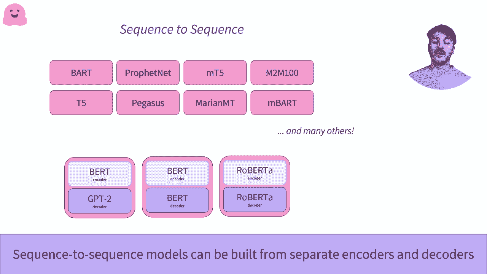

# 【双语字幕+资料下载】官方教程来啦！5位 Hugging Face 工程师带你了解 Transformers 原理细节及NLP任务应用！＜官方教程系列＞ - P7：L1.7- Transformer：编码器-解码器 - ShowMeAI - BV1Jm4y1X7UL

In this video， we'll study the encoder decoder architecture。

An example of a popular encoder decoder model is T5。

In order to understand how the encoder decoder works。

 we recommend you check out the videos on encoders and decoders as the standalone models。

Understanding how they work individually will help understanding how an encoder decoder works。

Let's start from what we've seen about the encoder。The encoder takes words as inputs。

 casts them through the encoder， and retrieves a numerical representation for each word cast through it。

We now know that this numerical representation holds information about the meaning of the sequence。

Let's put this aside and add the decoder to the diagram。In this scenario。

 we're using the decoder in a manner that we haven't seen before。

We're passing the outputs of the encoder directly to it。Additionally to the encoder outputs。

 we also give the decoder a sequence。When prompting the decoder for an output with no initial sequence。

 we can give it the value that indicates the start of a sequence。😊。

And that's where the anchor decor magic happens。😊，The encoder accepts a sequence as input。

It computes a prediction and outputs a numerical representation。😊。

Then it sends that over to the decoder。It has， in a sense， encoded that sequence。And the decoder。

 in turn， using this input alongside its usual sequence input will take a stab at decoding the sequence。

The decoder dedes a sequence， and outputs a word。As of now。

 we don't really need to make sense of that word， but we can understand that the decoder is essentially decoding what the encoder has output。

The start sequence here， the startup sequence word here indicates that it should start decoding the sequence。

Now that we have both the encoder numerical representation and an initial generated word。

 we don't need the encoder anymore。As we have seen before with the decoder。

 it can act in an autoregressive manner。The word it has just output can now be used as an input。This。

 in combination with the numerical representation output by the encoder。

 can now be used to generate a second word。Please note that the first word is still here as the model still outputs it。

 However， we have grade it out as we have no need for it anymore。😊，We can continue on and on。

 for example， until the decoder outputs a value that we consider a stopping value。

 like a dot meaning the end of a sequence。Here we've seen the full mechanism of the encoder decoder transformer。

 let's go over one more time。 We have an initial sequence that is sent to the encoder。😊。

That encoder output is then sent to the decoder for it to be decoded。

While it can now discard the encoder after a single use。

 the decoder will be used several times until we have generated every word that we need。

So let's see a concrete example with translation language modeling， also called transduction。

 which is the act of translating a sequence。Here we would like to translate this English sequence welcome to NYYC in French。

We're using a transformer model that is trained for that task explicitly。

 we use the encoder to create a representation of the English sentence。

 we cast this to the decoder with the use of the start sequence word。

 we ask it to output the first word。It outputs B avenue， which means welcome。

And we then use B avenue as the input sequence for the decoder。

This alongside the encoder numerical representation， allows the decoder to predict the second word a。

 which is two in English。😊，Finally， we ask the decoder to predict a third word， it predicts NYC。

 which is correct， we've translated the sentence。Where the encoder decoder really shines is that we have an encoder and a decoder。

 which often do not share weights。Therefore， we have an entire block。

 the encoder that can be trained to understand the sequence and extract the relevant information。

For the translation scenario we've seen earlier， for example。

 this would mean parsing and understanding what was said in the English language。

It would mean extracting information from that language and putting all of that in a vector dense in information。

😊，On the other hand， we have the decoder whose sole purpose is to decode the numerical representation output by the encoder。

This decoder can be specialized in a completely different language or even modality like images or speech。

Encos， decoders are special for several reasons。Firstly。

 they are able to manage sequence to sequence tasks like translation that we have just seen。Secondly。

 the weights between the encoder and the decoder parts are not necessarily shared。

Let's take another example of translation。Here where translating transformers are powerful in French。

Firstly， this means that from a sequence of three words。

 we're able to generate a sequence of four words。One could argue that this could be handled with a decoder that would generate the translation in an autoregressive manner。

And they would be right。Another example of where sequence to sequence transformers shine is in summarization。

Here we have very very long sequence， generally a full text， and we want to summarize it。

Since if the encoder and decoders are separated， we can have different context lengths， for example。

 a very long context for the encoder which handles the text and a smaller context for the decoder。

 which handles the summarized sequence。There are a lot of sequence to sequence models。

 This contains a few examples of popular encoder decoder models available in the Transformers library。

Additionally， you can load an encoder and a decoder inside an encoder decoder model。😊，Therefore。

 according to the specific task you are targeting， you may choose to use specific encoders and decoders which have proven their worth on these specific tasks。

。

