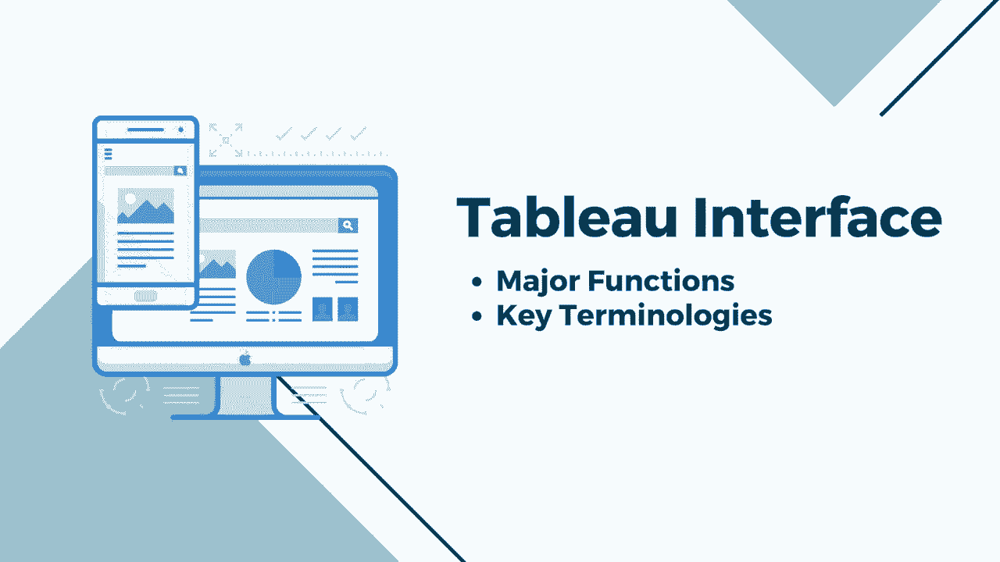
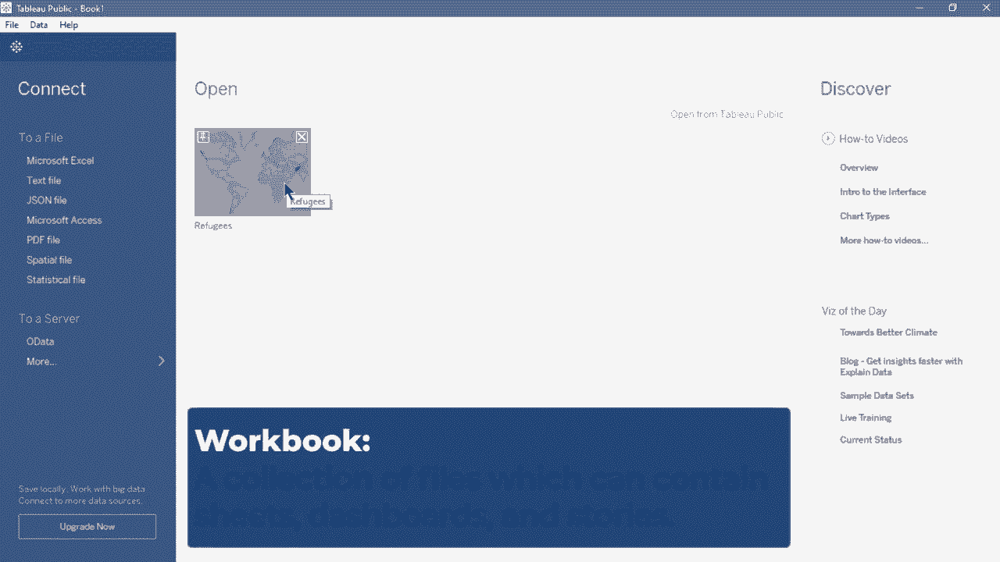
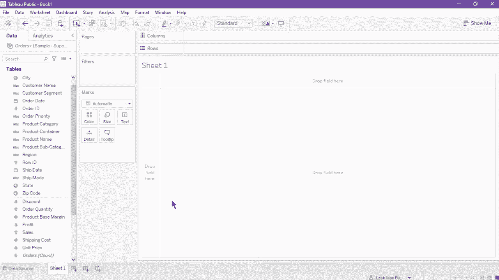
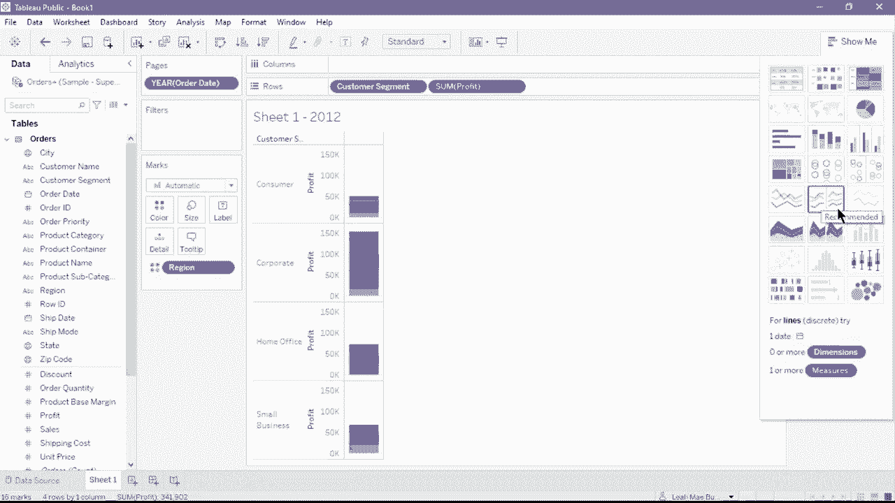
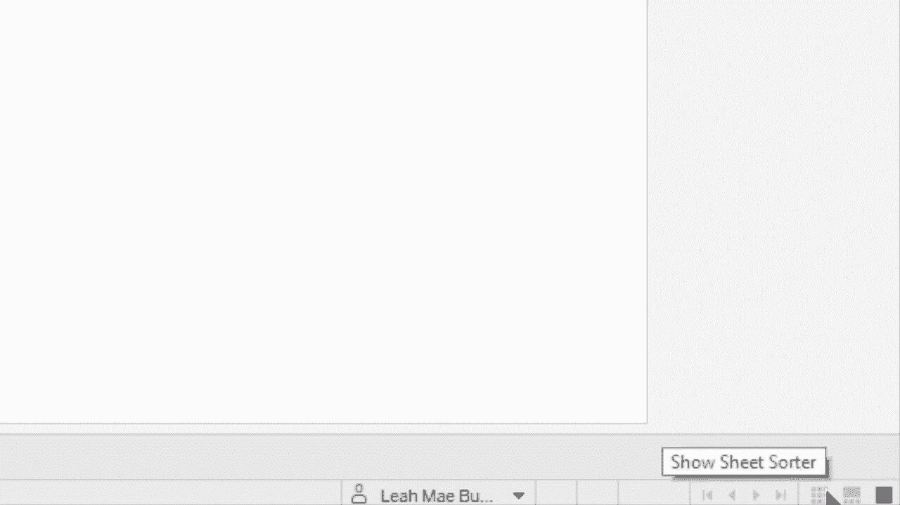
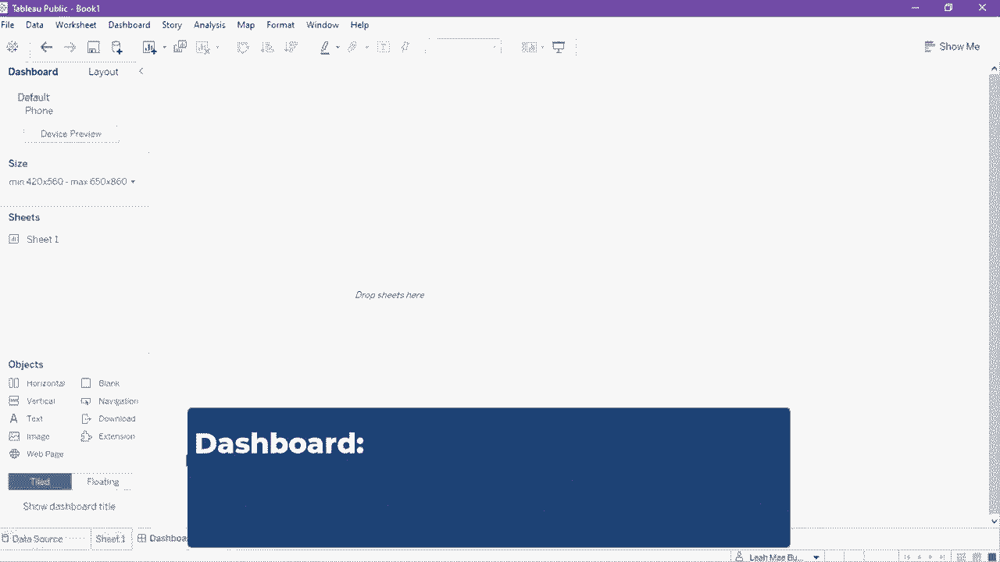

# 【双语字幕+资料下载】数据可视化神器 Tebleau！无需编程，使用拖拽和点击就做出超精美的图表。1小时新手教程，从安装到做图一气呵成~＜快速入门系列＞ - P4：4）Tableau功能探索 - ShowMeAI - BV1T341117q7

A simple and user friendly interface lets an analyst efficiently work with data。For this lesson。

 we're going to explore the intuitive interface of Tableau。

As well as learn each section's function and explain the key terminologies that you will encounter using this platform。

Upon opening Tableau public。We agreed by the start page from this window。

 we can open recently created workbooks， create a new one by connecting to a data source or explore tableau content from the community。

The page is consisted of three different panes。Connect， open and discover。

The rightmost part is the discover pane Through this pane。

 you can find links to popular views in Tableau Public。

 hone your Tableau skills by watching training videos and be informed from blogs and news in the resources section。

The central part of the page is the open pane。 This contains the recently created workbook thumbnails。

 and clicking on one will open the workbook。 A work book is a collection of files which can contain sheets。

 dashboards and stories。

You can pin workbooks in the start page by clicking the pin icon in the top left corner of the thumbnail。

Pinned workbooks will always appear on your start page。

 which is useful if you are constantly using a specific workbook to remove them from the start page。

 click the X button on the thumbnail。The last part of the start page is the connect pane。

You can use this to connect to flat files or to a new data connection。

 You can select one of the flat files from the list to open a file browse window or drag a file directly into the page to create a new file connection。

Upon inserting a file， it will lead us to the data source page。

The data source page allows users to establish the data connection， to blend the data。

 to filter the data， and apply basic adjustments to the fields or columns。

The page consists of four main areas， left pane， canvas， data grid and metadata grid。

The left pane shows the connected data source and other details about the data under the data connection section is the file name of the flat file for database connections。

 the database or schema will be the one listed。By using the drop down。

 you can edit the current connection， remove or rename it below the connection is the list of available sheets。

 Here we have orders， returns and users， which are the sheets contained in the Excel file we inserted earlier。

On the left part of the left pane are the action buttons。Undo， redo and save the tableau logo。

 which will show the start page and the refresh button。

 will refresh the data source on the upper right of the data source page is the canvas。

 which has two layers。 But first， let's drag in the order sheets and return sheets to the canvas and apply their data relationship。

This is the logical layer of the canvas。 It is where you can create relationships between logical tables。

To show the other layer of the canvas， double click on one of the tables or sheets。

 This shows a new window， which is the physical layer of the canvas。

It is where we can add joins and unions between tables。

We will learn more about this as we discuss how to use multiple data sources。

Below the canvas is the data grid。It shows the first 1000 rows of data from the connection or file that we indicated。

We can use this to apply general modifications to the data source， such as sorting and hiding fields。

 renaming， changing data type， and creating new calculated fields。Next。

 click on the list icon in the upper left part of the data grid to view the metadata grid。

 This pane shows all of the fields in the selected table， their table name。

 and their remote field name。Next， let's navigate to the tableableau workspace by clicking sheet 1 on the tab beneath the page。

 The tableableau workspace is where we will mostly reside when we create a chart。

 A single sheet is called a worksheet， which contains a single view of data。

 A view is the visual representation of data or the chart itself， which is inside the worksheet。

The Tableau Workspace consists of menus， a toolbar， the data pane， cards and shelves。

The top ribbon has the list of tabs for different functions。 The file tab lets you save files。

 open workbooks， and exit the application。Data tab has functions related to the data source here you can create a new connection。

 replace and modify the current source， and edit the data relationships。Next。

 we have the worksheet tab in this tab， you can create a new worksheet。

 show or hide parts of the worksheet and view its properties。

 Besides the worksheet tab is the dashboard tab and the story tab。

 which has basic dashboard and story functions。Most of its functions are not available since we are currently editing a view instead of a dashboard or story。

Next， we have the analysis tab。 It has additional functions in terms of performing analysis on the view。

 such as configuring the marks and labels。Calculating percentage。

 showing trend lines and applying forecasts next to it is the map tab。

The map tab sets the options for geographic visualizations in tableableau。

 after the map tab is the format tab， This tab helps users adjust or personalize how the visualization or view looks from this tab。

 we can edit the font， alignment， shading， lines and other visual properties。

 The Windows tab next to it， lets users show or hide a part of the workspace like the toolbar。

 status bar and sidebar， as well as enlarge the view for presentation mode。Finally。

 we have the help tab， which has links to the community in Tableau support and settings for the language and application performance。

Below the ribbon is a toolbar， the buttons available are contextual to what is on the sheet。

 meaning some buttons will be grayed out if it's not applicable on the current sheet。

 same as the data source page It first few buttons are the following the link to the start page。

 undo and redo button and the save button next to the save button is the new data source button where you can insert a new data connection。

Beside it are three sheet buttons， the first one is for creating either a new sheet story or dashboard。

 next to it is the duplicate button。 and the third one is the clear button。

 which removes everything placed on the current sheet。

 After the sheet buttons are the swap and sort button。 The swap button swaps the rows and columns。

 And next to it is the button to sort by ascending order and the sort by descending order。 After it。

 we have the highlight button， which enables highlighting in the sheet。

 group member buttons for creating groups。😊，And the show or hide marks labels button。

 the pin button beside it is for fixing the axes of the chart to either a specific or dynamic range。

 The drop down next to it is for the fit of the view。

 Next is a drop down for showing or hiding cards on the page。

 The last button is the switch to presentation mode。

The left part of the tableau workspace has the side bar。 It contains the data pane。

 and the analytics pane。The data pane includes all of the fields， sets and parameters。

 you can use the search bar to search the whole list or sort it either by name or data source order。

The analytics plane lets users apply advanced analysis to the view such as constant lines。

 forecasts and reference lines。 The center canvas is the work area。

 This is where our visualization is presented。The cards and shelves surrounding the work area are used to indicate how the view will be placed and shown。

 The columns and rows shelves create the structure of the chart。

 The fields are placed in these shelves to indicate whether it will be the value on the header or on the axes。

 The filter shelf allows you to specify which data to include an exclude。

A filter is a control on a view that limits the data shown。

Below the filter shelf is the Marx card。This is a key element for visual analysis in tableau。

 because you can add context and detail by dragging fields into the different visual properties of the marks card。

 Let's try creating a view as an example。 Dr the customer segment into the rows shelf。

 This creates four rows of customer segment values in a table view。 Next。

 drag the profit field from the data pane and place it after the customer segment on the row shelf。

This will automatically create a bar chart of the sum of profit by customer segment。 Now。

 add an order date to the column shelf。 It turns the bar chart into a line chart because we have added a continuous field as our column。

 Finally， drag a region field into the marks card and place it on color。

 This sets a regional granularity to each line chart by segment where each region is separated by a different line and color。

 The page shelf lets you break a view into a series of pages so you can better analyze how a specific field affects the rest of the data in a view。

 For example， let's drag the order date from the column shelf and place it on the page。

 This separates the view by year of order date where we can flip through each year by using the controls on the right panel。

 The show me button on the upper right。 lets users select a chart or view type by highlighting the possible charts that the view。

😊，Can be converted into the chart with orange outlines is selected to be the best match for the indicated data。

The bottom of the workspace has the status bar。 It shows the description of menu items and information about the current view。

 such as the marks and its current number of rows and columns。

To organize and navigate between sheets， you can use the button for sheets tab。

 film strips and sheet sorter， which is located on the bottom right of the workspace。

 The first button is the sheet sorter， which shows all the sheets in a workbook as thumbnail images on a single page。

 You can drag and drop thumbnails in this view to reorder the sheets。 Next is the film strip。

 The film strip displays along the bottom of the workbook and shows a thumbnail of the sheets。

 The last button is the sheet tab。 Each sheet will be represented as a tab in the bottom of the workflow。

Now， let's navigate to the dashboard page。 Click on the new dashboard button to create one。

 A dashboard is a collection of several views， letting you compare a variety of data simultaneously。

 The center canvas with the default white background will represent how your dashboard will look。

There are several functions for customizing your dashboard in the dashboard pane located on the left。

The first option lets you set the size of the dashboard and shows or hides a device preview。

 which can toggle to see how your dashboard will look on a different screen resolutions below the button。

 you can specify a range。 automatic or fixed size of the dashboard。 Next is the sheets section。

 you can drag and drop the available sheet to the canvas to include it in the dashboard。

 Aside from the sheets， you can also insert additional objects from the objects section such as images。

 containers and static text。

Next to the dashboard pane is the layout。 This pane lets you adjust each sheet and an object's layout position。

As well as its size and padding from this pane， you can also configure the dashboard border and background color below the layout tab is the item hierarchy。

 It lists the relationship between the sheets and objects currently placed in the dashboard。

Finally， let's go to the story page， click on new story buttons on the bottom to create one。

The center canvas will show how the story will look。

Additional configurations can be set in the story pane on the left。

On the first part of the story pane is the options for adding a new story point。

You can choose to create a new blank story or duplicate the current one。

Below it is the list of sheets and dashboards that you can insert into the story。

 drag a sheet into the canvas to add it to the story To add a caption。

 We can double click on the default text box on top to edit its content。

 If you want additional text boxes on the story， drag the text object from the story pane and place it into the desired position in the story。

 The story title is located in the upper right of the story canvas。

 You can edit it by double clicking the title。 But if you choose to hide it。

 you can uncheck the show title option in the story pane。To edit the size of the story。

 click the drop down on the size section of the story pane。

 you can choose to either set a fixed size， automatic size， or a range。

The layout tab next to the story's pane lets you set a navigator's style。

 A navigator allows you to edit and organize your story points。

This is only visible when you have more than one story point。

