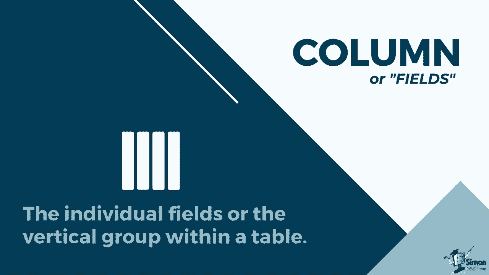
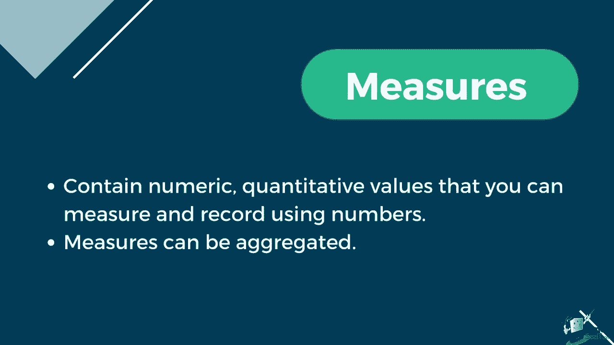
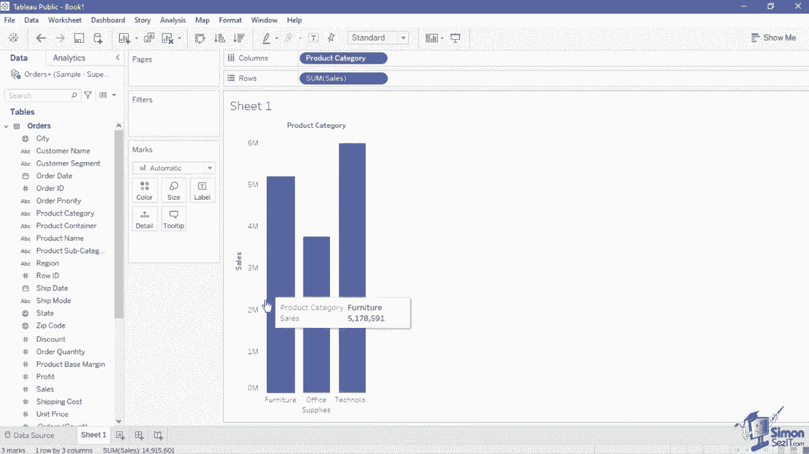
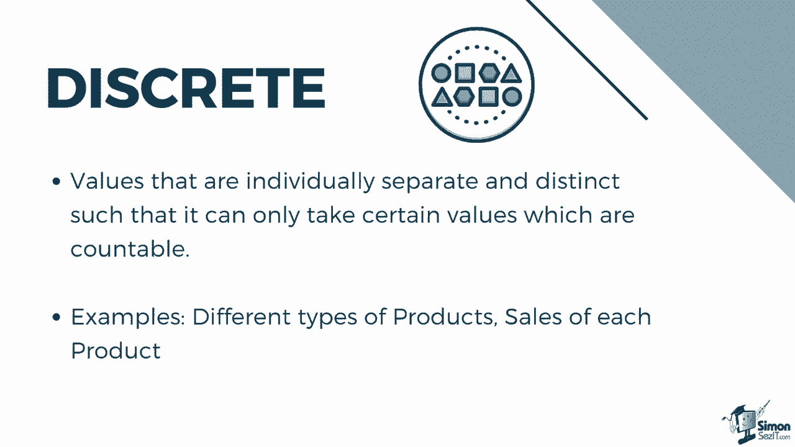
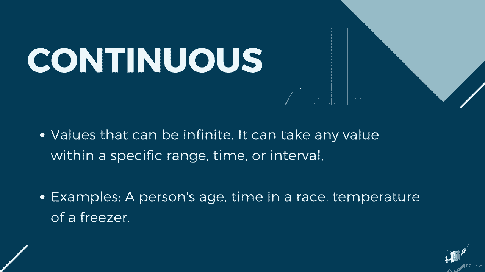
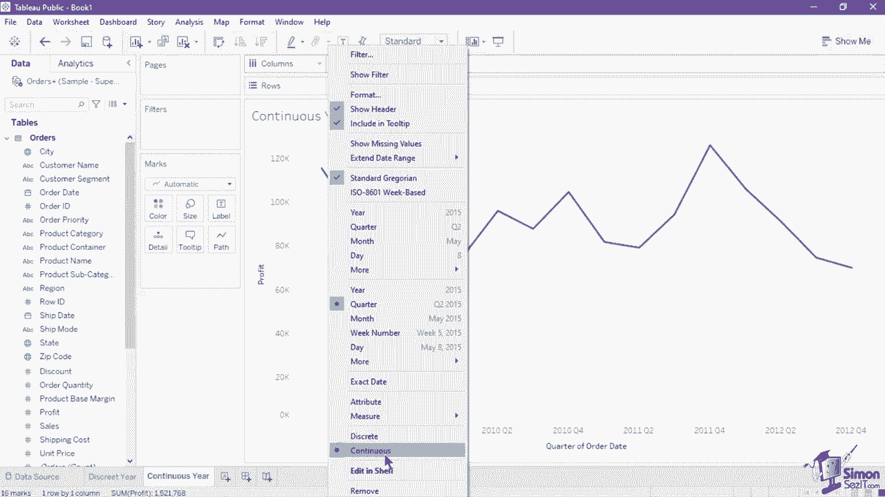

# 【双语字幕+资料下载】数据可视化神器 Tebleau！无需编程，使用拖拽和点击就做出超精美的图表。1小时新手教程，从安装到做图一气呵成~＜快速入门系列＞ - P5：5）Tableau 数据概念 - ShowMeAI - BV1T341117q7

Understanding the data concepts and the proper structure is essential to efficiently working with the Tableau platform。

Working with data that you are extremely familiar with。

 let you visualize it correctly and highlights your analysis。

Let's start with learning what type of data structure should be used with the tool。

Tableau works best with data that is in tables formatted like a spreadsheet。

 That is data that has a vertical format where the field names are located in the header of the columns。

 and the data values are placed in the rows。Knowing this， beginners in data analysis might ask。

 how can I differentiate whether it's a row or a column， A row or record contains the data value。

1 record of data means one horizontal row in the table。 For example。

 in this Excel file of superstore sales， each line of data in the rows pertains to individual records。

 columns， on the other hand， are the individual fields or the vertical group within a table。

In this sheet， we have the customer name column and city。

 The headers or the labels of each column are called the field names to avoid confusion。

 Just remember that columns are vertical and rows are horizontal。

Some data sources might be in a wide format， such as this refugee count data set。

It might be easier for a person to read and understand it in this format。

 but when bringing in this data to Tableau， it will read each year as a separate column。As a result。

 we will have separate fields for 2001，2002，2003 and 2004。

This will make it hard for us to create an analysis across time since each data is stored in different fields。

 Another problem is that the value does not have its own field name or context。

Since the data is in a wide format where each row has a different country and the column shows the year value。

 we do not have any indicator as to what the numbers 76。

26 and 2001 in Albania pertains to in order to fix this。

 we may need to reshape the data into a tall format before bringing it into tableableau。

In this format， we now have the country name， year and refugee count as the field names for each row。

 It is much easier to create an analysis using this data set because each field now represents a unique quality about the data。

Here are some additional things to check when reshaping your dataset set。

Make sure that there are no extra headers on top。The first two rows are critical for tableableau to interpret the data source。

 so it is better to remove the titles and heading inserted above the correct field names。

Remove Tos on dataset。Tableau can automatically compute totals for you。

 so keeping these total columns are unnecessary and might lead to double counting。

It is also better to include date fields in a traditional format rather than ones converted in years。

 months or other date aggregations。 Tableau can automatically aggregate dates。

 so it is more efficient to use the traditional format in order to unlock the full functionality of date fields。

Now， let's look at how Tableau reads and categorizes the fields。

You might notice that upon connecting tableau to a new data source。

 a symbol can be seen on top of each field name。 These represent the data type of each column。

 Data types classify the data in a given field and provide information about how the data should be formatted。

 interpreted and what operations can be done to that data。 For example。

 numeric fields can have mathematical operations applied to them。

 and geographic fields can be mapped。 The ABC icon are for text or string fields such as customer name and product type。

The calendar icon refers to the date fields such as invoice date and ship date。

 While the calendar with clock icon refers to date and time fields， such as last system refresh。

The hashtag icon refers to numerical fields such as profit and order I D。

 The T F icon shows Boolean values。Which only contain relational values， or either true or false。

Finally， we have the Gbe icon， which refers to geographic fields such as zip code and country。

All of these fields where their respective data type icon are also listed in the data pane when you create a new view。

 these fields will then be categorized by Tau into roles of either dimensions and measures。

 Dimenions have a blue data type icon and a blue pill。

 which is visible when you hover over the field name。

 Measures have a green data type icon and a green pill。

Dimenssions contain qualitative values， meaning they can't be measured， but are instead described。

 Dimenions are often things like city or country， eye color， category， team name， et cetera。

 You can use dimensions to categorize segment and reveal the details in your data。 Also。

 dimensions affect the level of detail in the view。Measures contain numeric。

 quantitative values that you can measure and record using numbers。 Measures can be aggregated。

In the data plane， dimensions are listed first by default。

 followed by the measures which are separated by a line。To show how dimension and measures differ。

 we will create a bar graph that shows the sales per product category in this sheet。

Drag the sales field into the rose shelf。 Since sales have numeric value， it is considered a measure。

As we can see， Tableau automatically aggregated it using the default aggregation measure of sum。

To aggregate is to gather the value into a group in order to visualize it as a whole instead of using each individual value。

 Since the aggregation method is set to sum， we can now see the bar marked up to the total sales。

 which is almost 15 million We will learn more about different aggregation methods as we go further along this course。

 Next， let's look at how a dimension will affect this visualization。

 We will add the product category field into the columns shelf。

Since the field product category is a dimension， it has segmented the data into three product categories。

 You can also move the product category pill into the colors marked card to segment the bar by color。

Tableau represents the data differently， depending on whether the dimension and measure are discrete or continuous。

 Discreet values are individually separate and distinct。

 such that it can only contain certain values， which are accountable。 For example。

Different types of products are discrete。 Sales of each product is also considered as discrete。

Continuous values can be infinite。 It can take any value within a specific range， Time or interval。

 A person's age is considered continuous。The time and a race and temperature of a freezer are also continuous values。

In this bar chart， we have a continuous measure of profit and a discrete dimension of year of order date。

 As you can see， the graph has no X axis line since the year of order date is set as discrete or distinct year value。

The year is treated as a header or label for each bar。 Now， let's compare it to this second chart。

 which uses the same data。In this line chart， we still use a continuous measure of sum of profit。

 but the quarter of order date is set as continuous， as implied by its green pill。

 Notice that an x axis line is now visible。 This order date is not sortable because it follows a chronological order from oldest date on the left to most recent date on the right。

If you wanted to create a chart which shows trend over time。

 you might opt for the continuous type of value， but if you need a chart that can be sorted。

 you will have to use a discrete value。 Dimensions are usually discrete and measures are usually continuous。

 However， this is not always the case。 You can always change a pill into either discrete or continuous by right clicking on the pill to show its menu and selecting either the discrete or continuous option。

When using multiple data sources in tableableau， you might encounter the term relationships and join。

 Both of them combine data from multiple tables， but they are not the same function。

 data relationshipss are a dynamic， flexible way to combine data。

 Think of it as a contract between tables。 Tableau brings in data from these tables using that contract to build a query with the appropriate joins。

 Reships have no upfront joins。 You only need to set the matching fields to define a relationship。

 The relationship is visible in the logical layer of the data source canvas wherein a flexible line connects or shows the relationship between the tables。

It is automatic in context aware Tableau automatically selects join types based on the fields being used in the visualization。

 During analysis， Tableau adjusts join types intelligently and preserves the native level of detail in your data。

You can see aggregations at the level of detail of the fields in your viz。

 rather than having to think about the underlying joins。

Joins are a more static way to combine data。 Joins must be defined between physical tables up front before analysis and can be changed without impacting all sheets using that data source。

 Join tables are always merged into a single table。

 They are displayed in the physical layer of the data source canvas using Venn diagram icons to show the join type。

It also requires you to set the join type and the clauses。

 Tableau recommends using relationships as your first approach to combining your data because it makes data preparation and analysis easier and more intuitive。

 You can use joins when you absolutely need to， such as when explicitly using a specific join type or when using data models that support shared dimensions。

