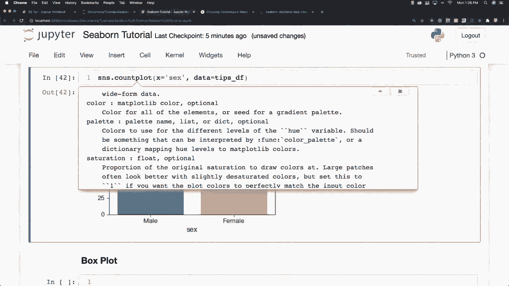
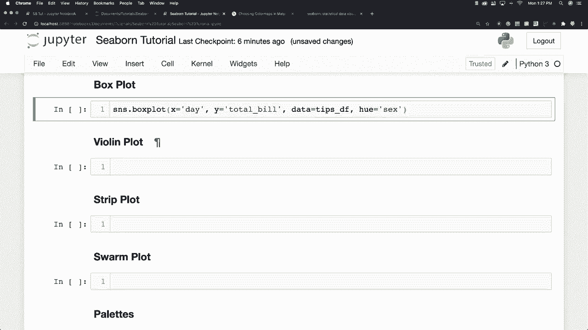
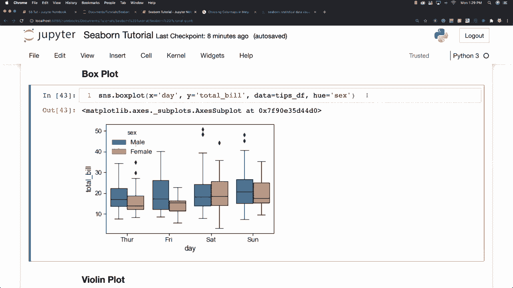

# 【双语字幕+资料下载】更简单的绘图工具包 Seaborn，一行代码做到 Python 可视化！1小时教程，学会20种常用图表绘制~＜实战教程系列＞ - P13：L13- 箱形图 - ShowMeAI - BV1wZ4y1S7Jc

Plos now a box plot is going to allow you to compare different variables and what it's going to do is show you the quartiles of the data So I'll just go and print one and then I'll explain exactly what it is showing I kind of really like box plots So let's say day and what we're going to do here is see how men and women change in regards to the total bills over multiple different days So I'm going to say Y is going to be total bill and of course the data is going to come from our tips data frame and this is the first time you're going to see h here and this is going to reference sex。

Male or female and there is our box plot。 Now like I said。

 the box is going to show quartiles of our data and you can see here is a legend and so forth。

 Now this bar that goes across the middle is the median and the box is going to extend one standard deviation that's what the box represents from our median these guys right here are called whiskers and they're going to extend to all of the other data aside from what is in our standard deviation aside from those points that are considered outliers and these points right here considered to be outliers All right and basically what hue is going to do for us is provide an additional way for us to add in another category So we're looking at the days as well as the total bills but by putting sex in here with hue that is also going to allow us to create。

Multiple box plots for each of the days for the males and a female so that we can compare them and we can see here that men tend to spend more money on Friday versus on Saturday where women spend more money All right and if you want to move this because sometimes these legend gets in the way let's say you would want to move it you can go plot and legend and location this will normally almost always work if you just type in location zero it left it in the same place I'm going to get more into legend here in a couple seconds。

 but basically it allows you to reposition the legend so that it isn't over top of your data and I'll get into the specifics of it after I continue on here for a little bit more in regards to our categorical plotting options that are available。

