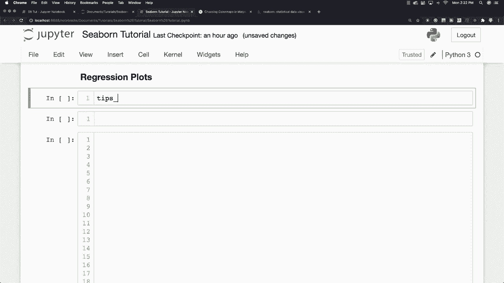
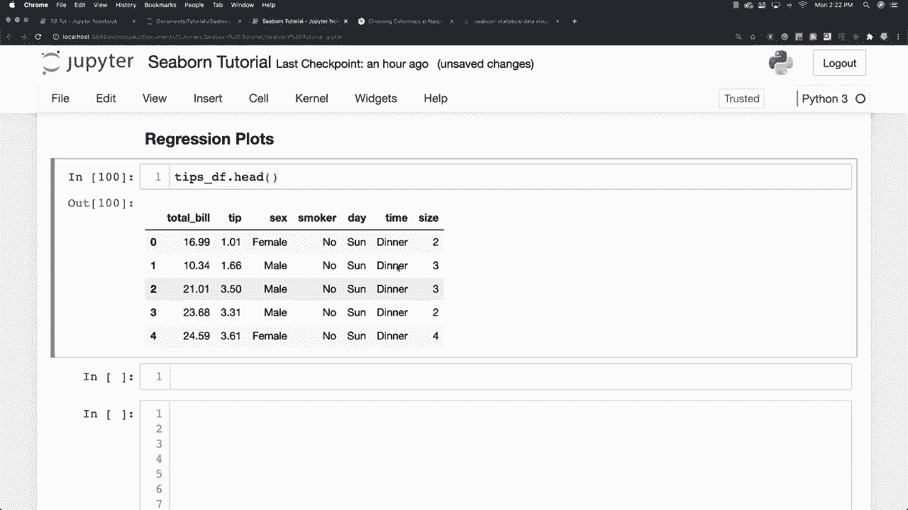
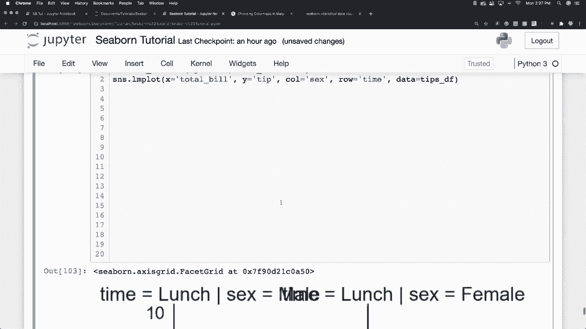
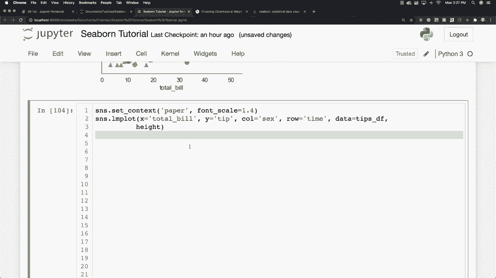
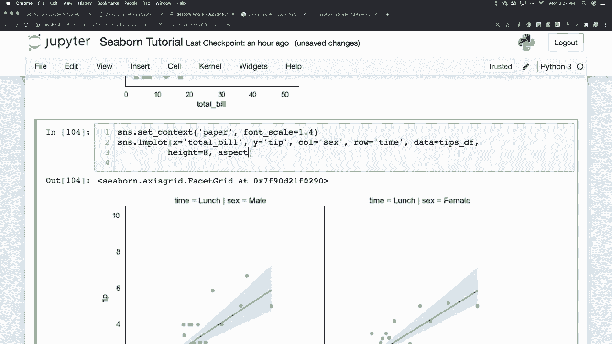
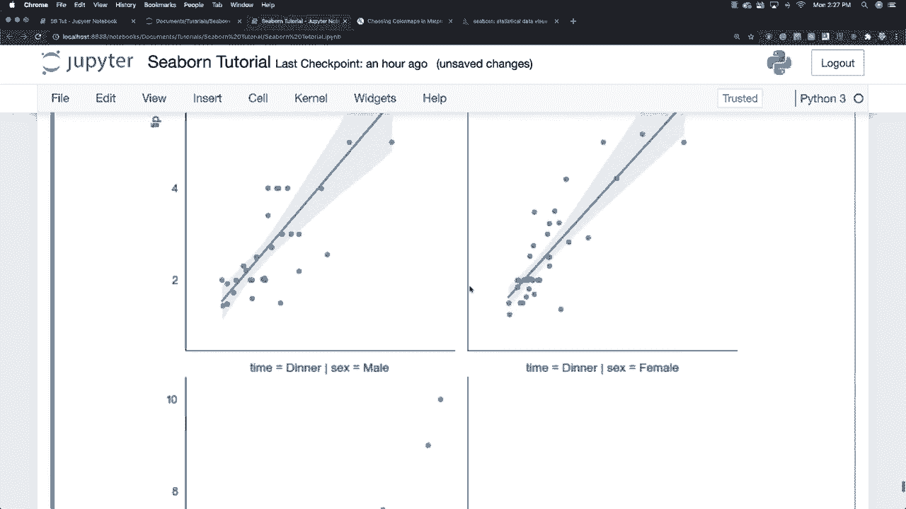
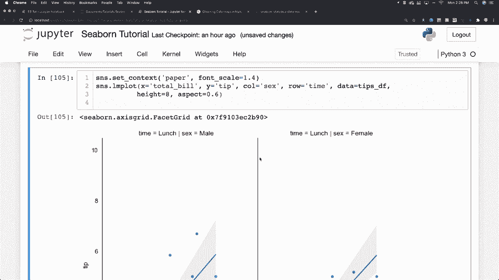

# 【双语字幕+资料下载】更简单的绘图工具包 Seaborn，一行代码做到 Python 可视化！1小时教程，学会20种常用图表绘制~＜实战教程系列＞ - P22：L22- 回归图 - ShowMeAI - BV1wZ4y1S7Jc

， so I'm going to use my tips data here again。 So let's go and let's just get the first five of these guys just to remind you what type of data we're going to be using there。

 Okay， so what I want to do is I'm going to define the size of the figure to be figure size is going to be equal to8 by6 I'm going to set to paper for this。

 So set。

Context。To paper I am going to scale my font to make this look nice to 1。

4 and to plot a regression plot which I've talked about a lot in my previous tutorials you use LM plot like this and what I want to do here is I want to study whether the total bill is going to affect the tip amount so of course it is and that's the reason why we're doing it so I'm going to go and plug in the total bill amount and for why we're going to plug in the tip amount Hugh is going to be used to show the separation between the men and the women。

 so we'll say hugh is equal to sex and the data of course is going to come from my tip data frame so T data frame and I'm going to use custom markers again just to show you that you can So I'm going to go。

I'm going to use。A circle。 And then I'm going， well， make sure you put that in quotes， though。

 circles。 And then for the women， I'm going to have。

Uppercase triangles and then I am going to also go and make further changes to our scatter plot by going scatter underscore KWS is equal to and I'm going to define the size for my markers and that is going to be I'm going to make it 100。

 see what that looks like。 I'm also going to define the align width and let's make that be equal to。

0 or 。5。 and I'm also going to change the edge color。Let's make that be white and if I run it。

 you can see there is our highly customized scatter plot and you can go in there and take all the other things we've learned about over the course of this tutorial and play around and make it look the way that you think would look best。

And for the final thing， I'm going to do another regression plot here。

 but what you can actually do is you can separate the data into separate columns。

 so I'm going to go SNS Lm plot and have this be equal to total bill again and the tip amount。

 so we're making the same analysis here， so here's tip and the column I'm also going to be analyzing six and you can also go and separate this into time of day。

 so I'm going to have the row based off of that。

And。Then finally， put in your data frame you're working with and you can see how all of that data is playing out and how it affects our regression and it just provides you multiple different ways to look at multiple pieces of data And if you don't like the way that looks sometimes you can just play around with the context。

 So let's go and take this guy and let's throw it down inside of here like that。

 And then let's change it to poster instead。 Oh， that's very， very big。 So that's not working。

 So let's just stick with paper and that's pretty readable And then of course。

 you could also come in and play around with the heights and so forth and the widths。

When let's just go and play around with height， let's go and first off。

 let's move this how to here a lot of space there， let's define our height to be equal to something like8 and our aspect to be something like 0。

6 and there you go So there's different ways we can stretch our data and look at it and analyze it and present it for our viewers and there is a pretty thorough overview of all the different awesome things you can do with Seaborn more visualization tutorials are coming and like always please leave your questions and comments down below otherwise till next time。

