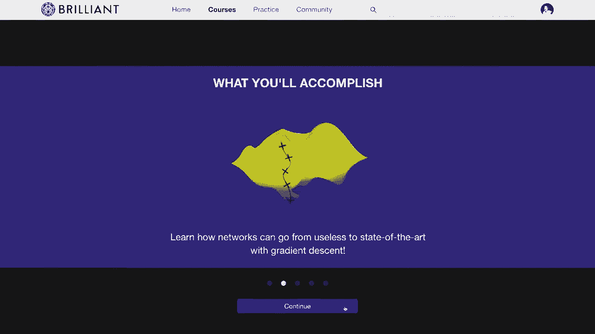
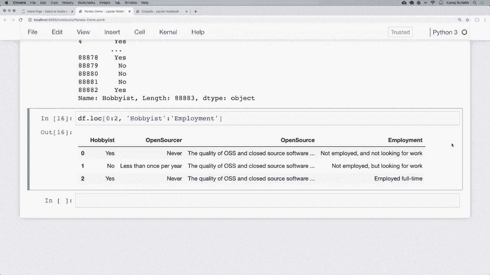

# 【双语字幕+资料下载】用 Pandas 进行数据处理与分析！真实数据&实时讲解，学完就能上手做数据分析了！＜实战教程系列＞ - P2：2）DataFrame 和 Series 基础 - 选择行和列 - ShowMeAI - BV1M64y187bz

Hey there。 How's it going， everybody。 In this video， we're gonna continue learning more about pandas。

 And specifically， we're gonna be learning about the data frame and series data types。

 So like I said in the last video， these are basically the backbone of pandas and are the two primary data types that you'll likely be using the most。

 So in this video we're gonna go over how we can think of data frames and series data types in a different way。

 And then we'll look at the basics of getting information from these data types。 Now。

 I would like to mention that we do have a sponsor for this series of videos。

 and that is brilliant org。 So I really want to think brilliant for sponsoring the series。

 And it would be great if you all can check them out using the link in the description section below and support the sponsors。

 And I'll talk more about their services in just a bit。 So with that said。

 let's go ahead and get started。 Okay， so first， let's look at what a data frame is。

 and then we'll learn more about how we can think about this in terms of a Python object。

 So we saw data frames briefly in our last video when we check to make sure that our data was loaded in correctly。

 So these were the。😊，Probjects that were displayed in Jupiter as rows and columns。 Basically a table。

 So let's take a look at what this looks like。 So if you were following along with the last video。

 this is basically the same Jupyter notebook that I had before， except this is just cleaned up a bit。

 So we're importing pandas here。 we are reading in our Cv files。

 So one is just our main data frame for our survey results。

 one is our schema data frame for the schema results。

 and then we are setting some options here where we have the max column set the 85 so we can see all the columns and the max rows set the 85 so that we can see all of the schema。

 Now if you haven't been following along with the video so far。

 then I do have a link in the description section below that links to where you can download this data data and follow along with this。

 Okay so this is a data frame here。 So where we are printing out Df do head。

 this is what this returns。 So this here。Is the first five rows of our data frame so you can see that a data frame is made up of multiple rows here and we also have multiple columns。

 So in the case of this data， these are survey results but your data can be you know whatever your data is but it's most likely going to be in rows and columns kind of like a table So for this data what these being survey results each row is a survey is one person who answered the survey and each question was their answer for that question on the survey So for example。

 this respondent number one here， they answered that yes。

 they were a hobbyist and if you want to know what hobbyist means then we just like we saw in the last video we can look at our schema data frame so let me go ahead and print this out here and let's look at this So if I look at what a hobbyist is then we can see that that question was do you code as a hobby。

So that's what this data is。 And that kind of gives us an idea of what a data frame is。

 Basically a data frame is just rows and columns。 But now let me explain how I like to think of data frames using native Python。

 So if we are only using Python and not using pandas to store information in rows and columns then how would we do this。

 Well for those of you familiar with dictionaries， you might think that it's a good idea to store information that way。

 So let me pull up a new notebook here that I have open here with some snippets and let's take a look at this。

 Okay so let's look at this first cell here。 So a lot of us are probably familiar with Python dictionaries where we have keys and values。

 So if I'm representing some data in this example it's a person then we can use a dictionary So first off I have a key of first which is going be the first name and then that has a value of corey and then we also have keys and values for the last name and the email as well。

Okay， so this dictionary here represents data for a single person。

 but how would we represent data for multiple people？ Well。

 there are probably a couple of different ways that we could do this。

 but the way that I like to think of this in terms of learning pandas is to make all of our values in our dictionaries a list。

 So let's take a look in the second cell here to see what this would look like。

 So here in the second cell now we can see that we have a pretty similar dictionary to what we had above。

 but now instead of just a single string here for the values I instead have a list and our list currently just has one person。

 but now since this is a list we can add more first names and information in here。

 So the first value of our list is going to be our first person。

 So if I go to the third cell down here at the bottom。

 now we can use this as an example to see what this would look like with multiple people。 So the。

Second value in our list will be our second person and the third value in the list will be our third person。

 So if we look here， we have people， we have a key of first。 So if we want the second person here。

 we go to the second value。 That's Jane。 the last name is Do。

 and the email go to the second value here is Jane Do at email do com。

 If you want the third person that would be John， and then third value in last would be do。

 and third value and email is John Do at email com。

 So we can kind of think this like row and columns。

 The keys are the columns and the values are the rose。 Now。

 if you look up the definition of a panda data frame online。

 then you'll see a lot of definitions that just say something like it's a twodimenional data structure。

 Now that might sound a little confusing button layhman's terms that basically just means rows and columns。

 Okay so like I said here， the key for email here would be our email column and contain all of the email value。

And if we wanted to see the email column then we can just access that key。

 So if I come down here into actually let me run all of these really quick here I think I open this up without running these so I want to make sure that we have this registered okay so if I wanted to see that email column then I could simply say people and then access that email key if I run that then we can see that we got all of the emails Now the reason that I wanted to show you this is because I feel like this really helped me in terms of how I think about data frames。

 So data frames are very similar to this but with more functionality than what we have here in standard Python Now we can actually create a data frame from this dictionary and see what this looks like。

 So let's do that and look at some basic data frame functionality and then we'll look at this more using the stack overflow data from the last video So here in this bottom cell in order to create a data frame from the information。

We have here， I'm going to go ahead and import pandas So I'm going say import pandas as PD and now we can create a data frame actually using this dictionary that we have up here。

 so to do that I can just say Df is equal to PD do data frame and check the casing there that's a capital D and a capital F。

 and then we'll just pass in that dictionary that has values as list So if I run this and that seem to run okay without any errors And now let me just print out Df here。

 and if I print that out， then we can see that now our data frame is representing this in a way to where we do have rows and columns that we can visualize So we get these people printed out in a nice table ofs and columns。

 Now we also have these over here to the far left that don't have column names this01 and 2 Now this is an index。

 Now I'm not going go much into。es right now because that's what the next video is going to cover。

 but basically it's a unique value for our rows。 Now it doesn't need to be unique， but again。

 we'll talk more about that in the video specifically on indexes。

 So now that we have a bit of an idea of how to think about data frames。

 Now let's take a look at how to access information here within the data frame。 So first。

 let's just access the values of a single column。 So just like we did with the dictionary。

 we can access a single column just like we were accessing the key of a dictionary。

 So just like I did people and email up here。 I can do very similar down here and just say that I want that email column of my data frame。

 Now that's not actually a key that is going to access the column of a data frame。

 but we can see here that we get all of the emails back from that data frame。 So again。

 I do want to emphasize that I only use the pure Python example so。

We could get an idea of how to think about a data frame， but like I said， a data frame is much。

 much more than just a dictionary of lists， so for example。

 we can see that when we displayed the email column here。

 it doesn't look the same as when we displayed the list of values from that dictionary and that's because this is actually returning a series and we can see this if we check the type so if I check the type of this email column here。

So let me run that。 We can see that this is pandas core series series。 So this is a series object。

 So what is a series。 So a series is still basically a list of data。 But just like with a data frame。

 it has a lot more functionality than just that。 Now。

 if you look up the definition of a series online。 Then you'll see a lot of definitions that just say it's a one dimensional array。

 And that might sound a little confusing， but in layman's terms that basically just means that it's rows of data。

 So again， you can think of a data frame as being rows and columns。

 and a series as being rows of a single column。 So a data frame is basically a container for multiple of these series objects。

 So again， that's important。 So let me go over that one more time。

 So we can see that a data frame here is two dimensional because it has rows and columns。

 So we can see here that it has you know， first name， last name email。Now。

 whenever we access just the email， then we can see that we get all these emails here。 Now。

 this is a series。 And I said that a data frame basically contains is a container for multiple series objects。

 So we can think of this email column here as a series。

 this last column here as a series and this first column as a series。

 And also we can see where we print it out this series here for the emails。

 we can see that this series also has an index as well， just like our data frame did。

 So this index is over here on the left。 the0，1 and 2。

 Okay so we can access a single column of a data frame like we're accessing a key just like we did here in this cell。

 but you might also see some people use dot notation to do this same thing So you might see some people do it like this。

 So they might do Df dot email。 And if I run this cell。

 then we can see that let me get rid of this cell。And just so we can compare these two。

 we can see that this gives us the same thing。 whether we access this like a key or whether we use dot notation。

 this returns the same series object of the email values。

 Now whichever way that you want to do this is really just a personal preference I actually prefer the first way of using the brackets and there are a couple of reasons that I prefer to use that over dot notation first is that I like using the brackets because there's a chance that one of your columns is named the same thing as one of the attributes or methods of a data frame。

 And if that's the case， then using the dot notation might give you some errors。 So for example。

 if a data frame a data frame has a method called count So if you had a column named count and you did and you were trying to access that count column using dot notation then that's actually going to access。

The count method from data frame instead of that count column。

 So that actually wouldn't work how we did it here。

 if you wanted to access the actual column called count which we don't have one in this specific data frame。

 but if we did than we would have to access it like this。 So that's kind of why I prefer brackets。

 So I'm going to be using brackets throughout this series。

 but I wanted you to know about dot notation because if you're working with other people using pandas。

 then you might see them access columns in using dot notation。

 So you need to know that it's at least a possibility。 And again。

 that doesn't mean that they're doing it wrong， it's just a personal preference。

 I just prefer using the brackets。 so I said that data frames have a lot more functionality than what we saw using you know standard Python So let's look at some other stuff that we can do here。

 So let's say that we wanted to access multiple columns。 Now in order to access multiple。

We can use the bracket notation and pass in a list of the columns that we want。

 So if I wanted both the last name and email columns。

 then we could say Df and use our brackets just like we saw before。

 But now I'm going to put in a set of inner brackets here as a list of columns that I want to access。

 So for the first value， I'll put last for the last name and for the second value。

 I'll put email for the email。 So if I run this， then we can see that now we have a data frame returned here of the last column and the email column。

 Now I want to emphasize again here， that I pass a list inside of these brackets here。

 So there are two pairs of brackets。 you can't leave off the inner brackets because you'll likely get a key error because pandas will think that you're passing in both of those strings as a single column name。

 And another thing that I want to point out here is that now that we're getting。

Multiple columns this can no longer be a series because remember。

 a series is basically a single column of rows。 So when we get multiple columns like this。

 it's just returning another data frame。 And in this case。

 it's a filter down data frame with just these specific columns。

 So we filtered out the first name column here。 and we just have the last and the email。 Okay。

 so that's how we get a specific column or multiple columns。 and we can slice these as well。

 similar to how we slice a list。 but I'll show that on our larger stack overflow data set here in a second。

 Now， if you have a lot of columns and want to see all of them easily。

 then we can just grab the columns specifically by saying Df dot columns。

 and we can run this and we can see here that this gives us all of our columns here。

 So our columns are an index of first last and email。OkaySo now we've seen how to get a column。

 but how would we get a row So in order to get rows。

 we can use the lo and i lo indexers so that is lo and i Lo。 so let's take a look at these。

 So first let's take a look at i Lo。 So i Lo allows us to access rows by integer location hence the name i Lo is integer location So if I wanted to get the first row then we can just say Df do i Lo and then use brackets here to since this is an indexer use brackets and pass in a0 and that will give us the first row。

 So if I run this then we can see that the first row has a first name of Cory last name of shaefffer and email of coreium schaffer atgmail do com So what that did is it returns a series that contains the values of that first row of data which like I said is the first name。

 last name and email。Of the first person in this example。 And again。

 we haven't discussed indexes yet。 that will be in the next video。

 but the index here is the column names so that we know what those values are So up here our index was 0。

1 and2 but whenever we're actually accessing a row。

 it's going to set that index to the column name so that we know what those values are because if this just said0。

1 and 2， then we might not know what these are and just like when we select multiple columns。

 we can select multiple rows as well by passing in a list of integers so if I want the first and second row then we can just say and again this is going to be a pair of brackets within these brackets because we're passing in a list to our index here and I'm just going to pass in a list of0 and1。

 So if I run this then we can see that now we get the first two rows of data。And again。

 be sure to pass in an enter list inside those brackets so that it does what you expect it to do。

 And also， we can see that now we're getting a data frame with these multiple rows。 Now。

 with these i lo and lo indexers， we can also select columns as well。

 And that is going to be the second value that we pass into these outer brackets。

 So if we thought of ilo and lo as functions， then we can think of the rows that we want as the first argument and the columns as the second argument。

 So let me show you what this looks like。 So here we have our inner bracket。

 Those are the rows that we want。 But now after that list， we can put a comma。

 And now we can specify the column that we want。 Now with i Lo。

 we can't specify and actual column name because these use integer integer locations。

 So these are for integers only。 So remember， our first name is the first column。 the last name。

The second column and the email is the third column。

 So if we wanted to grab the email address of the first two rows。

 then we can grab the column at index 2， which will be the third column since all of these start at zero。

 So if I was to pass in a two here。 and run that。 then we can see that now we get the email addresses of these first two rows。

 Okay so that's ioc。 So now let's look at Lo。 So with ioc。

 we were searching by integer location with Lo， we're going to be searching by label。

 And when we're talking about labels for rows， these will be the indexes。 And again。

 we don't have custom indexes right now。 So this index is just a default range of integers。

 So at the moment， this will somewhat be similar with i Lo。

 the i Lo indexer but we'll look at uses or use cases with Lo with actual labels in the next video when we cover indexes。

 So real quick， let's look。our entire data frame again。 So I'm just gonna print that out down here。

 So like I said， over here on the far left， these are our indexes。

 So these are the labels for that row。 So if I want the first row， then by default。

 this just has a label of0。 so I can say Df do lo and pass in a0 there。 and if I run that。

 then we can see that we get that row with that label of0。 And again。

 I know that that looks similar to i Lo at the moment。

 but we'll see how to use indexes with labels in the next video。 And just like with i Lo。

 we can also pass in a list to specify multiple rows。 So if I wanted the first and second row。

 then just like with i Lo， I can pass in an inner list here。

 So let's say that I want the first row and the second row。 So I'll run that。

 we can see that now we get the first and the second row。 And again。

 now we can see that we are getting a data frame back with now that we have multiple。

Rs and just like with I Lo， we can also pass in a second value into our indexer to select specific columns for these rows。

 Now， with Ilo， we used integers to select the columns。 But now that we're using Lo。

 we can use labels。 So if we want the email column of these first two rows。

 then now we can just pass in a value of email。 So if I run that。

 then we can see that now we get the email value of these first two rows。

 Now I didn't show this with IL， but we can also pass in a list for the columns as well。

 So if I want the last name and the email for these rows。

 then instead of just passing in a string as the second value here。

 then we can pass in a list of strings of the columns that we want。

 So I'm going wrap this in brackets here。 I know that this can get a little confusing with all these inner brackets。

 But let's say that we want email and we want last name。So if I run this。

 then now we can see that we got these specific columns here。

 email and last name for these specific rows， the row with label 0 and the row with label of one and also notice that the columns display and the order that we used in our list up here within Lo which is a different order from our original data frame So up here it' first last email but we asked for email and last and it gave us back in that order of email and last so now that we've seen the basics of grabbing certain rows and columns from a small data set now let's go back to our data from the last video and see how we grab some rows and columns from the stack overflow data set So I'm going to go over here to back to our pandas demo here and again just a quick overview of the data that we have here we're importing pandas we have Df as our main survey results here。

 our schema Df as our schema。We are setting some options here。

 This is what our main data frame head looks like， which is the first five rows。

 And then this is what our schema looks like。 So I'm going to go down below our schema here。

 And now let's mess around with this a little bit。 So let's go over a bit of what we learned and pluck out certain rows and columns。

 But first， let's see how many rows and columns that we have in this data frame。

 Now we saw a couple couple of different ways to do this in the last video。

 So the easiest way to do this is to use the shape attribute。 So if I say Df do shape and run this。

 then we can see that we have 88000 rows and 85 columns。

 So let's grab all of the responses for the hobbyist column。 So again。

 what I'm trying to do here is if we look at our main data frame。

 I want to grab all of the responses for this column right here， hobbyist。

 Okay so how would we do that Now， if you remember if you。To see what columns are available。

 then you could just say Df do columns to see all of these。 We can see that these are kind of long。

 We have 85 here。 But here we have hobbyist， which is the one that we want。

 And that is the question where people answered if they code as a hobby or not。

 And in the next video， we're going to cover indexes。

 I'll show how we can you know search a schema data frame to find exact questions so that we can see what questions are what specific columns in the data frame。

 But right now， let's just grab those hobbyist responses。

 So if you remember from that small data set that we just saw in order to grab that hobbyist column。

 we can just access that like a key。 So if I say Df。 and then pass in hobbyist there。

 Then we get a series of all of those responses。 And luckily。

 that doesn't display the entire 89000 rows in our browser here。

 But we do get the head and the tail of。That data to get an idea of what those responses look like。

 Now， real quick， let me show you something that we'll cover more of further into the series。

 but I want to give you an idea of how powerful something like pandas is。

 So let's say that we wanted to know how many of these responses were answered， yes。

 and how many were answered no。 Now， if we were using regular Python。

 then we might import the counter class or write a quick function or a loop to do this。

 But pandas has so much of this stuff already built in。

 So to get the count of unique values in this column。

 I can just use this value counts method to calculate this。 So right up here。

 I can just tack on a method of value underscore counts。 Now， again。

 this is going to be for a future video。 But I just want to give you an idea of what pandas can do。

 So whenever I add this value counts method we can see that out of this series that we returned here for all of our answers for this hobbyist。

Question the value counts are 71000 people said yes， they do code as a hobby and about 18000 said no。

 they don't code as a hobby。 And again， we'll cover more of this in future videos when we learn more about analyzing data in depth。

 But I wanted to give you a quick taste as to why it's beneficial to even learn pandas like we're doing here。

 it makes this type of stuff really easy and we could go further and plot that out and everything。

 Okay， but with that quick sidetrack out of the way。

 let's keep going and go over the other things that we learned earlier。 So we got a column here。

 So let me get rid of that value counts So we have our column here。

 So now let's grab a specific row and a specific column。 So let's grab the first row。

 and we'll also grab that same hobbyist column for that row。 So how do we grab rows。

 So remember if we want to grab rows that we use the lo or i Lo。

indexexers So I'm going to go ahead and use Lo because remember that that's the one that allows me to use labels and I'm going to use a label instead of an integer for the hobbyist column name Now again。

 since we're just using a default index and we can see the indexes here，0，1，2，3。

4 Since we're just using a default index instead of a custom one our current labels for our indexes are just a range of values from0 to 88000 something。

 So in order to get the first row， I can say Df do Lo and pass in that label of that first index。

 which in this case is just a0。 and these are all of the responses from the first respondent。

 So this is one person's entire survey results here。

 Now if we wanted to see their results for just that hobbyist question then remember。

Within the brackets here， I can pass in a second value for the columns that I would like。

 So if I pass in hobbyist， then we can see that their answer to that whether they code as a hobby is yes。

 and also like we saw earlier， I can also pass in a list of multiple rows or multiple columns to get the exact rows and columns that we want to see。

 So to get the first three responses for the hobbyist column。

 then instead of just passing in a single value here。

 then I can put in some inner brackets here and pass in a list of multiple rows。

 So if I pass in a list of three rows here， and run this。

 then these are the first three results for that hobbyist column。 Now。

 one thing that we haven't seen yet is that we can also use slicing to grab multiple rows and columns as well。

 Now， if you're familiar with list slicing， then this is pretty much the same thing。

 The only difference is that our last value is going to be。Inclusive， at least with Lo。

 So if we wanted the first three rows， then we could say。

That we want from0 and then slice to the index of2。 And if I run this。 oops。

 and I accidentally made a mistake here， actually， whenever we're using slicing。

 we do not wrap these in brackets。 So I'm going to take that out。 So for our first value。

 we're just saying we're no longer passing in a list of values。

 we're just passing in the slice of0 and then colon2。 So if I run that。

 then we can see that now we get the same result that we got before。

 And we can do this with the columns as well。 So right now， we're only getting the hobbyist column。

 But let's go back and look at our columns and see what columns come after the hobbyist column。

 So up here， these are all of our columns here， where we printed them out。

 So let's look at a few columns after hobbyist here。 So we have open sourcer， open source employment。

 So let's say that we wanted to get all of the columns from hobbyist all the way up to this employment column。

So to do that， I'm just going copy that。 we can come down here and。

We can just pass in a colon and then employment。 and that'll do a slice from hobbyist to employment。

 Now， I also want to point out that this is the reason that slicing is inclusive。

 for these values because imagine how much of a pain it would be。

 if we wanted all of the columns from hobbyist to employment。

 but the last value here wasn't inclusive， and we had to come up here and say， well。

 if I went from hobbyist to employment， then I really need to pass in， you know。

 hobbyist to country and country not inclusive。 that would just be way too confusing。

 So it's so much easier for this to be inclusive here。 So if you are wondering why they did that。

 then that's why they do it。 So if I run this。 then we can see that now for we get these first three rows here。

 And for the first three rows， we get all of those responses for the columns of hobbyist open sourcer all the way up to employment。

So now we've seen an overview of everything that we've learned about exploring our data frames and series objects so far and how we can pluck some you know basic information out of these。

 Now there's still tons to learn about data frames and series objects and will continue learning more learning more about these throughout the pandas series since these two data types are the main data types that we'll be using in pandas So we'll be learning more about advanced filtering queries。

 how to see which data type each column of our data contains and a lot more。 Now before we end here。

 I do want to mention that we have a sponsor for this video and that is brilliant org Briiant is a problem solving website that helps you understand underlying concepts by actively working through guided lessons and brilliant would be an excellent way to supplement what you learn here with their handson courses they have some excellent courses and lessons on data science that do a deep dive on how to think about and analyze data correctly So if you're watching my panda series because you're getting into the data science field then I would highly。

Recommend also checking out brilliant and seeing what other data science skills you can learn They even use Python in their statistics course and will quiz you on how to correctly analyze the data within the language Their guided lessons will challenge you but you'll also have the ability to get hints or even solutions if you need them it's really tailored towards understanding the material so to support my channel and learn more about brilliant you can go to brilliant org cms to sign up for free and also the first 200 people to go to that link will get 20% off the annual premium subscription and you can find that link in the description section below again that's brilliant。

 org cms。

Okay， so I think that's gonna do it for this pandas video。

 I hope you feel like you' got a good introduction to the data frame and series objects and how to navigate through some of your data。

 Now， like I said， there's a lot more to learn about these data types and some advanced filtering that will learn in future videos。

 So be sure to stick around for that。 Now in the next video。

 we're going be learning more about indexes。 So we saw basic default indexes in this video。

 But we'll learn how to set the index to specific columns and the benefits of doing that in the next video。

 But if anyone has any questions about what we covered here。

 then feel free to ask in the comment section below and I'll do my best to answer those。

 And if you enjoyed these tutorials and would like to support them。

 Then there are several ways you can do that。 The easiest ways to simply like the video and give it a thumbs up。

 And also it's a huge help to share these videos with anyone who you think would find them useful。

 And if you have the means you can contribute through Patreon。

 And there's a link to that page in the description section below。

 be sure to subscribe for future videos。 And thank you all for watching。😊。

