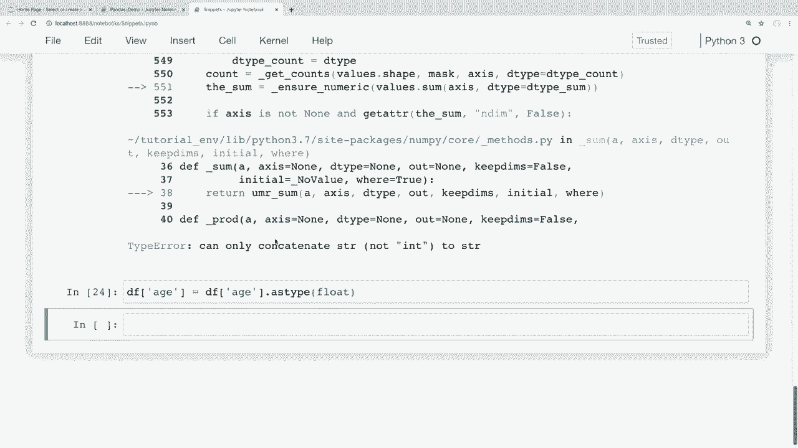
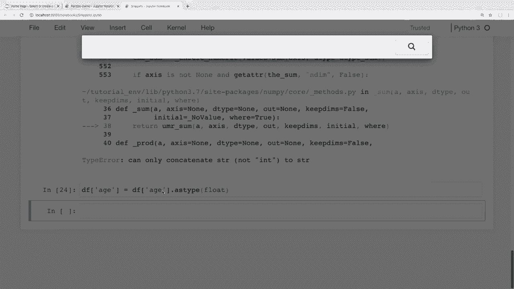
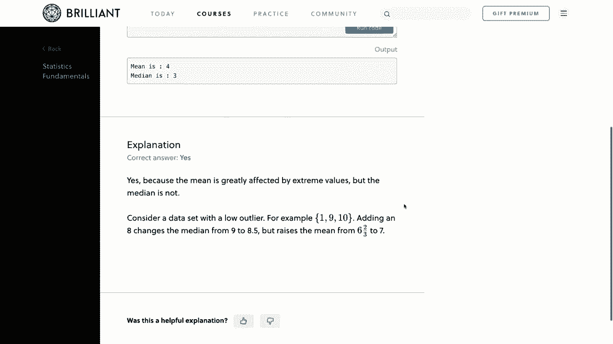
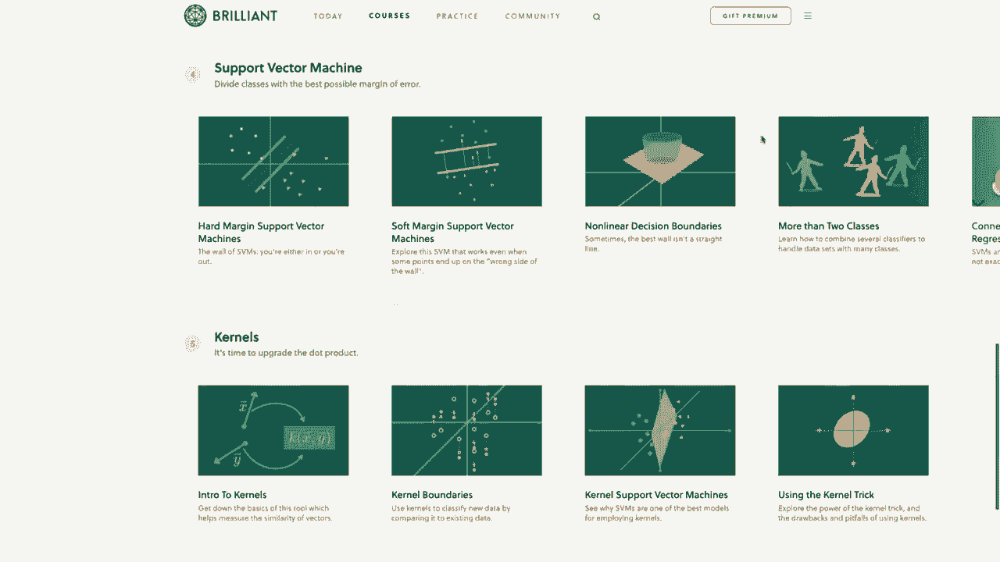
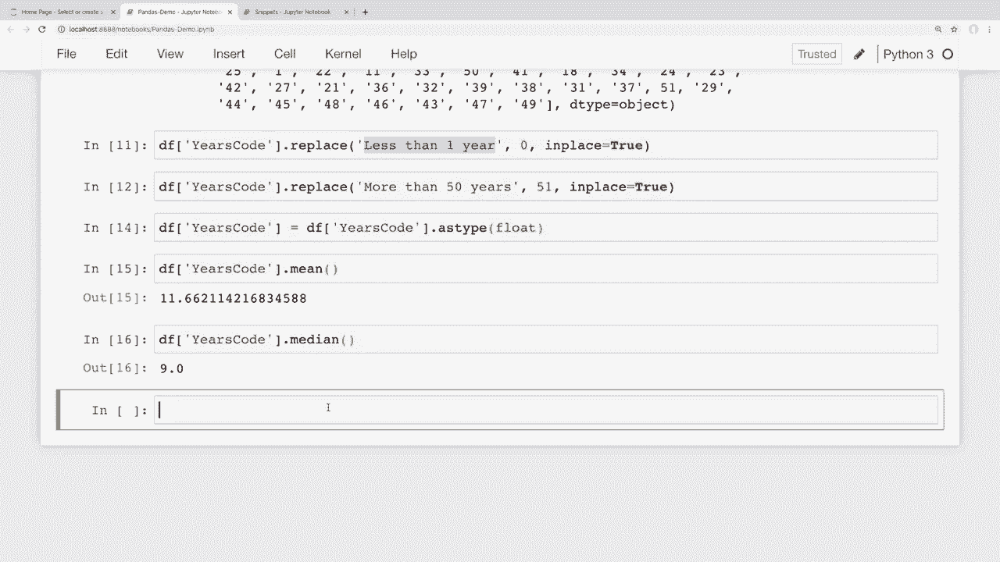

# 【双语字幕+资料下载】用 Pandas 进行数据处理与分析！真实数据&实时讲解，学完就能上手做数据分析了！＜实战教程系列＞ - P9：9）数据清洗 - 转换数据类型和处理缺失值 - ShowMeAI - BV1M64y187bz

Hey there。 How's it going， everybody。 In this video。

 we're gonna be learning how to handle missing values and also how to clean up our data a bit。 Now。

 almost every data set that you're gonna to be working with is likely going to have some missing data or data that we'd like to clean up or convert to a different data type。

 So we'll learn how to do all of that here。 Now， towards the end of the video。

 We'll combine what we learned here to be able to look at our stack overflow survey data。

 And calculate the average years of experiences of developers who answered the survey。

 So be sure to stay around for that。 And it's going to be great practice for what we learned here。

 Now， I would like to mention that we do have a sponsor for this series of videos。

 And that is brilliant。 So I really want to thank brilliant for sponsoring the series。

 and it'll be great if you all can check them out using the link in the description section below and support the sponsors。

 And I'll talk more about their services in just a bit。 So with that said。

 let's go ahead and get started。 Okay， so first， let's talk about how to drop missing values。

 So I have my snippets file open here。 And we've seen this in previous videos。 And again。

 if anyone wants to follow along。😊，Then I'll have a link to all of these notebooks and the data in the description section below。

 And as we've seen in previous videos， we'll learn how to do some of this in our smaller snippets data frame first And then we'll see how to do some interesting stuff on our larger stack overflow data set to get this working on some real worldorld data。

 So for this video I've added some null values here into our snippets data frame that we didn't have before。

 So I added some extra first names here。 And we can see that I just have one that is a nu do N。

 which is a not a number value。 I also imported nu up here at the top。

 this one here is just a nuvalue。 And then I also have some custom missing values as well。

 This one is just a string of NA and this one is just a string of missing。

 So I have some Ns some nuns and stuff like that thrown throughout this data so that we have some missing values。

 So you're gonna to see this a lot that when we work with pandas。😊。

We're going to have some missing data And depending on what it is you're trying to do。

 you might want to handle this in different ways。 So one thing you might want to do with missing data is to simply remove it。

 So for our small data frame here。 let's say that we're going to do some analysis with these people in the data frame。

 but if they don't have their first name last name and email address then we can't do what we're trying to do So we'll just remove the rows that don't have those values。

 So in order to do this， we can use the drop in a method。

 So let's do this and then I'll explain the results and go over those So all I'm going to do down here with my data frame is I'm gonna to say Df drop in a and we're gonna to run that without any arguments right now So when we run this we can see that now we only get four rows of data here And up here we had let's see45。

67。 So we got these four rows here because they didn't have any missing values。

 Now we do still have our bottom row here。Which has some of our custom missing values。

 But we'll see how to deal with these in just a second。 But for now。

 let's go over what drop in a is actually doing here。 Now。

 what's going on in the background is that drop in a is using some default arguments。

 So I'm going to manually fill in these default arguments。

 And it might make more sense why we got this specific results。 So by default。

 I'll leave that one here。 And now I'm going to fill in drop in a again。

 but I'm going to put the default arguments that it already has。

 and the default arguments of what this is doing in the background is it has an axis set to index。

 and it has a how variable set to any。 So since this is what the method was using by default anyway。

 we should go ahead and get the same results here and we can see that we do。

 we get the same results as we did when we ran this up here。

 But now let me actually explain these arguments here。 So first， we have the axis arguments。

 So this can either be set to index。Were set to columns。

 That is going to tell pandas that we want to drop in values when our rows are missing values when it's set here to index。

 If we set this to columns， then it would instead drop columns if they had missing values。

 And we'll look at that in just a second。 Now， the second argument here is how we want to drop these。

 or I guess a better way to frame that is this is the criteria that it uses for dropping a row or a column。

 So by default， this is set to any。 So we're looking over our rows since this is set to index。

 And this is set to any here。 So it will drop rows with any missing values。

 But this might not be what you want。 Maybe with this kind of an analysis that we're doing。

 It's okay to have you know missing email or last name or something like that。

 But there just has to be something。 It can't just be an entire row of missing values。

 So if that's the case， then we can instead change this， how argument to。All。

And this will then only drop rows when all of the values in that row are missing。

 So now if I run this， then we can see that now we get back more rows than we did before。

 because it kept the rows that had some missing values。 but not all missing values。

 So we can see here we have an email missing， but there were some other columns filled in。

 and we can see that everything was missing here， but they did have an email。

 So all of the values have to be missing in order for this to actually drop those。

 So it looks like we are missing index of four。 if I go up to a my original data frame here。

 we can see that that index had all missing values there。 Okay。

 now if I instead change this axis to columns instead of index。

 then it will drop columns that have all missing values。

 we don't have any columns that have missing values all the way down。

 So it should just return our original data frame。 So if I say columns here and run this。

 Then we can see。That's what we get because none of these columns have missing values all the way down Now。

 if I set this back to the default and drop columns with any missing values。

 then we'll actually get an empty data frame returned because we have one row that is completely empty that we saw here this index of four So for that row each column is going to have at least one missing value and if we set this to any then any column which is even a single missing value will be dropped which in this case is all of them So if I change this to any then since we have all missing values in one of these rows that's just going to give us an empty data frame now at this point you might be wondering okay well my data is a bit more complicated than this and I'm doing some of analysis where I want to drop some missing values but I only want to drop rows that are missing values in a specific column so for example。

Let's say that we're doing some analysis on our data and it's fine if they don't have a first name or a last name。

 but we really need the email address and if they don't have an email address。

 then we need to just drop those rows。 So in order to do this we can pass in a subset argument。

 So first I'm going to set our our access here back to index so that we're dropping rows and now we want to pass in a subset argument and this subset will be the column names that we're checking for missing values。

 So in this case it's just going to be a single column So I'm going to say subset is equal to and I'm still going to pass in a list even though this is just a single column and I'll say email So if I run this then we can see that the data frame that we get back is full of rows that have at least their email address filled in and again this one down here with these in values that is our custom missing values and I'll show you how to treat those。

Mising values in just a bit。 Now， in this case here。

 since we're only passing in a single column for our subset。

 our how argument here isn't really doing much because it's only going to look at the email address for missing values。

 So if an email address isn't filled in then passing in either any or all for our argument here would trigger that row to be removed So even if I put this as all it should give us the same results because we're only checking one value。

 but we can also pass in multiple columns to our subset。 So what if we said， okay， well。

 in order for my data to be useful I need either their last name or their email address。

 but I don't need both。 So in order to do this we could just say okay they need all of the。

Values in last name and an email。 or I'm sorry there that I got that reversed。

 they don't need their last name in the email。 It just can't be that all of those values are missing。

 So as long as the last name or the email is there。 Then it shouldn't drop those rows。

 So if I run this。 Then we can see that we get some values that don't have an email。

 but they did have a last name。 And also we would get back some values that didn't have a last name。

 but do have an email just like this a nonin spun here， it has an email。

 but it doesn't have a last name。 And again， that's because we passed in all for our how argument。

 which means for a row to be dropped， both of the subset columns needed to be missing。 Now。

 like we've seen in previous videos， This isn't permanently changing our data frame values。

 If we want to permanently change our data frame， then we'd have to add the inplace argument and set that equal to true here within this method。

 But we've seen that a bunch throughout the series so far。I don't think I'll go over that again here。

 Okay， so now let's get to these custom missing values。

 We can see down here that we have a row here that has some customized missing values。 So。

 for example， maybe the people who got our data from I didn't know what to do with missing values。

 So instead， they just passed in a string of N or they passed in you know a string of missing like we have here。

 So how would we actually handle these。 Well， it depends on how we load in our data。 In this case。

 we've created our data frame from scratch by creating a dictionary and then creating our data frame here。

 So what we can do here is just simply replace those values with an NN value。 Now。

 if we instead loaded in our data from a CV file。 then we could do something different。 But first。

 I'll show this and then we'll take a look at the CV file later whenever I go over to the stack overflow data。

 So right here at the top where we created our data frame。 I'm going to replace these values。

With a proper nuy NAN value。 So to do this'm just going to go a couple lines down here and we've seen this in previous videos。

 but we can use this replace here and I'm replacing all the values in the entire data frame。

 So anytime we see a string of NA I'm going to replace that with nuy NA and again I am importing nuy up here asmp。

 so that's where I'm getting I'm able to use nuy and then I want to say in place equal to true because we actually want to modify that data frame so if I run that then that would replace those values but I'm also going to place replace this string of missing as well withmp do NAN values and I want to do that in place as well。

 So let's go ahead and run this that should replace those values。

 And now if I look at our data frame here。 then we can see that we no longer have。

That string of missing or N。 these are now all N N values。

 And now if we go back through and we run ourselves where we dropped N values。

 then these custom values should have been replaced and it should treat those as missing values。

 So right here we can see what our previous result was where we got this index of 6 with those custom values if I rerun this now。

 we can see that that's gone and the same with here if I rerun this， then that is gone as well。 Now。

 if you don't actually want to make any changes， and we just want to see if certain values would or wouldn't be treated as NA values。

 then we could just run the NA or is in a method and get a mask of values as to whether or not these classified as NA or not。

 So let me just show you what I mean here。 So I could say Df dot is NA And this is just going to give us a mask here of values that whether or not they are classified as an N values。

 so we can see。That our row4 here was all NA values and so same thing with our row6 and we can see some other missing values throughout here as well。

 Now sometimes especially when we're working with numerical data we might want to fill our NA values with a particular value Now I'm working with string data here but sometimes it make might make sense to fill your NA values with certain values with these as well。

 So for example， let's assume that we were calculating grades for assignments or something like that and you had some assignments that were NA because the student never turned in the assignment Well at that point you could just decide if you wanted to score all missing assignments as zeros so that you could probably calculate up the grades so to do something like this we can use the fill NA method so for example I could say something like this if I do a Df do fill NA and then pass in a value。

Just to show you exactly what this is doing， I'm going to fill all of our missing values with this capitalized missing string here。

 and if I run this， then we can see that all of those missing or all of those in values We're filled with this string capitalized as missing。

 Now， like I said before， I don't do this a lot with certain strings。

 I found this to be most useful for numerical data depending on how you're doing your calculations。

 but you might want to give in values a value of0 or negative1 or something like that。

 So if it would make sense with your data， and you had numerical data to replace your missing values with a0。

 then you can just run Df fill in0。 And if I go ahead and run this。

 then we can see that that works on our data frame as well。 And again。

 just like with our other methods。 if you want those changes to your data frame to be permanent and carry over into other cells。

 then simply just add that inplace argument and set that to true to。that change permanent。 Okay。

 so now let's look at another common thing that we're likely going to need to do with a lot of our data。

 And that is casting data types。 So I have another column in my snippets here that I didn't have in previous videos。

 And I have up here， if we look， this is this age column。

 So let's say that we wanted to get the average age of all the people in this sample data frame。

 Well， right now， these might look like numbers when we print them out in our data frame down here。

 these are actually strings。 And we can see this if we look at our data frame data types。

 So to do this， we can say Df do D types。 and that's not a method。 it's just an attribute。

 So if I run this here。 And we can see that it says all of these columns are objects。

 And when it says it's an object， it likely means it's a string or a mix of different things。

 So in the latest version of Python or pandas， I'm sorry， they actually updated it。

 so that there's actually a string data type。Now but I'll do a video on those pandas version updates at the end of this series since they actually released that updated version as I was writing this course。

 but don't worry， there's not a lot that's changed to where what you learn here will be outdated or anything like that it's still mostly the same but we can see here that our age column is a string because it's this object data type。

 So if we wanted the average age then it wouldn't work as it is now。

 So let's just see what this error looks like。 So I'm going to grab the mean of that age column and if I run this then we can see that right now we get an error and if I scroll down to see what this error was。

 it says can only concatenate STR not int to string Now that might not be the most easy to understand error right there but basically it's telling us that because that column is strings and not integers So we need to convert that column to numbers instead of a string。

Now there's a caveat when doing this。 and this might throw some people off。

 So when we have NAN values in a column that we're trying to convert the numbers。

 then you need to use the float data type。 And that's because the NN value is actually a float under the hood。

 let me go ahead and show this just to show you what this looks like。

 So I'm going to look up the type of N dot NA。 And we can see that that is a float。

 So if we try to convert this column to integers， then it's going to throw an error when it runs into those NAN values because it can't convert those。

 So if I was to say Df and。Of age is equal to。 And now let's try to convert these to integers。

 So the way that you cast data types here is we can just say， okay， I want the age column as type。

 and now we want to pass in the type that we want。 If I tried to convert these to integers。

 Then this is going to give us an error。 because we have some N in values， So we can see here。

 int argument must be a string not none type。 So when you're trying to convert these the numbers and you have those Nn values。

 you basically have two options here。 If your column didn't have any missing values。

 then this would just work fine。 We wouldn't even run into this error。

 But if it does have missing values。 Then you can either convert those missing values to something else like a0 using the feel N method that we saw before。

 or you can just cast that column to a float instead。 Now。

 I think this would be a bad idea to convert those missing values to a0 or some other number。

Because we're trying to compute the average in this case。 But depending on your data。

 that might be what you want to do。 But I'm going to go ahead and just convert these to floats。

 So those naN values stay missing values。 So instead of an nt here。

 I'm just going to convert this to a float。 And if I run this， then that seem to have worked。

 So now we can look at the data types again。 So I'll say Df whoops。

 sorry I wouldn't typing in that cell。 I can say Df do D types。 And if we look at this。

 then we can see that now our age is a float object here。

 So now let's see what happens when we try to take the average of that column。

 So I'll say Df do mean。 And if I run that， then we can see that we get the average value for those ages。

 Now if you have an entire data frame of numbers or something like that that you're trying to convert all at once。

 then the data frame object has an as type method as well。 So you could just say Df do as type。

Then passs in whatever data type you're trying to cast everything to and just convert everything in the data frame at once。

 But we have some mixed columns here。 so we don't want to do that。

 Okay so we've been looking at our small data set right now to test this stuff out。

 But now let's take what we learned here and learn how this applies to real worldorld data and do some analysis on our stack overflow survey data so first of all。

 I mentioned earlier that if we had custom values for missing data then it's a little bit easier to handle these when loading in a cv and what I'm talking about up here is up here at the top where we replaced these custom missing values let me show you how we would do this same thing but loading in a cv instead So I'm gonna switch over here to my stack overflow survey data。

 let me go ahead and rerun this just to make sure that all of this stuff is running so this notebook still running that's good and again this is。

Stack overflow data that we have been using throughout the series。 And if you'd like to follow along。

 then I do have a download link for this in the description section below。 Okay。

 so if I wanted to ignore those custom values when loading in a CSV。

 then we can simply pass in an argument of a list of values that we want to be treated as missing。

 So here's how we would do this。 if we had some custom missing values here in this CSB file。

 then I could simply create a list here of those missing values and。I will just call this in a vows。

 And now I'll pass in a list of those。 So let's say that we have some values that are a string of N a and a string of missing。

 So now what we could do here is just add in an argument and say in a values is equal to。

 and then that list that we just created。 And if we run that， then we shouldn't get any errors。

 And when it reads in that CV， then it will treat that list of values。

 as missing values and give them an in a in result。 Now， in this survey here。

 they did a good job of not having any weird occurrences like that。

 So that actually shouldn't change anything。 Okay， so now let's look at an interesting problem with casting some values。

 So let's say that for the developers who answered this survey。

 we wanted to calculate the average number of years of coding experience among all of them。

 Now that might be a good thing to know to compare your experience against the average。

But let's look at what this or why this might be difficult to calculate with this data set。

 and us calculating this solution is actually going to apply several concepts that we've learned so far throughout this series。

 So the column to view the answer for this question in the survey is called years code。

 So let's look at some of these answers。 So I'm just going to look at the top 10 answers for years code。

So I will do a dot head。 and let's look at the top 10。 So if I run this。 then at first glance。

 this doesn't really look like it'll be a problem。 We just have a bunch of integers and the number of years that different respondents have been coding。

 So you might think that we can just grab the mean of this column simply by saying， okay。

 if we just have a bunch of integers here and some Nn values， that's fine。

 let's just grab the mean of that column。 But if I run this， then we get an error。

 And if I scroll down here。 Then it says can only concatenate string to string。

 And we saw the same error in our smaller data set where the column was actually being loaded in as a string instead of numerical data。

 And we should know how to handle this by now， since we did it in the smaller data set。

 So let's try that。 So let's try to convert this to floats and then take the average。

 So let me go back up here to the top where we。😊，And instead of running the mean here。

 I'm going to say， okay， well， let's convert this to a float so that we can grab that average。

 So I will say as type。And we want to convert this to a float since there are N N values。

 So if I run this。 then we still get an error。 So we didn't get an error in our smaller data set here。

 So if I scroll down， then it says could not convert string to float。

 And the string that it couldn't convert was less than one year。

 So this might be something that we didn't expect here。 So obviously。

 we don't just have numbers and N N values in this column。

 There is actually a string value that respondents could select that is equal to this string of less than one year for coding experience。

 So let's look at all the unique values of of this column so that we can see exactly what's in here in case there are more strings like this。

 And I don't believe we've actually seen this in the series yet。 maybe we have。

 I can't really remember。 But if we want to view unique values of a series。

 then we can simply use the unique method。 So we could also use the value counts method that we've seen several times before。

If we want to count all the unique values， but we don't really want to count them。

 we just want to see all the unique values in this column。 So to do this， I'm going to say。

DF and then access that years code column dot unique。Dot unique。 That is a method。 So if I run this。

 whoops， and I spelled this wrong。 Sorry having a hard time typing today。 Okay， so if I run this。

 then this gives us all of the unique values of that column。 And as we'd expect。

 there are a lot of numbers。 But we see that we also have some strings that are mixed throughout these numbers。

 Now we also have in A N values here。 but we're not going to worry about those。

 we just want to ignore the N A N values， because that's just people who didn't answer the question。

 But we can see that the strings that we have throughout here are less than one year。

 and more than 50 years of coding experience。 Okay， so those are our only string values。

 So I'm going to replace those with numbers so that we can get an idea of the average years。

 people have been coding。 So let's go ahead and replace less than one year here with a0 since that's basically the same thing。

 If somebody has been coding for less than a year than they've been coding for。Basically zero years。

 so to do this。I can say D F dot years code and access that column。 and then we can just replace。

That value of less than one year。And let's replace that with a0。

 And we also want these to be in place equal to true because we actually want to modify that data frame。

 So if I run that， then it should make that replacement。

 And now I'm also going to replace the value for more than 50 years here。

 And this is going to rescue skew our results a bit， depending on how we want to do this。

 I'm simply going to replace this with the value of 51。

 there may be some people who have several more more years of coding experience than 51 years。

 But I can't imagine that would be that many people who have， you know。

 coded many years greater than 50。 So I'm going to just going to fill this in with 51。

 But like I said， depending on what we pick here， it could affect our results slightly。

 but not by a lot in this case。 So I'm just going to grab this same replace value here。 And instead。

 I want to replace more than 50 years。And I'm going to replace that with a value of 51。 So now。

 let me go ahead and run this。 And if we want to look at these unique values again。

 then we could look at these。 And now it doesn't look like we have any strings in here。

 But we can see here that this is still a D type of object。

 which means that it's not actually reading this in as floats。 So if we scroll back up here a bit。

 Oh， actually， I think I。Overwrote that line。 Yes， I did。 So let's just try that again， so。

What I want to do here is I want to convert this to a float。

 And this is what gave us an error before because we had these strings in here。

 and it didn't know how to convert these to a float。 But now we should just be able to see say， okay。

 I want to convert that。 as type set that to a float。 So let's run that。

 And we didn't get an error this time。 So that's good。

 And now we should be able to view the average numbers of or average number of years of coding experience of the developers who filled out this survey。

 So to do this。 I'm just going to say， okay， D F data frame。

Access that column and grab the mean of that column。 So if I run this。

 then we can see that now we get that average back。

 So the average that we got here was about 11 and a half years of coding experience。

 as the average years for developers who answered this survey。

 And now you can do other analysis on this as well。 So， for example， if we wanted to see the median。

 Then I could run that。 And the median comes back as nine years of coding experience。

 So hopefully that real world example helped explain why it's important to know how to cast these values and understand what's going on there。

 there's always going to be data that is messy or not in the format that we wanted in。

 So knowing how to handle these missing values and cast these values to different data types is really going to be essential when working with pandas。

 Okay， so before we end here， I'd like to thank the sponsor of this video and mention why I really enjoy their tutorials。

 And that is brilliant。 So in this series， we've been learning about pandas and how to。😊。

Analyze data in Python and brilliant would be an excellent way to supplement what you learn here with their handson courses。

 They have some excellent courses and lessons that do a deep dive on how to think about and analyze data correctly。

 for data analysis fundamentals。 I would really recommend checking out their statistics course。

 which shows you how to analyze graphs and determine significance in the data。

 And I would also recommend their machine learning course which takes data analysis to a new level while you' about the techniques being used that allow machines to make decisions where there's just too many variables for a human to consider。

 So to support my channel and learn more about brilliant。

 you can go to brilliant org to sign up for free。 And also the first 200 people that go to that link will get 20% off the annual premium subscription。

 and you can find that link in the description section below。 again。

 that's brilliant org for so I think that's going to do it for this pandas video I hope you feel like you got a good idea for how to handle these missing values and cast our data to different。

😊。

Data typess so that we can do exactly what we want to do in terms of analyzing our data。 Now。

 in the next video， we're gonna to be learning how to work with dates and time series data。

 Now I've been using the stack overflow survey data for this entire series because I love being able to show you all realword examples of how these concepts apply。

 But our stack overflow survey data doesn't have any time series data that we can actually work with。

 So I'm gonna to be using a different data set for the next video。

 and I still haven't narrowed down exactly what I'll be using。

 but I'll be sure that it allows us to do some analysis on some real worldor data like we've been doing。

 So maybe we'll use time series data to analyze cryptocurrency rates over time or something like that。

 But if anyone has any questions about what be covered in this video then feel free to ask in the comment section below and I'll do my best to answer those。

 And if you enjoy these tutorials and would like to support them。

 then there are sub ways you can do that。 The easiest ways to simply like the video and give it a thumbs up。

 and also it's a huge。😊，To share these videos with anyone who you think would find them useful。

 And if you have the means， you can contribute through Patreon。

 And there's a link to that page and in the description section below。

 Be sure to subscribe for future videos。 And thank you all for watching。😊。

