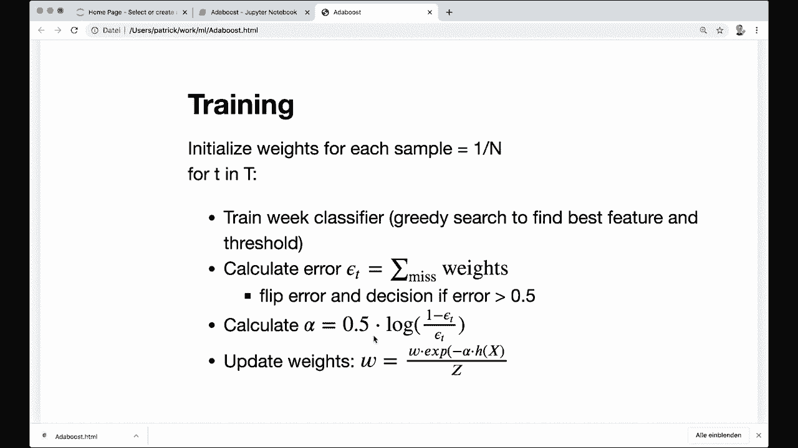
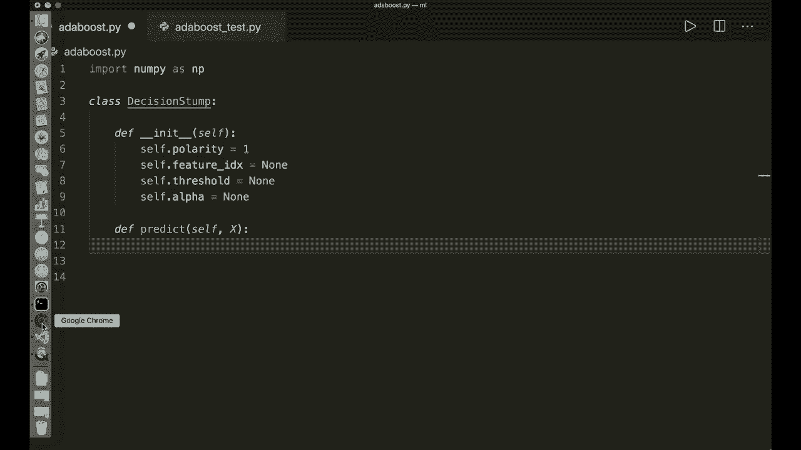
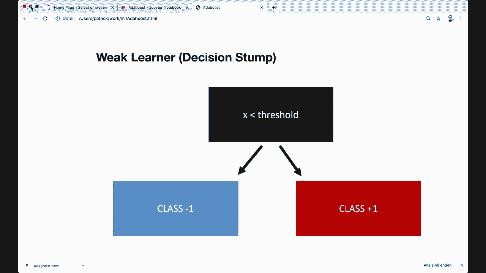
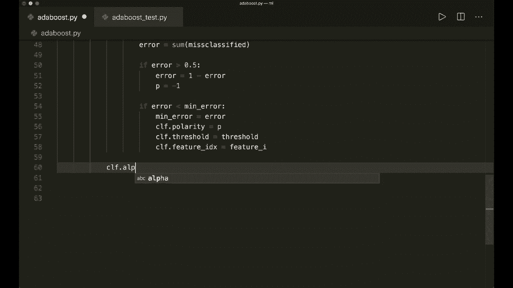
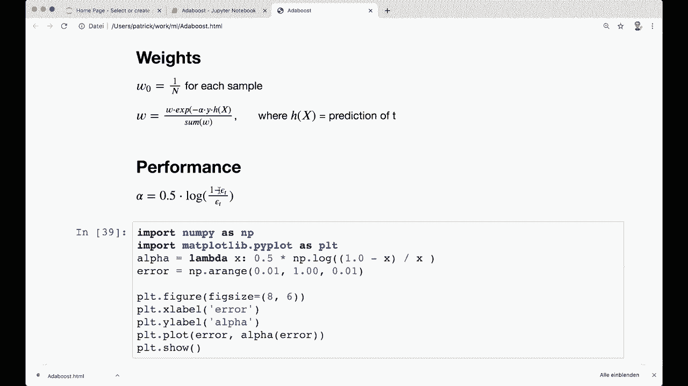
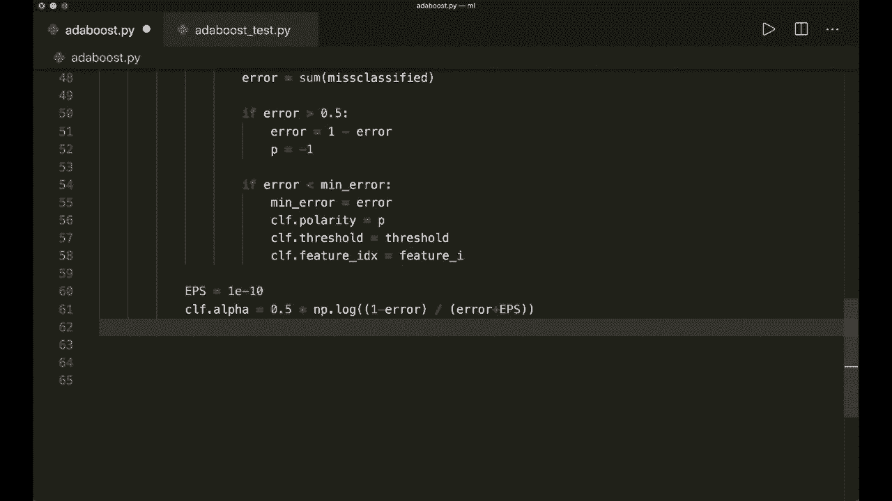
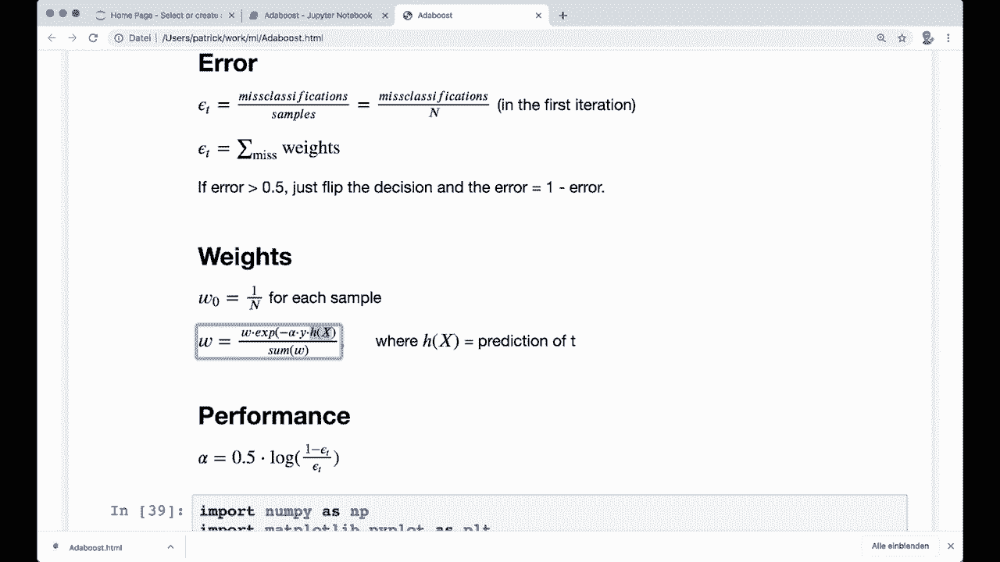
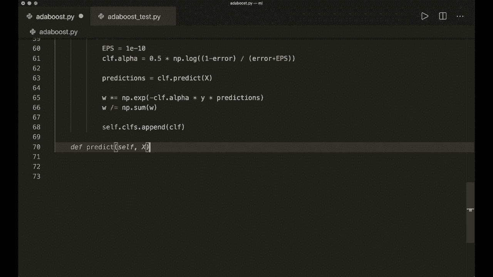
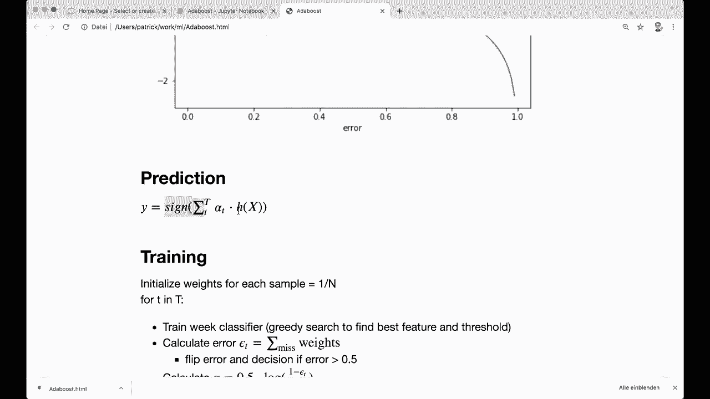

# 【双语字幕+资料下载】用 Python 和 Numpy 实现最热门的12个机器学习算法，彻底搞清楚它们的工作原理！＜实战教程系列＞ - P14：L14- AdaBoost - ShowMeAI - BV1wS4y1f7z1

Hey， guys， welcome to another machine learning from Sc tutorial。 Today。

 we are going to implement the addda boost algorithm using only Nmpy and built in Python modules。😊。

A a boost uses the boosting approach， which follows the simple idea to combine multiple weak classifier into one strong classifier。

 And this approach works really well in practice。 So let's start with a theory before we jump to the code。

 So let's have a look at this 2 D example here to understand the concept。

 So here we have our samples with only two different features on the X axis and on the Y axis。

 And now the first classifier makes a split based on the Y axis in this example。

 So it draws a horizontal decision line at some threshold。 So the dashed line that we can see here。😊。

And we can see that some predictions are correct， but we also have misclassifications。

 And now with these misclassifications， we can then calculate a performance measure。

 So the accuracy for this classifier。 And with this measure。

 we calculate and update weights for all training samples。 And now the second classifier comes in。

 and it uses these weights and finds a different and possibly better decision boundary。

 So the second classifier in this example here chooses a feature on the x axis and draws a vertical line。

 And then again， we calculate the performance and update the weights。

 And then we repeat the step for as many classifiers as we want。😊，And then here at the very end。

 we have all the different decision lines， and we also have all the different classifier performances。

 and then we combine all our classifiers so we can make a weighted sum with the calculated performances。

 And this allows us to draw the perfect decision line that we can see here。

 which can be more complex than a simple linear decision line。😊。

And the idea with the way that some here he at the end means that the better the classifier is the more impact it has for the final outcome。

 So this is basically the concept。 And now let's look at all the different steps and also the math behind this in detail。

So the first thing that we need is a weak classifier。 and this is also called weak learner。

So a weak learner is always a very simple classifier。 And in the case of the addda boost。

 we use a so called decision stamp for this。 So a decision stamp is basically a decision tree with only one split。

 So what we can see here。 So we look at only one feature of our samples and only at one threshold。

 And then based on if our feature value is greater or smaller than the threshold。

 We say that it is class -1 or class plus one。😊，So this is the decision stump。

 And then we need the formula for the error。 So the first time。

 the very first time during our iteration， the error is calculated as the number of misclassifications divided by the total number of samples。

 And this is the natural approach for the error。 So if we have a look at our example again。

 Then we can see that we have 10 samples in this case。 and in the first in the first classifier。

 we have three misclassifications。 So this means that our error rate is 0。3 or 30%。

So this is the first time。 But the next time we also want to take into account the weights。

 So if a sample was mis misclassified， we give it a higher weight for the next iteration。

 And this means that our formula is then calculated。

As the sum over the weights for all misclassifications。 And if our error is greater than 05。

 we simply flip the error。 So we flip all decision， all decisions， and we also flip our error。

 So it is then1 minus the error。So this is the error。 and now we need the weights。

 So the weights are initially set to one over n for each sample。

 And this also matches the error calculation in the first step。

 So if we say we calculate the error as the sum over all misclassified weights。

 and we also say that each weight is one over n in the beginning。

 then it is equal to the number of misclassifications divided by the number of samples like here。So。

 yeah， that's why the initial weights are one over n for each sample。

And then we also need the update rule that is defined here。

 So we have the old weight times the exponential function of minus alpha times the actual y times h of x。

 where h of x is our prediction。And alpha is the accuracy of the classifier。 So if this is-1。

 we have a misclassification。 and if this is plus one here， then we have a correct classification。

 and this whole formula basically makes sure that misclassified samples have a higher impact for the next classifier。

So yeah， this is what you should remember from the weights。And now the performance。

 So we need to calculate the performance or alpha for each classifier， and we can do this。

 and we need this for the final prediction then， and the formula for the performance is calculated as this。

 So it's 0。5 times the lock of one minus the error divided by the error。

So let me make this a little bit larger for you。So this is the performance。

And our error is always between 0 and1。 So I plotted alpha for different errors in this range here。

 And we can see that it is equally distributed somewhere between a positive value here and a negative value here。

So with a low error， we have a high positive value， and with a high error here close to one。

 we have a high negative value。 So since we are flipping the decision then this will then be correct classifications again with a high contribution to the negative side。

 So the side here， where the class is  -1。 So this is the concept of the alpha。

 And now we need the prediction So now if if we have understood all of this。

 then the final prediction is very easy to understand。 So we just choose the sign here。

 the sign of the sum over all predictions where we weigh each prediction with the performance of the classifier。

 So alpha times the prediction here。So the better our classifier。

 the more impact it has for the final prediction。And the better the classifier。

 the more it points into the negative or positive side。

 And then we take the better side as prediction for our class。 So， yeah。

 that's the concept of the prediction。And it can be a bit confusing with the different formulas and the side flipping。

 but the basic concept is not so difficult。 And let's summarize all the different training steps that we must do in the code。

 So， first of all， we initialize， initialize over weights for each sample and set the value to one over N。

 Then we choose the number of weak learners we want。 And then we iterate over this。

 And then we train each decision stampump。 So we do a greedy search to find the best split feature and the best split threshold。

Then we calculate the error for this decision stump。 So this is with the formula。

 the sum over the misclassified weights。 Then we also flip the error and the decision if it is greater than 05。

Then we calculate the alpha with the formula。And then we need the predictions。

 And then with the predictions and the alpha， we can then calculate。 We can then update the weights。

So this is what we must do in the code now。 And yeah。

 I promise you that since now that we have all the formulas and all the training steps here。

 the implementation is pretty straightforward and should not be so hard。 So let's jump to the code。

So the first thing we do is import Ny。 So import Ny S and P。

 And this is the only module that we're gonna to need。

And now we create a class for the decision stampump。 So class decision stampump。

And this gets an in it。 So define an in it。 And this only has self。

 And here we want to store a couple of things。 So the first thing that we want to store is the so called polarity。

 So self dot polarity equals one。 And this tells us if the sample should be classified or as-1 or plus one for the given threshold。

 So if we want to look at the right or the left side。

 And this is needed because if we want to flip the error， then we also must flip the polarity。

 So this gets clearer in a second。And now the second thing that we want to store here is the feature index。

 So self dot feature index equals none in the beginning。 And we also want to store the threshold。

 So the split threshold self dot threshold equals none in the beginning。

 And we also want to store the variable for the performance。 So the alpha。

So we say self dot alpha equals none。 So this is the things that we want to store。

 And then we also define a predict method for the decision stampump。

 So we say define predict and it gets self and it gets x。 So the samples that it should predict。

 And now what we want to do here is， simply look at only one feature of this sample and then compare it with the threshold and say if it's smaller than it's  minus-1 and otherwise it's plus one。

 So that's the whole concept of the decision stampump。 So let's do this。

 So let's say the number of samples equals X dot shape0。 and then let's get only this feature。

 So let's say x column equals x。

And then we can use a colon。 so we still want all the samples。

 but only this feature index that we calculate later during the training。 So self dot feature index。

 and now we make our predictions。 So we say predictions equals。 and by default， we say this is one。

 So let's say nuy ones with the size of the number of samples。 And then we must check the polarity。

 So we say if self dot polarity equals equals one。 So this is the default case。

 then we say that all the predictions that are smaller where the feature vector is smaller than the threshold than it's minus-1。

So， let's say， predictions。And then at these indexes。

 where x column is smaller than self dot threshold Then these predictions are -1。

 And in the other case， else。 So if our polarity is -1。

 then we want to do it exactly the other way around。 So let me copy this。

 But we want to say if the x value is greater than our threshold。 then these are the -1 predictions。

So， yeah， this is the all that our the decision stump is doing。

 and then we can return the predictions。So this is the class for the decision decision stamp。

 And now we need a class for the actual add boost algorithm。 So let's say class add boost。

And let's make this a small letter。 And now we need a in it first。 So define a in it。

 And this gets self。 and the only parameter it gets is the number of classifiers that we want。

 So let's say N C， L F equals5 by default。 And then in the in it， we store this number。

 So we say self dot N C， L F equals the number of classifier。 And then as always。

 we want to implement the fit and the predict method。 So let's start with the fit method。

 So let's say define fit。 and it has self and it has X and y。 So the training samples and the labels。

And now， the first thing we do is to get the shape of this vector。

 So the number of samples and also the number of features。Features equals x dot shape。

And then we want to in， initialize our weights。 So in it the weights。 And as I said。

 all the weights for each sample is set to one over n in the beginning。 So let's say w equals nuy。

 And then we can use a a method from numpy that is called full。 So nuumpy full。

 and it gets the size number of samples。 And then it gets an initial value。 And here we say one。

Over the number of samples。 So this sets each value to this calculated value。And then。

 this is our initialization。 And now let's iterate through all the classifiers and do the training。

 So first， we create a list where we want to store all the classifiers。 So let's say self dot C。

 L F's。😊，诶。And this is an empty list in the beginning。 And now let's do the iteration。

 So let's say4 underscore in range。 And here we have the number of classifiers that we specify。

 So self dot N， C， L， F。And now what we want to do here is we want to do the greedy search。

 So we want to iterate over all the features and all the threshold。

 So this is similar to the decision tree implementation that I did in another tutorial。

 And I recommend that you check that out， too。 So we want to do a similar thing here。 So。First。

 we create our classifier。 So let's say C LF equals decision stump。

 And now let's define a min error in the beginning。 So we want to find the best feature value。

 the split feature and the split threshold where this error then is minimum。 So in the beginning。

 we just say this is float。In， so this is a very high number。

 And now let's iterate over all the features。 So let's say for feature。For feature。

 I in the range of。And here we have the number of features that we got in the beginning。

And then we want to get only this feature。 So let's say X column。

 So this is similar to what we did here。So we can do the same thing and say x column。Equals this。

 So all the samples， but only this feature index。 So I call it feature I， in this case。

And then we get one to get only the unique values。 And these are our thresholds。

 So let's say thresholds equals Nai dot unique。And here， the unique values of our column。

 So x column。 And now we iterate over all the thresholds。 So let's say for threshold in。Thresholds。

And now what we want to do is we want to predict with the polarity 1 first and then calculate the error with the formulas that I showed you in the beginning。

 So let's say our polarity equals  one。 And then let's do the predictions。 So predictions equals。

 And this is similar to what we did here。 So in the beginning， just， it's just one。

And then we use this formula here。 So since our polarity is  one。

 we have to compare it by saying if it's smaller than our threshold。

 So predictions where our column value， our feature value is smaller than our threshold than there our predictions are -1。

So now we predicted all the samples and now we want to calculate the error and as I said。

 the error is the sum over the weights of the misclassified samples。

 So let's get the misclassified weight。 So let's say misclassified equals W and the w where our y our training labels is not equal to the predictions that we just did。

So these are the misclassified weights。 And now we want to simply calculate this sum over these weights。

 So arrow。Eror equals the sum over this misclassified weight。 So this is the error。

 And now we also want to flip our error If it is greater than 05。

 So we say if error is greater than 05。 We simply say that our new error equals 1 the error and then we also flip the polarity。

 So we say P equals-1。So now we have our error and now we check if our error is smaller than the min error。

 So let's say if error is smaller than the min error。Then this is our new min era。

 So we say min error equals error。 And now this is the best current fit for our decision stamp。

 So we want to store this。 So we say CF dot polarity equals P and sorry， only P。

 and we also want to store the threshold and the feature。

 So CF dot threshold equals the current threshold and C F dot feature index equals feature I。

And yeah， so this is the whole training loop for a classifier。

And now when we are done with post four loops， what we want to do here is have to check if I'm on the right indent。

So now what we have to do is to calculate the performance。 so calculate alpha。

 So we say and CF dot alpha equals。 and then we need this formula here。

So 05 times the lock of1 minus the error divided by the error。

And we also use a little epsilon so that we don't divide by 0。

 So let's say Es equals this small value。嗯。And this is our epsilon。 And now let's use the formula。

 So 05 times and nuy dot the lock。And here we have one minus the error。And then divide by here。

 let's say error plus our epsilon。 And let's wrap this in another parenthses。 So this one。

And let me check if this is correct。 So let's do another one around this one here。And then。

 this should be fine。So this is our alpha。 And now we want to update the weights。 And for this。

 we also need the prediction。 So let's check the formula formula again。

 So this is the old weight times the exponential function of minus the alpha that we just calculated times the actual predictions or the actual labels times the predictions。

 And then we normalize it。 So this is the formula that we need。 So let's write this here。

 And let's first get the predictions。 So we can say predictions equals。

 and we already implemented this so we can simply say CF dot prediction。

X。X， yeah。 So we get the column up here。 so we can put the whole x here。

 And now we have the predictions， and now we can use them and update the weights。

 So we say our weights is multiplied equals。 And then we say nuy X。 So the exponential function。

 And then minus C F dot alpha。Times， and here the actual labels。 and then times the predictions。

The times， predictions。So， and then we want to normalize it。

 So we divide it by the sum over this weight。 So we say w divided equals。

 And then here we say nuy dot sum W。And now we are done。 So we updated our weights。

 and then we want to store this classifier。 So we want to save it。 So we say self dot C， L。

 F dot append the current classifier。 So we append C， L F。And now we are done with the fit method。

 So this is the whole training of our add boost classifier。And。Now， what we also need is， of course。

 we want to have the predict method。 So let's implement this down here。 So let's say define， predict。

 and here it gets self and it also gets X。 And now this is the formula that I showed you here。

 So we look at the s of the sum。 And here we multiply each alpha with the with the prediction。 Yeah。

 So let's do this。

So let's say C， L F dot Prats equals。 And here we use list comprehension。

 And then we do this for each of the classifiers。 So we say C， L F dot alpha times。

 And here we use the predictions C， L F dot predict。 And here we want to predict X。

 And we want to do this for each of the start classifiers。 So we say for C， L F in self dot C， L Fs。

So these are all the predictions in the sum。 And now we need to calculate the sum。

 So we say y pre equals and then nuy dot sum。 And here we say C， L F pres and along the axis 0。

 So now we have the sum。 And now the very last thing that we need to do is to look at the s。

 So we say y pret equals nuy dot s sign of this， Y pret。And this is our final prediction。

 And then we can return this。 So let's return why pret。And now we should be done。

 So now we have the fit method and the predict method。

And now here I've already written a little test script。

 So here I import this class that we just created。 So from addda boost to import adddabu。

Then I also have a accuracy measure here。 And then in this example。

 we load the breast concert data set from the SQ learnide assets。

 and then the important thing that we must do here is to set all the labels that are 0 at the moment to-1 because add boost needs the labels as-1 and plus1。

 and then we do a train test split as always， And then here we create a add boost classifier。

 and in this case， I put in five classifier。 Then we call the fit method。

 and then we call the predict method and then we calculate the accuracy。So this is the test script。

 So let's run this and hope that everything's working。 So let's say Python a boost test。

 it's called and hit enter， and it's running， and it's calculating。And I hope that it's working。

 And now we are done。 So， yeah， so here we have a accuracy accuracy。

 and it's pretty good in this example。 So we have 094。 So we see that it's working。And yeah。

 I hope you enjoyed the tutorial and see you next time， bye。

