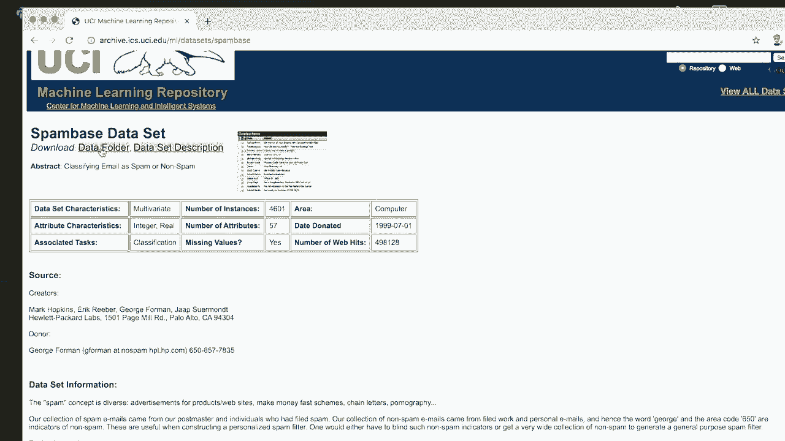
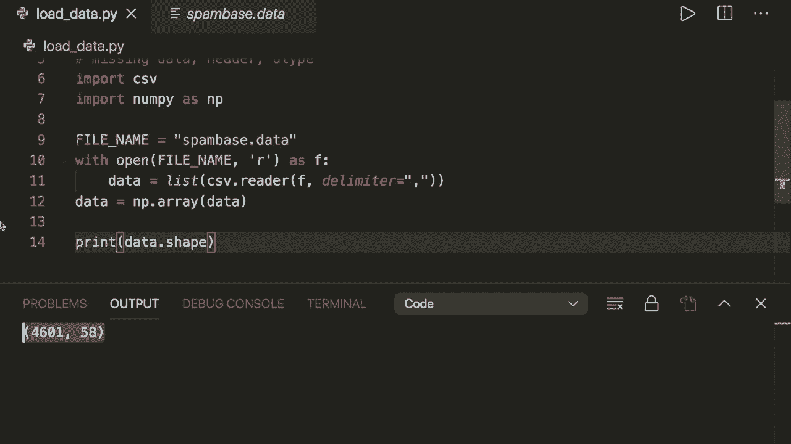
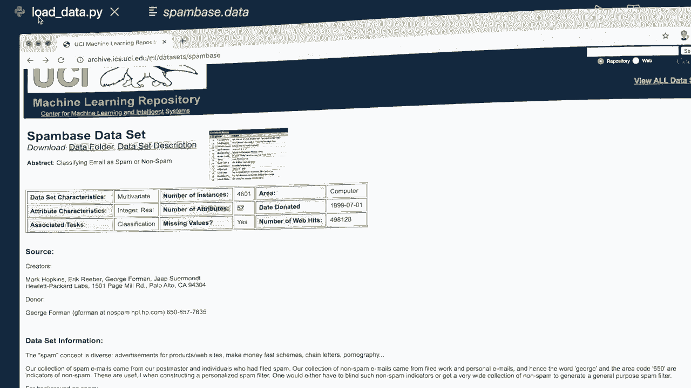

# 【双语字幕+资料下载】用 Python 和 Numpy 实现最热门的12个机器学习算法，彻底搞清楚它们的工作原理！＜实战教程系列＞ - P16：L16- 从 CSV 加载数据 - ShowMeAI - BV1wS4y1f7z1

Hey， guys， welcome to another machine learning tutorial。

 So in all my previous machine learning examples， I used available data directly from the S K learnn data sets module。

 And a lot of people have asked me how they should load their data if they have their own data sets。

 So today， I want to show you how you load the data from a file。 I will show you four different ways。

 one with pure Python 2 with Nmpy and one with the Panndas library。😊。

I will also show you what you should do with heatathers missing data and how to get the correct data type。

 so please make sure to watch all the way to the end。And now in this tutorial。

 I'm going to use the spam based dataset。 So if we Google this。

 then the first entry leads us to this side。 and this is a popular website to get machine learning data sets。

 And in this spam based data set。 We want to classify emails as spam or no spam。

 So we can then go to the download folder and load the spambased dot data。 And I already did this。

 So I have this here。 And this is in Csv format。 So comma separate values。

 And usually the ending here would be dot Csv。 but here it's dot data， which is fine， too。

 So let's start and let me show you how we can load this。

So first， let's load this with pure Python and the C SV modules so we can import C S V。

 This is already built in in Python。 Then let's specify our file name equals。

 So let's have a look at this again。 This is called spam basedase data。

So let's call this spam based dot data。 And now we say with open our file name in read mode S F。

 And then we say our data equals。 and then we can use the Csv module and call the reader。

 And here we have to give it our F and also the the limiter。

 So the values that separates all the data。 And in this case， it's a comma。

 And this will give us an iterator。 And then we can use the list method to convert this to a list。

And now we have the data in a list。 So let's convert this to a Nmpy array。

 So let's import Numpy S and P。 And then up down here。

 we say our data equals a nuy array from the data。 And then， for example。

 we can print the data dot shape。 So let's run this。 And then we see that it worked。

And if we have a look at the website。Then we can see here the number of samples is 4601。

 and the number of features is 57。 So here we have 4601 and58。 And this is because our。

Data holds both the features and the class label right now。 So now here in this case。

 the class label is the very last column。 So the next thing we want to do is to split our。

List here into features and class labels。 So for this， let's get the shape。

 So let's say number of samples and the number of features equals data dot shape。

 And then we use list slicing。 So first thing we want to do is to decrease this by one。

 So let's say number of features minus equals  one。 because we only have 57。

And then we use list slicing。 So we say x equals data， and then we say colons。

 So we want all the rows。 and for the columns， we want to start at column 0 and all the way to the number of features。

 and this this last column is excluded。 So this will only hold the features and for the y。

 this is data。 and again， we want all the rows。 but only the last column。So now we have split this。

 And now， for example， if we print x dot shape and y dot shape。 and if we run this。

 then we see that this worked。 And now we have it in the correct format。 for example。

 now we can put it。Or give it to our classifier for the fit method and start our training。

So this is the first way that I wanted to show you。 However。

 I would not recommend this because this is usually slower and also needs more code than the other methods。

 which I'm going to show you now。 But you should still know how to load a file manually。

So let's forget this now。 and let's delete this。 And now let me show you how we can do this in Nmpy。

 So in Numpy， we can do this with only one line。 so we can say data equals Numpy。

 and then we use a method that is called load T X T。

 and this also needs the file name and the delimiter equals a comma。 And this is all we need。

 So now if we run this。Then we see that it worked， too。 And this is much simpler and also faster。

So this is the first method that we can use with Nmpy。 However， there is an even better one。

 which I would recommend。 So this is data equals nuumpy。

 and the second method is called Cheen from T X T。 And this also needs the file name and the delimiter equals the comma。

 And now if you run this， then we see that this work too。 So this is my preferred method with nuumpy。

And it basically does the same as this one， but it offers a little bit more options for the parameters。

 For example， here， we can deal with missing data， which I want to show you in a second。So， yeah。

 so this is the function with numpy。 And now as a last thing。

 I want to show you how we can do this with pandaas。

 So if you're already familiar with pandaas and you can use this too。 And here we have a function。

That is called read CSV So we say data frame because in pandas we usually deal or call this data frame。

 and then we say PDd dot read underscore CSV and again our file name and we could also give it the delimiter equals the comma and。

Then we have it as a data frame。 And then what we can do is to convert this to a numpy。

 So we can say data equals data frame to nuy to。Num pi。

 And then we can do the same as we are doing here。 For example， we can split this into x and y。

 And now， if we run this。Then we see that this work two， but here we now have one row to less。

 and this is because here we have to be careful because pandas tries to read a header and in this case we don't have a header。

 so we have to say header equals none。And then if we load this。Then we see that it is correct again。

 So this is how we can use pandas。 Both are fine。 So I would recommend using this if you only want to use numpy。

 And if you are familiar with pandas， than I would use this one because this is even more options。

 and it's also a little bit faster。So， yeah。So that's how you can load this。

 And now let's talk about the data type， the header and missing data。

 So one thing that is good practice is to already specify the data type。 If you know it。 So。

 for example， here we can give the argument， data type equals， for example， nu load 32 and down here。

 we can do the same thing for the。For the pandas function。So now if we run this。

 then we see this word 2。 And， for example， we can print the type of data too。Then， we see。

Oh here we see it's only one Nmpy array。 Let's print the type of data。 Let's say0，0。

 Then we should see that， it is a Ny float 32， and it's good practice to always specify this if you know it。

 So if you know that data than put it here， because otherwise the function has to figure out the data type for itself。

 and this usually takes a little bit more time。 And it can also be wrong。And yeah。

 so some algorithms， some classifier expect this as float。

 or I think the most of them expect this as float。 So that's what I would recommend to do here。

If you don't put it in here and want to convert it later， by the way。

 then you can still do this by saying data equals nuy S array。 And then you put in the data。

 And then as data type data type equals and then here your float 32。Yeah。

 so that's what you can do with， with the data type。 And now let's talk about a header。

 So in this case， we don't have a header。 But let's say in our file， we have a header where we。

 for example， have the feature descriptions feature  one feature 2。And so on。 So during the loading。

 we don't want this， of course。 And then what we can do here is。 first of all。

 let's run this and see what happens。 And then we get an error because our functions cannot figure out the first row。

 So what we can do here is we can simply skip this。 So for the ch from text method。

 we need to say skip header。 And then the number of rows， we want to skip。 So in this case， it's one。

 And the same for the pandas function。 But here we have to be careful because here。

 the argument is called skip rows equals one。 And now if we run this。Then this worked again。 And we。

 again， have the correct shape， and it skipped the header。

So this is what you should do if you have a header here。 And now as a last thing。

 I want to talk about missing values。 So a lot of time， for example， there are missing values。

 for example， here， we just have a comma and then no entry。 and。So if you run this， then let's print。

For example， let's print。X， and then in the first。Row， let's print the feature 0 to 5。And down here。

 the same。 So now if you run this。 we see we have a N A N。 So this stands for not a number。

 And these functions can figure this out on their own。

 So if it is empty or I think if there is a dash or a N A N。

 So then they can automatically see that this is not a number。

 but sometimes you also have a string here， which doesn't make sense。And now， if I try to run this。

 then this should produce an error because it cannot figure out the string here。

 because you said all these should be floats。 So what you can then do here is we can specify additional missing values。

 by saying missing。Values。Equals， and then here you put in a list。 And here we can put in hello and。

For the pandas function， the argument is N A values。 And then here you have to put to use a list。

 So I recommend to check out the documentation whenever you need the arguments。

 you don't have to memorize this。So here we say hello。 and then it knows that it should ignore these。

 So now if you run this， then this worked again， and it filled these， the hello with not a number。

 And you could also specify what it should use instead。

 So here we can use the argument filling values equals。 And so you might want to set this to 0。

But so in this example， suggest that we can see it， I will set this to 9，9，9，9。 and as a float。

 And for the pandas function， what we can then do after loading is to call data frame and then set data frame fill N A。

 not the number to 9999。0。 And now， if we run this。

Then we see that here it replaced the not a number with 9，9，9，9。 And here I have to say， of course。

 data frame equals this new data frame。 And now， if I run this again。

Then we see that it worked too for the pans method。So this is how we can deal with missing numbers。

 So usually you want to say this to 0 and。Then you should be good to go。

 because a lot of errors that beginners see is because there are missing numbers。

 and then your algorithm crashes because it doesn't know how to deal with this。

 So always make sure that you deal with missing numbers。Then I recommend to specify the data type。

 And now you should also know how to deal with headers。And yeah。

 so these are the preferred two methods that you should know Thempy Chen from text method and the pandas Re CS SV method。

 So， yeah， that's all you need。 And I hope you enjoyed this tutorial。 If you like this。

 please subscribe to the channel and see you next time， bye。

