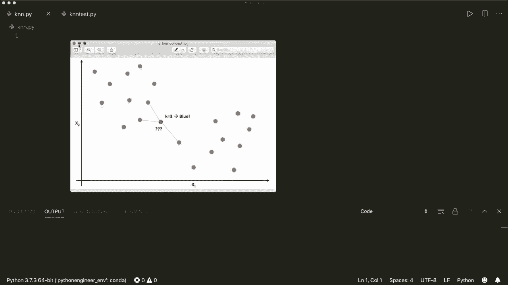
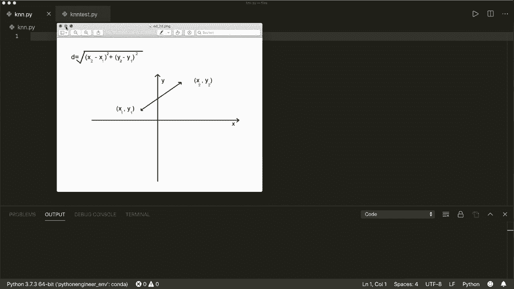
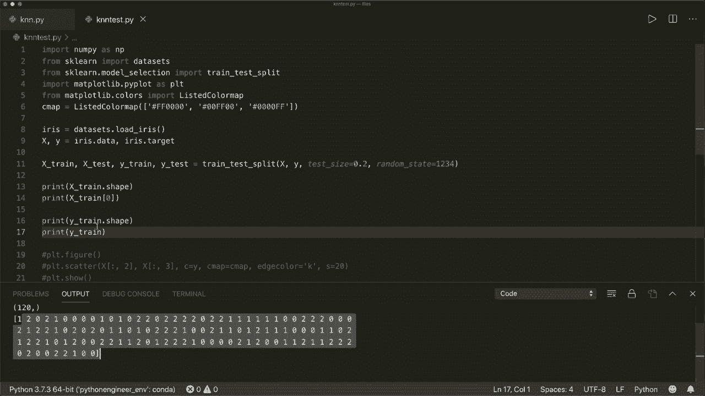
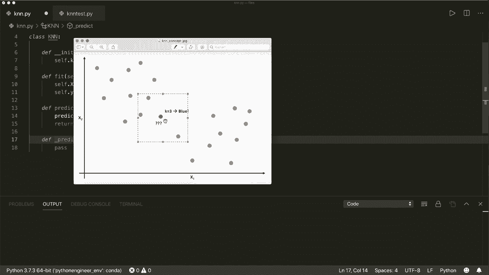
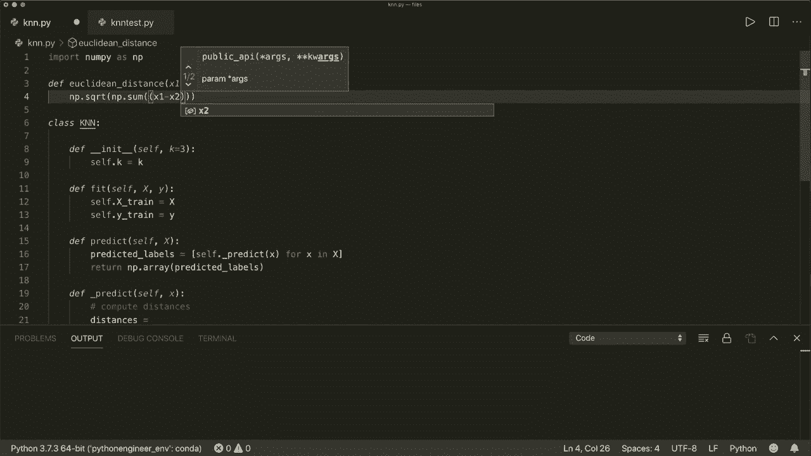
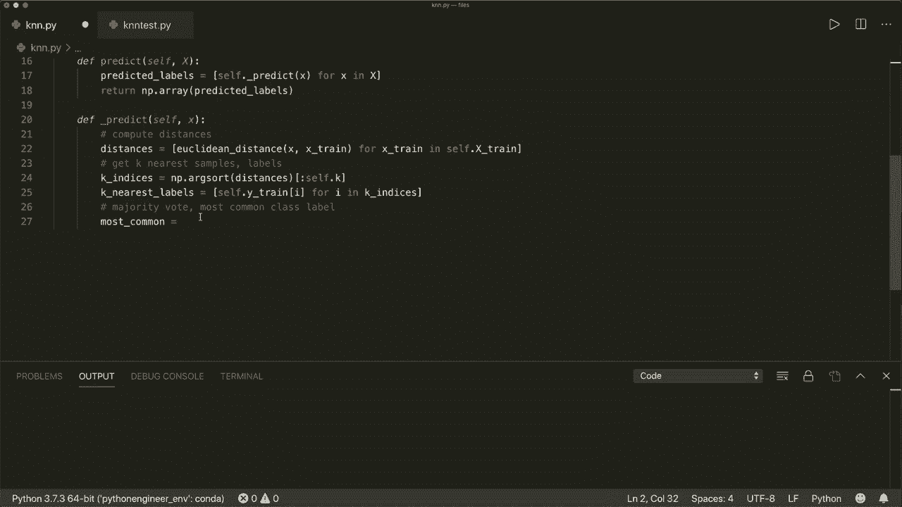
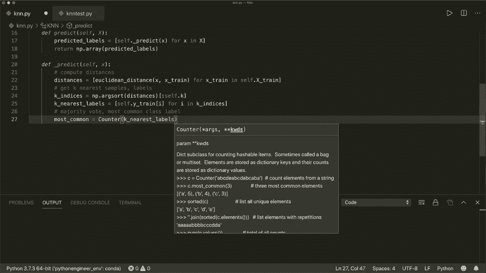
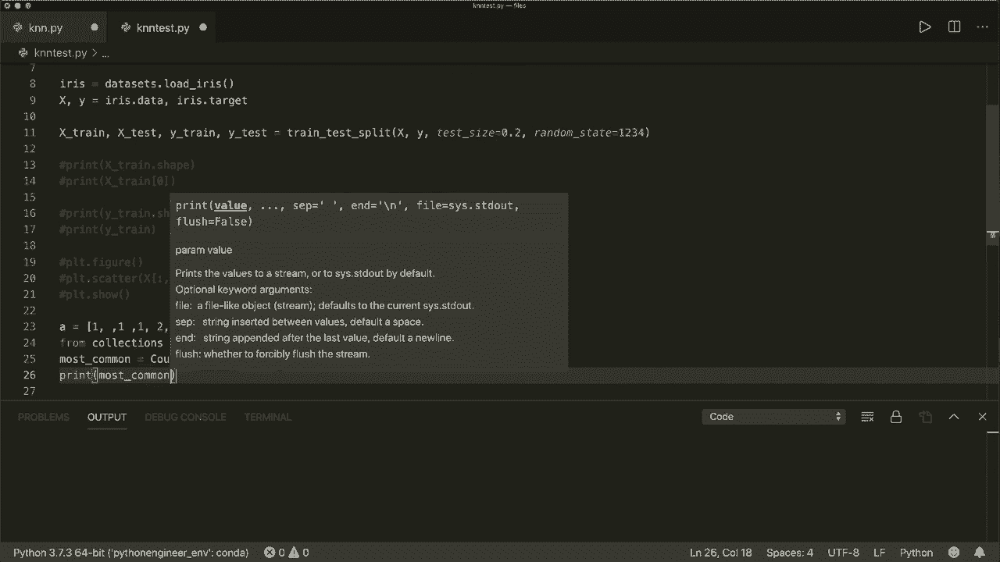
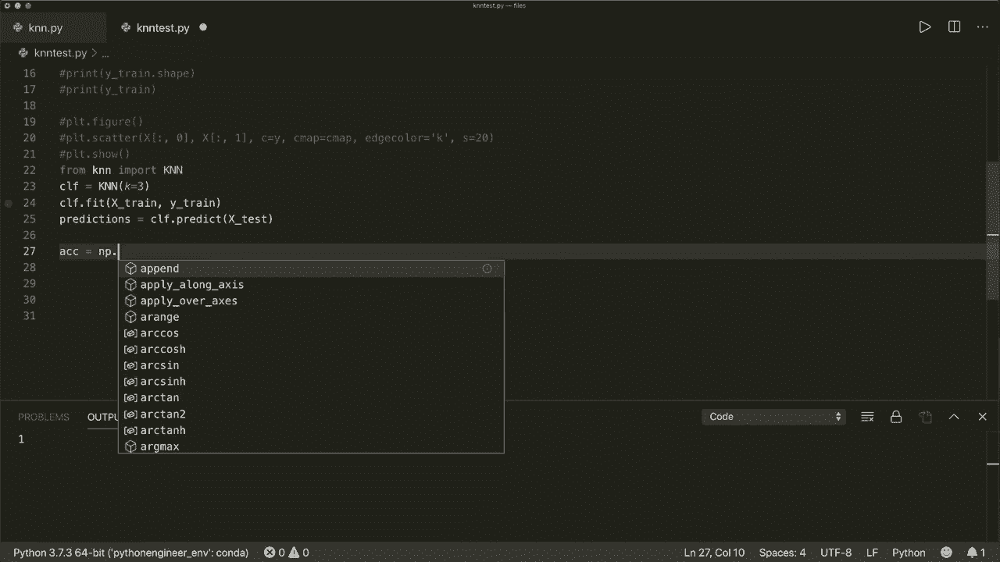
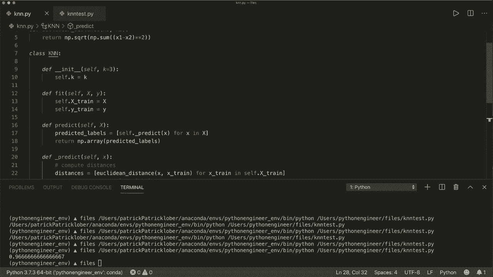

# 【双语字幕+资料下载】用 Python 和 Numpy 实现最热门的12个机器学习算法，彻底搞清楚它们的工作原理！＜实战教程系列＞ - P2：L2- 神经网络 - ShowMeAI - BV1wS4y1f7z1

Hi， everybody。 Welcome to a new tutorial。 This is the first video of a new series called machine learning from scratch。

 In this series， we are going to implement popular machine learning algorithms using only built in Python modules and Ny。

 So today， we will start with the key nearest neighbor algorithm or short K and N algorithm。😊。

The concept of K And N is fairly easy。 A sample is classified by a popularity vote of its nearest neighbors。

 So let's consider an example with two classes and a two dimensional feature vector。

So let's have a look at this figure。 So here we have two classes。

 the blue class and the orange class， and we have feature vectors with two dimensions。

 So we have x1 on this axis and x 2 on this axis。And what we do here is we have some training samples。

And then for each new sample that we want to classify。

 we calculate the distance of this sample to each of the training samples。

 And then we have a look at the nearest neighbors。 So in this case。

 we have a look at the three nearest neighbors。 So these ones。

 And then we choose or predict the label based on the most common。Class labels here。

 So we have two blue glasses and one orange glass。 So this then will be a blue class。

And this is the whole concept of the K and N。And what we also have to know is in order to calculate the distances。

We used the Euclidean distance。

So in a 2D example， the Euclidean distance of two points is defined as the square root over。

 and then we have for each。🤢，Feature vector component。 we have the squared。Difference。

 so we have x 2 minus x1 squared plus y2 minus y1 squared。

 So this is the Euclidean distance in a 2D case。 and in a more general case， the formula。

Is defined as。This， so it's the square root over the sum from I equals 0 to n。

 where n is the number of dimensions。 And then we have the sum over。Each。Component。

 and for each component， we calculate the squared distance or the square difference。

So this is the Euclidean distance， and this is all we have to know in order to implement the K and N。

 So let's start。 And first， let's define a class called K and N。

And this has， of course， an innate method。So in itself， and this will get a K。

 So this is the number of nearest neighbors we want to consider。

 And this will also get a default value。 So the default is 3。And in the in it。Oh， sorry。

We define the in it。 So in the in， we simply want to store the K。 So we say self dot K equals k。

And then what we want to implement here。 And here we want to follow the conventions of other machine learning libraries。

 For example， the psychic Learn library。 So we have a。嗯。Fit method。So this。

 this will fit the traininging samples and some。Training labels。

 And this will usually involve a the training step。 So we want to implement this one。

 And then we also want to implement a predict method。Sorry， this also has self。

And the predict method。 So here we want to predict new samples。

So these are the methods we want to implement。And now， before we go on， first of all。

 let's have a look at how our data looks。 So what is this X and this Y， And for this。

 I wrote some test script。 So here I used the famous irris data sets。

 So you might have heard about this already。 So I can get this from the ps could learn module。

 And then I will generate some training samples and some test samples。

 and the associated training labels and test labels。

So let's first have a look at how this。Training samples。 look。

 so we want to print the shape of this one。So this is an an nuy N D array of shape，120 by 4。

 So 120 is the number of samples。 and four is the number of features for each sample。 So for example。

 let's print the first sample。So this is four features in it。

So this is how our training samples look。 And now let's have a look at our training labels。So。

This is a 1 D row vector， also of size 120。 So for each of our training samples， we have the。

The label for it。So if we print this， then we see this will be a 1 D vector with only one row。

And now let's what we see here is we have label 0，1 and 2。 So this is a three class problem。

 So let's also plot this。嗯。And now， for example， what I plot here is I only plot the first two。

Feature us so that we have a 2D case。So this is how our data looks。 So we have three classes， red。

 green and blue and。

Yeah。So this is how our data looks。 And now we can continue by implementing this。

 So in our fit method。So in the K and N algorithm， this doesn't involve a training step。

 So what we do here is we simply want to store our training samples and then we can use them later。

 so we can say， let's store them。 So let's say self。

 and then we call this X train equals X and self Y train。Equals y。So this is all for our fit method。

And now， for our predict method。So， this will get。Can get multiple samples here， So we。嗯。

Can see this， because we， we use a capital x for this。So this can have multiple samples。

 so we can write a little helper method。 So we want to do this for each of the samples。

 We want to say we want to get the predicted。Labels。Equals， and then。We use。

Or we write a helper method that we call underscore predict。 And this will only get one sample。

So here we use list comprehension。 So what we want to do then is we want to call this self。Predict。

With one sample X。 And then we want to do this for all of our samples。In our。Tests samples here。

 So for small x in capital x。And then this will be a list。 So let's convert this to a nuy array， and。

Then。This is our predict method。 And， of course， we have to import Nmpy。 So we say import Ny S and P。

And now， how does our underscore predict method look like， So now again。Let's have a look。

At the figure here。 So what we do is。We want to calculate all the distances。

And then we have a look at the nearest neighbours and the labels of the nearest neighbors。

 And then we do a maturity vote and choose the most common class label。

 So let's write some comments here。 So， first of all， we want to compute the distances。

Then， we want to。Get the can nearest neighbors， So get Ca。Nearest samples， and。We want to get the。

Also， want to get the labels。 And then we do a maturity mode。So we want to get the most。

Come on class label。So。Let's do this。 So let's say， distances equals。And now， as I said。

 we use the Euclidean distance here。 So let's define this。

 and we want to define this as a global function。 So you might want to write this in a separate file or call this in some utility class。

 So here I will simply do it in the same file。 So I say。要。Kiyian。This tense。Of two feature vectors。

 So let's say x1 and x 2。 And now again， let's have a look at the formula。

 So this is the square root。 and then the sum over each square distance。 So we have the square root。

 So we can say。

Nampai dot S， Q， R T。

And then we have the sum。 so we can use numpy dot sum。 So this will calculate the sum for over each。

Feature vector component。 And here we have the。Squared difference。

 So we can say x 1 minus x2 to the power of 2。

So this is all we need。 And we want to return this， of course。

And now in our predict methods。What we want to do is。

We want to calculate the distances of this one new sample to all the training samples。

 So we also use list comprehensions here， and we call this Euclidean distance with our new test sample。

So， and then to each of the training samples。 So we say small x train。

 And then we want to calculate this for。Extrain in capital， or in self dot。X train。

So now we have all the distances。And now we want to get the key nearest samples and the labels。

So what we do here is we sort our distances and。We can do this。 So let's call this decay。Indices。

And this。 And here we use nuumpy dot。Ark sort。So this will sort the distances and。

Will return the indices。Of how this is sorted。 So here we call。Distances。And this will be an array。

 And we also want， we only want to have the K closest samples。 So let's use slicing here。

 And let's start at the beginning。 So 0。 or we can omit this。 And this is goes only until self dot K。

 So this will be the。Indices of the K nearest samples。 And now let's get the labels。 So we get the。

Kay。Nearest。Labels equals。 And here we can。 we also use list comprehensions。

 and then we get the label of each training and labels。With this in the index， So the index I。

 and then for I in K indcs。So now we have the labels of our nearest neighbors。

 and then we use a maturity vote and get the most common class label。

 So let's call this most common equals。 And for this， we use another Python module。

 So we use the counter module。 So we say from collections import。Counter。And then。Weii。

Get there。Or we get a counter of the， nearest labels。

And then this is a method called most common。 And we only want to have the first or the very most common。

嗯。And now let's have a look how this looks， so。If I comment this out and let's write a short example what the collections or the counter module will do。

 So let's say we have a list A equals， and this is some values in it。 So 1，1，1，2，2。

 and then some error。Labels， as though also from collections import。Counter。

And now we get the most common equals， so。We create a counter of this list， and then one most common。

So。Let's print this。

So。I have to。Close this first。 So let's run this again。嗯。So this will be a list。

 and then we have a tuple of the most common item。 So， for example， if we， in this case。

 we only have， we want to have one， the one most common item。 and this is a tuple。

 and the first item here is the most common item。 So this is one。 and the second item is the。

Number of times， this is in our list。 So it three times  one。 So， for example， if you use two。

 then it will also put in the second most common items。 In this case， it is2。

 and we have two times 2。 So we only want。One most common。So as I said， this is a list。

 So in order to get the first item， we use the index 0。

 So now we have the tuple and now to get the actual items again， we use the first index。

 and then we have one。So here we have to do the same thing， and we want to return this。

 So let's return most common of index 0 of index 0。

And this is all our implementation of the K and N algorithm。So， let's try this out， so。Let's。

 in our test example， we already have our test file。 We already have our training and test samples。

 So let's use our。Our。K and N class， So we can say from K And N import。K and N。

 and then create a classifier。 So C， F equals。

K and N。And so， let's use。

K equals 3。And then we want to call the fit method first。 So we want to fit our X train。And the。

Why train。And then we get the predictions。 And this is。By we do this by calling CF dot predict。

 And then we want to predict。Our。Test sample samples。 So x test。And now let's calculate the accuracy。

 So accuracy。 So this is defined by how many of our predictions。Are correctly classified。

So this is the。 So here we use the sum。嗯。

The sum。And here， we write。Predictions equals， equals。

Why test。So for each prediction， that is。The right。Or the same as the correct label， it。Es1。

And then we divide this by the number of test samples。 So we divide this by Lng， y。

Test。And let's print our accuracy。

And see if this works。So， yeah， in this case， it's 1。0。 So all of our predictions are。Correct。

 so let's use another。Number of neighbors。 So K equals 5。

 So usually you want you want to use an odd number here。 So let's run this。Oh， sorry。

 So in this case， it's 096， so。Not as good as with three neighbours， but also very good。 And yeah。

 we see that this is working。 And this is our whole implementation of the K And M。 And yeah。

 I hope you enjoyed this tutorial and see you in the next tutorial， bye。😊。

