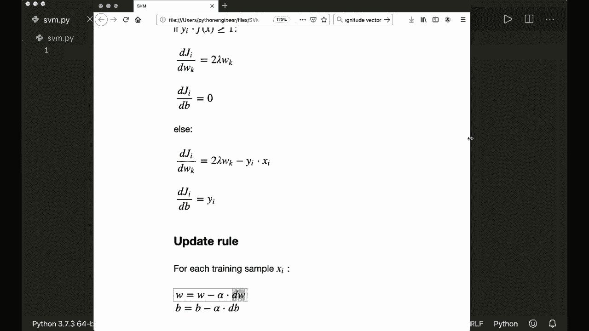
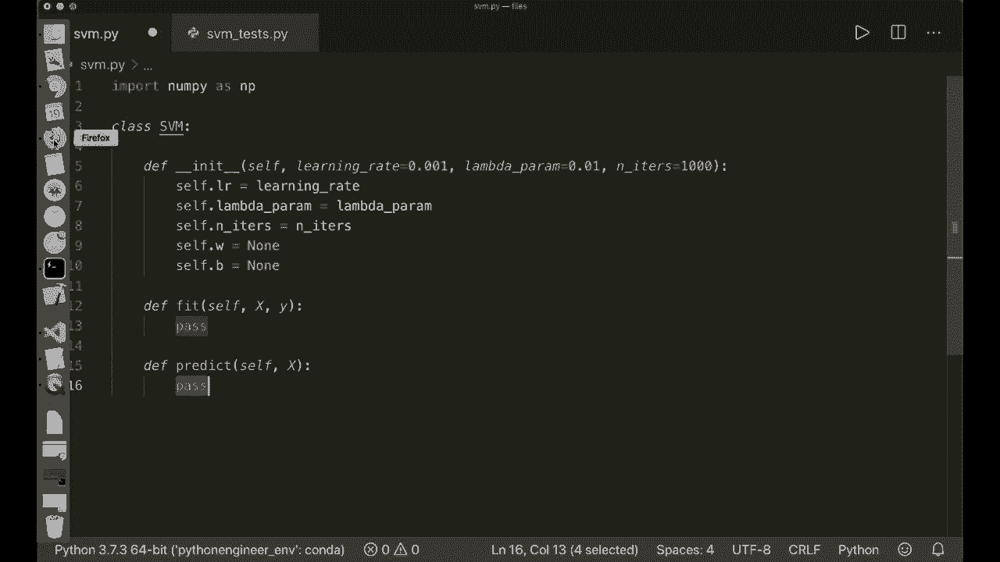
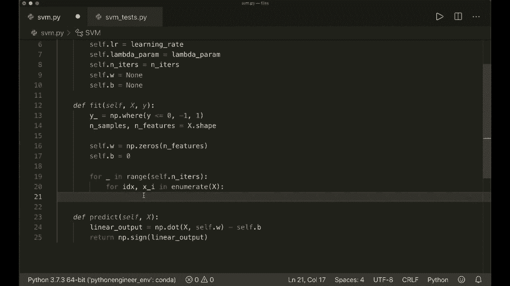
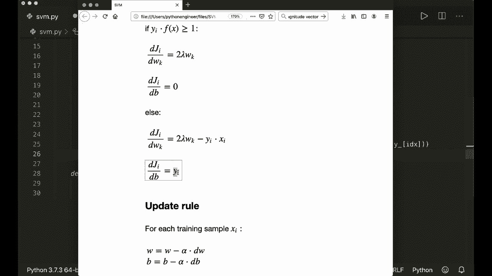
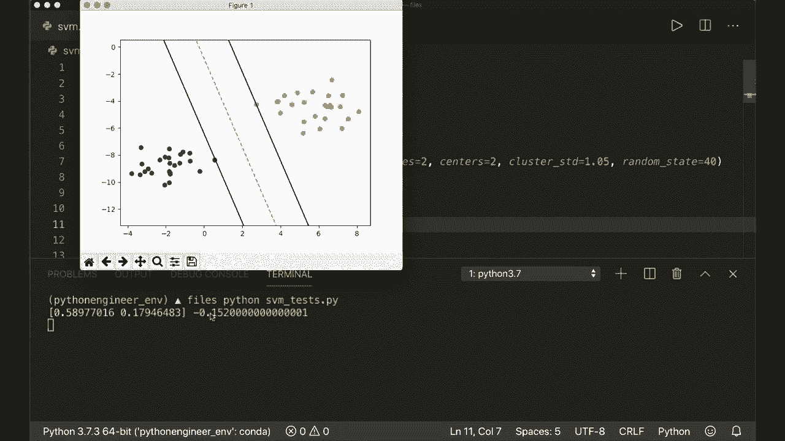

# 【双语字幕+资料下载】用 Python 和 Numpy 实现最热门的12个机器学习算法，彻底搞清楚它们的工作原理！＜实战教程系列＞ - P8：L8- 支持向量机 - ShowMeAI - BV1wS4y1f7z1

Hi， everybody。 Welcome to your new machine learning from scratcht tutorial。 Today。

 we are going to implement the SVM algorithm using only built in Python modules and Ny。😊。

The SVM or support vector machine is a very popular algorithm。

 It follows the idea to use a linear model and to find a linear decision boundary also called a hyperplane that best separates our data。

And here， the choice as the best hyperplane is the one that represents the largest separation or the largest march in between the two classes。

 So we choose the hyperplane so that the distance from it to the nearest data point on each side is maximized。

 So if we have a look at this image， then we want to find a hyperplane and the hyperplane has to satisfy this equation W times x minus B equals 0。

And we want to。Find the hyperplane so that the distance to both the。both classes is maximized。

 So we used the class plus one here and-1 here。So this， this tense or the margin should be maximized。

And first， let's have a look at the math behind it。

 so it's a little bit more complex than in my previous tutorials。

 but I promise that once you have understood it， the final implementation is fairly simple。So。

We use the linear model， W times x minus B。 That should be 0。 And then our。嗯。

Our function should also satisfy the condition that W times x minus B should be greater or equal than one。

For our class plus one。 So all the samples here must lie on the left side of this equation or this line here。

And all。The samples of the class，-1 must lie。On the right side from this equation。

 So if we put this mathematically， then we should it must satisfy W times x minus B should be greater or equal than1 for class1。

 or it should be less or equal than-1 for class -1。So if you put this in only one equation。

 then we multiply our。Linear function with the class label。

 And this should be greater or equal than one。So this is the condition that we want to satisfy。

And now we want to come up with the W and the B。 So our weights and the bias。And for this。

 we use the cost function and then apply gradient descent。

 So if you're not familiar with gradient descent already。

 then please watch one of my previous tutorials。 For example。

 the one with linear regression there I explain this a little bit more in detail。So now let's。Conue。

 So we use the。Use a cost function here。 And in this case， we use the hinge loss。

 and this is defined as the maximum of 0 and。1 minus。 And here we have our condition。

 Y I times our linear model。 So what this means is if。

 if we plot the hinge loss and here the blue line is the hinge loss。 So this is either 0， if。Y times。

F is greater or equal than one。 So if they have the the same sign。Then it's 0。 And the， if they。Yeah。

 if they are correctly classified and are larger than one， then our loss is 0。

 So this means if we have a look at this image again， if。For the green glass， if its。

 if it lies on this side。Then， it's 0。And for the blue class， if it lies on this side。

 then it's also 0。And otherwise， then we have a linear function。

 So the further we are away from our decision boundary line， the higher is our loss。

And so this is one part of our cost function。 and the other part is。As I already said。

 we want to maximize the margin here。So between these two classes and the margin is。

Defined as2 over the magnitude of w。 So this is dependent from our weight。

 dependent on our weight vector。 So we want to maximize this， and therefore。

 we want to minimize the magnitude。 So we put this or add this to our。Cost functions。

 So we also put this term。The magnitude of W to the power of two times a lambda parameter。

And then here we have our hinge loss。So the lambda parameter tries to find a trade off between these two terms。

 So we it says basically says which is more important。 So we want to， of course。

 we want to have the right classification。 We want to lie on the correct side of our lines。

 but we also want to have the the line such that the margin is。Is maximized。嗯。So yeah。

 so if we look at the two cases， if our， if we are on the correct side of the line。

 So if Y I times F on x， F of x is greater or equal than one。Then we simply。

 we only have this term because this is the hinge loss is 0。 And otherwise。

 then our cost function is this year。And now we want to minimize that。

 So we want to get the derivatives or the gradients of our cost function。So in the first case。

 if we are greater or equal than one。Our derivative。Is only is two times lambda times。W， so。

 and here we only look at one component of our W。 So we get rid of the magnitude。

And the derivative with respect to the B is 0。 So please double check that for yourself here。

 I will not explain the derivatives and details。And in the other case。

 so if if Y I times F on x is not greater or equal than one。

Then our derivative with respect to the W is this equation here。

 and the derivative with respect to our bias is only Y I。So again。

 please double check it for yourself。And then when we have our gradients， we can use the update rule。

 So the new weight is the old weight minus because we use gradient de。

 So we go into negative direction minus the learning rate or the step size times the derivative。

 So these are our update rules and。Now， I hope youve understood the concept and the math behind this。

 And now we can start implementing it。 So this is now straightforward。 So， first of all。

 we import Ny S and P， of course。

And then we create our class S we am， which will get an in it。Method。

And here I will put in a learning rate， which will get a default value of 0001。

 and it will get a lambda parameter， which will also get a default。 And I will say this is 001。

 So this is usually also a small value。And then it will get the number of iterations for our optimization。

 which will get the default of 1000。So then I will simply store them。

 So I will say self dot L R equals learning rate。Self do。Lambda Para equals Lambda Para。

 So note that I cannot use Lambda here because Lada is a keyword and Python for the Lada function。So。

 yeah， them self do。And。Its equals and its。 Then I will say self dot W equals none and self dot B equals none。

 So I have to come up with them later。 and then we define our two functions。 So as always。

 one is the predict function， where we fit the training samples and the training labels。And the。

Sorry， this is the fit method。And the other one is the predict method。

Where we predict the labels of the test samples。And now let's start with the predict method。

 because this is very short， so。

We want to， as I said， if we look at the math， we apply this linear model。

 and then we look at the sign of this。 So if it's positive， then we say it's class 1。

 and if it's negative， then we say it's class-1。 So we say linear。

Output equals Ny dot。Dot， So the dot product。Of X and self dot W， minus self dot。B。

 and then we choose the size。 so we can simply say， return。Nampy dot sign of this linear output。

So this is the whole predict implementation。 And now let's continue with the fit method， so。

First of all。As I said， we used the classes plus 1 and-1 here。

 So we want to make sure that our y has only -1 and plus1。 So oftentimes it has 0 and1。

 So let's convert this。 So let's say y underscore equals。

 And here we can use nuy dot where this will get a condition。 So we say y。

 if this is less or equal than 0， then we put in -1， and otherwise we put in plus1。So。

This will convert all the zeros or smaller numbers to -1 and the other numbers to plus 1。And now。

 let's get the number of samples and the number of。Features。And this is simply X dot。Shape。

 because our input vector X is a nuy and DRA。Where the number of rows is the number of samples and the number of columns is the number of features。

Then we want to initialize our W and our B。 And we simply put in zeros in the beginning。

 So we say self。Tt W equals Ny zeros of size and features。 So for each。

Feature component we put in a0 for our weight component。And then we say self dot B equals 0。

 And now we can。Start with our gradient descents。 So we say， for underscore。

 because we don't need this in range self dot and it iter。

 So the number of iterations we want to do this。And then， we iterate over our。Train samples。

 So I say4 index and X， I in enumerate X。So this will give me the current index and also the current sample。

And now。

What I want to do now is let's。Have a look at the。math again。 So I want to。

I want to calculate the weight or the derivative of our cost function with respect to the W and with respect to the bias。

And here I first， but at first， I look if this condition is satisfied， so I will。Say。

 and the condition is Y I times our linear function。 So I say condition equals。

Why underscore of the current index。Times， and then the linear function， so。Nampai dot。

Of the current sample and our self dot W minus self dot。B。嗯。This should be greater or equal than one。

So if this is satisfied and the condition is true and otherwise it's false。 So now I say if。

Condition， so if this is true。Then， our。Divatives look like this。

 So the derivative with respect to the B is just 0。 And so we only need this， so。I say。嗯。

So it's two times lambda times W。 And then in our update， we go in So we say。

The new way is the old weight minus the learning rate times this。 So I write this in one step。

 So I say self dot W minus equal self dot learning rate times。 And now here。

We have。Two times self dot Lambda parameter times self dot W。So this is the first update。

Or if our condition is satisfied and we only need this update。 And otherwise。

 we say self dots W minus equal self times L R the learning rate times。 and let's again。

 have a look at the equation。 So it's。

Two times lambda times w minus Y， I times X， I so。

Two times。Our lambda times。W minus nuy dot。 So I want to multiply our vectors， X， I and。

Why I so the y underscore of the current index。So this is our update for the W and our self dot。B。

Is minus equal self times learning rate times the derivative and the derivative is only。

Or just Y I， So only。

Why underscore of the index。And now we are done。 So this is the whole implementation。

And now let's test this。 So I've written a little test script that will。Import this SVM class。

 and then it will generate a。Some test samples。 So it will generate two glasses。

And then I will create my SVM classifier and fit the data。

And then I wrote a little function to visualize this so you can find the code on Gitthub， by the way。

 so please check it out for yourself and now if we run this。

 so let's say Python as we am underscore Te P。

And now， this should。Calculate the weights and the bias， and it should also plot the decision。

Fun the the yellow line and the two lines on both sides here。And we see that it's working。 So， yeah。

That's all about the S VM。 I hope you enjoyed this。 And if you like this。

 please subscribe to my channel and see you next time， bye。

