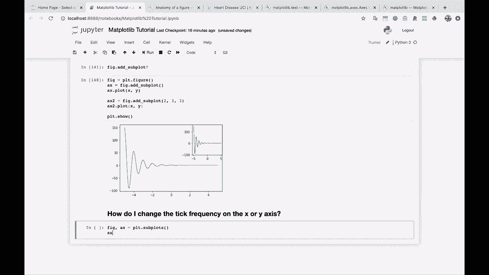
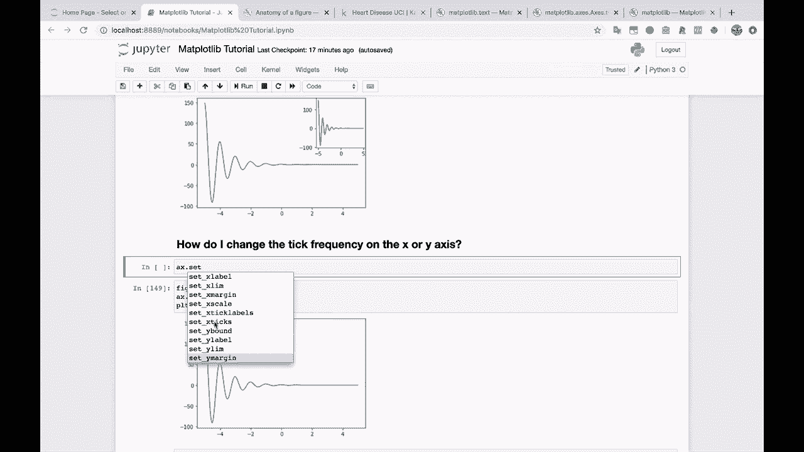
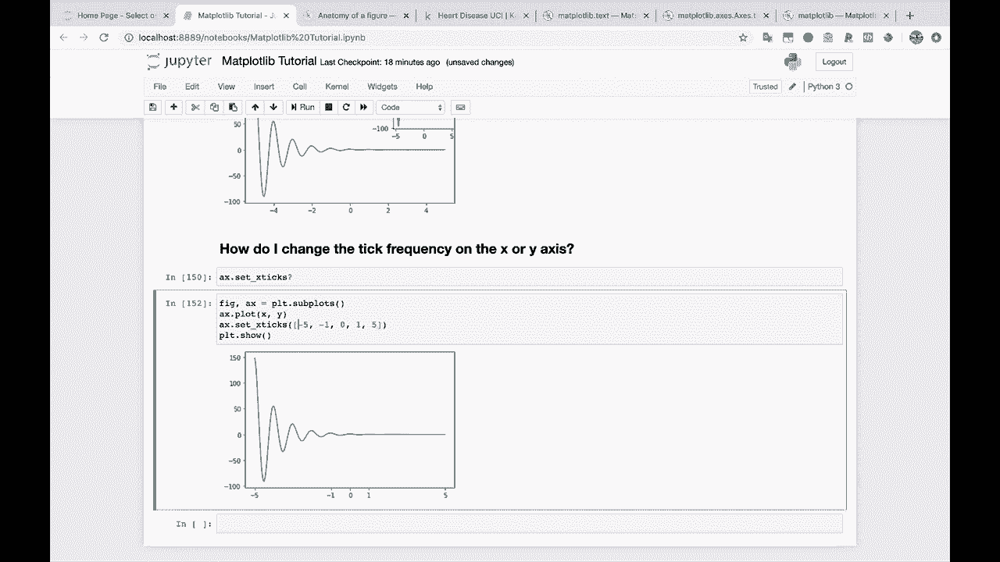
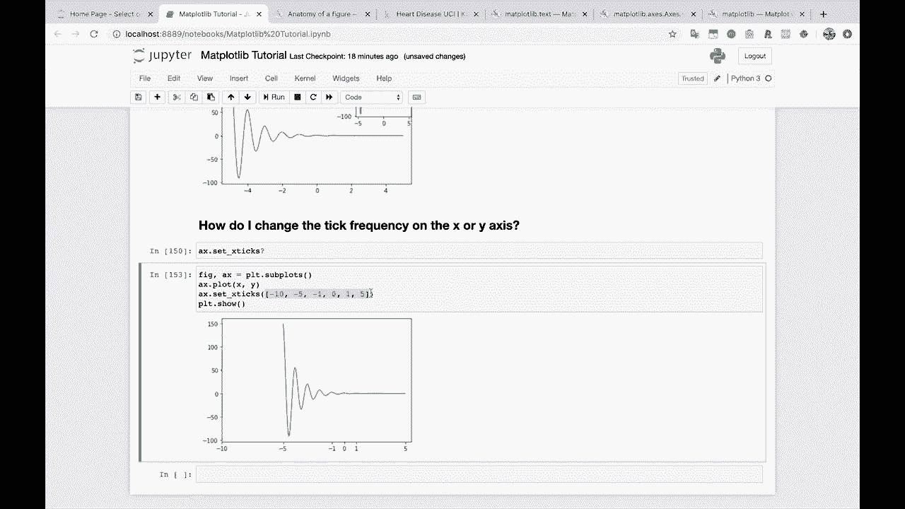

# 【双语字幕+资料下载】绘图必备Matplotlib，Python数据可视化工具包！150分钟超详细教程，从此轻松驾驭图表！＜实战教程系列＞ - P15：15）更改 x 轴上的刻度频率 - ShowMeAI - BV14g411F7f9

Another common question is。This one， how do I change the tick frequency， the tick frequency。

On the X or Y axis。

Alright， so let's go back to our normal way of doing things， subplots。

Subplots will do A X dot plot X and Y， and then we'll do PL T dot show。

So you'll see here that the current X ticks are basically just where Maplotlibb thinks that they should go。

 And sometimes this will work and sometimes we'll want to change that。 So if we go up here to AX dot。

 I'll hit tab， take a look at what we got here， and then I'll start typing in set。

And you can see all the things that we can set and let's scroll down and you'll see set X ticks。

 This is the one we want to go for。

We can look at the documentation if you want。 So we basically just pass in ticks。

 and we just pass in a list of X， tick X axis， tick locations。 So let's try that， let's say。

Let's say， we want。

Take locations at。Let's say negative， let's change this from even numbers to。 let's say negative 5。

 negative 3， negative 1。 we'll add 0 as well。 and then 1，3，5。 Let's see what happens。

And there you go。We have now changed the X ticks from even numbers to odd numbers， including 0。

 and we can just leave out some of these tick labels if we want， you know， let's take out 3。

And there you go， like， maybe this is how you want to present it for some reason。

 And you can even do stuff like， let's add in negative 10 for some reason。

And， you know， there you go。 So you've now kind of expanded the graph to the left and added an X tick label there。

So it's just that easy。And you can， you know， you could do all kinds of different patterns and stuff with this if you want。

 But that's how you。

