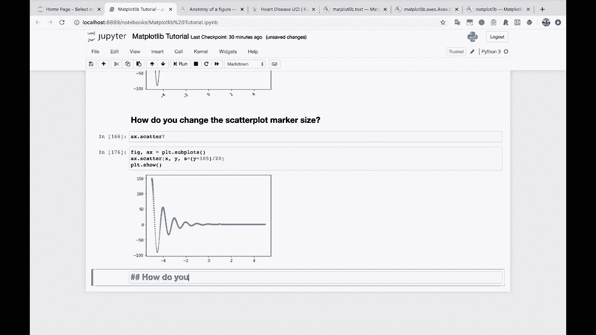
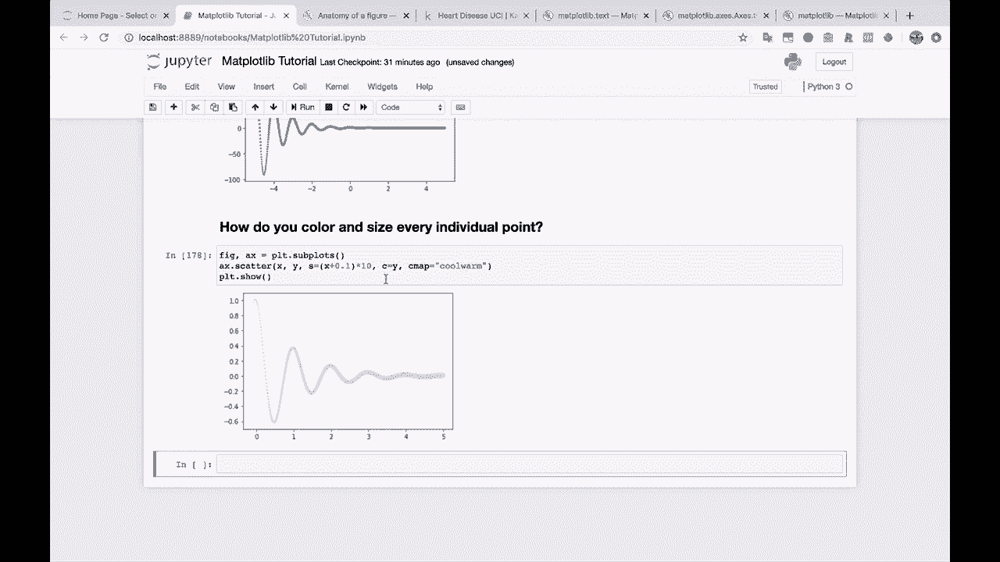
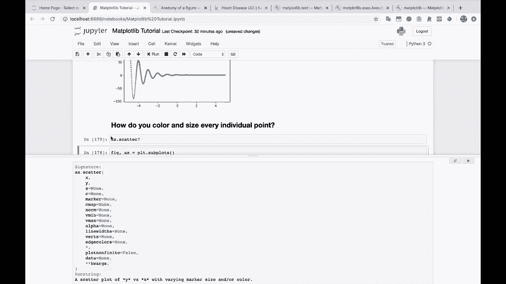
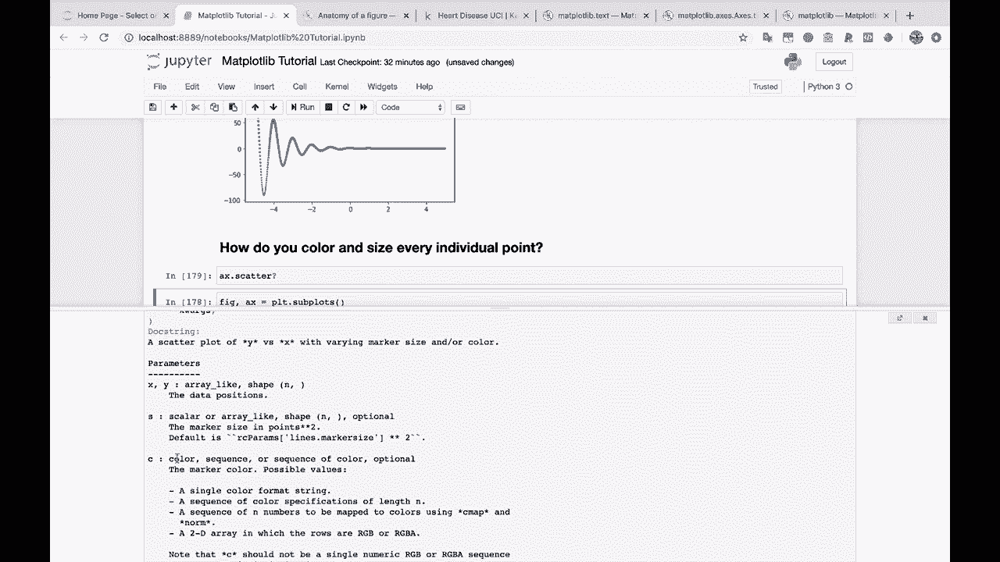
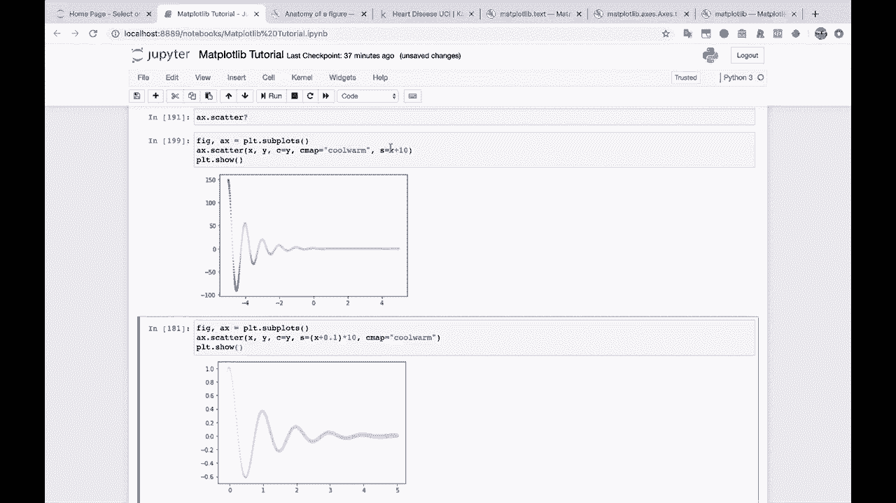
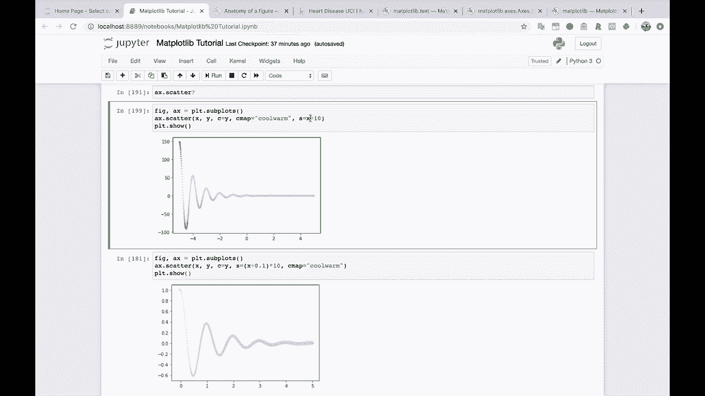

# 【双语字幕+资料下载】绘图必备Matplotlib，Python数据可视化工具包！150分钟超详细教程，从此轻松驾驭图表！＜实战教程系列＞ - P21：21）更改散点图的大小和颜色 - ShowMeAI - BV14g411F7f9

And let's actually show you that really quickly。 This will be our next question。

 How do you color and size every individual point。

Well， you just pass in arrays。 You just pass in arrays here。 So let's take this。

 We'll take it back down here。 Let's get our X。You know， we'll do like， we'll do X plus。0。01 or 0。

1 to avoid that whole error that it encountered。 and we'll multi， multiply that by 10。

 And then we've also got this C parameter。Got the C parameters。 So let's try passing that in。

 Let's try passing Y in for that。

And you'll see that we get some kind of interesting thing going on here。

 Let's I'm going pass in a C map value。 This is a color map。

 This is a way that you let map plot Lib know。 hey， I want to use a particular。

A particular group of colors。So we got some cool， warm going on。

And this actually is not doing what I would expect it to do。

 I would expect the values to change with the Y here。 Let's take a look at A x dots scatter。

So you can pass in size， you can pass in C。C is a color， a sequence or a sequence of color。

There we go。 Alright， it looks like it looks like was able to fix it by some of these x values。

 If you look at x here。 So we're going down to negative5。

And so if we add 10 to our x so that we make sure all of our sizes are positive。

 then it looks like things work as we would expect them to。Okay， figured that out。

 So this is coloring by every point and also doing the size by every point。

 And this might not be very helpful for this specific graph。 But let's say that you've got， you know。

100 different points on a scatter plot。 and you want to color them by one thing。

 and you want to size them by another。This is how you would do that。 And as we just learned。

 make sure that all of your sizes are positive because you can't have a negative size。

