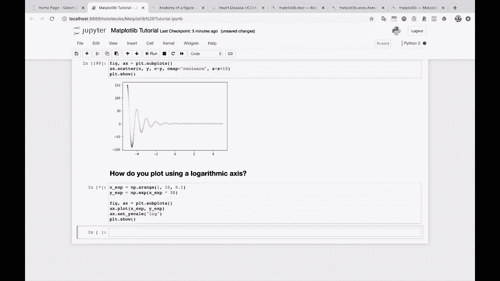

# 【双语字幕+资料下载】绘图必备Matplotlib，Python数据可视化工具包！150分钟超详细教程，从此轻松驾驭图表！＜实战教程系列＞ - P22：22）使用对数轴绘图 - ShowMeAI - BV14g411F7f9

Yes。

Allright， here's one that comes in handy for some data science problems， and this is。

 how do you plot using amic axis？

So， essentially。Sometimes you might have values that grow very large， very quickly。

 that grow exponentially。 You might have a histogram where everything is clustered over on one side。

 So these are a couple of the different use cases where。

You might be interested in using a logarithmic access。

 So I'm going to just copy over some code that I have over here， so。

Our X exponential is just going to be an x range from 1 to 10 with a step size of 0。1。

 And then our y values。 So we're going do the exponential function。 So E to the。X times 30。

 So E to the x times 30。Now， if you plot this， you'll see a graph that looks like this。 Now。

 this is not particularly helpful， right， We are down here。

It looks like very close to 0。 And then suddenly it just shoots up。

 And but you'll see that our scale of our access here， our axis， our y axis is actually。

 what is this like 10 to the 129。 So this is， this is a monstrously large number。😊。

It's just the fact that our y values are growing。 they grow so large towards the right side of the graph here that none of this is really on the plot。

So this is not particularly helpful。So how might we change the Y axis？To be a logarithmic axis。

 So this is a kind of a classic example of when you might want to use a logarithmic access is whenever you have some of your values that are in wildly different ranges than other of your values。

 So in this case。We come down here to our where our axis is our axes a or apologies A X dot。

 in this case， we're going to use this set Y scale。

And we just pass in log。

And there is a beautiful， straight line。That shows the linear relationship。Between x and log of y。

So this is a nice thing to do for graphs like， let me copy this up here just so you can have a reference。

It's a nice thing to do for graphs like this， as I said before。

 it also is nice for histograms where you have a lot of values kind of clustered on one side。

SoAnd this is a pretty common thing that comes up in data science as you're looking at different types of data。

