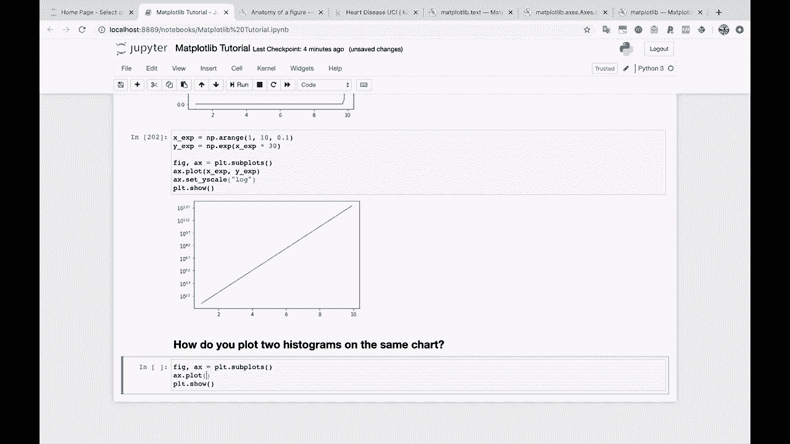
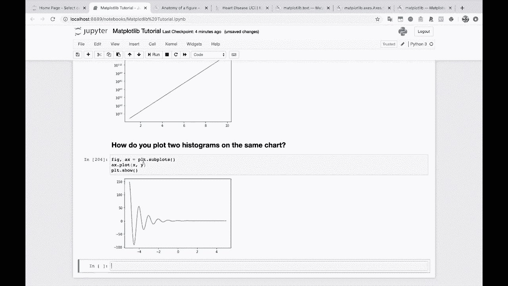
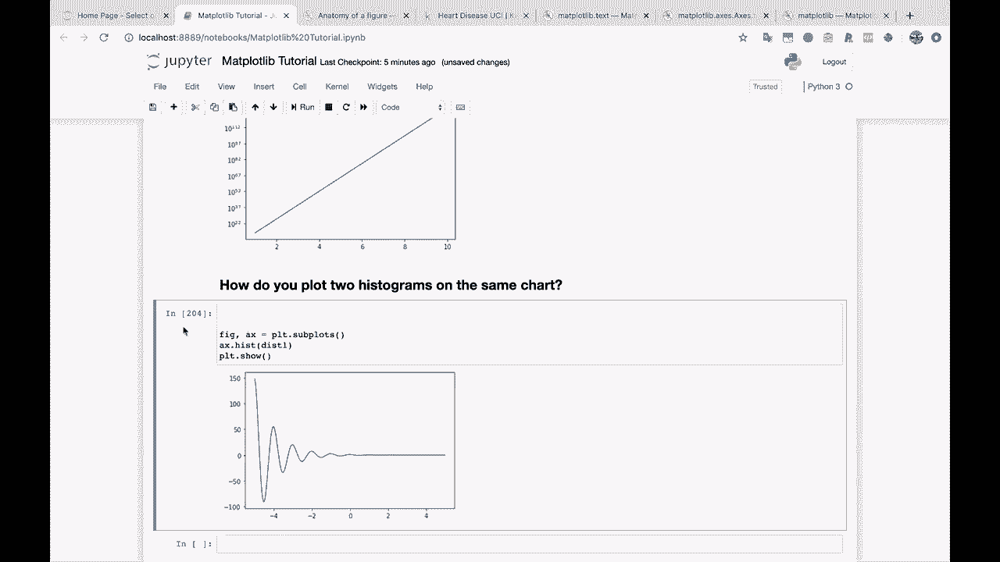
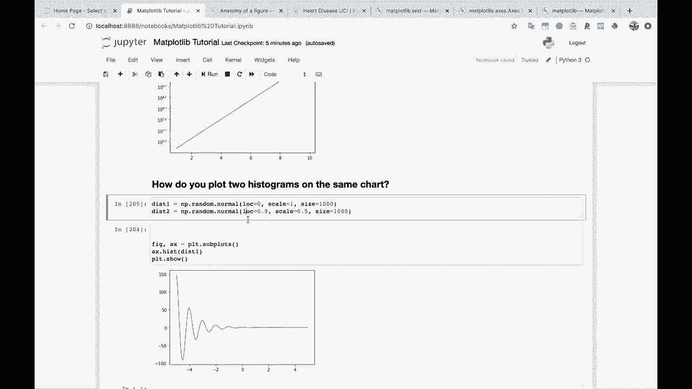
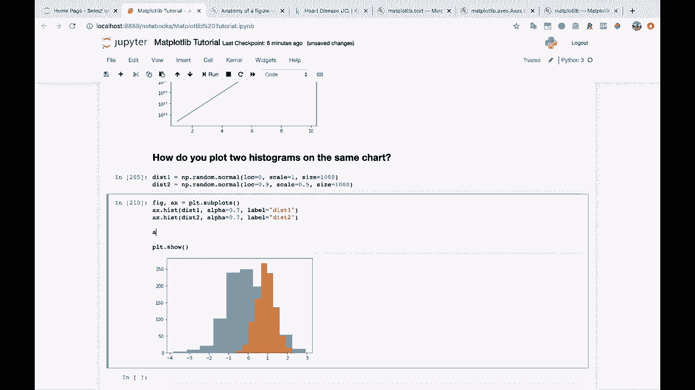
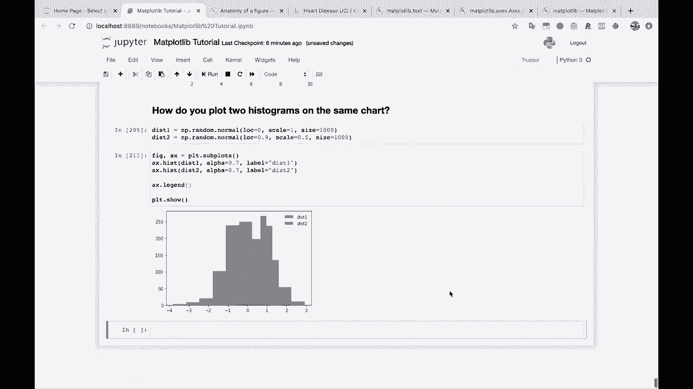

# 【双语字幕+资料下载】绘图必备Matplotlib，Python数据可视化工具包！150分钟超详细教程，从此轻松驾驭图表！＜实战教程系列＞ - P23：23）在同一张图上绘制两个直方图 - ShowMeAI - BV14g411F7f9

Yeah。

Okay， rolling right along here。How do you plot two histograms on the same chart is a pretty common question。

 This is something you should know how to do。 How do you plot to histograms on the same chart。

This is something you should know how to do because it is a classic example。

Of plotting two graphs on the same axes。 So let's。Let's see。

So if we just plot our X and Y here。 So we're going need some data that we can， that we can。

Ploot in a histogram。And I went ahead and created a couple of normal distributions。

Let's go ahead and throw those in here。So I'm just creating normal distributions。

 they have a certain mean， they have a certain standard deviation。

 and I'm creating 1 thousand0 different data points。If we do Ax dot hist of disk 1。

Let's create these outside here。 So we're dealing with the same data because this will create a new data set every single time。

And here's our first histogram。

And now。You just do another histogram on that same axes。 So ta， there you go。

 two histograms in the same chart， Sam axes， it's as easy as that。 Now。

 whenever we've got something like this going on， I'll show you another one of my favorite tricks here。

 which is using this alpha parameter。 And alpha basically controls the transparency。

 So let's actually do alpha on the second graph first。 And let's， let's take this down to。😊，Like 0。7。

And if we take the alpha down to 0。7， you can now see that we can see through the orange graph to the blue graph。

 And if we do an alpha on both of them。Then we get this pretty nice coloring effect here where both of them are a little bit muted。

 and we can see the distribution of both of the graphs。 Now。

 just because I think that this is helpful， I'm also going to throw labels on here。 So dis1。Dis 2。

 And then remember， if we run this。

This doesn't do anything， until。Wei。

Call A X dot legend。And there you go， that's how you do two histograms on the same chart。

