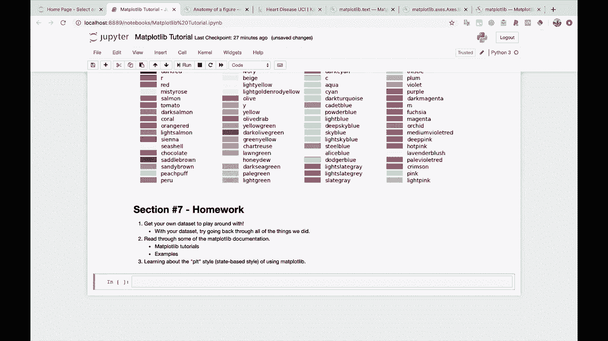
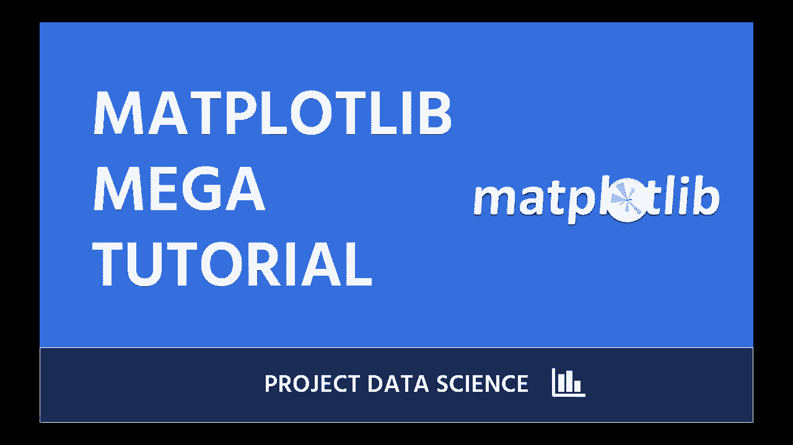

# 【双语字幕+资料下载】绘图必备Matplotlib，Python数据可视化工具包！150分钟超详细教程，从此轻松驾驭图表！＜实战教程系列＞ - P27：27）进一步学习，总结，致谢 - ShowMeAI - BV14g411F7f9

And that's it。 We're done。 What a marathon of a tutorial here。 That was a lot of information。

 Don't feel bad if your brain feels like it cannot hold all of it。

 I'm gonna leave you with a little bit of homework section number。 Are we up to section number 6。

 Is that where we are。 Oh， Does it even matter at this point。Let's go here。 Section 6。

 So we are now at section 7。 actually， Section 7。 Here's some homework for you。

 If you want to keep learning about mappl Lib， so。Number one， get your own data set。

To play around with。You， oh， we got to change this to a markdown cell。

 Change that to a markdown cell。 or actually， let's just use the use the one that we got going on right here。

So you learn better whenever you're interested in what you're doing so get your own data set that you're interested in and try plotting some things。

 That will be a great way for you to learn。And I'll say here。

 kind of a little sub bulletet of this is。With your data， try going back through。

All of the things we did。And that will help solidify a lot of this knowledge in your mind。

The next thing I would recommend is read through some of the map plot Live documentation。

 and I'm going to point you to two specific places here。

So the first one is the map plot Lib tutorials。 Those are really good。

They can help reinforce a lot of the stuff that we just went through。

 And the next one is the examples。So just looking at some examples and the code that generated those examples。

And the final thing， which I will recommend。Is reading about the。

 or let's just say learning about the P， LT style。Or the state based style of using。Mapplot Lib。

 so this is kind of a way of using mapplot Lib that we did not go into。

I don't necessarily even recommend that you use this style。Most of the time。

 I think that the way that we've been doing things is how I would recommend doing them。

 but other people are going to use this and you're going to see code examples that use this。

 and so it's good to at least learn a little bit about what it is。And with that。

 I want to say thank you so much for going through this tutorial。 I hope you've learned a ton and。😊。

And are able to apply this to your own data science work。

 and if you need additional data science tutorials。

 definitely check out other project data science videos and courses。And leave a comment。

 Let us know what you want to learn and we'll help you learn it。 Alright， that is it。

 Happy learning project data scientists， and we will see you later， bye。😊。

