# 【双语字幕+资料下载】绘图必备Matplotlib，Python数据可视化工具包！150分钟超详细教程，从此轻松驾驭图表！＜实战教程系列＞ - P8：8）添加和更改文本 - ShowMeAI - BV14g411F7f9

Let's move on to our next section now。 So this next section。

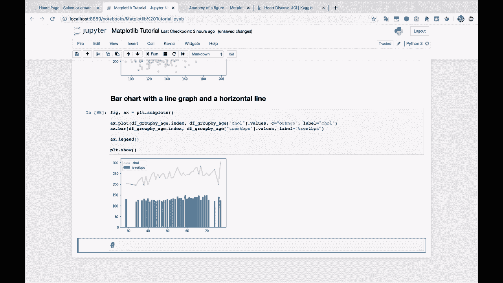

You'll notice that we haven't added any titles。 We haven't added any labels。

 We haven't messed with any of the text。 We've just been doing the graphing with the exception of our our legend here。

 which which gets placed automatically。 So let's have a section now in what section is going to be。

 I think， number 4。 right， Are we on section， section 4。 yep， Section number 4， moving right along。

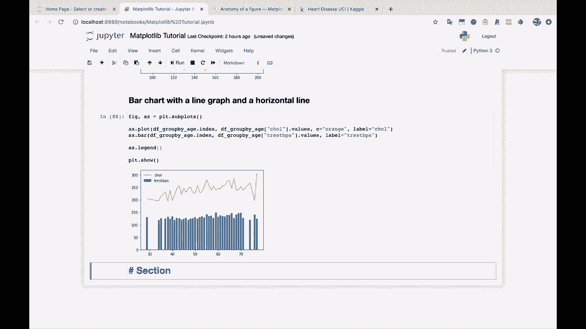

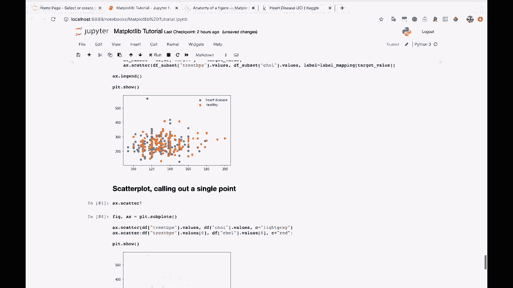

Section number 4， adding and altering text。 Allright。

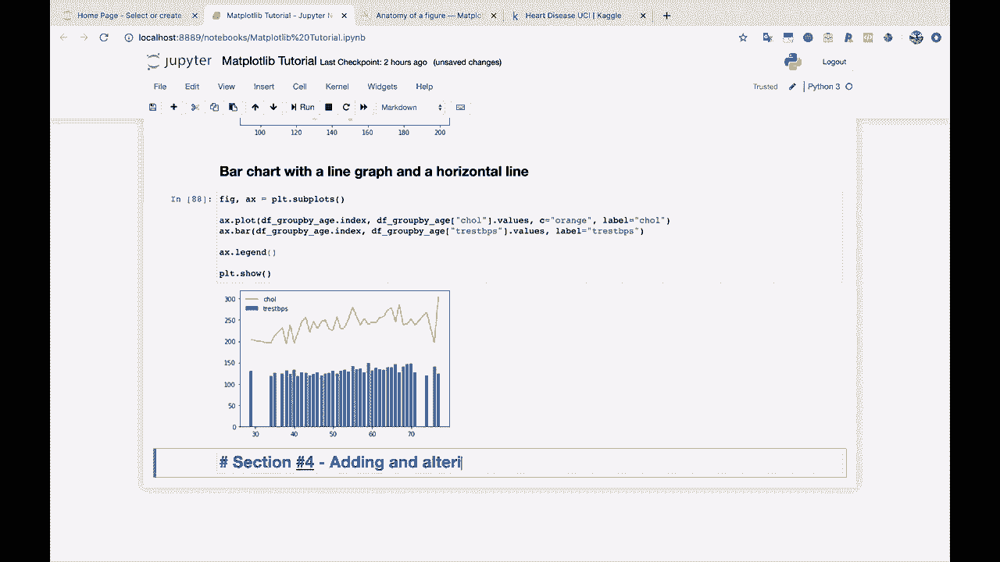

So adding and altering text， this is a very important part of graphing because you want to give people information about what they're looking at。

 you know you want to label your X axis， like what is 50， what is this number even stand for。

 You want to label your Y axis， know what are we looking at and then you want to give the graph some title。

 some helpful title so that people are able to understand the context of the data and what you're trying to communicate。

So I'm going to before we do text， before we dive into it。

 I want to show you a very helpful mat plot Lib。

Resource of do Maplotlibb。ATex。

a i here。😔，Let's take a look at this。

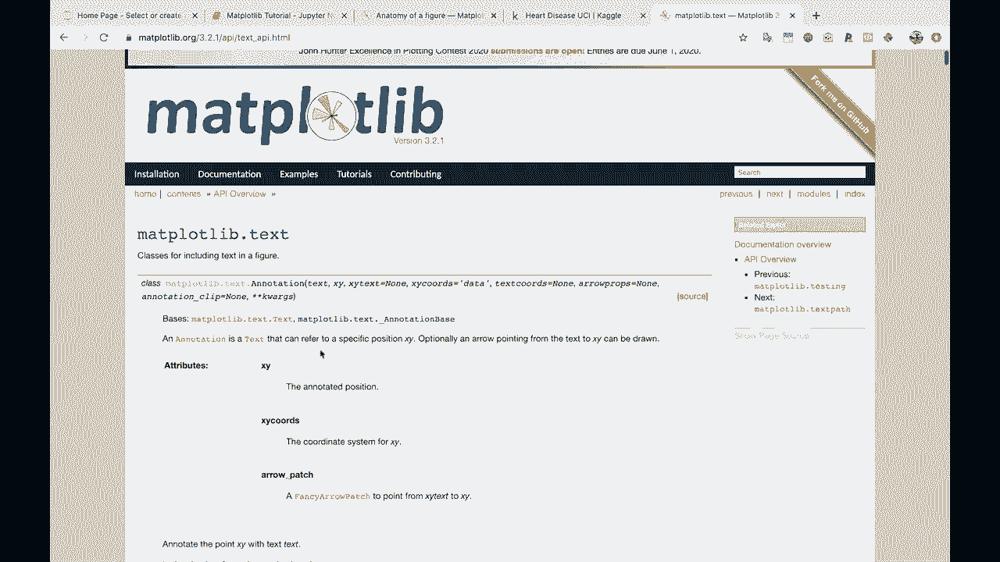

So there's one specific thing that I want to show you。 Actually。

 and I'll just go ahead and copy in this URL it's。

Down here on the page， here we go。Class mapplotlib do text dot text， so。

The reason why I'm showing this to you is because the mappl Lib the API， the documentation。

Is very good for looking at all of the different properties that you can use when you're using something like a text object。

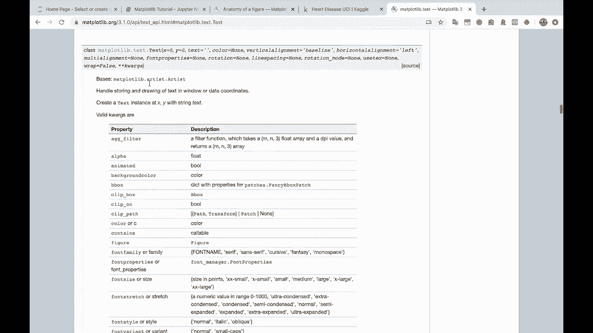

So our titles are text， our labels are text， etc。

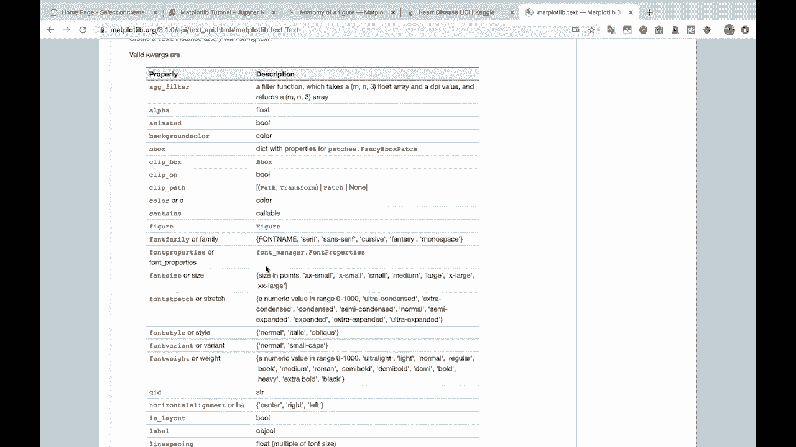

These are some of the things that you can change about the text。

 So you'll notice you can change the font family so you can change the type of font。

 You can change the font size。 One of the ones that we're going to use is you can change the rotation of the text。

 So you've got all of these different。

Options for manipulating the text。 So this is a very helpful link。 I'll make sure that you have this。

 And whenever you need to do something special with your text， you can come here and reference this。

 So I'll actually， yeah， I was gonna paste this into the。

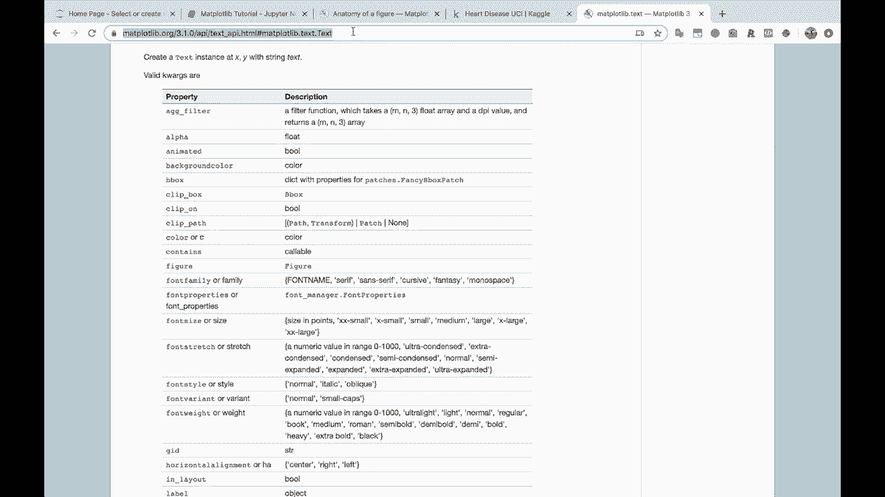

Jupiter notebook here。Okay， so first， let's look at axis labels。 and this is axis with an I。

 as opposed to a Cs with an E like that so。

Let's get some graph to work with that we'll work with for this text section here。So。

Let's see here maybe what we want to do。Is we want to look at this bar graph。Of cholesterol。 Well。

 we want to look at a bar graph of cholesterol by age。 So I'll copy this plot down here。

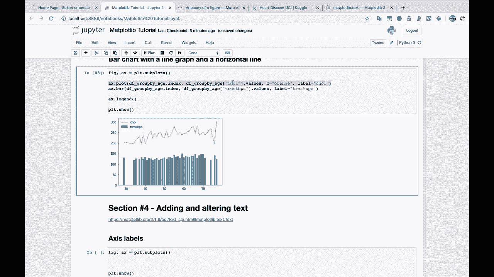

Let's change this to a bar graph of age versus cholesterol。I'll get rid of the color， and the label。

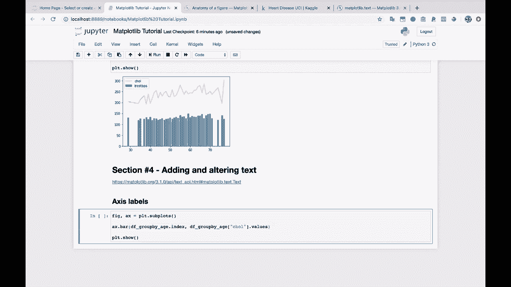

So first things first， our audience has no idea what the axis。

 the x axis and the y axis are supposed to mean here。

So the way that we do that is I'll actually show you on the object first。 So A X。

 I'll hit dot hit tab。 Let's look at all of our different methods here。 So it's the set。

 So you'll start seeing all the different things that you can set。

 come up here as I type in set set underscore。X， so you can set the bounds， the limit。

 We're going to set the X label。 So we're going to set the X label here。 And what is our x。 Well。

 that is the， that's the age。 So let's go ahead and copy this up here。And there you go。

 you see the word age printed down here now as our X axis label。

If we want to do the same thing for the y axis， well， we just change this to set y label。

 and what is this， is going to be average。Cholesterol。Average cholesterol there。

And there is our Y axis label。So now what if we want to give this plot a handy dandy title。

 So I will go ahead and copy this down。 Let's create a new section header here called。

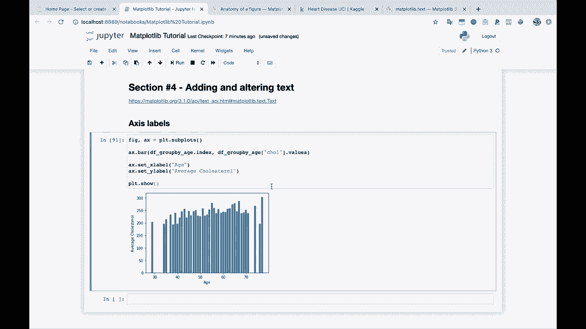

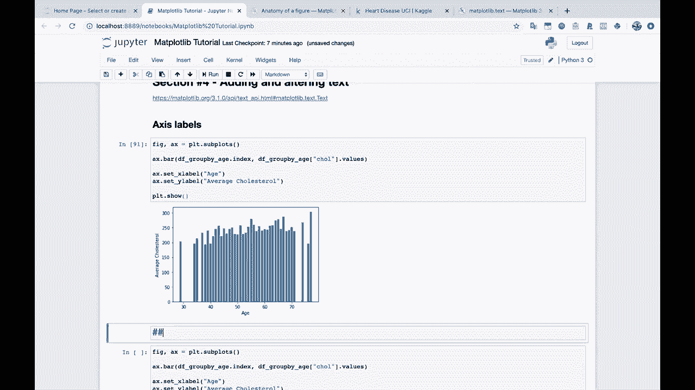

Pot。Tido。

And the way that you do this。Is let's go back to Ax do set。

And let's just see if there's a set title set there is right there。 Look at that。

 I already knew that， but you didn't know that， so。

It was still a surprise for one of us AX dot set title。And let's look at let's。

 let's say average cholesterol by age。

And there you go。Average cholesterol by age now， as the title。

OfAnd we're doing this on the AX object。 So this is the title。Of this axes， the title of this axes。

 and this will actually come into play in just a second here。

So。These are two of the main things you're really going to want to know for adding and altering text。

 and we're going to do some more with text later in the common questions section。

 but for now for now let's go ahead and just leave it as the access labels and the plot title since these are going to be some of the main things that you will use。

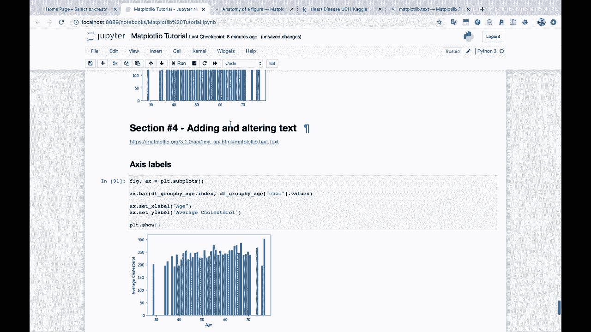

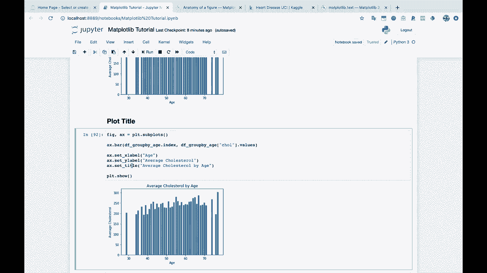