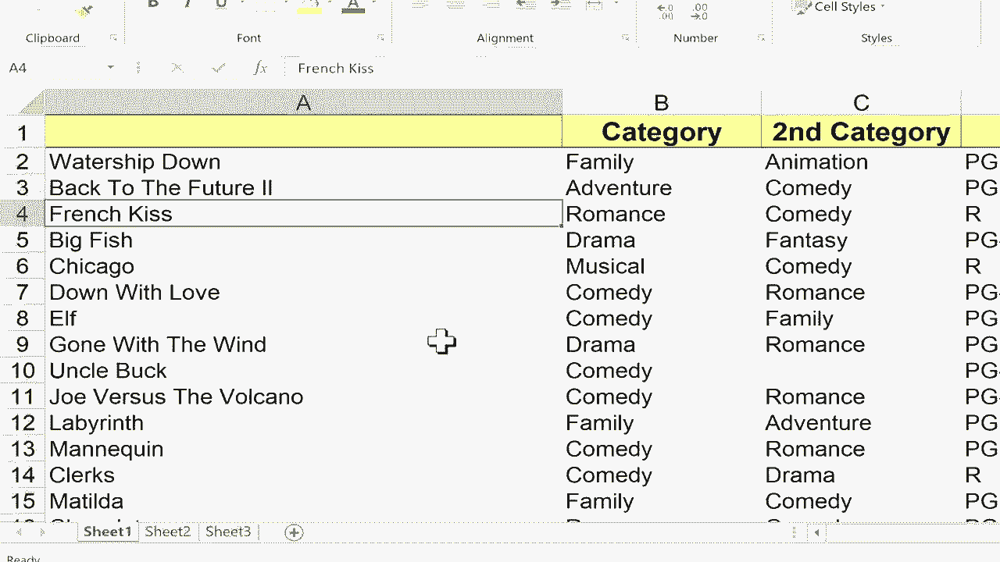

# 【双语字幕+速查表下载】Excel中级教程！(持续更新中) - P13：13）使用正确的函数修复不正确的大小写 - ShowMeAI - BV1uL411s7bt

In this short Excel tutorial， I want to show you a great function。

 That's one of the lesser known functions in Excel。 And it's the function called proper。 Now。

 what proper does is it fixes problems like what we have here in column A。

 Let's say I recently received this spreadsheet from somebody else。

 And it's obviously someone that didn't follow the conventions of writing in English。

 You can see that some of these movie titles are in all caps。 Others are in all lower case。

 Others follow some crazy other formula for what to capitalize and what not to capitalize。

 So fixing this is going to be pretty hard for me and pretty time consuming。

 unless I know about the proper function。 So let's take a look at how to fix these capitalization irregularities in Excel。

 The first thing I would do is I would right click on the column to the right of the column that has the problem。

 So I'll right click there on the column letter。

And choose insert to get a blank column that's right next to the column with the problem。

 and then I'll just go to the first available cell， I'll type in the equals sign and the word proper。

Then I'll put the left parenthesis， and I need to select a cell that has improper capitalization。

 So here it is cell a2。 I just click there。 I should put in a right parenthesis。

 but it's not necessary。 So I'm not going to do it。

 And then I tap enter on the keyboard and look what it did。 It took this text and made it proper。

 Now， the good news is I don't have to do that same formula again and again and again for each of these cells that have a problem。

 Instead， all I have to do is click on the formula that I just did。 And it looks like words。

 So if you doubt it's a formula， you can just double click on it。 and you'll see the formula。

 Of course， you can also look here at the formula bar。 But anyway。

 I'm just going click on it and then go to the lower right corner of that cell。

 You can see there's a little green square。 And if you put your mouse pointer right on that square。

 You should get a black plus sign。 not a white plus sign， but a black plus。

Just click and hold the click and then drag down the page and then release the mouse click and look what it did。

 It took all of my text。 and it made it all proper。 Watership down is now capitalized correctly。

 Chicago。 same thing。 It's no longer all caps。 It fixed elf and made that proper。

 notice this one here， Uncle Buck， that's all lower case。

 but proper fixed it and made it capitalized， but not all caps。 We do have an interesting case here。

 though， with back to the future， too。 And you probably can tell why that that was a problem。

 It's because whoever made this spreadsheet put two eyes in a row uppercase。

 and that's how they wrote to back to the future too。

 And so the proper function thought that that second eye should not be capitalized。

 So every once in a while， proper does make a mistake， but in this case， it's a very logical mistake。

 Okay， great。 Now the only problem is。I have two columns that are duplicates。

 one that has lots of improper capitalization and one that is really good。

 You're going to be tempted to right click and delete column A， but if you do look what happens。

 you mess up the data in the column that you fixed So instead this is what you should do click on column B to highlight the entire column and then you can right click copy and then right click on column A but don't paste if you do there will be some errors instead go to paste special and click and switch it from paste all to paste values So it's gonna to paste just the values from column B not the formulas So I click on values click OK and now these are values。

 they are not formulas。 If you look in the formula bar there's no formula there。

 It's just text copied from column B。 So at this point I can right click and delete column B。

 don't need that anymore and now I have。The movie titles and they're not dependent at all on any other column or data。

 so I've cleaned up the irregular capitalization Thanks for watching this video I hope you found it to be useful if you did please click the like button below。

