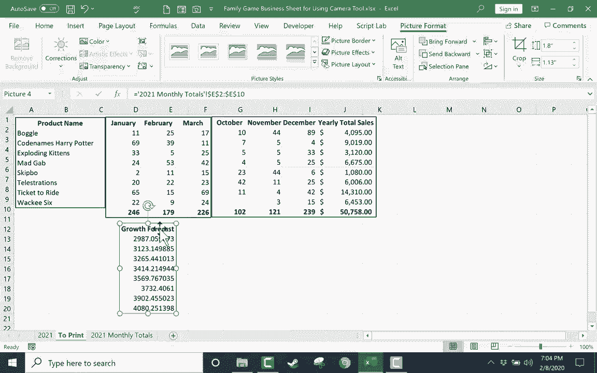

# 【双语字幕+速查表下载】Excel中级教程！(持续更新中) - P38：39）使用相机工具 - ShowMeAI - BV1uL411s7bt

In this video， we're gonna to look at how to use the handy camera tool in Excel。

 Step 1 is you need to add the camera icon to the toolbar。

 And probably the best way to do that is to come up here to the top of the screen and here we have what's called the quick access toolbar and there's a button at the right edge of the quick access toolbar and the button represents customize So customize Quick access toolbar So I'll just click that。

 and I want to customize it in more ways than are listed here。 So I'll go to more commands。

 It opens up a menu with dozens and dozens of additional tools that we can add to this quick access toolbar。

 right now it's showing me just popular commands that I can add to the bar。

 but I want to see all of them。 So I click on all commands。

 there's this giant list Well if I browse down a ways one of the commands is called camera There it is。

 So I click on it and then I'll click the add button to add it to my quick access toolbar。

 Now I can click。And it appears here at the top。 All right。

 Now why would I even want this camera command on my quick Access toolbar。 Well。

 one of the things it can do is it enables you to take pictures of different parts of your spreadsheet and then you can combine them together。

 So you can see here I have a game sales chart。 Let's imagine that this is for a small business that sells board games and card games。

 and let's say I have a meeting coming up and I need to be able to show how our sales did in October。

 November December。 but I also want to show how the year started out。

 So I want to include maybe January February March。 and I want to include October。

 November December and then also maybe the yearly totals。

 So that can be kind of hard to do without recreating the chart or printing the whole thing but then I'll have data that I don't necessarily want。

 So watch what I can do using the camera tool Now that we have the camera on the quick access toolbar。

 The next step is to click on the range that you。To take a picture of。 Now， maybe it's just one cell。

 but in most cases， it's a range of cells。 So I want the product name all the way down。

 all the products that are being sold with that selected。

 I just go up here and click the camera button。 and it took a screenshot。

 At least that's what it seems like。 a screenshot。 I'm going show you that it's more than a screenshot。

 But anyway， now that that's taken。 You can see this dashed line around the data。

 So now I'm going go to a new sheet。 I'll just click this plus sign to open up a new sheet。

 It doesn't really matter what it calls it。 I can rename that anything。 I'll just call this to print。

 And then click on the cell where you want the screenshot of the information to appear。

 I would like it to appear here in the upper left。 So I click， and it didn't work。

So let's try it again。 I'll go back。 It's already selected。 I click on the camera button。

 and then I'm gonna go to my twoprint spreadsheet and click where I want it to appear。

 And there it is。 Here's my screenshot。 I'll just click and drag and put it exactly where I want it to be。

 And let's see what else do I want to be included in this print out that I'm going do。 Well。

 like I said， I want January February March。 I select that range。 go up and click the camera icon。

 go to to print。 click and the data appears。 and I can put it exactly where I want it to be。

 jumping back to my other spreadsheet。 I can go over and get October， November。

 December and the yearly total sales。 get all of that。 Take a snapshot and then go to to print。

 click where I want it to appear。 And so this is a really nice way to collect information to collect data from your spreadsheet onto one page so that you can now print it a little bit easier。

 So now to print it。 Of course， we could go to file and select。😊。

Pnt or you can just hold the control key and tap P。 and it opens up the print options。

 And you can see my data just about fits on the paper。 I can fix that in a number of ways。 In fact。

 I have a whole other video on printing tips and tricks。

 you should definitely watch that if you haven't already。 But in this case。

 I'm just gonna switch it from portrait orientation to landscape。

 and now my data fits really well in the print out。 and I can just click print。

 I could also print to file。 and you can see what that will do。 It will print it not to a printer。

 but it will turn it into a Pdf。 A digital representation of this that I can then email to people。

 So those are both good options。 Now， there's one more thing about this that you really need to see。

 And that is if I go back to the source data。 Let's say I notice an error。

 Maybe skipkbo does not really cost $677， but actually cost 5。

 And maybe we only sold two of them in January instead of 7 or 8。 Well I can。Change the data here。

 And then when I go to my two print spreadsheet。 look skip2 that number updated。

 This screenshot isn't really a screenshot。 It is pulling the data from my other sheet and displaying it in that screenshot。

 So that's why I kind of hesitate to call it a screenshot， It's not really a screenshot。

 Let's say that we're not selling the generic code names game， but code namess Harry Potter。

 which is a fun version of code names。 I changed the data here。 Let's look at the two print。

 it changed it there as well。 So now in addition to printing this spreadsheet。

 I could just move this to the front。 And when I save this file， this report will open up。

 and this will be what people see when they open up the spreadsheet first。

 if that's what you want to do。 But anyway， this camera tool is a great way to pull data even from multiple sheet。

 I could bring in additional information from a completely different sheet。

 Let's say this growth forecast。Click the camera icon go to toprint。

 It doesn't really make sense here， but I can pull in information from multiple sheets onto one page and then print it or save it as a PDF and email it to people So please check out the camera tool Thanks for watching I hope you found this tutorial to be helpful。

