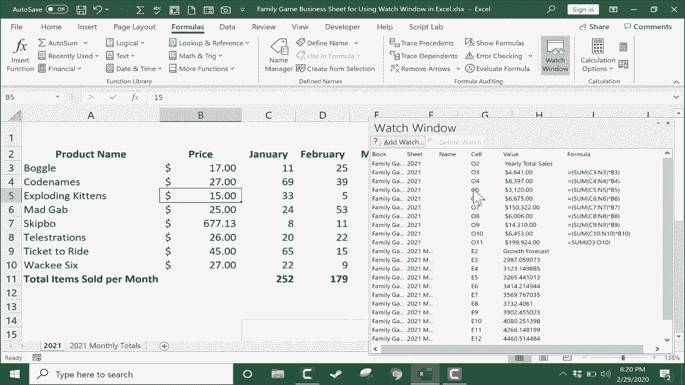

# 【双语字幕+速查表下载】Excel中级教程！(持续更新中) - P39：40）使用监视窗口 - ShowMeAI - BV1uL411s7bt

In this tutorial， we're going to look at how to set up a watch window in Excel。

 and you'll see how it works and how useful it can be in your Excel spreadsheets。

 So here I have a simple spreadsheet with some game sales from a hypothetical board game and card game store。

 and you can see the data extends over here to the right quite a ways at the far right。

 I have yearly total sales that are calculated by adding up the sales from all of these months and then multiplying the number of sales by the price of the board game in this case。

 So this spreadsheet is working out just fine for me。 but let's say I want to run some scenarios。

 Maybe I'd like to know what if we would have charged $16 for boggle instead of 15。

 if we had somehow had the exact same number of sales。

 How would that have changed our yearly total sales。 Well， it did adjust it。 The number went up。

 but I wasn't able to see it as it moved up。 So it's kind of hard for me to know how much that increased by。

 go。Back and change it back to 15。 So watch what I do next。

 I'm going to set up a watch window to track the yearly total sales。 And that way。

 while I'm changing these numbers here at the left， I'll be able to see at the same time。

 how that affects the yearly total sales here at the right。

 step 1 to set up a watch window is to click on a cell or in this case。

 a range of cells that you would like to watch。 So I just clicked here and held the click and then drag down to select the entire range I would like to watch。

 Now I can release the mouse button。 And I'll go here on the formulas tab formulas ribbon here is watch window。

 Now， watch window should be in most modern versions of Excel with the exception， I believe of Mac。

 if you have Excel for Mac， I do not think watch window is included。 Okay， so again。

 with this range selected， I'm going to go up and click watch window。 And it takes me to this screen。

 this window， but it's empty。Typically， it will pop up at about this size。

 especially the first time that you use it。 But what you'll need to do is click add watch。

 And because I already selected this range Excel is smart and figures out that that's probably what I want to watch。

 I could double check it to make sure but it is correct。

 and then I'll just click add and now I've set up a watch window。

 Now let's look at the data that it's watching。 notice that it's listing the book。 In other words。

 the workbook that this data is from。 It's also noting the sheet。 So this is the 2021 spreadsheet。

 It lists the name of the range or the cell。 in this case， these are not named cells。

 and it's got a list of each cell that it's watching and the value and the formula that produces the value。

 So this is kind of an interesting watch window。 it gives me some pretty interesting data。

 Now if I use the scroll bar to scroll to the left。

 Look the watch window stays focused on what I told it to watch。

So now I can go back into the data and run some numbers。 Let's say we charged $17 for boggle。

 here in the watch window， I could see that it moved up quite a bit。

 The yearly total sales for boggle。 So keep your eyes here on the total4 code names。

 It's this 9000 number， let's see what if we had charged only $27 and sold the same amount。

 It drops the yearly total sales。 So these watch windows that you can set up on the formulas tab。

 formulas ribbon here in the formula auditing group。 there it is watch window。

 they can really help you to see data that's otherwise hard to see。

 And it's especially useful if you have a giant spreadsheet or a workbook made up of multiple sheets。

 If you want to see data that's far apart。 but you want to see it together with other data。

 Watch window can really help you out with that。 Let's take it to another level by going to another spreadsheet or even workbook。

 In this case， I'll just go to the 2021 monthly totals spreadsheet。This won't make a ton of sense。

 but I'll click here on growthrow forecast， and I'll click and drag down to select that at least as far down as the full data set goes with that selected。

 I can click watch window but watch window is really already activated。

 So there's no need to click watch windowow this time。

 Instead I can just click add watch Excel wants me to verify the range that it's gonna watch that looks good So I click add And now my watch window is longer。

 it's bigger， but hopefully you can see that it's now tracking two different sources of information。

 two different ranges of information。 So with this add watch。

 you can watch data on two separate spreadsheets or two different parts of the same spreadsheet or even different workbooks。

 When you're finished with your watch window if you don't need it anymore。

 just go ahead and X out of it and continue using Excel as you normally would if you want the watch window back you can just click it again and it should remember the watch windows that you've added in the past。

した？