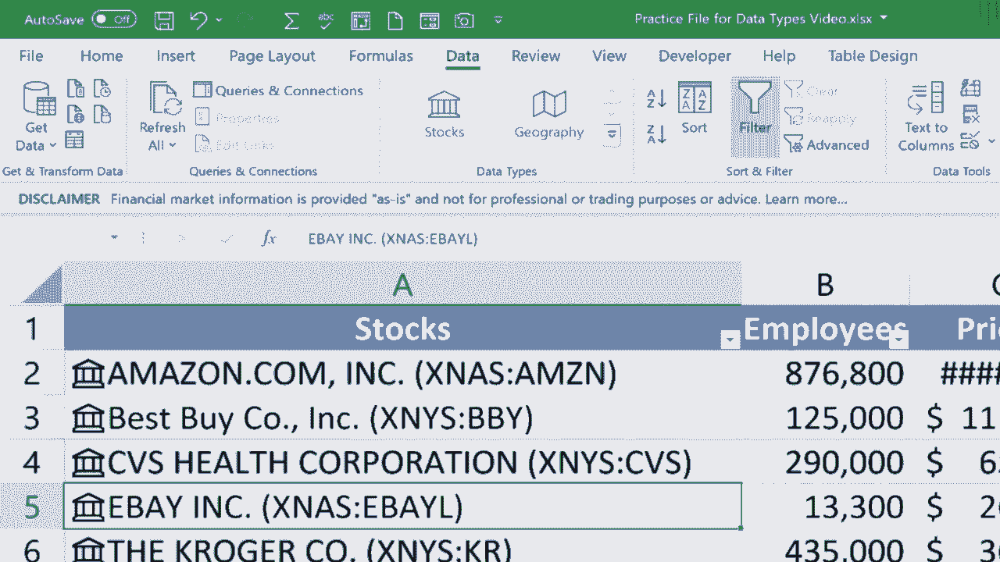

# 【双语字幕+速查表下载】Excel中级教程！(持续更新中) - P51：52）使用数据类型工具 - ShowMeAI - BV1uL411s7bt

In this video， I'm going to show you how to use the Excel data types tools。 As you can see。

 I have three spreadsheets in this workbook， one with a list of US states。

 one with a list of countries and a third with a list of just a few companies jumping back to the US states spreadsheet。

 I want to point out that in Microsoft 365 versions of Excel。 and that includes Windows。

 Mac online and perhaps some other versions of Excel。 also。

 if you go to the data tab and look in the data types group， you should see stocks and geography。

 If you've seen those and wondered what they are， what they're for this video is for you。

 But basically， what these buttons do is they enable you to easily and quickly pull in information about stocks and also about geography。

 Now， if you don't see the data types group on the data ribbon， something to check is go to file。

And go down to account and make sure that you're signed in here at the left that you're signed in to Onedrive and that you have that connection。

 It's not enough just that you've activated Microsoft 365。

 You have to be signed in to your online Onedrive。 Once you've done that。

 you should see stocks and geography in the data types group on the data ribbon。 Okay。

 let's take a look at how this works。 I'm going to click a to select the entire column a。

 the whole list of US states。 and then I'll just go over here and click geography。

 And what happens is I get this interesting little card that appears here at the left of each of the states。

 Now， if I click on a state， I get a little button that pops up that lets me insert data about Alabama in this case。

 Maybe I'm interested in the median household income。 So I click it。 and there it is。

 I can do the same for Alaska。 Just click on the cell that has the card。 click the pop up button。

Medn household income。 There we go。 Now， in most cases， This isn't going to be good enough。

 You're not going to want to just pull in information about one or two of the items in the list。

 Instead， typically， you'll want information on all of them。

 So I'm going to undo to take away the cards that were placed there。

 And now I'm going to select column a insert table。 click O， And now that this is a table。

 Watch what happens when I again， select a go to data。 select geography。 Now， yes。

 I get the cards again。 I get the button。 but now this button works for all of the items in the table。

 So I'll click the button。 I'm interested in median household income。

 I get a warning that it may take some time。 That's okay。 I just clicked O。

 And it's now pulling in information on household income about each of the 50 states。

 in the United States。 And this is being pulled from the Internet。 It's current information now。

I get another pop up button here so I can click that and choose something else that I'm interested in。

 Okay， maybe the largest city。 again， I'm getting the warning。 I'm gonna check this box。

 Don't show this message again。 I understand it's gonna take a little time。

 And there we have the largest city As always in Excel。

 if the information doesn't fit inside the column， I can just double click between the column letters。

 So between C and D， I double clicked and it's now the perfect width。

 and the pop up button appears again。 How about persons per household that sounds interesting to me。

 So I select it And now that information is gonna be added to this spreadsheet。

 So this is a great way to build a spreadsheet quickly。

 Anytime your spreadsheet has anything to do with geography。

 It can be for cities for states for countries and so on。 Now。

 another thing you can do with this is you can click on the actual card symbol here at the left and look what it does。

 It gives you basically an overview of in this case。😊，The state of Arizona。 I get the flag。

 I get the capital city， the current leadership of the state and on and on and on all sorts of information。

 The data comes from Wikipedia。 the US census and perhaps other sources as well。 All right。

 let's try the same kind of thing。 But with countries。 I'll click column a。

 I'll go to insert to turn this into a table， click O， I'll go to data and click geography。

 It looks like it worked。 It's added cards next to all of the countries that it recognized。

 it looks like I have some mistakes in my list of countries。 And so some of these。

 it couldn't understand， and it put a question mark next to them。 but just like with the states。

 I can click on the card here at the left to see an overview of the country。

 and then I can click this button that popped up to select the information that I want to display in the spreadsheet。

 I'll just pick one more How about birth rate。And it pulls in that information。 Now。

 let's move on to the third spreadsheet in the workbook。 stocks stocks work similarly。

 insert a table， click O， go to the data tab But this time， I'll click the stocks button。

 Excel searches for and tries to identify the companies in my list。 Now， in the case of ebay。

 it's having some trouble。 over here in the data selector panel。

 They have some suggested results to choose from。 And a lot of these look good。

 I'll just click this one here。 And now it has fixed the error that was there。

 I'm going double click between A and B to make sure the information fits in the column And then I can click this symbol here。

 the add column pop up button， and then I can go down and choose the information I would like to display。

 How about the number of employees in the company。 And I'll pick one more。

 I'll go to the current price of their stock。 And there we go。 Now， especially in this case。

It might have been better instead of me selecting the entire column A。

 I probably should have just clicked and dragged to select the six companies that are listed here。

 The reason why is because it's trying to fill in this information all the way down as far as my table exists。

 and that is overwhelming Excel a little bit。 But hopefully you can see the potential in using the stocks and geography buttons in Microsoft Excel in the future。

 hopefully more data types will be added into Excel。

