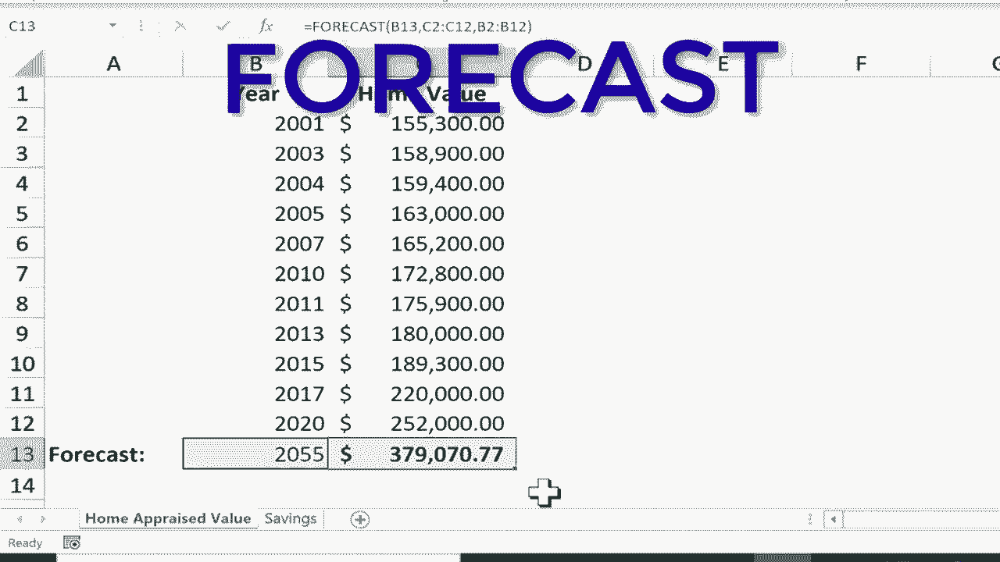

# 【双语字幕+速查表下载】Excel中级教程！(持续更新中) - P54：55）预测函数 - ShowMeAI - BV1uL411s7bt

In this tutorial， I will show you how to use the Excel forecast function。

 And this is just one way you can use it。 But I think it'll help you get a sense of what it's for。

 And you can see the workbook that I have here。 It consists of two spreadsheets。

 one on a home appraised value and the other is savings。 It's like the savings account in a bank。

 Those will be our two examples。 So here on the home appraised value spreadsheet。

 You can see I have a list of years。 Let's say I bought a house in 2001。

 And this is what it was worth at the time。 And then maybe every year or two or three。

 the house got appraised。 but each of these years has a different home value for the home。

 And these years are all in the past。 Of course， But what about the future。

 Is there a way to kind of forecast， what the value of this home will be in 2035。 Now。

 before I show you how to do this in Excel， Just know that this is limited。 Obviously。

 Excel doesn't know that much about home values that doesn't know。

How real estate appreciates and it doesn't know the neighborhood that I live in or things like that。

 there's all sorts of variables。 but using the information that we do know Excel can make an educated guess about the future。

 So here in this blank cell， I'm just going click and then type the equal sign and I'll type in the function forecast Now you'll notice there are six different forecast functions。

 they're all pretty similar， but if you know that what you're looking at is a linear model。

 you could choose forecast linear。 If you know that what you're looking at is an exponential model。

 you could use forecast do ETS。 and there's all of these other slightly different versions of the forecast function。

 If you're not sure which one to use， just stick with basic forecast。

 So that's what I'm going to do After typing in forecast。

 I'll just put a left parenthesis and you can see what Excel is looking for。

 It's looking for an X number and then comma and a known。Y comma and then a known X。

 So this can be really confusing at first。 But basically， the forecast。

 I want it to be based on the year 2035。 So I'm going to click on 2035。 that will become the X。

 So I click on 2035。 Now， I didn't really click on the number。

 I actually clicked on the cell cell B 13。 So anything that I type in B 13， that will become the X。

 now I type comma and the known y。 Okay， so since this is X。

 the y must be this information here and it is。 So this is the information that we know。

 We know what the past appraisal values have been。 So I just clicked and dragged to select all of the past appraisal amounts。

 And now I'll put a comma in。 And now it wants the known X's。 So this is X。 What are the known X's。

 Well， all of these years。 these past years。 So I click and drag to highlight all of the past year。

And then I should put in a right parenthesis and tap enter on the keyboard。

 and it calculates what Excel thinks my home will be worth in 2035 based on past results。 Okay。

 let's try that again。 This time I'm going to go to the savings spreadsheet。

 And this again is limited， and there's going to be some flaws in this。

 Excel doesn't know my saving habits and things like that。 But let's say in 1995。

 I had $10 in the bank in 2005， I had $3000。 I would follow the same pattern as before。

 I would go here to this cell and click and type equals forecast left parenthesis。 What's the X。

 What is this forecast based on。 Well， it's based on the year 2030。

 So I click on that cell B 11 type the comma。 What's the known y of this data。 If this is X。

 then this is Y。 So I'll click here to select all of the Y comma。 And now the known。Well。

 here are the known X's。 So I click and drag to select those。 put in the right parenthesis。

 tapap enter。 And apparently that's what I would have in 2030。

 That's not a lot of savings for 10 years。 And like I said， this forecast ability is pretty limited。

 But Excel is doing its best to figure out， okay， given these numbers and their relationship to these numbers。

 This is what Excel expects for 2030。 Now， notice that you can go in here and change from 2030。

 I could put 2055 tap enter。 and the model updates， the forecast updates。

 and this is now the expected amount。 I can do the same thing with home appraised value。

 so I could change this from 2035。 What about 2055。 I'll tap enter。 and I can see， oh。

 that is now the expected amount that my home will be worth in 2055。

 So even though forecast is limited， It is kind of fun and it's a way to quickly get an estimate。

Based on past results。