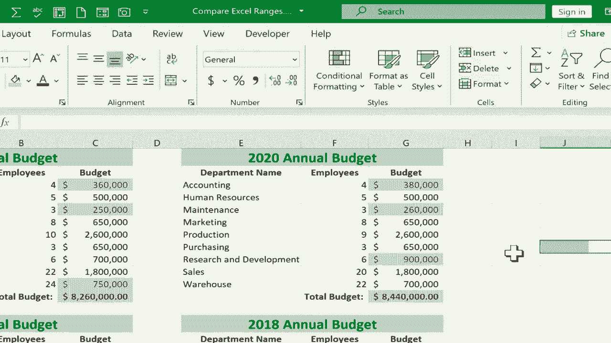

# 【双语字幕+速查表下载】Excel中级教程！(持续更新中) - P58：59）比较和对比 Excel 范围 - ShowMeAI - BV1uL411s7bt

In this short Excel tutorial， I want to show you how to compare Excel ranges and show the differences。

 And the example file I have for this， which you can find in the description below this video has some simple annual budgets。

 And you can see each budget from 2018 through 2021。 Each one has its own tab。 But also。

 I have a comparison tab where all four are viewable on the same spreadsheet。

 And what if I would like to compare and contrast these budgets to identify what has changed from 2020 to 2021。

 what has been adjusted。 Well， I could look one by one at each of these budget items and the number of employees maybe something's changed along those lines。

 and I could just eyeball it and figure out the differences。 But there's a much faster way in Excel。

 What I would do is click and drag to highlight the whole range of one of the ranges I want to compare。

 In this case， I want to compare the current year with the previous year。

Once I've highlighted the first range， the next step is to hold the control key on the keyboard and then click and drag to highlight the second range that I want to compare。

 So with both of those selected， now I can just go to the home tab home ribbon in the Sts group I'm going to click on conditional formatting。

 and a whole bunch of options appear if you're not familiar with conditional formatting you really need to watch my previous tutorials showing you how to use conditional formatting。

 there are lots of powerful exciting options here in conditional formatting。

 but for the purposes of this video， I'm just going hold my mouse over highlight cells rules。

 and I'm going to go all the way down to duplicate values。

 So this is highlighting all of the cells that are duplicated and that's one way to accomplish a comparison right if it shows all the duplicates。

 it also shows all of the unique items as well。 but to make it even more readable。

 I'm just going to switch it from duplicate to unique click and now in red in this case。

Is highlighting the differences from 2020 to 2021 I can click away now from those highlighted ranges and you can see yeah。

 the title has changed from 2020 to 2021， the budgets for accounting and maintenance have changed and so has the budget for research and development and the warehouse this also highlights some other differences。

 the number of employees is different in a couple of cases。

 Now to make this a little bit easier to read and to identify the changes I'm going to hold control in T Z to undo my conditional formatting and this time I'm going to focus in just on what's most important。

 Obviously I know that the date changed and maybe it doesn't matter the number of employees。

 what if I'm only interested in the budget changes Well。

 then just click and drag to highlight budget， hold control and then click and drag to highlight the budget range from 2020 and again。

 conditional formatting， highlight sales rules duplicate value。Switch from duplicate to unique。

 This time， though， I'm going to switch instead of light red fill with dark red text。

 I just want you to see that there are other options you can do yellow fill to kind of highlight the differences in a typical yellow highlighter color。

 however you want to do it。 I'll click O。 And now this is a little easier to read。

 I think it just identifies the key information。 and what is different。 what is changed。

 I can undo that。 And I could do another comparison if I want， comparing 2021 to 2018 or 2019。

 So I would encourage you to download this practice file and try that out。

