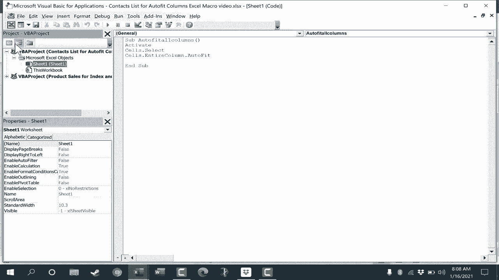

# 【双语字幕+速查表下载】Excel中级教程！(持续更新中) - P60：61）从头开始创建 Excel 宏 - 自动调整列 - ShowMeAI - BV1uL411s7bt

In this video， I will show you how to create your own Excel macro。 and specifically in this video。

 it's gonna to be a macro that will make it so that you can just click a button。

 And by doing so all of the columns in your Excel spreadsheet。

 will automatically fit the data that's in those columns and look at the spreadsheet that we're using for this。

 It's a contacts list with all sorts of personal information for some fictional people。

 And you can get a copy of this in the description below the video。 But as you can see。

 the widthits of some of these columns are off a bit。 This column B for example。

 is way too wide And of course， I can adjust that by clicking and dragging between column B and column C in this example。

 just right on that line， click and drag to resize that column。 There's also a faster way to do this。

 I could resize all of these columns by clicking and dragging to select all of the column headings。

 And then I could double click between any two of those and it resizes all of them to the perfect width。

I just did control Z to undo。 So even though that's faster。

 I can create a macro to do it even faster than that？ So how would I go about creating my own macro。

 Well， one way to do that is to record your own macro。

 And if you haven't already watched my beginner's guide to Excel macros。

 You should watch that in a lot of cases。 That's the best option is just to record a macro。

 And then assign it to a button。 But let's look at how to create a macro from scratch。

 Step1 is to make sure that you have the developer tab added to Excel。 right now。

 I don't have that developer tab。 There are a couple of ways that you can add that developer tab。

 One of the easiest is just to right click on any of these tabs and choose customize the ribbon。

 That brings up these options。 and you can look here at the right where it says main tabs。

 you can look for developer and make sure that box is checked then click O Now I have a developer tab here on the developer tab。

 you can just look in the code group。 and there we have visual basic。And go ahead and click that。

 notice that there's also a keyboard shortcut alt F 11。 And that opens the visual basic editor。 Now。

 what is visual basic。 Well， it's a programming language like C plus plus or other programming languages。

 and Microsoft includes visual basic a version of it for you to use inside of Microsoft word Powerpoint and Excel。

 But instead of calling it visual basic， it's Vba visual basic for applications。

 And so we're going to do a little bit of programming here。

 But I hope you'll find it to be pretty simple not too intimidating。

 So what we're going to want to do here is select sheet 1。

 that's the spreadsheet that I'm working on right now。 And if I double click that。

 you'll notice that I get a window that pops up。 And this is where I can put my code。

 And if you're familiar with visual basic。 and you know how to code in it。

 you can just type that code in。 and you've created an Excel macro。

 in this video we're just going to use a simple bit of code。

 And I'm including this in the description。Below the video in case you want to just copy paste it in so we're going start by typing sub Sub stands for subroutine procedure and then I'm just going to type in autofit all columns left parenthesis right parenthesis I'll tap enter activateivate enter C dot select and notice when I typed dot it brought up a popup menu that I could just click to pick which of these I want to use I'll just go with select so I can either keep typing or doublecl to enter the word select there tap enter on the keyboard cellss dot entire column dot autofit and here I can just tap enter to choose autofit and then the last part is added automatically and sub in other words we're done with this subroutine procedure At this point I'll just go ahead and X out of the Vba coding window and now on the developer tab in the code group I can just go directly to the macros button and I can。

Cose this one macro that I've created and click Run。 Notice what it did。

 It automatically resized all columns to fit exactly perfectly the content in those columns so that everything fits and the biggest item just barely fits in each column Okay I'm going mess up some of these columns again just to show you that there is an even better way to sometimes use a macro and that is by creating a button and attaching that button to the macro that you've created。

 So here on the developer tab， I'm just going go to the insert button and I'll choose a form control to add and it's going to be a button you can also add active X controls。

 but for simplicity， I'm just gonna to click form control button and then click and drag on the screen to create the outline of that button。

 next， I'm supposed to assign a macro to that button Now sometimes the macro doesn't exist yet in which case you can just click okay and then assign the button later。

 but in this case， I do have the macro it's already created。This auto fit all columns。 I click O。

 Now I can change the name of the button if I want to just click to highlight the text。

 delete it out， and I'll call this button。 autofit columns。 Next。

 I want to move this button off to the side so that it's not covering the data。 Now。

 with these developer buttons you can't left click and drag to move the buttons。 Instead。

 you have to right click and drag。 So I'll just pull it over to the side。 release the mouse button。

 move here。 And then once you click off that developer button。

 You're not gonna to be able to move it or do anything other than click the button instead you right click on the button。

 That gives you the options。 You can format the control， assign a different macro。

 cut it or copy it or whatever you need to do。 But it's the right click that enables those options。

 So I'm gonna go ahead and left click on it and let's see if it executes the macro。

 I click and it worked。 It beautifully resized all the columns to make sure everything fits perfectly once again。

 Now， at this point， I want to。😊，Save this workbook and this spreadsheet because I'd like to be able to use this button in the future。

 I don't want to have to create my macro and my button every time I use this spreadsheet。

 so I can just go up and click the save button， but watch what happens。 It's giving me a warning。

 The following features cannot be saved in macrofr workbooks。 because I have created a macro。

 and I've used visual basic for applications to create this great feature。

 I have to save this workbook in a special way。 Not it says to save a file with these features。

 click no and then choose a macro enabledable file type in the file type list。 So I'll do that。

 click no， and then I'll go up here to the file type。

 and I'll change it to Excel macro enabledable workbook。

 noticeice that it adds an M to the end of the file extension。

 I'm going also changed the name of the file itself just a little bit just for my own reasons。

 And now when I close this file。 It closes out， and then maybe in a day or a week。

 I go to file and I'll choose that same spreadsheet。

Open up there's my autofit columns button that I created and link to my macro。

 but notice it's not gonna to work unless I click this button to enable macros。

 So I'll click enable content。 And now as I work， let's say I type in somebody's address and it's much longer than the other addresses so the data doesn't fit in the column anymore I can just click this button and it will autoresize。

 So these visual basic scripts or bits of code that you can type in in a way they can seem almost like magic spells。

 until you understand the coding itself。 it does kind of seem like magic。

 if I know these words and if I paste them into this window。

 it can do powerful things almost like magic。 and that is one way to proceed from here。

 if you want to， you can just search the internet for bits of VB code。

 plug them in and see how they affect your spreadsheets Now make sure you're getting those codes from reputable sources。

 and that you understand what the code is gonna do otherwise it could mess up your data。

 in addition to just searching the Internet。There are also some good books you can get。

 and I'll put links in the description below to some books about VBA and Excel。

 and if this video is well received， I'd love to make additional videos showing you some other useful Excel macros that you can build from scratch in Microsoft Excel。

