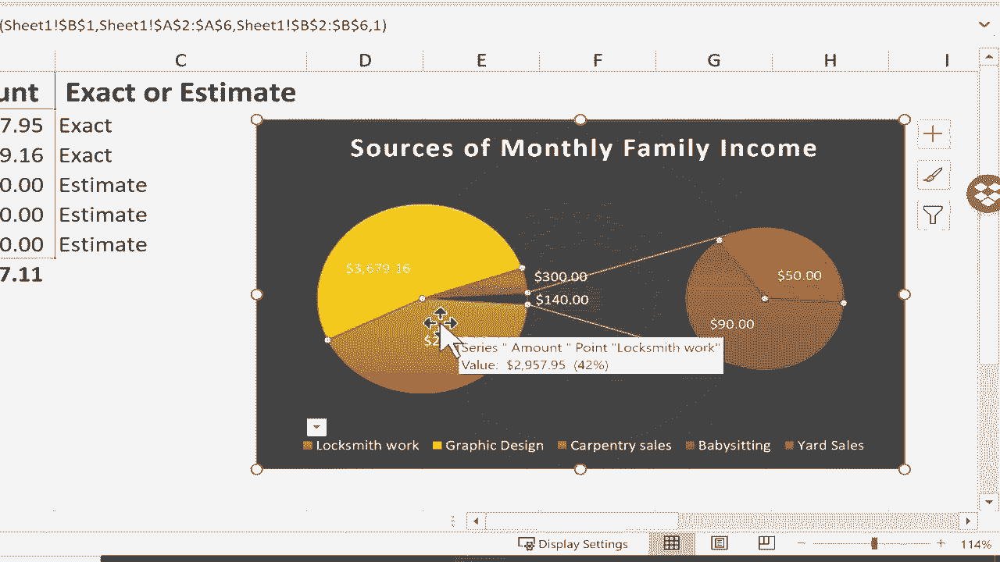
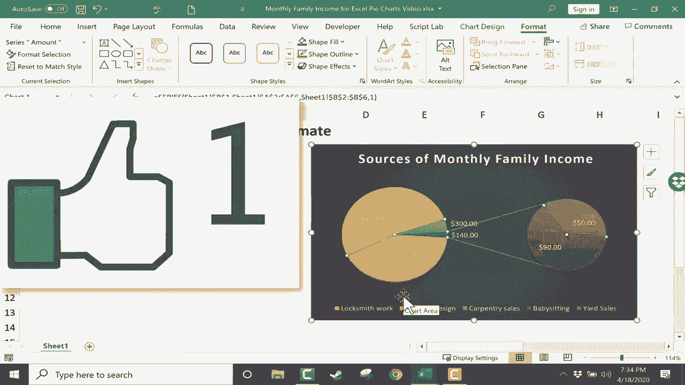

# 【双语字幕+速查表下载】Excel正确打开方式！提效技巧大合集！(持续更新中) - P29：29）创建饼图 - ShowMeAI - BV1Jg411F7cS

In this video， we will look at how and when to use a pie chart in Excel。 First。

 let's discuss when is a pie chart useful。 The purpose of a pie chart is to show the relationship between individual parts and a whole。

 So， for example， in this spreadsheet。 We have a list of income sources for a family。

 Let's say one spouse is a locksmith and makes this amount of money。 It's an exact amount per month。

 The other spouse is a graphic designer and makes a different amount， Also exact。

 And then they both also have side hustles， and these are estimates， not exact numbers。

 So I'll change those to estimates。 And the way this works is each of these incomes becomes a component of the total amount of money。

 So each of these is a part that makes up the whole down here。

 So this is one of those instances in which a pie chart would be useful and would be able to convey interesting。

Useful information。 Before we go on， I want to show you a separate example。

 one in which a pie chart would not make much sense。

 This spreadsheet here is a very complicated spreadsheet with repeating segments， Count products。

 And because of its complexity， this would not be a great candidate for a pie chart。

 I'll show you what I mean a little bit later。 But for now。

 let's go back to our monthly family income spreadsheet。

 So if I want to create a pie chart to go with this data。

 Step 1 is to just select the data for the chart。 So I'll click and hold the mouse click and drag to select column A and column B。

 but I'm not including the totals in my selection。 We include the column headings so that Excel knows what the numbers represent。

 but we don't include the totals because the total would skew the pie chart and make it basically useless。

 So with that data selected， I can just go to the insert tab。 we have a variety of chart。

listedisted here。 and there is insert pie chart。 So I'll click on it。

 and a variety of options appear。 Notice when I put my mouse on the options。

 I get a preview of what they would look like。 This is a great feature in Excel to help me decide which one to pick。

 We have some 2D pie charts。 A 3D pie chart and a dont chart。 with all these pies and donutts。

 I'm getting pretty hungry， but I'll try my best to focus。 And for now。

 I'm going to pick the 3D pie chart。 So I just click it。 and my chart appears on the spreadsheet。

 And I can click and drag and place that pie chart wherever I want it to be。

 I think that looks great right there。 Now that I have my pie chart。 If I have it selected。

 I get two additional tabs up here at the top chart design and format。

 If I click away from the chart。 I lose those two tabs。

 But I can just click again on the chart and they reappear。

 Let's look at some of the options that these two tabs give us。If you click on the chart design tab。

 you can see that there's an option to add chart elements。 If you click on the button。

 it gives you some chart title options。 I can get rid of this amount chart title by selecting none or I could move it to centered over the pie chart。

 and there are more title options。 If you click there。

 you get additional fill and border options and shadows and all sorts of different alignment options。

 etc cetera。 I want my title here at the top。 but I don't like the text that it chose for the title。

 I want to change it from amount to something else。

 I'll change it to sources of monthly family income。

 I think that does a much better job of describing the data that I'm showing here。

 It's much better than just the word amount。 Other things I can do here in the add chart element button include my data labels right now。

 I have none。 If I choose center。 Look what happens。

 The number that this pie slice or pie section is now placed on。

That section as a label。 But you can see the problem with this。 Sometimes it doesn't work。

 They're two squish together。 And so I can go back and choose a different option for my data labels。

 Outside end is another possibility， best fit data call out。 That's a great option in many cases。

 and you can also load more options as well，  similar to my title options。

 I think my favorite option there was best fit。 Look great。

 and it's clear what each pie slice or segment represents。 I also have some legend options。

 I can have no legend。 I can have a legend at the right top Left or bottom。 And once again。

 I can get more legend options if I want to。 I've decided to move the legend to the right。

 I think that looks really good。 A few other changes I can make on the chart design tab。

 include quick layout。 You can just quickly adjust the layout by putting your mouse over。😊。

One of these options and clicking， I actually like it the way it is right now。

 I can also click change colors to choose different color schemes。

 And the way this works is this is a color palette。 So if I click here on any of these colors。

 then this becomes the color palette or color scheme for this chart。

 If I prefer more of a blue gray color scheme。 I just click here and everything becomes blue or gray。

 and we have all of these other options as well。 and much more if I browse down。

 I'm going to choose colorfulful palette 3， I think that looks really good。 Next。

 I can choose from different chart styles。 Now this will change some of my settings that I already selected or adjusted。

 But you can see that each of these really can change the effect that the pie chart has on the viewer。

 And depending on your purpose for showing the chart and the style that is most attractive to you and to your audience。

 some of these might work better than others。 I think that one looks interesting， although the。😊。

I a little strange。 There's another style that I think looks really good。 and yet another。

 But I think I'll click this undo button a few times to get back to the way I had it originally。

 Next to the chart styles， I have options to switch up the data。

 Sw rows and columns or select different data。 I can also change the chart type if I want to。

 If I click there， it gives me again， an option to go from 3D back to a 2D chart。

 or choose a doughut chart。 I can even switch to a totally different type of chart。

 But this is a good opportunity for me to also show you one of these options。

 Pi of pie or bar of pie。 Pi of pi is a particularly interesting option。

 especially when you have some large pieces of the pie， and then some much。

 much smaller pieces of the pie like we have here with this data。 So if you look at this example。

 the pi of pie chart set up shows us what this small slice represents It's $90 from babysitting and 50。

From yard sales。 And so this smaller pie chart helps to illuminate the smaller slices of the pie。

 I really like how this looks now， although I may change it here to this other style。

 that looks great to me。 The final option we have here on the chart design tab is move chart。

 If I click that。 noticeice that I can put this chart on a new sheet。

 or I could leave it as an object in sheet 1。 Let's try moving it to a new sheet。

 I could name it if I want to。 but I'll just click O。 Now I have a new sheet。

 but it's specifically a chart sheet， chart1。 And now sheet 1 doesn't have the pie chart on it at all。

 I'm going to undo that。 just by selecting the chart again， going to chart design。

 and I'll move it to an object in sheet 1。 click O。 Let's look quickly now at the format tab。

 Here we have a bunch of shapes that we could add arrows， triangle squares， etc ceter。

 There's also some shape。Styleles that I can select。 If I put my mouse on these。

 it gives me a preview。 and you can see how selecting one of these other theme styles would change the look and feel of the pie chart。

 pretty dramatically in some cases。 So you'll get some really beautiful looking options。

 If you just try these out and notice I'm not clicking。

 I'm just putting my mouse over the top of the different styles and I get an instant preview。

 I can also go up here and choose a specific shape fill。 If I like the look of this pie chart。

 except for the background color that's kind of black or dark gray。

 I could pick a specific color for the shape fill。 I actually don't want to do that in this case。

 but you might want to。 I'll go down here to shape outline。 and I could pick a color， let's say red。

 Now this pie chart box is outlined in red。 and I could go to the shape outline drop down and change the weight of the outline。

 I could make it really thick if I want to。 I don't necessarily think that looks good。

 but those are the kinds of things that you can change。

By going here to the format tab for your pie chart。

 there are also some other quick styles that you should look into if you're interested in them。 Now。

 one of the beautiful things about pie charts and other charts in Excel is as time goes on。

 If these numbers change。 let's say the carpentry sales go up。

 I tap enter and the pie chart adjusts to show those changes。

 Let's say the yard sale goes up quite a bit。 Again， the pie chart adjusts based on those changes。

 Before we end， I want to show you a couple of pie chart features that many people are totally unaware of。

 but are very useful and can help your pie charts look great。

 One is you can explode any part of the pie chart。 So， for example。

 as long as the pie chart is selected， I can double click on any piece of the pie chart。

 and then click and drag to explode that slice of the pie。 and that is the word for it。 explode。

 I can double click on this pie piece and click and drag to。😊。

Exode that slice of the pie and each of these others as well。

 Doing this can be helpful in separating the labels a little bit from each other and drawing the focus on particular parts of the pie chart。

 Another feature that's often overlooked is that you can right click on any pie chart element to adjust its fill its outline to format the data label maybe by changing its color。

 And if you regret any of these changes， you can right click on that pie slice and choose reset to match style。

 And I'll do that also for the text。 So I hope you have fun creating pie charts in Excel。

 just keep in mind that pie charts are not for every kind of data or spreadsheet。 For example。

 if I select even a portion of this spreadsheet just with one column that has numerical data in it。

 And if I go to insert pie chart， look at the results that I get。

 this is completely useless and irrelevant。

Information， so it's definitely important to think through your purpose for creating a pie chart and the data that you want to illustrate by using the chart。

 Thanks for watching。 I hope you found this tutorial to be helpful。

